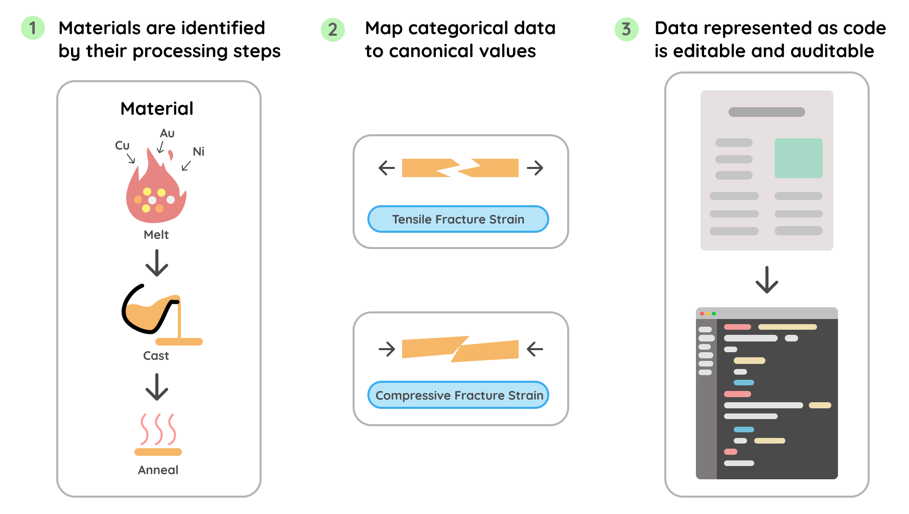

# LitXBench

[](https://pypi.org/project/litxbench)
[](https://radical-ai.github.io/litxbench)

LitXBench is a benchmark to evaluate LLMs on extracting material information synthesized in research papers. Read the preprint here.

<p align="center">
  
</p>

# Installation

`uv pip add litxbench`

# Usage

## Loading Ground Truth

LitXBench ships with annotated ground-truth extractions. The `litxalloy` dataset contains 19 papers on high-entropy alloys.

```python
from litxbench.litxalloy import papers

# papers is a dict mapping DOI strings to list[Experiment]
doi = "doi_10_3390__e21020122"
ground_truth = papers[doi]
```

## Building Extractions

Represent extracted materials as `Experiment` objects. Each experiment contains raw materials, synthesis groups (with optional template variables), and output materials with their measurements.

```python
from pymatgen.core.composition import Composition
from litxbench import (
    CompMeasurement, Configuration, CrysStruct, Experiment, Material,
    Measurement, ProcessEvent, ProcessKind, Quantity, RawMaterial, RawMaterialKind,
)
from litxbench.core.models import GlobalLatticeParam
from litxbench.core.units import Celsius, Hour, MegaPascal, Nanometer, gram_per_cm3, percent, HV
from litxbench.litxalloy.models import AlloyMeasurementKind

extracted = [
    Experiment(
        raw_materials={"elements": RawMaterial(kind=RawMaterialKind.Powder)},
        # Synthesis groups can use template variables (e.g. [Duration], [Temp])
        # that are substituted per-material via process strings.
        synthesis_groups={
            "Milling[Duration]": [
                ProcessEvent(
                    kind=ProcessKind.PlanetaryMilling,
                    duration=Quantity(value="[Duration]", unit=Hour),
                ),
            ],
            "SPS[Temp]": [
                ProcessEvent(
                    kind=ProcessKind.SparkPlasmaSintering,
                    temperature=Quantity(value="[Temp]", unit=Celsius),
                ),
            ],
        },
        output_materials=[
            # Named materials can be referenced as inputs by later materials
            Material(
                process="elements->Milling[Duration=60]",
                name="base",
                measurements=[
                    CompMeasurement(Composition("CoCrNiCuZn")),
                    GlobalLatticeParam(
                        struct=CrysStruct.BCC,
                        phase_fraction=Quantity(value=100, unit=percent),
                    ),
                    Measurement(
                        kind=AlloyMeasurementKind.crystallite_size,
                        value=13,
                        unit=Nanometer,
                    ),
                    Measurement(
                        kind=AlloyMeasurementKind.lattice_strain,
                        value=0.7,
                        unit=percent,
                    ),
                    # Configurations represent distinct phases within a material
                    Configuration(
                        name="Phase 1",
                        measurements=[
                            Measurement(kind=AlloyMeasurementKind.solidus, value=1244.8, unit=Celsius),
                        ],
                    ),
                ],
            ),
            # This material chains from "base" through the SPS synthesis group
            Material(
                process="base->SPS[Temp=900]",
                measurements=[
                    CompMeasurement(Composition("CoCrNiCuZn")),
                    Measurement(kind=AlloyMeasurementKind.density, value=7.89, unit=gram_per_cm3),
                    Measurement(kind=AlloyMeasurementKind.ultimate_compressive_strength, value=2121, unit=MegaPascal),
                    Measurement(kind=AlloyMeasurementKind.vickers_hardness, value=615, unit=HV),
                    GlobalLatticeParam(struct=CrysStruct.FCC, name="FCC1"),
                    GlobalLatticeParam(struct=CrysStruct.FCC, name="FCC2"),
                ],
            ),
        ],
    ),
]
```

## Evaluating Extractions

Compare your extractions against the ground truth to get precision, recall, and F1 scores.

```python
from litxbench import compare_experiments

result = compare_experiments(ground_truth, extracted)
print(f"Precision: {result.precision:.2%}")
print(f"Recall:    {result.recall:.2%}")
print(f"F1:        {result.f1:.2%}")
```

For multi-level metrics (value, process, configuration, and material levels):

```python
from litxbench.core.eval import compute_multi_level_metrics

metrics = compute_multi_level_metrics(result)
print(f"Overall F1: {metrics.overall_f1:.2%}")
print(f"Value F1:   {metrics.value_f1:.2%}")
print(f"Process F1: {metrics.process_f1:.2%}")
```

A complete end-to-end example is available at [`examples/usage.py`](examples/usage.py).

# Paper Evaluation Scripts Warning

For the evaluation scripts used in the paper, LitXBench intructs LLMs to format the extracted materials as code. This code is run by LitXBench via Python `exec`. Do NOT call untrusted LLMs as they may generate untrusted code which could be executed on your machine.
