ELSEVIER

Available online at www.sciencedirect.com

SciVerse ScienceDirect

Procedia Engineering 36 (2012) 292 – 298

Procedia Engineering

www.elsevier.com/locate/procedia

# IUMRS-ICA 2011

# Microstructure and Compressive Properties of NbTiVTaAlₓ High Entropy Alloys

X. Yangᵃ, Y. Zhangᵃ,ᵇ,*, and P.K. Liawᵇ

ᵃHigh-entropy Alloys Research Center, State Key Laboratory for Advanced Metals and Materials, University of Science and Technology Beijing, Beijing 100083, China

ᵇDepartment of Materials Science and Engineering, University of Tennessee, Knoxville, TN 37996-2200, USA

# Abstract

The novel refractory high entropy alloys with the compositions of NbTiVTaAlₓ were prepared under a high-purity argon atmosphere and their microstructure and compressive properties at room temperature were investigated. Despite containing many constituents, all alloys had a single solid solution phase with body-centered cubic (BCC) structure, and possessed high compressive yield strength and ductility, which should be attributed to solid solution strengthening.

© 2011 Published by Elsevier Ltd. Selection and/or peer-review under responsibility of MRS-Taiwan

Open access under CC BY-NC-ND license.

Keywords: High entropy alloy; solid solution; yield strength; ductility; solid solution strengthening

# 1. Introduction

Recently, high-entropy alloys (HEAs), defined as alloys that generally have at least 5 major metallic elements and each of which has an atomic percentage between 5 % and 35% [1], have attracted increasing attentions. According to the regular solution model, the alloys have very high entropy of mixing, which makes HEAs usually form FCC and/or BCC solid solutions rather than intermetallic compounds or other complex ordered phases, and the total number of phases is well below the maximum equilibrium number allowed by the Gibbs phase rule [1-4]. In the past decade, a number of these HEAs have been explored

1877-7058 © 2012 Published by Elsevier Ltd. Open access under CC BY-NC-ND license.

doi:10.1016/j.proeng.2012.03.043

X. Yang et al. / Procedia Engineering 36 (2012) 292-298

with excellent properties such as high strength, better room temperature ductility, good resistances to wear and high thermal stability, but few HEAs can meet the requirements of aerospace industry [4-10].

According to empirical rule, a rapid decrease in strength of HEAs occurs at temperatures above  $\sim 0.6\mathrm{T}_{\mathrm{m}}$ , where  $\mathrm{T}_{\mathrm{m}}$  is the melting temperature. To date, HEAs research has emphasized systems mainly based on the transition metals such as Cr, Mn, Fe, Co, Ni, Ti and Cu, and hardly any HEAs can be used at the temperature above  $1273\mathrm{K}$  [4, 10]. In view of the excellent softening resistance, it is reasonable to explore high entropy alloys with high melting point. Recently American researchers have explored some refractory HEAs, composed of some transition metal elements with high melting temperature such as Ta, W, Nb, Mo and V [11, 12]. However, these alloys exhibit high density and low plastic strain. In this work, the lighter elements, Al and Ti, are selected to decrease the density and improve the ductility, thus the novel refractory HEAs, NbTiVTaAlx, are explored and their microstructure and mechanical properties are investigated.

# 2. Experimental procedure

Alloy ingots with nominal composition of  $\mathrm{NbTiVTaAl_x}$  (x values in molar ratio,  $x = 0, 0.2, 0.5$ , and 1.0, denoted by Al0, Al0.2, Al0.5 and Al1.0, respectively) were prepared by arc melting the mixtures of high-purity metals with the purity better than  $99~\mathrm{wt\%}$  under a Ti-gettered high-purity argon atmosphere on a water-cooled Cu hearth. The alloys were remelted several times and flipped each times in order to improve homogeneity. The prepared alloy buttons with about  $11\mathrm{mm}$  thick and  $30\mathrm{mm}$  in diameter were cut into appropriate form for investigating their microstructure and compressive properties.

Microstructure investigations of alloys were carried out by X-ray diffraction (XRD) using a PHILIPS APD-10 diffractometer with  $\mathrm{CuK}\alpha$  radiation. Cylindrical samples of  $\Phi 3\mathrm{mm} \times 6\mathrm{mm}$  were prepared for room compressive tests and investigated using MTS 809 materials testing machine at room temperature with a strain rate of  $2 \times 10^{-4}\mathrm{s}^{-1}$ . The morphologies of cross sections and fracture surfaces were examined using a ZEISS SUPRA 55 scanning electron microscope (SEM) with energy dispersive spectrometry (EDS).

# 3. Results and discussion

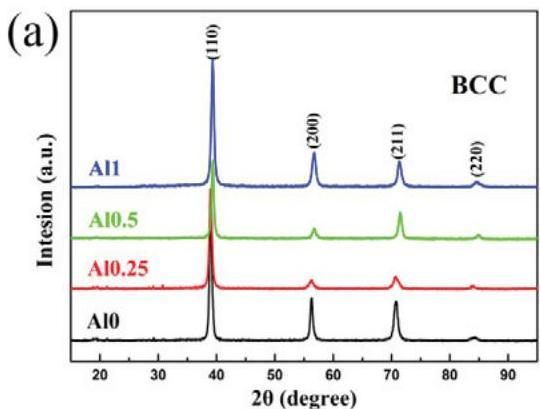
Fig. 1 (a) XRD patterns of the as-solidified NbTiVTaAl $_x$  ( $x = 0, 0.25, 0.5$ , and 1) alloys; (b) the detailed scans for the peaks of (110) of BCC solid solutions.

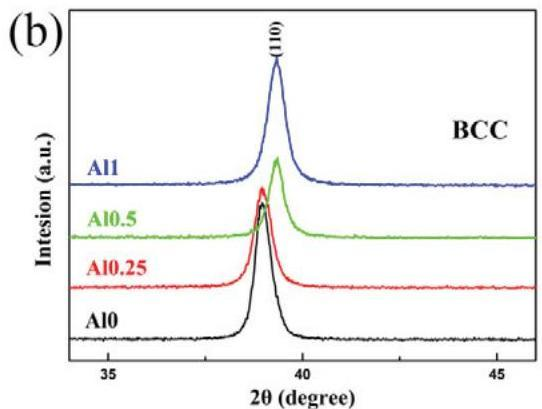

X. Yang et al. / Procedia Engineering 36 (2012) 292-298

Figure 1(a) and (b) show the XRD patterns of the specimens for NbTiVTaAl $_x$  alloy series. From Fig. 1(a), only BCC solid solution phase can be detected in all alloys, indicating that the addition of Al has little effect on the phase constitution of this type of HEAs, and the crystal-plane indices of BCC structure corresponding to diffraction peaks can be identified and marked in XRD patterns. This may be ascribed to the high entropy effect. For these alloys, high entropy of mixing  $(\Delta S_{mix})$  caused by multi-principal elements significantly lower  $\Delta G_{mix}$ , which will make random solid solution easily form and more stable than intermetallic compounds or other ordered phases during solidification.

The magnified image of (110) for BCC reflections is shown in Fig. 1(b). It is noticed that the (110) peak shifts towards lower  $2\theta$  as the Al contents increase, which indicates that the Al addition can cause the decrease of lattice parameters of NbTiVTaAl $_x$  alloys. Obviously, Al element has similar atomic radius to three elements of Nb, Ti and Ta, but Al has a distinctly larger atomic radius than V (see Table 1), which will affect the extent of lattice distortion and change the lattice constants of alloys.

Table1. The crystal structure, atomic radius (r), melting temperature  $(\mathrm{T_m})$  and density  $(\rho)$  of high purity Nb, Ti, V, Ta and Al metals. The investigated crystal structure and the calculated melting temperature for the NTiVTaAl $_x$  alloy series are also given here.

|  Metal | Nb | Ti | V | Ta | Al | Al0 | Al0.25 | Al0.5 | Al1.0  |
| --- | --- | --- | --- | --- | --- | --- | --- | --- | --- |
|  Crystal structure | BCC | HCP | BCC | BCC | FCC | BCC | BCC | BCC | BCC  |
|  r (pm) | 147 | 146 | 135 | 147 | 143 | — | — | — | —  |
|  Tm(K) | 2750 | 1946 | 2202 | 3293 | 933.5 | 2548 | 2453 | 2368 | 2225  |

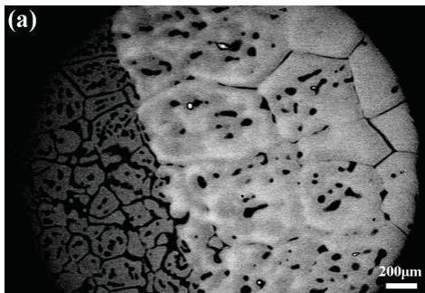

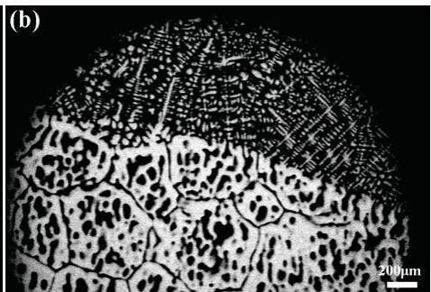

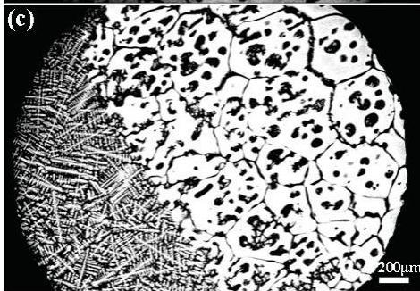
Fig. 2 SEM backscatter images of the (a) Al0, (b) Al0.25, (c) Al0.5 and (d) Al1.0 alloys.

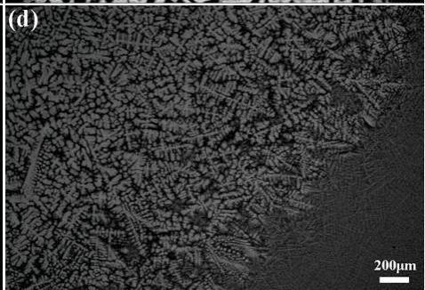

Figure 2 shows the microstructures of NbTiVTaAl $_x$  alloys. It can be seen that the microstructure of Al0 alloy consists of equiaxial dendritic-like grains, and Al0.25, Al0.5, and Al1.0 alloys exhibit typical cast

X. Yang et al. / Procedia Engineering 36 (2012) 292 - 298

dendritic microstructure with the Al contents increase. For all four alloys, the grain sizes are rather larger, and the different regions show different morphology and crystal orientation due to the nonuniform temperature gradient during solidification.

In our previous work [13], the parameter $\Omega$ and the atomic size difference $\delta$ have been proposed to predict the solid solution formation in multicomponent alloys, and $\Omega \geq 1.1$, $\delta \leq 6.6\%$ should be expected as the criteria for forming HE stabilized solid-solution phase. The parameter $\Omega$ and $\delta$ are expressed as[13]:

$$
\Omega = \frac {T _ {m} \Delta S _ {\text {m i x}}}{\left| \Delta H _ {\text {m i x}} \right|} \tag {1}
$$

$$
\delta = \sqrt {\sum_ {i = 1} ^ {n} c _ {i} \left(1 - r _ {i} / \bar {r}\right) ^ {2}} \tag {2}
$$

Where $\Delta H_{mix}$ is the enthalpy of mixing and $\Delta S_{mix}$ is the entropy of mixing; $Tm$ is the melting point of alloy, which is calculated using the rule of mixtures $(T_{m} = \sum c_{i}(T_{m})_{i})$, $n$ is the elemental number of the alloys, $c_{i}$ is the atomic percent of the ith element, $r_i$ is the atomic radius of the ith element, $(\overline{r} = \sum c_i r_i)$ is the average atomic radius of the alloy. In this work, the parameters $\Omega$ and $\delta$ of NbTiVTaAl$_x$ alloys are calculated according to Eq. (1) and (2), and the corresponding results are listed in Table 2. The calculation required physicochemical and thermodynamic parameters for the constituent elements are obtained from Ref. [14], some of them are given in Table 1. Clearly, the parameters $\Omega$ and $\delta$ of studied alloys are met the criteria for forming HE stabilized solid solution phase $(\Omega \geq 1.1, \delta \leq 6.6\%)$, thus the studied alloys are inclined to form solid solution phase during solidification. The curves of $\Omega$ and $\delta$ as a function of Al contents are plotted in Fig. 3. It can be seen that the $\Omega$ values, reflecting the competitive relationship between $\Delta S_{mix}$ and $\Delta H_{mix}$, decrease from 117.461 to 2.215 with Al addition, which indicates that the effect of mixing of entropy on solid solution weaken; while the atomic size difference reaches the maximum $(3.424\%)$ as $x = 0.25$, subsequently, $\delta$ values decrease with Al contents increase as $x &gt; 0.25$.

Table 2. The calculated parameters based on Eq. (1) and (2).

|  Alloys | ΔH_{mix}(KJ/mol) | ΔS_{mix}(J/k.mol) | δ (%) | Ω  |
| --- | --- | --- | --- | --- |
|  NbTiVTa | -0.25 | 11.53 | 3.34 | 117.46  |
|  NbTiVTaAl_{0.25} | -4.82 | 12.71 | 3.42 | 6.47  |
|  NbTiVTaAl_{0.5} | -8.40 | 13.15 | 3.30 | 3.71  |
|  NbTiVTaAlV_{1} | -13.44 | 13.38 | 3.16 | 2.22  |

Moreover, in NbTiVTaAl$_x$ alloys, three constituent elements of Nb, V, Ta exhibit BCC structure (see Table 1), and Al element usually is considered as a BCC stabilizer, all of which facilitate the formation of BCC structure in the studied alloys. Guo et al. [15] proposed that valence electron concentration (VEC) can control the phase stability for BCC or FCC solid solution; FCC phases are found to be stable at higher VEC $(\geq 8)$ and BCC phases are stable at lower VEC $(&lt; 6.87)$. The VEC for multicomponent alloys can be defined as:

$$
\mathrm {V E C} = \sum_ {i = 1} ^ {n} c _ {i} (V E C) _ {i} \tag {3}
$$

Where $(VEC)_i$ is the VEC of the ith element. The VEC for constituent elements of the studied alloys are taken from Ref. [15] and the calculated VEC of Al0, Al0.25, Al0.5 and Al1.0 are 4.75, 4.65, 4.56 and 4.40, respectively. The relationship between VEC and Al contents of alloys is shown in Fig. 3(b). All studied alloys possess lower VEC, thus BCC phase is stable.

X. Yang et al. / Procedia Engineering 36 (2012) 292-298

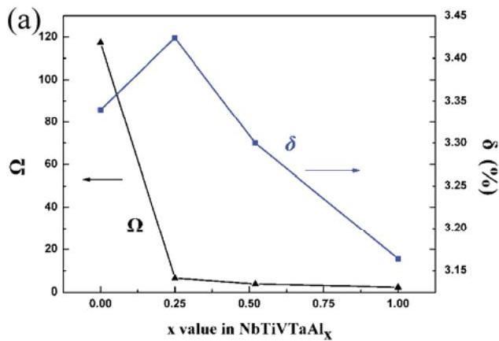
Fig. 3 (a) The curves of  $\Omega$  and  $\delta$  as a function of Al contents for NbTiVTaAl $_x$  ( $x = 0, 0.25, 0.5$  and 1) alloys; (b) the relation between VEC and Al contents of alloys.

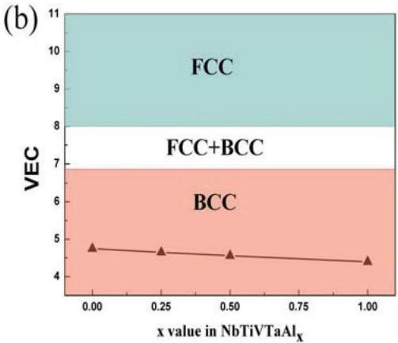

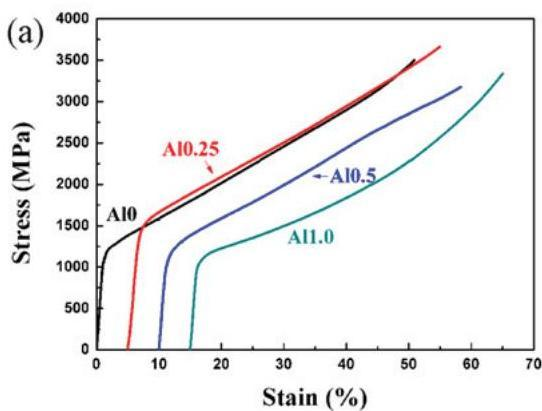
Fig. 4 (a) The compressive engineering stress-strain curves of NbTiVTaAl $_x$  ( $x = 0, 0.25, 0.5$  and 1.0) alloys; (b) compressive test results for these alloys.

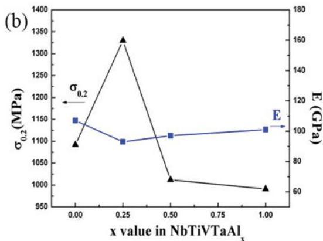

Figure 4(a) shows the compressive engineering stress-strain curves of room temperature test for NbTiVTaAl $_x$  alloys. All alloys exhibit high yield compressive strength and good plastic deformation. The yield strength of Al0, Al0.25, Al0.5 and Al1.0 are  $1092 \mathrm{MPa}$ ,  $1330 \mathrm{MPa}$ ,  $1012 \mathrm{MPa}$  and  $991 \mathrm{MPa}$ , respectively. After yielding, the strength of alloys increase continuously and the samples of alloys do not break under about  $50\%$  compressive strain. The relations between yield strength, elastic modulus and Al contents for studied alloys are shown in Fig. 4(b). It can be seen that when the Al content increases to  $x = 0.25$ , the maximum yield strength increase to  $1330 \mathrm{MPa}$ ; while the further addition of Al element can make yield strength decrease. This variation tendency of yield strength is similar to that of atomic size difference. Moreover, the elastic modulus of studied alloys changes slightly with the Al addition. The high yield strength of these alloys likely is attributed to solid solution strengthening.

For NbTiVTaAl $_x$  alloys with single BCC structure, each atom can be expected as a solute atom and it can randomly occupy the crystal lattice site of alloy. Nevertheless these solute atoms with different sizes and properties can interact with each other and elastically distort the crystal lattice, which induce the

X. Yang et al. / Procedia Engineering 36 (2012) 292 - 298

formation of local elastic stress field. The interactions between these local elastic stress fields and the stress field of dislocations in alloy will hinder dislocation movements, and cause the increase of strength. In general, the relation between the strengthening $(\Delta \sigma)$ and solute concentration (c) is expressed as [16]:

$$
\Delta \sigma \propto c ^ {n} \tag {4}
$$

Here $n \approx 0.5$. Compared with the traditional crystal materials, the concentration of solute for NbTiVTaAl$_x$ HEAs is extremely high, so these alloys exhibit high compressive strength. On the other hand, the strengthening caused by atomic size mismatch will increase with the increase of atomic size difference. In NbTiVTaAl$_x$ HEAs, the atomic size difference reach a maximum as $x = 0.25$, the corresponding compressive yield strength of Al0.25 alloy also is the highest, which implies that the effect of atomic size mismatch on the strength is very notable in NbTiVTaAl$_x$ HEAs.

Figure 5 shows the morphologies of the fractographs of the deformed sample for Al0 alloy. The lateral surface of the deformed sample under $50\%$ compressive strains is shown in Fig. 5(a). It can be seen that the sample with the barrel-like form does not fracture after compressive deformation, but some surface cracks, marked by the arrows, are observed. Besides, the sample exhibits slightly nonuniform deformations, which may be ascribed to inhomogeneous microstructures. As a contrast, the secondary electron image and backscatter electron images of the deformed sample with $30\%$ compressive strains are shown in Fig. 5 (b) and (c), respectively, no cracks can be observed in both surface and insider. Deformed grains that were elongated in the radial direction can be seen in Fig. 5 (c). The similar morphologies have also been observed in Al0.25, Al0.5 and Al1.0 alloys.

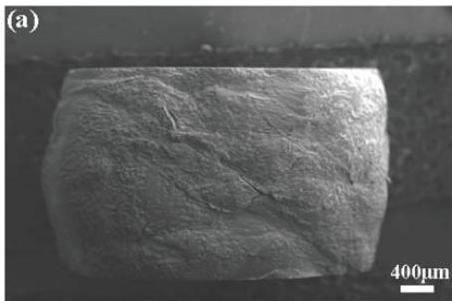

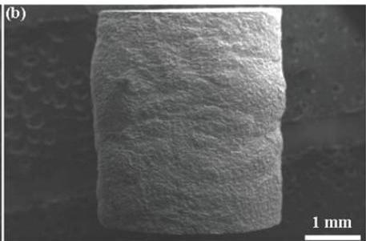

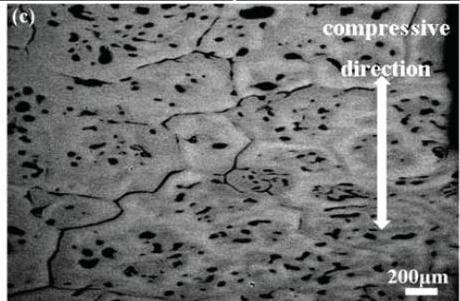

Fig. 5 The morphologies of the fractographs of the deformed sample for Al0 alloy. (a) The lateral surface of the deformed sample under $50\%$ compressive strains; the secondary electron image and backscatter electron images of the deformed sample with $30\%$ compressive strains are shown in (b) and (c), respectively.

# 4. Conclusions

A new series of NbTiVTaAl$_x$ high entropy alloys have been successfully prepared, which all have simple phase structures and exhibit obvious dendrite structures. The phase formation rule of them has

X. Yang et al. / Procedia Engineering 36 (2012) 292-298

been discussed, based on the parameters of $\Omega$, $\delta$ and VEC. It is concluded that these alloys possess excellent BCC solid-solution formation ability. All alloys have high compressive yield strength and ductility (no fracture under $50\%$ strains), which should be attributed to solid solution strengthening.

## Acknowledgements

The authors would like to acknowledge financial support by the National Natural Science Foundation of China (NNSFC, No.50971019).

## References

[1] Yeh J W, Chen S K, Lin S J, Gan J Y, Chin T S, Shun T T, et al. Nanostructured high-entropy alloys with multiple principal elements: Novel alloy design concepts and outcomes. Adv. Eng. Mater. 2004; 6(5): 299-303.

[2] Zhou Y J, Zhang Y, Wang Y L, Chen G L. Microstructure and compressive properties of multicomponent $\mathrm{Al}_{\mathrm{x}}(\mathrm{TiVCrMnFeCoNiCu})_{100 - x}$ high-entropy alloys. Mater. Sci. Eng. A 2007; 454-455: 260-265.

[3] Zhang Y, Zhou Y J, Lin J P, Chen G L, Liaw P K. Solid-solution phase formation rules for multi-component alloys. Adv. Eng. Mater. 2008; 10(6): 534-538.

[4] Zhang Y, Chen G L, Gan C L. Phase Change and Mechanical Behaviors of $\mathrm{Ti_xCoCrFeNiCu_{1 - y}Al_y}$ High Entropy Alloys. Journal of ASTM International 2010; 7(5): 1-8.

[5] Zhou Y J, Zhang Y, Wang Y L, Chen G L. Solid solution alloys of AlCoCrFeNiTi, with excellent room-temperature mechanical properties. Appl. Phys. Lett. 2007; 90(18): 181904.

[6] Chuang M H, Tsai M H, Wang W R, Lin S J, Yeh J W. Microstructure and wear behavior of $\mathrm{Al_xCo1_3CrFeNi_{1.5}Ti_y}$ high-entropy alloys. Acta Mater 2011; 59(16): 6308-6317.

[7] Wen L H, Kou H C, Li J S, Chang H, Xue X Y, Zhou L. Effect of aging temperature on microstructure and properties of AlCoCrCuFeNi high-entropy alloy. Intermetallics 2009; 17(4): 266-269.

[8] Tsai C W, Tsai M H, Yeh J W, Yang C C. Effect of temperature on mechanical properties of $\mathrm{Al}_{0.5}\mathrm{CoCrCuFeNi}$ wrought alloy. J. Alloys Compd. 2010; 490(1-2): 160-165.

[9] Zhu J M, Fu H M, Zhang H F, Wang A M, Li H, Hu Z Q. Microstructures and compressive properties of multicomponent AlCoCrFeNiMo, alloys [J]. Mater. Sci. Eng. A 2010; 527(26): 6975-6979.

[10] Tong C J, Chen M R, Yeh J W, Lin S J, Chen S K, Shun T T, et al. Mechanical performance of the $\mathrm{Al_xCoCrCuFeNi}$ high-entropy alloy system with multiprincipal elements. Metall. Mater. Trans. A 2005; 36(5): 1263-1271.

[11] Senkov O N, Wilks G B, Scott J M, Miracle D B. Mechanical properties of Nb25Mo25Ta25W25 and V20Nb20Mo20Ta20W20 refractory high entropy alloys. Intermetallics 2011; 19(5): 698-706.

[12] Senkov O N, Wilks G B, Miracle D B, Chuang C P, Liaw P K. Refractory high-entropy alloys]. Intermetallics 2010; 18(9): 1758-1765.

[13] Yang X, Zhang Y. Prediction of High-entropy Stabilized Solid-solution in Multi-component Alloys. Mater. Chem. Phys. 2011; in press.

[14] Kittel C. Introduction to solid state physics. New York: Wiley. 1996.

[15] Guo S, Ng C, Lu J, Liu C T. Effect of valence electron concentration on stability of fcc or bcc phase in high entropy alloys. J. Appl. Phys. 2011; 109(10): 103505-5.

[16] Qiao J W, Ma S G, Huang E W, Chuang C P, Liaw P K, Zhang Y. Microstructural Characteristics and Mechanical Behaviors of AlCoCrFeNi High-Entropy Alloys at Ambient and Cryogenic Temperatures. Mater. Sci. Forum 2011; 688: 419-425.