www.nature.com/scientificreports

# SCIENTIFIC REPORTS

OPEN

# Enhanced strength and ductility in a friction stir processing engineered dual phase high entropy alloy

S. S. Nene $^{1}$ , K. Liu $^{1}$ , M. Frank $^{1}$ , R. S. Mishra $^{1}$ , R. E. Brennan $^{2}$ , K. C. Cho $^{2}$ , Z. Li $^{3}$  &amp; D. Raabe $^{3}$

Received: 19 October 2017

Accepted: 14 November 2017

Published online: 23 November 2017

The potential of high-entropy alloys (HEAs) to exhibit an extraordinary combination of properties by shifting the compositional regime from the corners towards the centers of phase diagrams has led to worldwide attention by material scientists. Here we present a strong and ductile non-equiatomic HEA obtained after friction stir processing (FSP). A transformation-induced plasticity (TRIP) assisted HEA with composition  $\mathrm{Fe}_{30}\mathrm{Mn}_{30}\mathrm{Co}_{10}\mathrm{Cr}_{10}$  (at.%) was severely deformed by FSP and evaluated for its microstructure-mechanical property relationship. The FSP-engineered microstructure of the TRIP HEA exhibited a substantially smaller grain size, and optimized fractions of face-centered cubic (f.c.c.,  $\gamma$ ) and hexagonal close-packed (h.c.p.,  $\varepsilon$ ) phases, as compared to the as-homogenized reference material. This results in synergistic strengthening via TRIP, grain boundary strengthening, and effective strain partitioning between the  $\gamma$  and  $\varepsilon$  phases during deformation, thus leading to enhanced strength and ductility of the TRIP-assisted dual-phase HEA engineered via FSP.

High-entropy alloys (HEAs) represent a special class of materials that were originally designed to obtain a single-phase massive solid solution devoid of any secondary phases $^{1}$ . The approach provides high solid solution strengthening and may suppress formation of brittle intermetallic phases $^{1,2}$ . Significant efforts have been devoted to develop new HEAs for overcoming the strength-ductility trade-off inherent in most conventional materials. A prominent example is an equiatomic HEA with composition  $\mathrm{Fe}_{20}\mathrm{Mn}_{20}\mathrm{Ni}_{20}\mathrm{Co}_{20}\mathrm{Cr}_{20}$ , which showed excellent strength, ductility, and fracture toughness at cryogenic and room temperatures $^{2}$ . However, the limitation of the equi-atomic HEA approach is that it represents a single point within a huge compositional phase space. Thus, a number of non-equiatomic HEAs such as  $\mathrm{Al}_{1.5}\mathrm{CoCr}_{0.5}\mathrm{FeNi}_{0.5}$  and different variants of the FeMnNiCoCr system were introduced, showing in part promising property profiles $^{3-6}$ .

HEAs have shown a strong potential in tuning their primary deformation mechanisms by adjusting their chemical composition and by engineering the microstructure via processing. Recent work by Li et al. $^{6}$  demonstrates tunability of deformation mechanisms such as dislocation slip, twin induced plasticity (TWIP) and trnasformation induced plasticity (TRIP) by varying the Mn content from 45 to 30 at  $\%$  in the Fe-Mn-Co-Cr system. This led to the development of another class of HEAs known as dual phase  $\mathrm{Fe}_{50}\mathrm{Mn}_{30}\mathrm{Co}_{10}\mathrm{Cr}_{10}$  HEA which utilizes the TRIP effect as the primary strain accomodation mechanism during plastic deformation. In this material a simultaneous increase in strength and ductility was obtained due to the engineered fraction and thermodynamic stability of the face-centered cubic (f.c.c.,  $\gamma$ ) and hexagonal close-packed (h.c.p.,  $\varepsilon$ ) phases in the microstructure through well designed composition and thermomechanical processing $^{3,4,6}$ . While such microstructures and their effects associated with conventional thermomechanical processing on the deformation behavior in HEAs, including TRIP HEAs, have been investigated in detail, studies on severe plastic deformation, such as equal channel angular pressing (ECAP), high-pressure torsion (HPT) and friction stir processing (FSP), of HEAs and their effects on the mechanical properties $^{7-9}$  have been limited so far. Among these techniques, FSP is the most industrially feasible process for bulk products and has applicability for solid state joining. Earlier work by Kumar et al. $^{4}$  showed that FSP of  $\mathrm{Al}_{0.1}\mathrm{CoCrFeNi}$  HEA resulted in substantial improvement of strength and ductility when compared with the as-cast condition, due to enhanced grain refinement and a greater fraction of high angle grain boundaries. The difference between FSP and ECAP/HPT lies in the pathway of microstructural refinement. The

$^{1}$ Center for Friction Stir Processing, Department of Materials Science and Engineering, University of North Texas, Denton, Texas, 76203, USA.  $^{2}$ Weapons and Materials Research Directorate, U.S. Army Research Laboratory, Aberdeen Proving Grounds, MD, 21005, USA.  $^{3}$ Max-Planck-Institut für Eisenforschung, Max-Planck-Str. 1, 40237, Düsseldorf, Germany. Correspondence and requests for materials should be addressed to R.S.M. (email: Rajiv. Mishra@unt.edu)

SCIENTIFIC REPORTS |7:16167 |DOI:10.1038/s41598-017-16509-9

www.nature.com/scientificreports/

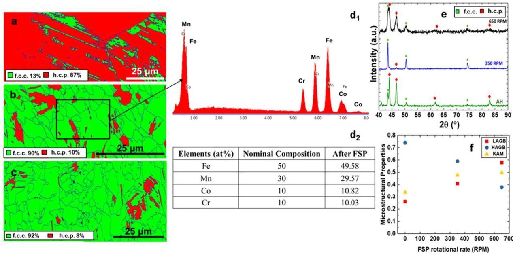
Figure 1. (a-c) Phase maps for the material in the as-homogenized condition; after additional 350, and after 650 RPM processing,  $(\mathbf{d}_1 - \mathbf{d}_2)$  corresponding EDS results for 350 RPM processed sample, (e) corresponding XRD results for the as-homogenized and FSP samples, (f) microstructural properties including the fraction of high angle grain boundaries, low angle grain boundaries, and kernel average misorientation values after FSP. AH: as-homogenized; FSP: friction stir processing; RPM: rotations per minute; LAGB: low angle grain boundary; HAGB: high angle grain boundary.

fine grain size obtained from FSP results from dynamic recrystallization and limiting subsequent grain growth $^{10}$ . Grain refinement during ECAP and HPT occurs by deformation-driven grain fragmentation and patterned dislocation storage leading to a high fraction of low angle grain boundaries $^{11,12}$ .

Li et al.3,4 had shown that the strength-ductility profile of this material depends not only on grain size but also on the fraction of the h.c.p.  $\varepsilon$  phase and the density of stacking faults. FSP leads to a highly transient microstructure type, as the material is deformed at a high temperature and individual grains experience different stages of straining. Here we used FSP to engineer the microstructure of the TRIP  $\mathrm{Fe_{50}Mn_{36}Co_{10}Cr_{10}}$  HEA along two strands of motivation. The first is that grain size reduction enhances the stability of the f.c.c.  $\gamma$ -phase grains against deformation-driven transformation. This effect should lead to a more uniform distribution of the f.c.c.  $\gamma \rightarrow$  h.c.p.  $\varepsilon$  transformation zones, thereby maximizing the dispersion and hence the TRIP effect. Second, joinability of any advanced novel alloy is an essential precondition for using it in engineering applications. FSP results provide a first overview of the alloy's suitability for friction stir welding.

# Results and Discussion

Microstructure evolution after FSP. Figure 1a-c show electron back scattered diffraction (EBSD) maps for the as-homogenized and 350 and 650 rotations per minute (RPM) treated FSP samples, highlighting the drastic reduction in average grain size from  $\sim 100\mu \mathrm{m}$  to 6.5 and  $5.2\mu \mathrm{m}$ , respectively. Since FSP is a high temperature, severe plastic deformation process, it also changed the fraction of f.c.c.  $\gamma$  and h.c.p.  $\varepsilon$ -phases in the microstructure while maintaining the chemical homogeneity. Fig. 1d1d2 display the EDS analysis results for a 350 RPM specimen showing average compositions of the constituent elements of the dual phase (DP)-HEA suggesting homogeneity in the microstructure. As discussed by Palanivel et al. $^{10}$ , FSP leads to a homogenization of the microstructure and its local composition owing to the enhanced shear-related deformation-driven transport and mixing of the elements. XRD analysis (Fig. 1e) shows the phase changes that have occurred with FSP, as depicted by the variation in peak intensities for f.c.c.  $\gamma$  and h.c.p.  $\varepsilon$ -phases as a function of FSP tool rotation rates. FSP led to a significantly higher fraction of f.c.c.  $\gamma$ -phase in the microstructure of the TRIP HEA irrespective of the tool rotational rates as seen in Fig. 1b-d in comparison with the as-homogenized reference condition (Fig. 1a).

A detailed analysis of the EBSD data (Fig. 1f) revealed that the fraction of high-angle grain boundaries (HAGBs), as highlighted by blue lines, decreased in comparison to the as-homogenized material as a result of severe plastic deformation during FSP. This fractional drop of HAGBs was also supported by the higher kernel average misorientation (KAM) values for the 350 and 650 RPM processed samples as compared to the as-homogenized microstructure. However, the KAM values were less than 1.2 irrespective of the processing condition, which also indicated the occurrence of dynamic recrystallization upon FSP. Moreover, most of the new grains were twin-free, and h.c.p  $\varepsilon$  was present in the form of plates within the f.c.c. grains as shown in Fig. 1b,c.

Li et al.3,4 reported  $\sim 32\%$  of h.c.p. phase in the microstructure with an average f.c.c.  $\gamma$  grain size of  $4.5\mu \mathrm{m}$  upon cold-rolling and subsequent annealing at a furnace temperature of  $900^{\circ}\mathrm{C}$  for  $3\mathrm{min}$ . After FSP we find that the same alloy showed  $\sim 8$  and  $\sim 10\%$  of h.c.p. at similar grain sizes of  $\sim 5.2$  and  $6.5\mu \mathrm{m}$ , respectively. The TRIP effect

SCIENTIFIC REPORTS |7:16167 |DOI:10.1038/s41598-017-16509-9

www.nature.com/scientificreports/

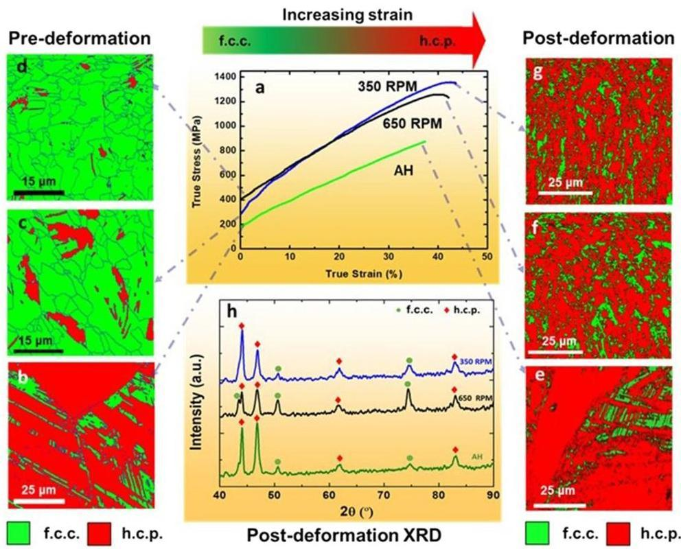
Figure 2. (a) True stress-true strain curves for the as-homogenized and FSP samples deformed at room temperature at an initial strain rate of  $10^{-3}\mathrm{s}^{-1}$ , (b-d) EBSD maps showing f.c.c.  $\gamma$ - and h.c.p.  $\varepsilon$ -phase fractions prior to tensile deformation and, (e-h) EBSD maps and corresponding XRD patterns showing f.c.c.  $\gamma$ - and h.c.p.  $\varepsilon$ -phase fractions after tensile deformation. AH: as-homogenized; RPM: rotations per minute.

includes the conversion of f.c.c.  $\gamma$ -phase to h.c.p.  $\varepsilon$ -phase under deformation, and thus a higher starting fraction of f.c.c.  $\gamma$ -phase should lead to a higher level of TRIP effect, provided that the thermodynamic stability of the f.c.c.  $\gamma$ -phase is similar in both cases. Therefore, FSP provided an expedient route for obtaining fine-grained TRIP HEAs with higher f.c.c.  $\gamma$ -phase fraction, as compared to conventional thermomechanical processing, which required multiple processing steps.

Stress-strain behavior. Figure 2a-g present the true stress-true strain curves for the 350 and 650 RPM treated samples, along with the EBSD phase maps before and after tensile deformation, as compared to the as-homogenized reference material. Since the material in as-homogenized state had coarser grains and a higher  $\varepsilon$ -phase content (Fig. 2b), it also exhibited lower strain hardening response, reaching a maximum true stress of  $800\mathrm{MPa}$  with uniform elongation of  $35\%$ . The as-homogenized material experienced a limited TRIP effect, as indicated by the similar color codes in the EBSD phase maps (Fig. 2b,e), and the XRD data obtained before and after tensile deformation (Fig. 2h). The FSP treatment led to significant improvement in the tensile mechanical properties of the alloy, i.e. maximum true stress values of  $1400\mathrm{MPa}$  and  $1200\mathrm{MPa}$  at uniform elongations of almost  $45\%$  and  $42\%$  were obtained for the samples with tool rotational rates of 350 and 650 RPM, respectively (Fig. 2a). This enhanced combination of strength and ductility was partly attributed to  $\sim 90\%$  f.c.c.  $\gamma$ -phase, as shown in Fig. 2c,d prior to deformation, and the associated high TRIP-related strain hardening during deformation.

The change in color from green to red shown by the EBSD phase maps (Figs 2c,d,f,g) and majority h.c.p.  $\varepsilon$ -phase peaks shown by XRD (Fig. 2h) after failure of the FSP tensile samples confirmed the deformation-induced phase transformation from f.c.c.  $\gamma$ - into the h.c.p.  $\varepsilon$ -phase. Tensile deformation resulted in transformation of  $\sim 90\%$  of the starting  $\gamma$ -phase to almost  $79\%$  and  $75\%$  h.c.p.  $\varepsilon$ -phase for the 350 and 650 RPM conditions, respectively.

The values of true ultimate stress and ductility for the 350 RPM treated sample appear similar to the highest values reported by Li et al. after cold-rolling and  $3\mathrm{min}$  annealing. Moreover, the properties of the single phase equi-atomic  $\mathrm{Fe}_{20}\mathrm{Mn}_{29}\mathrm{Co}_{26}\mathrm{Cr}_{20}\mathrm{Ni}_{20}$  alloy appeared to be significantly inferior to those observed for the FSP alloys having similar grain sizes. The work hardening response of the 350 RPM treated and as-homogenized reference material after tensile deformation confirmed that FSP produced a pronounced increase in work hardening. Regarding the yield strength (YS) values of the alloy, significant improvement of the 350 RPM treated sample led to a value of  $298\mathrm{MPa}$  compared to a value of  $198\mathrm{MPa}$  for the as-homogenized sample. The 650 RPM treated sample showed  $\sim 200\mathrm{MPa}$  increase in YS (Fig. 2a) compared to the as-homogenized condition. These improved

SCIENTIFIC REPORTS |7:16167 |DOI:10.1038/s41598-017-16509-9

www.nature.com/scientificreports/

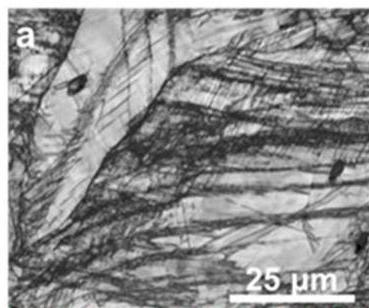

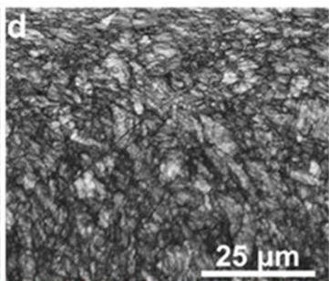

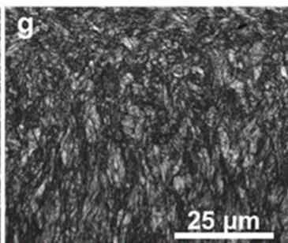

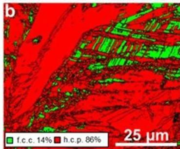

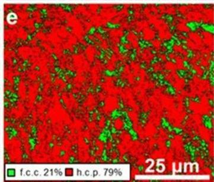

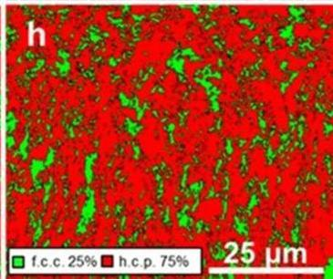

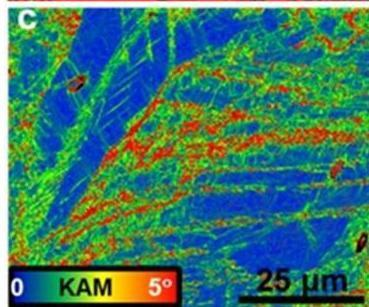
Figure 3. (a-c) EBSD image quality, phase, and KAM maps for the as-homogenized reference sample (d-f) image quality, phase, and KAM maps for the 350 RPM processed sample (g-i) image quality, phase, and KAM maps for the 650 RPM processed sample after room temperature tensile deformation at a strain rate of  $10^{-3}\mathrm{s}^{-1}$ . RPM: rotations per minute; KAM: kernel average misorientation.

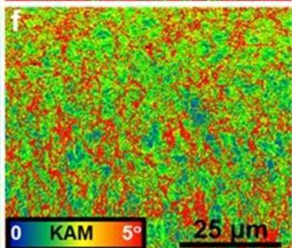

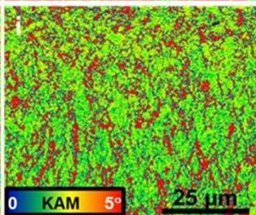

values for the FSP specimens were related to more homogeneous deformation because of finer grains in comparison with the as-homogenized material.

Deformation mechanisms after FSP. Figure 3a is an image quality map for the coarse-grained as-homogenized sample after tensile deformation, showing a heavily deformed microstructure. No significant changes in phase fraction were expected for this sample after deformation (Fig. 3b), as the starting volume fraction of f.c.c.  $\gamma$ -phase was extremely low. Most of the work hardening in this condition was associated with a dislocation density increase. KAM values were higher near the f.c.c.  $\gamma$ -phase, but quite low in the  $\varepsilon$ -phase region (Fig. 3c), indicating that most of the deformation was accommodated by the f.c.c.  $\gamma$ -phase. Thus for the as-homogenized material, dislocation assisted plasticity is the primary mechanism of deformation and not the TRIP effect.

These trends change drastically for FSP samples which showed very large deformation-induced transformation of f.c.c.  $\gamma$ - to h.c.p.  $\varepsilon$ -phase (Fig. 3e,h). Figure 3d,g are the associated image quality maps. Since the KAM values were above 1 in both, the f.c.c.  $\gamma$ - and the h.c.p.  $\varepsilon$ -phase after deformation for both FSP samples (Fig. 3e,f and h,i), they were directly associated with the densities of geometrically-necessary dislocations (GNDs) $^{13,14}$ . Regions with higher KAM values (indicated by red color) in Fig. 3c,f,i indicate larger plastic accommodation strains due to the strain mismatch among the two phases. As the deformation continues, the remaining f.c.c.  $\gamma$ -phase experiences gradually a higher barrier to the f.c.c.  $\gamma \rightarrow$  h.c.p.  $\varepsilon$  transformation due to the back stresses exerted by the transformed h.c.p.  $\varepsilon$ -phase $^{3,4}$ .

Li et al.3,4 observed that at higher strain levels, the h.c.p.  $\varepsilon$  -phase also showed higher KAM values, suggesting that it accommodated some of the total deformation. Deformation-induced twinning is the primary mechanism by which the h.c.p. phase contributes to work hardening of the alloy13-23. Thus, the need for strain partitioning builds up during continuing deformation as the harder h.c.p.  $\varepsilon$  -phase volume fraction increases. FSP specimens before tensile deformation have lower average KAM values (Fig. 1e) than after tensile deformation (Fig. 3f,i), a circumstance that is likely to be related to lower GND arrays in the f.c.c.  $\gamma$  -phase. The fine initial  $\gamma$  grain size in the FSP processed specimens leads to a more homogeneous KAM pattern. The difference in KAM distribution (Fig. 3c,f,i) among the three conditions emphasizes the important role that microstructural features, such as the grain size and phase fractions, play for the deformation mechanisms in a TRIP HEA, as reported previously3,4.

SCIENTIFIC REPORTS |7:16167 |DOI:10.1038/s41598-017-16509-9

www.nature.com/scientificreports/

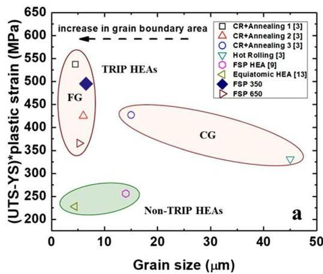
Figure 4. (a) Strength-ductility index (SDI) as a function of grain size and (b) variation of SDI as a function of  $\varepsilon$  phase fraction (prior to deformation) for grain-refined TRIP HEAs and non-TRIP HEAs. CG: coarse grained; FG: fine grained; FSP: friction stir processing; CR: cold rolling; RPM: rotations per minute.

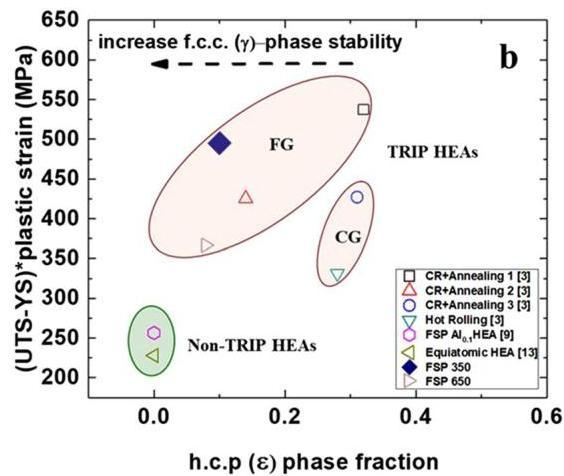

Enhanced strength-ductility index (SDI) for TRIP HEA: Effect of f.c.c.  $\gamma$  grain size and h.c.p.  $\varepsilon$ -phase fraction. Recent literature[15-23] on TRIP steel, and work by Li et al.[3,4] on TRIP HEAs have confirmed that the f.c.c.  $\gamma$  grain size and the h.c.p.  $\varepsilon$ -phase proportion are directly related to the thermodynamic stability of the f.c.c.  $\gamma$ -phase. Figure 4a,b show a strength-ductility index (SDI), defined as (UTS-YS) * plastic strain[24], plotted as a function of grain size and h.c.p.  $\varepsilon$ -phase fraction for the TRIP HEA processed upon various processing conditions. The plot in Fig. 4a suggests that grain refinement in the TRIP HEAs leads to greater improvement in the SDI value than observed for the  $\mathrm{Fe}_{20}\mathrm{Mn}_{29}\mathrm{Co}_{20}\mathrm{Cr}_{20}\mathrm{Ni}_{20}$  equiatomic reference  $\mathrm{HEA}^{25}$ . Moreover, a non-TRIP  $\mathrm{Al}_{0.1}\mathrm{CoCrFeNi}$  HEA, after subjecting it to a FSP, showed a lower SDI value compared to TRIP HEAs with and without FSP exposure. This clearly indicates that TRIP HEAs have superior work hardenability when compared to more stable single phase HEAs, and have a strong potential to overcome the inverse relationship between strength and ductility.

Among the TRIP HEAs, it was apparent from Fig. 4b that SDI values are a function of f.c.c.  $\gamma$  grain size and h.c.p.  $\varepsilon$ -phase fraction prior to tensile deformation. Cold-rolled and annealed TRIP HEA (3 min at a furnace temperature of  $900^{\circ}\mathrm{C}$  followed by water quenching) showed a maximum SDI value[3,4]. Further, the material in FSP 350 RPM condition showed the second highest SDI value (with similar grain size) among all other TRIP HEAs treated by thermomechanical process, which could be attributed to the enhanced stability of the f.c.c.  $\gamma$ -phase after FSP. However, the difference in the SDI values for the 350 and 650 RPM treated specimens could be explained by considering both the grain refinement and the  $\varepsilon$ -phase fraction prior to tensile deformation.

The effect of grain size on f.c.c.  $\gamma$ -phase stability can be explained as follows: An increase in the grain boundary area per unit volume increases the number of preferential nucleation sites for h.c.p.  $\varepsilon$ -phase formation due to grain refinement. On the other hand, the adjacent grain boundaries restrict the growth of the h.c.p.  $\varepsilon$  plate by exerting back stresses and hence stabilize the f.c.c.  $\gamma$  grains. For example, the 350 RPM treated sample with an average grain size of  $6.5\mu \mathrm{m}$  resulted in stabilization of the f.c.c.  $\gamma$ -phase as confirmed by the EBSD and XRD maps (Fig. 1c,d), respectively. The increase in strength, ductility and resultant SDI value of the alloy is tied to the refinement of grain size which leads to higher yield strength and larger number of nucleation sites for h.c.p.  $\varepsilon$ -phase resulting in improved work hardening.

Along with the finer grain size, the initial h.c.p.  $\varepsilon$ -phase fraction prior to tensile deformation also changes the overall stress-strain response of the metastable HEAs because of the change in the f.c.c.  $\gamma$ -phase stability and associated work hardenability. Therefore, relatively higher fractions of h.c.p.  $\varepsilon$ -phase with finer grain sizes has been suggested as a beneficial microstructure for metastable alloys for attaining substantial work hardening for improved strength and ductility[3,4,8]. Similar observations can be made from the present results, wherein the 350 RPM treated sample showed higher SDI value than the 650 RPM treated sample due to finer grain size and a higher fraction of the h.c.p.  $\varepsilon$ -phase prior to deformation. Alloys treated by conventional thermomechanical processes also displayed similar trends for the dependence of the SDI values on the h.c.p.  $\varepsilon$ -phase fractions. For example, the highest value of SDI was observed for a microstructure with finest grain size (4.5 μm) and almost 30%  $\varepsilon$  phase among the alloys and processing conditions considered in Fig. 4b[3,4].

The FSP engineered DP-HEA has a similar f.c.c  $\gamma$  average grain size  $(6.5\mu \mathrm{m})$  as compared to the TMP-HEA reported by Li et al.3,4  $(4.5\mu \mathrm{m})$ . However, the h.c.p  $\varepsilon$ -phase fraction of  $\sim 10\%$  in the FSP engineered DP-HEA is lower than the value of  $30\%$  in TMP-HEA3,4. This difference in the starting h.c.p  $\varepsilon$ -phase fraction results in  $\sim 50\mathrm{MPa}$  difference in their SDI values, that of the TMP-HEA being higher. This comparison shows the intrinsic importance of not only grain size but also prior h.c.p.  $\varepsilon$ -phase fraction in optimizing the mechanical response of the DP-HEA irrespective of the processing path. Figure 4b reveal a processing window such that strength and ductility can be improved further by engineering both, the grain sizes and  $\varepsilon$  phase fractions to obtain excellent mechanical properties of TRIP HEAs.

SCIENTIFIC REPORTS |7:16167 |DOI:10.1038/s41598-017-16509-9

www.nature.com/scientificreports/

|  Processing parameters  |   |
| --- | --- |
|  Rotational Rate (RPM) | 350, 650  |
|  Traverse Speed (mm/min) | 50.8  |
|  Plunge Depth (mm) | 3.65  |
|  Tilt Angle (°) | 2.5  |

Table 1. Processing parameters selected for FSP.

# Conclusions

Friction stir processing resulted in a fine grain size along with a high volume fraction of f.c.c.  $(\gamma)$  phase as compared to as-homogenized reference material. This combination of fine grain size and distribution of small volume fraction of h.c.p.  $\varepsilon$ -phase leads to high work hardening rate over an extended plastic strain range due to an enhanced TRIP effect. The TRIP HEAs exhibit very high values of the strength-ductility product index and the response can be tailored through microstructural engineering. The initial FSP results also provide a first overview of the alloy's suitability for joining via friction stir welding.

# Methods

Materials and Processing. The TRIP HEA was produced by melting and casting in a vacuum induction furnace using pure metals with a nominal composition of  $\mathrm{Fe}_{50}\mathrm{Mn}_{30}\mathrm{Co}_{10}\mathrm{Cr}_{10}$  (at  $\%$  ). The as-cast blocks were hotrolled at  $900^{\circ}\mathrm{C}$  to a thickness of  $50\%$  (from 40 to  $20\mathrm{mm}$ ). Subsequently, the alloy sheets of  $20\mathrm{mm}$  thickness were homogenized at  $1200\mathrm{C}$  for  $5\mathrm{h}$  in Ar atmosphere followed by quenching in ice water. Subsequently, sheets of  $5\mathrm{mm}$  were machined out of the block by electro-discharge machining, and subjected to friction stir processing with the parameters mentioned in Table 1. The processing tool had a shoulder diameter of  $12\mathrm{mm}$  with tapered pin. The root diameter, pin diameter, and length were  $7.5\mathrm{mm}$ ,  $6\mathrm{mm}$ , and  $3.5\mathrm{mm}$ , respectively.

Microstructural and mechanical characterization. Microstructure of the alloy in homogenized (coarse-grained) and recrystallized (grain-refined) conditions were analyzed by various methods. X-ray diffraction (XRD) measurements were performed using an RIGAKU X-Ray equipment equipped with  $\mathrm{CuK}_{\alpha}$  radiation operated at  $40\mathrm{kV}$  and  $30\mathrm{mA}$ . Electron backscatter diffraction (EBSD) measurements were carried out by a FEI NOVA Nano (SEM) with a Hikari camera and the TSL OIM data collection software.

Rectangular  $1\mathrm{mm}$ -thick, dog-bone-shaped mini-tensile specimens were machined using a mini computer numerical control (CNC) machine from  $1\mathrm{mm}$  below the top surface within the nugget region. Gage length and width of the tensile specimens were 5 and  $1.25\mathrm{mm}$ , respectively. In each condition, three samples were tested at room temperature using initial strain rate of  $10^{-3}\mathrm{s}^{-1}$ .

# References

1. Yeh, J. et al. Nanostructured high entropy alloys with multiple component elements: novel alloy design concepts and outcomes. Adv. Eng. Mater. 6, 299-303 (2004).
2. Cantor, B., Muticomponent and high entropy alloys, entropy 16, 4249-4268 (2014).
3. Li, Z. et al. Metastable high-entropy dual-phase alloys overcome the strength-ductility trade-off. Nature 534, 227-30 (2016).
4. Li, Z. et al. A TRIP-assisted dual-phase high-entropy alloy: grain size and phase fraction effects on deformation behavior. Acta Mater. 131, 323-335 (2017).
5. Deng, Y. et al. Design of a twinning-induced plasticity high entropy alloy. Acta. Mater. 94, 124-133 (2015).
6. Li, Z. &amp; Raabe, D. Strong and Ductile Non-equiatomic High-Entropy Alloys: Design, Processing, Microstructure, and Mechanical Properties. JOM 69, 2099-2106 (2017).
7. Heczel, A. et al. Defect structure and hardness in nanocrystalline CoCrFeMnNi High-Entropy Alloy processed by High-Pressure Torsion. J. Alloys Compd. 711, 143-54 (2017).
8. Hammond, V. H. et al. Equal channel angular extrusion of a low density high entropy alloy produced by high energy cryogenic mechanical alloying. JOM 66, 2021-2029 (2014).
9. Kumar, N. et al. Friction stir processing of a high entropy alloy  $\mathrm{Al}_{0.1}\mathrm{CoCrFeNi}$ . JOM 67, 1007-1013 (2015).
10. Palanivel, S. et al. A framework for shear driven dissolution of thermally stable particles during friction stir welding and processing. Mater. Sci. Eng. A 678, 308-314 (2016).
11. Valiev, R. &amp; Langdon, T. G. Principles of equal channel angular pressing as a processing tool for grain refinement. Prog. Mater. Sci 51, 881-981 (2006).
12. Zhilyaev, A. P. &amp; Langdon, T. G. Using high pressure torsion for metal processing: fundamentals and applications. Prog. Mater. Sci 53, 893-979 (2008).
13. Calcagnotto et al. Orientation gradients and geometrically necessary dislocations in ultrafine grained dual-phase steels studied by 2D and 3D EBSD. Mater. Sci. Eng. A 527, 2738-2746 (2010).
14. Martin, S., Ullrich, C. &amp; Rafaja, D. Deformation of austenitic CrMnNi TRIP/TWIP Steels: nature and role of the  $\varepsilon$  martensite. Mater. Today Proc. 2, 643-646 (2015).
15. Trichter, F. A study  $\gamma \rightarrow \varepsilon$  phase transformation in Fe-Mn alloys induced by high pressure and plastic deformation. Scripta Metall 12, 431-434 (1978).
16. Guimares, J. R. C. &amp; Rios, P. R. Martensite start temperature and the austenite grain-size. J. Mater. Sci. 45, 1074-1077 (2010).
17. Takaki, S., Nakatsu, H. &amp; Tokunaga, Y. Effects of austenite grain size on  $\varepsilon$  martensitic transformation in Fe-15mass%Mn alloy. Materials Transactions 34, 489-495 (1993).
18. Sinclair, C. W., Poole, W. J. &amp; Brechet, Y. A model for the grain size dependent work hardening of copper. Scr. Mater. 55, 739-742 (2006).
19. Pisarik, S. T. &amp; Van Aken, D. C. Thermodynamic driving force of the  $\gamma \rightarrow \varepsilon$  transformation and resulting MS temperature in high-Mn steels. Metall. Mater. Trans. A. 47, 1009-1018 (2016).
20. Galindo-Nava, E. I. &amp; Rivera-Diaz-del-Castillo, P. E. J. Understanding martensite and twin formation in austenitic steels: A model describing TRIP and TWIP effects. Acta Mater. 128, 120-134 (2017).

SCIENTIFIC REPORTS | 7:16167 | DOI:10.1038/s41598-017-16509-9

www.nature.com/scientificreports/

21. Pierce, D. T. et al. The influence of manganese content on the stacking fault and austenite/c-martensite interfacial energies in Fe – Mn – (Al – Si) steels investigated by experiment and theory. Acta Mater. 68, 238–253 (2014).
22. Suh, D. W. et al. Medium-alloy manganese-rich transformation-induced plasticity steels. Metall. Mater. Trans. A 44, 286–293 (2013).
23. Grässel, O. et al. High strength Fe-Mn- (Al,Si) TRIP/TWIP steels development - properties - application. Int. J. Plast. 16, 1391–1409 (2000).
24. Kim, S.-H., Kim, H. &amp; Kim, N. J. Brittle intermetallic compound makes ultrastrong low-density steel with large ductility. Nature 518, 77–9 (2015).
25. Otto, F. et al. The influences of temperature and microstructure on the tensile properties of a CoCrFeMnNi high-entropy alloy. Acta Mater. 61, 5743–5755 (2013).

## Acknowledgements

The work was performed under a cooperative agreement between the Army Research Laboratory and the University of North Texas (W911NF-13-2-0018). The authors are thankful to the Center for Advanced Research and Technology for providing access to the microscopy facilities at the University of North Texas.

## Author Contributions

S.S.N., K.L., M.F., R.S.M., R.E.B. and K.C.C. designed the research; Z.L. and D.R. made the alloys and provided research guidance; S.S.N., K.L. and M.F. processed and characterized the alloys; S.S.N., K.L., M.F. and R.S.M. analyzed the results; S.S.N. and R.S.M. drafted the manuscript. All authors discussed the results and contributed to the final manuscript.

## Additional Information

Competing Interests: The authors declare that they have no competing interests.

Publisher's note: Springer Nature remains neutral with regard to jurisdictional claims in published maps and institutional affiliations.

Open Access This article is licensed under a Creative Commons Attribution 4.0 International License, which permits use, sharing, adaptation, distribution and reproduction in any medium or format, as long as you give appropriate credit to the original author(s) and the source, provide a link to the Creative Commons license, and indicate if changes were made. The images or other third party material in this article are included in the article's Creative Commons license, unless indicated otherwise in a credit line to the material. If material is not included in the article's Creative Commons license and your intended use is not permitted by statutory regulation or exceeds the permitted use, you will need to obtain permission directly from the copyright holder. To view a copy of this license, visit http://creativecommons.org/licenses/by/4.0/.

© The Author(s) 2017

SCIENTIFIC REPORTS | 7:16167 | DOI:10.1038/s41598-017-16509-9