www.nature.com/scientificreports

# SCIENTIFIC REPORTS

OPEN

# Design, Microstructure and Mechanical Properties of Cast Medium Entropy Aluminium Alloys

Received: 20 July 2018

Accepted: 17 April 2019

Published online: 01 May 2019

Jon Mikel Sanchez $^{1}$ , Iban Vicario $^{1}$ , Joseba Albizuri $^{2}$ , Teresa Guraya $^{3}$  &amp; Eva Maria Acuna $^{4}$

In this work, the design, microstructures and mechanical properties of five novel non-equiatomic lightweight medium entropy alloys were studied. The manufactured alloys were based on the  $\mathrm{Al}_{65}\mathrm{Cu}_5\mathrm{Mg}_5\mathrm{Si}_{15}\mathrm{Zn}_5\mathrm{X}_5$  and  $\mathrm{Al}_{70}\mathrm{Cu}_5\mathrm{Mg}_5\mathrm{Si}_{10}\mathrm{Zn}_5\mathrm{X}_5$  systems. The formation and presence of phases and microstructures were studied by introducing Fe, Ni, Cr, Mn and Zr. The feasibility of CALPHAD method for the design of new alloys was studied, demonstrating to be a good approach in the design of medium entropy alloys, due to accurate prediction of the phases, which were validated via X-ray diffraction and scanning electron microscopy with energy dispersive spectroscopy. In addition, the alloys were manufactured using an industrial-scale die-casting process to make the alloys viable as engineering materials. In terms of mechanical properties, the alloys exhibited moderate plastic deformation and very high compressive strength up to 644 MPa. Finally, the reported microhardness value was in the range of  $200\mathrm{HV}_{0.1}$  to  $264\mathrm{HV}_{0.1}$ , which was two to three times higher than those of commercial Al alloys.

Traditional alloys are based on a main element with additional elements alloyed to obtain the properties required for a specific industrial application. Therefore, a knowledge of alloys near the corners of a multicomponent phase diagram is well developed, with much less knowledge of alloys at the centre of the phase diagram $^{1}$ . The traditional alloy strategy has been very restrictive in exploring the full range of possible alloys, because there are many more compositions at the centre of a multicomponent phase diagram than at the corners.

To overcome the above concerns, High Entropy Alloys (HEAs) and equiatomic multicomponent alloys were proposed respectively by Yeh et al.2 and Cantor et al.3 in 2004. Unlike traditional alloys, HEAs or equiatomic multicomponent alloys were composed of five or more metallic elements in equimolar or near-equimolar ratios. The basic principle behind the new alloy strategy was to promote the formation of solid solution phases, avoiding the formation of brittle intermetallic compounds (ICs).

Yeh et al. proposed a classification of the alloys in function of the configurational entropy  $(\Delta S_{conf})$ . The alloys were classified as HEAs when their  $\Delta S_{conf}$  at a random state was higher than  $1.5\mathrm{R}$  (R being the gas constant), regardless of whether they are single-phase or multiphase at room temperature (RT). Alloys were classified as Medium Entropy Alloys (MEAs), when the values of their  $\Delta S_{conf}$  were in the range from 1R to  $1.5\mathrm{R}$ . Finally, some commercial alloys such as 7075 aluminium alloys or AZ91D were classified as low entropy alloys, its  $\Delta S_{conf}$  is less than  $1\mathrm{R}^4$ . Although, the initial publications focused on single-phase HEAs because of their excellent properties, some multiphase and non-equiatomic HEAs also demonstrated to possess excellent mechanical and physical properties[6-8]. Thus, the term Complex Concentrated Alloys (CCAs) was introduced for multiphase HEAs. For the sake of simplicity during the present work, the term HEAs is used for single phase SS when  $\Delta S_{conf} \geq 1.5\mathrm{R}$ . The term CCAs is used for multiphase alloys when  $\Delta S_{conf} \geq 1.5\mathrm{R}$ . Finally, alloys are named MEAs when  $1\mathrm{R} \leq \Delta S_{conf} \leq 1.5\mathrm{R}$ .

The most commonly used melting techniques to manufacture HEAs, MEAs and CCAs are vacuum arc melting and vacuum induction melting. These techniques are basically based on melting in a protective atmosphere and casting in a water refrigerated copper mould. Multiple repetitive melting and solidification are often performed to guarantee the chemical homogeneity of the alloys. The principles of manufacturing HEAs were studied by Kumar et al. and Jablonski et al. Despite the expensive casting process, HEAs and most CCAs usually possess poor

$^{1}$ Tecnalia Research &amp; Innovation, Department of Foundry and Steel Making, Derio, 48160, Spain.  $^{2}$ Faculty of Engineering of Bilbao (UPV/EHU), Department of Mechanical Engineering, Bilbao, 48013, Spain.  $^{3}$ Faculty of Engineering of Bilbao (UPV/EHU), Department of Mining &amp; Metallurgical Engineering and Materials Science, Bilbao, 48013, Spain.  $^{4}$ Leartiker, Department of Mechanical Characterization, Markina-Xemein, 48270, Spain. Correspondence and requests for materials should be addressed to J.M.S. (email: jonmikel.sanchez@tecnalia.com)

SCIENTIFIC REPORTS (2019) 9:6792 | https://doi.org/10.1038/s41598-019-43329-w

^{11}. The use of the HEA, RA, and SA, is a key component of the HEA, RA, and SA, and is a key component of the SA, SA_{conf}, SA_{conf}, and SA_{conf} for the HEA, RA, and SA_{conf} for the SA_{conf} and SA_{conf} for the SA_{conf} and SA_{conf} for the SA_{conf} and SA_{conf} for the SA_{conf} and SA_{conf} for the SA_{conf} and SA_{conf} for the SA_{conf} and SA_{conf} for the SA_{conf} and SA_{conf} for the SA_{conf} and SA_{conf} for the SA_{conf} and SA_{conf} for the SA_{conf} and SA_{conf} for the SA_{conf} and SA_{conf} for the SA_{conf} and SA_{conf} for the SA_{conf} and SA_{conf} for the SA_{conf} and SA_{conf} for the SA_{conf} and SA_{conf} for the SA_{conf} and SA_{conf} for the SA_{conf} and SA_{conf} for the SA_{conf} and SA_{conf} for the SA_{conf} and SA_{conf} for the SA_{conf} and SA_{conf} for the SA_{conf} and SA_{conf} for the SA_{conf} and SA_{conf} for the SA_{conf} and

www.nature.com/scientificreports/

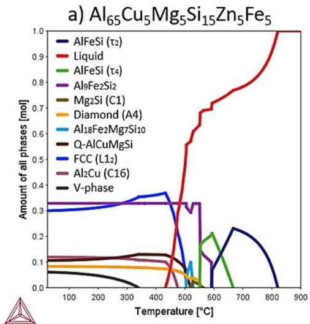

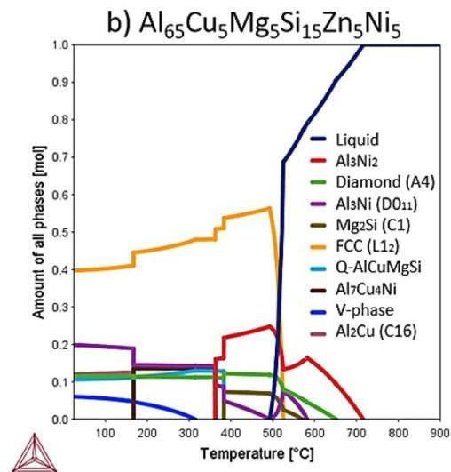

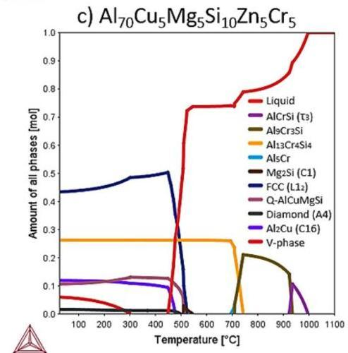

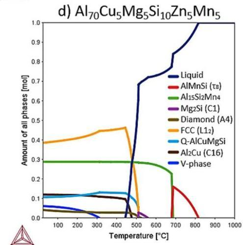

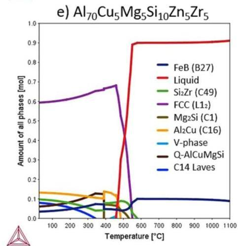
Figure 1. Amount of all phases VS temperature diagrams of designed alloys (a)  $\mathrm{Al}_{65}\mathrm{Cu}_5\mathrm{Fe}_5\mathrm{Mg}_5\mathrm{Si}_{15}\mathrm{Zn}_5$  b)  $\mathrm{Al}_{65}\mathrm{Cu}_5\mathrm{Mg}_5\mathrm{Ni}_5\mathrm{Si}_{15}\mathrm{Zn}_5$  c)  $\mathrm{Al}_{70}\mathrm{Cr}_5\mathrm{Cu}_5\mathrm{Mg}_5\mathrm{Si}_{10}\mathrm{Zn}_5$  d)  $\mathrm{Al}_{70}\mathrm{Cu}_5\mathrm{Mg}_5\mathrm{Mn}_5\mathrm{Si}_{10}\mathrm{Zn}_5$  and e)  $\mathrm{Al}_{70}\mathrm{Cu}_5\mathrm{Mg}_5\mathrm{Si}_{10}\mathrm{Zn}_5\mathrm{Zr}_5$  using Thermo-Calc software with TCAL5 database.

are not supposed to be in total thermodynamic equilibrium. The phase diagrams in Fig. 1 predicted at least the formation of major FCC  $(\mathrm{L}1_{2})$ ,  $\mathrm{Al}_{2}\mathrm{Cu}$  (C16), Diamond  $(\mathrm{A}_{4})$ , Q-AlCuMgSi and V-phase  $(\mathrm{Mg}_{5}\mathrm{Zn}_{11})$  in all the alloys at RT, except in  $\mathrm{Al}_{70}\mathrm{Cu}_{5}\mathrm{Mg}_{5}\mathrm{Si}_{10}\mathrm{Zn}_{5}\mathrm{Zr}_{5}$  alloy. FCC  $(\mathrm{L}1_{2})$  refers to an ordered FCC phase closely related to the  $\mathrm{L}1_{2}$  structures (Strukturbericht notation). The disordered structure of FCC (A1) solution transformed into ordered FCC  $(\mathrm{L}1_{2})$ , due to the complex composition of the alloys. The V-phase, which precipitated from the FCC solid solution, was the last precipitated phase in all the alloys, and the precipitation range was about  $300^{\circ}\mathrm{C}$ .

SCIENTIFIC REPORTS (2019) 9:6792 | https://doi.org/10.1038/s41598-019-43329-w

www.nature.com/scientificreports/

|  Nominal Composition | Al | Mg | Si | Zn | Cu | Fe | Ni | Cr | Mn | Zr | O  |
| --- | --- | --- | --- | --- | --- | --- | --- | --- | --- | --- | --- |
|  Al65Cu3Fe5Mg5Si15Zn5 | 64 | 6 | 13 | 6 | 5 | 4 |  |  |  |  | 2  |
|  Al65Cu3Mg5Ni5Si15Zn5 | 64 | 7 | 12 | 5 | 4 |  | 5 |  |  |  | 3  |
|  Al76Cr2Cu5Mg5Si10Zn5 | 73 | 5 | 7 | 6 | 3 |  |  | 4 |  |  | 2  |
|  Al76Cu4Mg5Mn5Si10Zn5 | 66 | 6 | 11 | 6 | 4 |  |  |  | 4 |  | 3  |
|  Al76Cu5Mg5Si10Zn5Zr5 | 66 | 7 | 9 | 6 | 7 |  |  |  |  | 3 | 2  |

Table 1. Chemical composition in at.% of the manufactured alloys measured by SEM-EDS.

Figure 1(a) shows the equilibrium phase mole fraction of  $\mathrm{Al}_{65}\mathrm{Cu}_3\mathrm{Fe}_5\mathrm{Mg}_5\mathrm{Si}_{15}\mathrm{Zn}_5$  alloy as a function of temperature. The phase diagram also predicted the formation of  $\mathrm{Al}_{9}\mathrm{Fe}_5\mathrm{Si}_2$  (also known as  $\beta\text{-Al}_{4.5}\mathrm{FeSi}$ ) at RT. The liquidus and solidus temperatures were  $817^{\circ}\mathrm{C}$  and  $461^{\circ}\mathrm{C}$ , respectively. Below solidus temperature, only V-phase was precipitated, at  $329^{\circ}\mathrm{C}$ . Thus, from CALPHAD calculations  $\mathrm{Al}_{65}\mathrm{Cu}_3\mathrm{Fe}_5\mathrm{Mg}_5\mathrm{Si}_{15}\mathrm{Zn}_5$  alloy consisted of an ordered FCC solid-solution (30%) and five ICs (70%) at RT, with the main phase being  $\mathrm{Al}_{9}\mathrm{Fe}_5\mathrm{Si}_2$  (33%). Figure 1(b) shows the phase diagram of  $\mathrm{Al}_{65}\mathrm{Cu}_5\mathrm{Mg}_5\mathrm{Ni}_5\mathrm{Si}_{15}\mathrm{Zn}_5$  alloy as a function of temperature. The phase diagram predicted a similar phase equilibrium that is close to that obtained previously in Fig. 1(a) at RT. But with the difference of obtaining  $\mathrm{Al}_3\mathrm{Ni}$  ( $\mathrm{D0}_{11}$ ) instead of  $\mathrm{Al}_{9}\mathrm{Fe}_5\mathrm{Si}_2$  phase. The liquidus and solidus temperatures were  $716^{\circ}\mathrm{C}$  and  $488^{\circ}\mathrm{C}$ , respectively. Some qualitative and quantitative phase transformations were calculated below solidus temperature. The  $\mathrm{Al}_3\mathrm{Ni}_2$  phase, which was the major IC near liquidus temperature disappeared at  $362^{\circ}\mathrm{C}$ . The Q-phase was expected to precipitate at  $382^{\circ}\mathrm{C}$ , indicating that the Cu absorption of this phase led to the transformation of  $\mathrm{Al}_3\mathrm{Ni}_2$  into an  $\mathrm{Al}_3\mathrm{Ni}$ . The phase constitution of  $\mathrm{Al}_3\mathrm{Ni}$  phase was  $(\mathrm{Al},\mathrm{Ni})_{0.75}\mathrm{Ni}_{0.25}$  and did not admit Cu. Instead,  $\mathrm{Al}_3\mathrm{Ni}_2$  was calculated with a phase constitution of  $(\mathrm{Al},\mathrm{Si})_3(\mathrm{Ni},\mathrm{Cu})_2(\mathrm{Ni})_1$ . So, the alloy consisted of a major ordered FCC solid-solution (40%) and five ICs (60%) at RT, with the main IC being  $\mathrm{Al}_3\mathrm{Ni}$  (20%). Figure 1(c) shows the equilibrium phase mole fraction of  $\mathrm{Al}_{76}\mathrm{Cr}_3\mathrm{Cu}_5\mathrm{Mg}_5\mathrm{Si}_{10}\mathrm{Zn}_5$  alloy as a function of temperature. The phase diagram also predicted the formation  $\mathrm{Al}_{13}\mathrm{Cr}_4\mathrm{Si}_4$  at RT. The liquidus and solidus temperatures were  $997^{\circ}\mathrm{C}$  and  $450^{\circ}\mathrm{C}$ , respectively. The V-phase was stable at temperatures below  $300^{\circ}\mathrm{C}$ . From thermodynamic calculations in Fig. 1(c), it can be predicted that  $\mathrm{Al}_{76}\mathrm{Cr}_3\mathrm{Cu}_5\mathrm{Mg}_5\mathrm{Si}_{10}\mathrm{Zn}_5$  alloy consist of an ordered FCC solid-solution (43%) and five ICs (57%) at RT, with the main IC being  $\mathrm{Al}_{13}\mathrm{Cr}_4\mathrm{Si}_4$  (26%). The amount of this compound was stable below  $692^{\circ}\mathrm{C}$ . Figure 1(d) shows the equilibrium phase mole fraction of  $\mathrm{Al}_{76}\mathrm{Cu}_5\mathrm{Mg}_5\mathrm{Mn}_5\mathrm{Si}_{10}\mathrm{Zn}_5$  alloy as a function of temperature. The diagram was closely related to the phase diagram in Fig. 1(c). The diagram also predicted the above-mentioned phases and the  $\mathrm{Al}_{15}\mathrm{Si}_2\mathrm{Mn}_4$  compound at RT. The liquidus and solidus temperatures were  $817^{\circ}\mathrm{C}$  and  $447^{\circ}\mathrm{C}$ , respectively. From thermodynamic calculations in Fig. 1(d), it can be predicted that  $\mathrm{Al}_{76}\mathrm{Cu}_5\mathrm{Mg}_5\mathrm{Mn}_5\mathrm{Si}_{10}\mathrm{Zn}_5$  alloy consisted of an ordered FCC solid-solution (39%) and five ICs (61%) at RT, with the main IC being  $\mathrm{Al}_{15}\mathrm{Si}_2\mathrm{Mn}_4$  (29%). The amount of this compound was stable below  $681^{\circ}\mathrm{C}$ . Figure 1(e) shows the equilibrium phase mole fraction of  $\mathrm{Al}_{76}\mathrm{Cu}_5\mathrm{Mg}_5\mathrm{Si}_{10}\mathrm{Zn}_5\mathrm{Zr}_5$  alloy as a function of temperature. The phase diagram is significantly more complex compared with previously calculated diagrams in Fig. 1(a-d). The phase diagram predicted the formation of major FCC (L12),  $\mathrm{Al}_2\mathrm{Cu}$  (C16), Q-AlCuMgSi,  $\mathrm{Si}_2\mathrm{Zr}$  (C49), C14 Laves (Zn2Mg) phase and FeB (B27) at RT. The phase composition of FeB phase was  $(\mathrm{Zr})(\mathrm{Si},\mathrm{Zn})$ . The liquidus temperature was over  $1100^{\circ}\mathrm{C}$  and solidus temperature was  $454^{\circ}\mathrm{C}$ . Many phase transformations were calculated below solidus temperature, resulting in a microstructure of an ordered FCC solid-solution (60%) and five ICs (40%) at RT, with the main IC being  $\mathrm{Al}_2\mathrm{Cu}$  (13%).

Microstructure characterization. The overall bulk composition of the alloys was estimated using scanning electron microscopy (SEM) equipped with an energy dispersive X-ray spectrometry (EDS) on large areas. At least three random measurements were made, and the overall values are presented in Table 1. The obtained results showed good approximations to target compositions of the alloys, which demonstrated that the manufacturing process was successfully performed, although oxidation was detected by SEM-EDS.

The optical microscopy (OM) image of  $\mathrm{Al}_{65}\mathrm{Cu}_3\mathrm{Fe}_5\mathrm{Mg}_5\mathrm{Si}_{15}\mathrm{Zn}_5$  alloy is shown in Fig. 2(a). The microstructure of the alloy revealed that shrinkage porosity was distributed near the plate-like phase. This defect was caused by metal reducing its volume during solidification, and its inability to feed shrinkage around complex morphology of the phase. A magnified OM image is shown in Fig. 2(b), where a mixture of different phases and brightest matrix phase were observed. At least five phases (A, B, C, D and E) with different contrasts were observed. In Fig. 2(c), dark irregular blocky-shape phase (A) were observed in the microstructure of  $\mathrm{Al}_{65}\mathrm{Cu}_5\mathrm{Mg}_5\mathrm{Ni}_5\mathrm{Si}_{15}\mathrm{Zn}_5$  alloy. The magnified OM image of the alloy is shown in Fig. 2(d), a mixture of different phases (B, C, D and E) and a brightest matrix phase were observed. In Fig. 2(e), the complex dendritic structure of  $\mathrm{Al}_{76}\mathrm{Cr}_3\mathrm{Cu}_5\mathrm{Mg}_5\mathrm{Si}_{10}\mathrm{Zn}_5$  alloy is shown, which was divided by net-like interdendritic structure and different phases. The magnified OM image is shown in Fig. 2(f), the microstructure also showed a mixture of different phases (A, B, C, D and E) and brightest matrix phase. In Fig. 2(g), shrinkage porosity was observed in the microstructure of  $\mathrm{Al}_{76}\mathrm{Cu}_5\mathrm{Mg}_5\mathrm{Mn}_5\mathrm{Si}_{10}\mathrm{Zn}_5$  alloy. The magnified OM image of  $\mathrm{Al}_{76}\mathrm{Cu}_5\mathrm{Mg}_5\mathrm{Mn}_5\mathrm{Si}_{10}\mathrm{Zn}_5$  is shown in Fig. 2(h), the image revealed that the microstructure was composed of at least five phases (A, B, C, D and E) and brightest matrix phase. In Fig. 2(i), shrinkage porosity was observed in the microstructure of  $\mathrm{Al}_{76}\mathrm{Cu}_5\mathrm{Mg}_5\mathrm{Si}_{10}\mathrm{Zn}_5\mathrm{Zr}_5$  alloy. The OM image also showed the formation of dark irregular blocky-shape phase (A), but these were much smaller in size than previously observed phase in Fig. 2(c). The magnified OM image is shown in Fig. 2(j), a mixture of randomly distributed phases (B, C, D and E) were observed in the matrix.

SCIENTIFIC REPORTS (2019) 9:6792 | https://doi.org/10.1038/s41598-019-43329-w

www.nature.com/scientificreports/

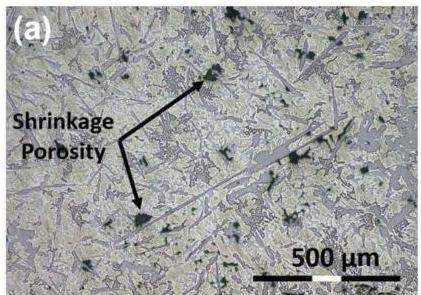

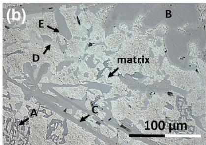

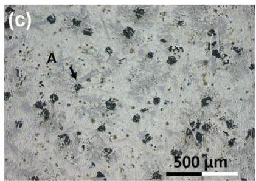

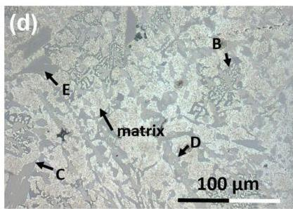

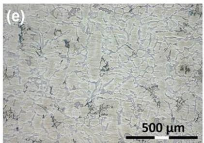

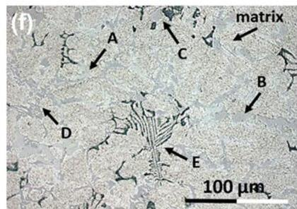

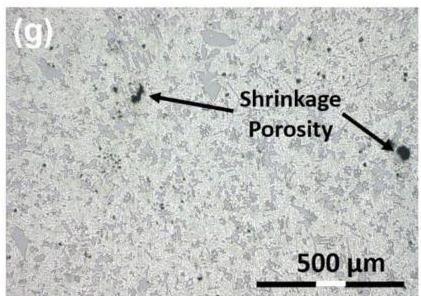

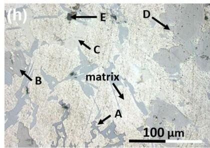

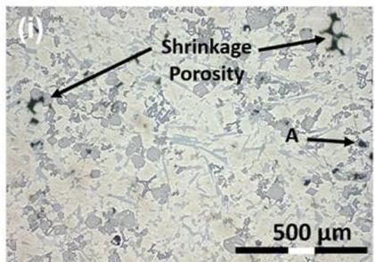
Figure 2. OM images of (a,b)  $\mathrm{Al}_{65}\mathrm{Cu}_5\mathrm{Fe}_5\mathrm{Mg}_5\mathrm{Si}_{15}\mathrm{Zn}_5$ , (c,d)  $\mathrm{Al}_{65}\mathrm{Cu}_5\mathrm{Mg}_5\mathrm{Ni}_5\mathrm{Si}_{15}\mathrm{Zn}_5$ , (e,f)  $\mathrm{Al}_{70}\mathrm{Cr}_5\mathrm{Cu}_5\mathrm{Mg}_5\mathrm{Si}_{10}\mathrm{Zn}_5$ , (g,h)  $\mathrm{Al}_{70}\mathrm{Cu}_5\mathrm{Mg}_5\mathrm{Mn}_5\mathrm{Si}_{10}\mathrm{Zn}_5$  and (i,j)  $\mathrm{Al}_{70}\mathrm{Cu}_5\mathrm{Mg}_5\mathrm{Si}_{10}\mathrm{Zn}_5\mathrm{Zr}_5$  manufactured alloys.

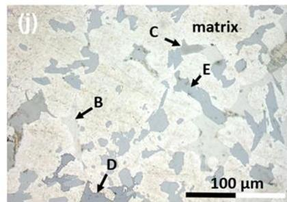

According to OM images in Fig. 2, a multiphase character can be expected for the manufactured alloys. The different images confirmed a heterogeneous microstructure composed of at least five phases and major FCC matrix. So, CALPHAD thermodynamic modelling successfully predicted the number of constituent phases at RT.

The XRD patterns in Fig. 3 showed at least the formation of FCC solid solution (Space Group = 225), Si  $(\mathrm{S.G.} = 227)$  and  $\mathrm{V - Mg_2Zn_{11}}$ $(\mathrm{S.G.} = 218)$  in all the alloys. The XRD pattern in Fig. 3(a) also showed the formation of  $\mathrm{Al}_{2}\mathrm{Cu}$ $(\mathrm{S.G.} = 140)$ ,  $\mathrm{Al}_{x}\mathrm{Cu}_{2}\mathrm{Mg}_{6}\mathrm{Si}_{7}$ $(\mathrm{S.G.} = 174)$  and  $\mathrm{Al}_{9}\mathrm{Fe}_{2}\mathrm{Si}_{2}$  phase  $(\mathrm{S.G.} = 14)$  in  $\mathrm{Al}_{65}\mathrm{Cu}_{5}\mathrm{Fe}_{5}\mathrm{Mg}_{5}\mathrm{Si}_{15}\mathrm{Zn}_{5}$  alloy. The experimental results obtained by XRD technique and CALPHAD simulation in Fig. 2(a) showed a good agreement. Figure 3(b) detailed the XRD pattern of  $\mathrm{Al}_{65}\mathrm{Cu}_{5}\mathrm{Mg}_{5}\mathrm{Ni}_{5}\mathrm{Si}_{15}\mathrm{Zn}_{5}$  alloy. The pattern also showed the

SCIENTIFIC REPORTS (2019) 9:6792 | https://doi.org/10.1038/s41598-019-43329-w

www.nature.com/scientificreports/

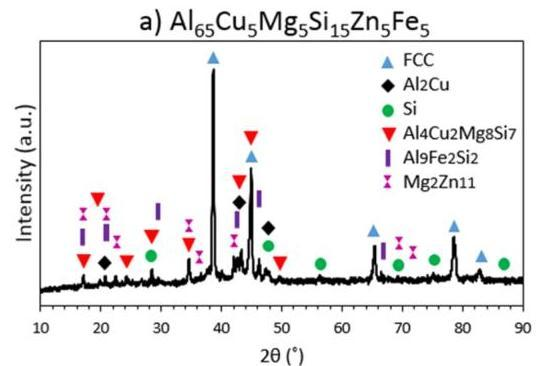

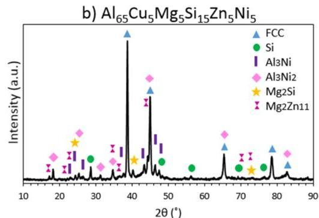

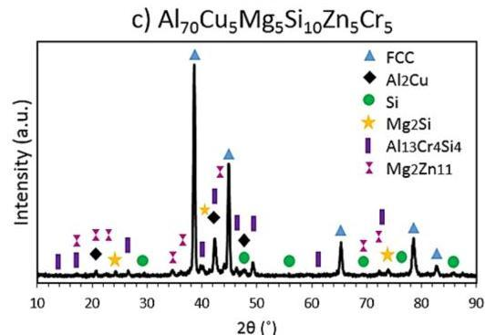

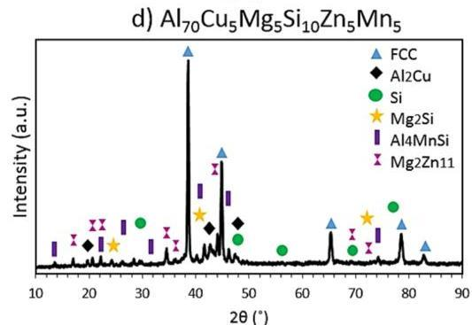

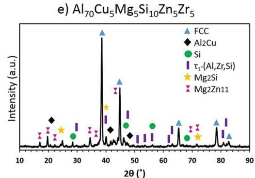
Figure 3. XRD diffraction patterns of the (a)  $\mathrm{Al}_{65}\mathrm{Cu}_5\mathrm{Fe}_5\mathrm{Mg}_5\mathrm{Si}_{15}\mathrm{Zn}_5$ , (b)  $\mathrm{Al}_{65}\mathrm{Cu}_5\mathrm{Mg}_5\mathrm{Ni}_5\mathrm{Si}_{15}\mathrm{Zn}_5$ , (c)  $\mathrm{Al}_{70}\mathrm{Cr}_5\mathrm{Cu}_5\mathrm{Mg}_5\mathrm{Si}_{10}\mathrm{Zn}_5$ , (d)  $\mathrm{Al}_{70}\mathrm{Cu}_5\mathrm{Mg}_5\mathrm{Mn}_5\mathrm{Si}_{10}\mathrm{Zn}_5$  and (e)  $\mathrm{Al}_{70}\mathrm{Cu}_5\mathrm{Mg}_5\mathrm{Si}_{10}\mathrm{Zn}_5\mathrm{Zr}_5$  as-cast alloys.

formation of  $\mathrm{Al}_{3}\mathrm{Ni}$  (S.G. = 62),  $\mathrm{Al}_{3}\mathrm{Ni}_{2}$  (S.G. = 164) and  $\mathrm{Mg}_{2}\mathrm{Si}$  (S.G. = 225). Thus, FCC, Si, V- $\mathrm{Mg}_{2}\mathrm{Zn}_{11}$  and  $\mathrm{Al}_{3}\mathrm{Ni}$  predicted phases were observed, but  $\mathrm{Al}_{2}\mathrm{Cu}$  and  $\mathrm{Al}_{4}\mathrm{Cu}_{2}\mathrm{Mg}_{8}\mathrm{Si}_{7}$  phases were not indexed. The XRD pattern showed the formation of  $\mathrm{Al}_{3}\mathrm{Ni}_{2}$  and  $\mathrm{Mg}_{2}\mathrm{Si}$  compounds at RT, but these phases were predicted at temperatures above  $358^{\circ}\mathrm{C}$  and  $382^{\circ}\mathrm{C}$ , respectively. Figure 3(c) detailed the XRD pattern of  $\mathrm{Al}_{65}\mathrm{Cu}_{5}\mathrm{Mg}_{5}\mathrm{Ni}_{5}\mathrm{Si}_{12}\mathrm{Zn}_{5}$  alloy. The XRD pattern also showed the formation of  $\mathrm{Mg}_{2}\mathrm{Si}$  and  $\mathrm{Al}_{13}\mathrm{Cr}_{4}\mathrm{Si}_{4}$  (S.G. = 216) phases. The other indexed phases showed good agreement with CALPHAD calculations in Fig. 2(c).

Figure 3(d) detailed the XRD pattern of  $\mathrm{Al}_{70}\mathrm{Cu}_5\mathrm{Mg}_5\mathrm{Mn}_5\mathrm{Si}_{10}\mathrm{Zn}_5$  alloy. The diagram is very similar to the diagram represented in Fig. 3(c), but  $\mathrm{Al_4MnSi}$  (S.G. = 194) phase was observed instead of  $\mathrm{Al}_{13}\mathrm{Cr}_4\mathrm{Si}_4$  indexed in Fig. 3(c). In this case, the formation of the  $\mathrm{Mg}_2\mathrm{Si}$  phase mentioned above was also observed. Figure 3(e) detailed the XRD pattern of  $\mathrm{Al}_{70}\mathrm{Cu}_5\mathrm{Mg}_5\mathrm{Si}_{10}\mathrm{Zn}_5\mathrm{Zr}_5$  alloy. The diagram showed similar diffraction peaks to those observed in Fig. 3(c,d). But,  $\tau_{1}-(\mathrm{Al},\mathrm{Zr},\mathrm{Si})$  (S.G. = 194) phase was indexed instead of  $\mathrm{Al}_{13}\mathrm{Cr}_4\mathrm{Si}_4$  and  $\mathrm{Al_4MnSi}$  phases. The experimental result showed some discrepancies with thermodynamics results in Fig. 2(e). Phase diagram predicted the formation of FCC,  $\mathrm{Al_2Cu}$ , Q-AlCuMgSi,  $\mathrm{Si}_2\mathrm{Zr}$ , C14 Laves ( $\mathrm{Zn}_2\mathrm{Mg}$ ) and FeB phases at RT. Thus,  $\mathrm{Si}_2\mathrm{Zr}$ , C14 Laves ( $\mathrm{Zn}_2\mathrm{Mg}$ ) and FeB phases were not observed by XRD.

To reveal the qualitative chemical compositions of the regions, EDS mappings were obtained in Fig. 4. For a better understanding of the maps, oxygen was neglected due to the insignificant amount that it represented in the composition of the alloys. Figure 4(a) showed the complex microstructure of the  $\mathrm{Al}_{65}\mathrm{Cu}_5\mathrm{Fe}_5\mathrm{Mg}_5\mathrm{Si}_{15}\mathrm{Zn}_5$  alloy. The matrix is rich in Al with a small amount of Zn. This region corresponds to FCC phase detected by XRD. In the remaining space,  $\mathrm{Al}(\mathrm{Cu})$ -rich region was distinguished, which agrees well with  $\mathrm{Al}_2\mathrm{Cu}$  compound obtained by XRD measurements and thermodynamic calculations. Si was segregated in two different regions. The first one, it was mainly composed of Si and it was surrounded by the matrix. The second region, although rich in Si, was also composed of Al and Fe. It presented a plate-like morphology and it was related to  $\mathrm{Al}_9\mathrm{Fe}_2\mathrm{Si}$  phase, this phase was not distributed homogeneously in Fig. 4(a). The brightest region was mainly composed of Zn and a small amount

SCIENTIFIC REPORTS (2019) 9:6792 | https://doi.org/10.1038/s41598-019-43329-w

www.nature.com/scientificreports/

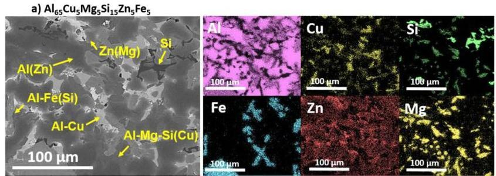

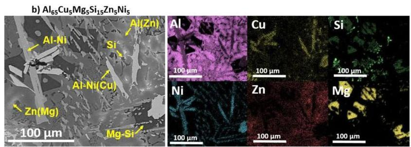

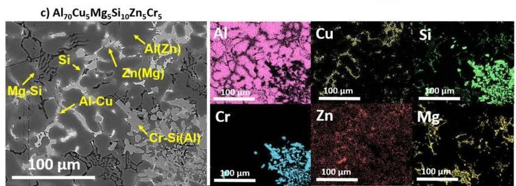

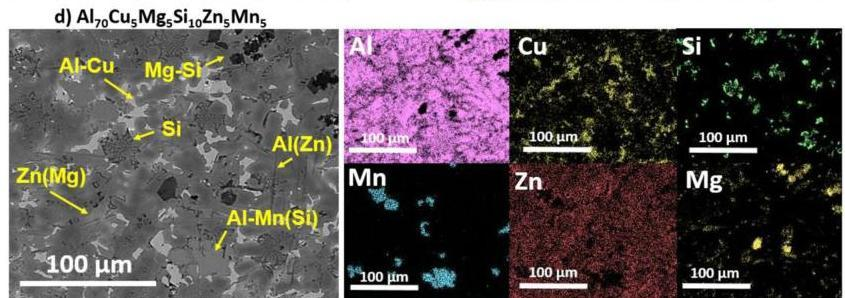

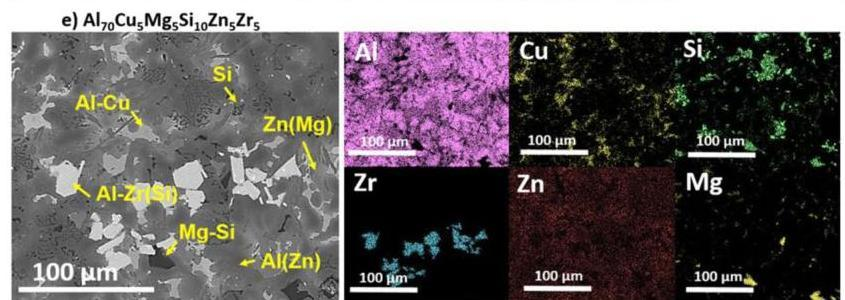
Figure 4. SEM image and EDS elemental mapping of (a)  $\mathrm{Al}_{65}\mathrm{Cu}_5\mathrm{Fe}_5\mathrm{Mg}_5\mathrm{Si}_{15}\mathrm{Zn}_5$ , (b)  $\mathrm{Al}_{65}\mathrm{Cu}_5\mathrm{Mg}_5\mathrm{Ni}_5\mathrm{Si}_{15}\mathrm{Zn}_5$ , (c)  $\mathrm{Al}_{70}\mathrm{Cr}_5\mathrm{Cu}_5\mathrm{Mg}_5\mathrm{Si}_{10}\mathrm{Zn}_5$ , (d)  $\mathrm{Al}_{70}\mathrm{Cu}_5\mathrm{Mg}_5\mathrm{Mn}_5\mathrm{Si}_{10}\mathrm{Zn}_5$  and (e)  $\mathrm{Al}_{70}\mathrm{Cu}_5\mathrm{Mg}_5\mathrm{Si}_{10}\mathrm{Zn}_5\mathrm{Zr}_5$  as-cast alloys.

of Mg. This region was related to  $\mathrm{V - Mg_2Zn_{11}}$  phase. Finally, Al-Mg-Si(Cu)-rich region was distinguished, and this region corresponded to the above defined Q-phase.

In Fig. 4(b), two types of needle-like regions and dark blocky-shape precipitates are distributed in the matrix of  $\mathrm{Al}_{65}\mathrm{Cu}_5\mathrm{Mg}_5\mathrm{Ni}_5\mathrm{Si}_{15}\mathrm{Zn}_5$  as-cast alloy. The matrix was rich in Al and Zn, with a small amount of Cu and Si. From EDS mapping, the longest needle-like region was composed of Al and Ni. This was consistent with the phase composition of  $\mathrm{Al}_3\mathrm{Ni}$  compound predicted by Thermo-Calc. The second needle-like region presented similar morphology, but it was found that quite a few concentrations of Cu were dissolved in the region. This Cu absorption leaded to the formation of  $\mathrm{Al}_3\mathrm{Ni}_2$  phase, which was not supposed to be in thermodynamic equilibrium at

SCIENTIFIC REPORTS (2019) 9:6792 | https://doi.org/10.1038/s41598-019-43329-w

www.nature.com/scientificreports/

|  Alloy | Mg | Si | O | Al  |
| --- | --- | --- | --- | --- |
|  Al65Cu3Mg5Ni5Si13Zn5 | 54 | 28 | 18 | —  |
|  Al76Cr3Cu5Mg5Si10Zn5 | 41 | 23 | 24 | 12  |
|  Al76Cu5Mg5Mn5Si10Zn5 | 55 | 29 | 16 | —  |
|  Al76Cu4Mg5Si10Zn5Zr5 | 55 | 30 | 15 |   |

Table 2. Chemical compositions of the Mg-Si-rich regions in the as-cast alloys measured by SEM-EDS (at.%).

RT. The phase diagram in Fig. 1(b) shifted the formation of  $\mathrm{Al}_{3}\mathrm{Ni}$  phase at temperatures below  $380^{\circ}\mathrm{C}$ . At this temperature,  $\mathrm{Al}_{3}\mathrm{Ni}$  and Q-AlCuMgSi phases precipitated from  $\mathrm{Al}_{3}\mathrm{Ni}_{2}$ . In the XRD pattern of Fig. 3(b),  $\mathrm{Al}_{2}\mathrm{Cu}$  and Q-AlCuMgSi phases were not observed. Therefore, according to the observations, Cu got trapped in  $\mathrm{Al}_{3}\mathrm{Ni}_{2}$  phase, avoiding the formation of  $\mathrm{Al}_{2}\mathrm{Cu}$  and Q-AlCuMgSi phases. In  $\mathrm{Al}_{65}\mathrm{Cu}_{5}\mathrm{Mg}_{5}\mathrm{Ni}_{5}\mathrm{Si}_{15}\mathrm{Zn}_{5}$  alloy, Si was also segregated in two different regions, forming Si-rich phase and Mg-Si-rich blocky-morphology region. This blocky region corresponded to previously defined  $\mathrm{Mg}_{3}\mathrm{Si}$  phase. The brightest region was mainly composed of Zn and a small amount of Mg. This region was related to V- $\mathrm{Mg}_{2}\mathrm{Zn}_{11}$  phase defined by XRD.

Figure 4(c) shows Al-rich dendritic region that was enriched with Zn. The Fig. 4(c) also shows that  $\mathrm{Al}_{2}\mathrm{Cu}$  compound was precipitated in the interdendritic space. There were many non-uniform particles dispersed in the microstructure. These particles presented irregular blocky-form and were composed of Al, Cr and Si. These particles were correlated to  $\mathrm{Al}_{13}\mathrm{Cr}_4\mathrm{Si}_4$  phase. The brightest region in the interdendritic space, it was mainly composed of Zn and a small amount of Mg. This region was corresponded to  $\mathrm{Mg}_2\mathrm{Zn}_{11}$  phase. Finally, the Chinese script region was composed of the matrix and Mg-Si-rich skeleton-like precipitates. This region presented different morphology than the one shown in Fig. 4(a), but quite similar qualitative elemental composition.

In Fig. 4(d), the as-cast microstructure consists of a dominant set of coarse Al(Zn) dendrites with a minor set of bright precipitates randomly distributed in the dark background. The dendritic structure was rich in Al and is also composed of small amounts of Cu and Zn. The interdendritic space was rich in Al and Cu, corresponding to  $\mathrm{Al}_{2}\mathrm{Cu}$  phase. The eutectic region was composed of Si-rich particles precipitated in Al-rich dendrites. The  $\mathrm{Zn(Mg)}$ -rich region was correlated to V- $\mathrm{Mg}_{2}\mathrm{Zn}_{11}$  phase. A region composed of Al, Mn and Si with blocky-morphology was distinguished, and this region was correlated to  $\mathrm{Al}_{4}\mathrm{MnSi}$  phase defined by XRD in Fig. 3(d). Finally, an irregular dark blocky-shape Mg-Si-rich region was distinguished. This region corresponded to  $\mathrm{Mg}_{2}\mathrm{Si}$  phase defined by XRD.

In Fig. 4(e) Al(Zn)-rich dendrites and Al-Cu-rich interdendritic regions are shown. These regions corresponded to FCC and  $\mathrm{Al}_{2}\mathrm{Cu}$  phases respectively. The eutectic region was composed of Si-rich particles precipitated in Al(Zn) dendrites. This eutectic region was also observed in  $\mathrm{Al}_{70}\mathrm{Cu}_{5}\mathrm{Mg}_{5}\mathrm{Mn}_{5}\mathrm{Si}_{10}\mathrm{Zn}_{5}$  alloy. The darkest region in SEM image corresponded to Mg-Si-rich region, correlated to  $\mathrm{Mg}_{2}\mathrm{Si}$  phase. The brightest region was composed of Al, Si and Zr, and it presented blocky-morphology, and was not homogenously distributed in the microstructure of the alloy. So, the formation of  $\tau_{1}$ -(Al,Zr,Si) phase was confirmed in Fig. 4(a). The chemical composition of Al-Zr(Si)-rich phases obtained in the present study was far from the stoichiometric composition of the  $\mathrm{Si}_{2}\mathrm{Zr}$  and FeB ((Zr)(Si,Zn)) phases predicted by Thermo-Calc. The reason for the discrepancies between CALPHAD and experimental results was that although TCAL5 database contains assessments of 87 ternaries[43], the ternary Al-Si-Zr system is not assessed. Therefore, the predictions of binary compounds of Si-Zr in Fig. 1(d) may not have been entirely correct. Finally, the  $\mathrm{Zn(Mg)}$ -rich region was correlated to V-  $\mathrm{Mg}_{2}\mathrm{Zn}_{11}$  phase. The phase diagram in Fig. 2(e) shows that the formation sequence of the phases was FeB,  $\mathrm{Si}_{2}\mathrm{Zr}$ , FCC,  $\mathrm{Mg}_{2}\mathrm{Si}$ ,  $\mathrm{Al}_{2}\mathrm{Cu}$ , V-phase, Q-phase and finally, C14 Laves phase. Thus, the observation of  $\mathrm{Mg}_{2}\mathrm{Si}$  phase in the diffraction diagram meant that Q-phase could not be formed from  $\mathrm{Mg}_{2}\mathrm{Si}$ . Subsequently, C14 Laves phase was not precipitated from Q-phase. Thus, the experimental observations of the  $\mathrm{Al}_{70}\mathrm{Cu}_{5}\mathrm{Mg}_{5}\mathrm{Si}_{10}\mathrm{Zn}_{5}\mathrm{Zr}_{5}$  as-cast alloy corresponded only partially to the predictions in Fig. 2(e).

The  $\mathrm{Mg}_{2}\mathrm{Si}$  phase was not expected to be in thermodynamic equilibrium at RT. But XRD and SEM-EDS results clearly showed that  $\mathrm{Mg}_{2}\mathrm{Si}$  phase was formed in  $\mathrm{Al}_{65}\mathrm{Cu}_{5}\mathrm{Mg}_{5}\mathrm{Ni}_{5}\mathrm{Si}_{13}\mathrm{Zn}_{5}$ ,  $\mathrm{Al}_{70}\mathrm{Cr}_{5}\mathrm{Cu}_{5}\mathrm{Mg}_{5}\mathrm{Si}_{10}\mathrm{Zn}_{5}$ ,  $\mathrm{Al}_{70}\mathrm{Cu}_{5}\mathrm{Mg}_{5}\mathrm{Mn}_{5}\mathrm{Si}_{10}\mathrm{Zn}_{5}$  and  $\mathrm{Al}_{70}\mathrm{Cu}_{5}\mathrm{Mg}_{5}\mathrm{Si}_{10}\mathrm{Zn}_{5}\mathrm{Zr}_{5}$  alloys. So, the quantitatively chemical compositions of  $\mathrm{Mg}$ -Si-rich regions in Fig. 2(b-e) were analysed using SEM-EDS in Table 2.

The compositions in Table 2 revealed that  $\mathrm{Mg}_{2}\mathrm{Si}$  phase was oxidized, due to the high reactivity of  $\mathrm{Mg}$  at the temperatures reached up during the melting. The chemical composition of  $\mathrm{Mg}$ -Si-rich regions in  $\mathrm{Al}_{65}\mathrm{Cu}_{5}\mathrm{Mg}_{5}\mathrm{Ni}_{5}\mathrm{Si}_{15}\mathrm{Zn}_{5}$ ,  $\mathrm{Al}_{70}\mathrm{Cu}_{5}\mathrm{Mg}_{5}\mathrm{Mn}_{5}\mathrm{Si}_{10}\mathrm{Zn}_{5}$  and  $\mathrm{Al}_{70}\mathrm{Cu}_{5}\mathrm{Mg}_{5}\mathrm{Si}_{10}\mathrm{Zn}_{5}\mathrm{Zr}_{5}$  phases was very similar. The phases presented typical blocky morphology of  $\mathrm{Mg}_{2}\mathrm{Si}$  compound, as can be observed in Fig. 4(b,d,e). On the other hand, in  $\mathrm{Al}_{70}\mathrm{Cr}_{5}\mathrm{Cu}_{5}\mathrm{Mg}_{5}\mathrm{Si}_{10}\mathrm{Zn}_{5}$  alloy, the absorption of a small amount (12 at.%) of Al modified the blocky morphology into a Chinese script morphology. But this was only confirmed in  $\mathrm{Al}_{70}\mathrm{Cr}_{5}\mathrm{Cu}_{5}\mathrm{Mg}_{5}\mathrm{Si}_{10}\mathrm{Zn}_{5}$  alloy, and the reasons for this have not been determined. The Chinese script phase is preferred because it is less detrimental to mechanical properties.

Mechanical properties. Up to the present, compressive properties and Vickers's microhardness are the most reported properties studied for MEAs, HEAs and CCAs. In Table 3, the density and compressive mechanical properties with the standard deviations of the manufactured MEAs were summarized. Figure 5(a) shows the engineering compressive stress-strain curves of the manufactured MEAs. In this study, the fracture strength and the plastic strain were defined as the maximum stress and the maximum deformation in the stress-strain curve under each testing condition. The experimental scatter was  $2 - 3\%$  for the maximum compressive deformation. The  $\mathrm{Al}_{65}\mathrm{Cu}_5\mathrm{Fe}_5\mathrm{Mg}_5\mathrm{Si}_{15}\mathrm{Zn}_5$  and  $\mathrm{Al}_{65}\mathrm{Cu}_5\mathrm{Mg}_5\mathrm{Ni}_5\mathrm{Si}_{15}\mathrm{Zn}_5$  alloys had high RT strength  $(\sigma_{\max} = 482\mathrm{MPa}$  and

SCIENTIFIC REPORTS (2019) 9:6792 | https://doi.org/10.1038/s41598-019-43329-w

www.nature.com/scientificreports/

|  Alloy | ρ (g/cm3) | σy (MPa) | σmax (MPa) | εmax (%) | E (GPa) | σmax/ρ  |
| --- | --- | --- | --- | --- | --- | --- |
|  Al65Cu5Fe5Mg5Si15Zn5 | 3.08 | 422 ± 75 | 482 ± 98 | 1 | 88.7 ± 04 | 156  |
|  Al65Cu5Mg5Ni5Si15Zn5 | 3.15 | 534 ± 04 | 574 ± 32 | 1 | 107.8 ± 17 | 182  |
|  Al70Cr5Cu5Mg5Si10Zn5 | 3.06 | 490 ± 18 | 608 ± 30 | 6 | 78.4 ± 03 | 199  |
|  Al70Cu5Mg5Mn5Si10Zn5 | 2.98 | 622 ± 15 | 644 ± 13 | 2 | 114.1 ± 02 | 216  |
|  Al70Cu5Mg5Si10Zn5Zr5 | 3.06 | 565 ± 79 | 633 ± 42 | 4 | 105.1 ± 27 | 207  |

Table 3. Density  $\left( \rho \right)$  and compressive mechanical properties of the manufactured alloys at RT.

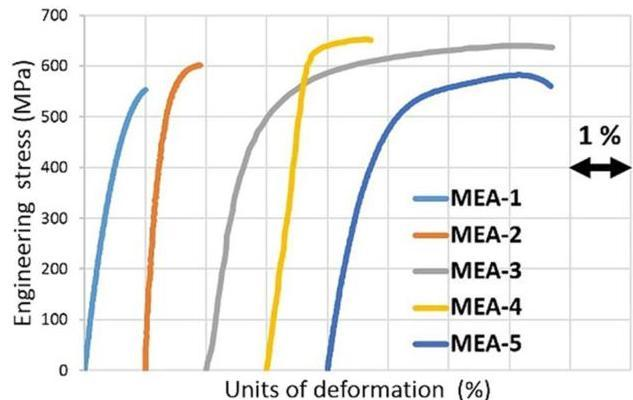
(a)

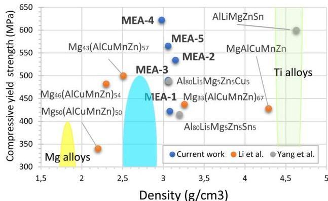
(b)
Figure 5. (a) Compressive engineering stress-strain curves of manufactured  $\mathrm{Al}_{65}\mathrm{Cu}_5\mathrm{Fe}_5\mathrm{Mg}_5\mathrm{Si}_{15}\mathrm{Zn}_5$  (MEA-1),  $\mathrm{Al}_{65}\mathrm{Cu}_5\mathrm{Mg}_5\mathrm{Ni}_5\mathrm{Si}_{15}\mathrm{Zn}_5$  (MEA-2),  $\mathrm{Al}_{70}\mathrm{Cr}_5\mathrm{Cu}_5\mathrm{Mg}_5\mathrm{Si}_{10}\mathrm{Zn}_5$  (MEA-3),  $\mathrm{Al}_{70}\mathrm{Cu}_5\mathrm{Mg}_5\mathrm{Mn}_5\mathrm{Si}_{10}\mathrm{Zn}_5$  (MEA-4) and  $\mathrm{Al}_{70}\mathrm{Cu}_5\mathrm{Mg}_5\mathrm{Si}_{10}\mathrm{Zn}_5\mathrm{Zr}_5$  (MEA-5) MEAs at RT. (b) Materials property space for compressive yield strength vs density at RT of manufactured alloys, related works and conventional lightweight alloys.

$\sigma_{\mathrm{max}} = 594 \mathrm{MPa})$  but showed a true compressive fracture strain of only  $1\%$ . In the case of  $\mathrm{Al}_{65} \mathrm{Cu}_{5} \mathrm{Fe}_{5} \mathrm{Mg}_{5} \mathrm{Si}_{15} \mathrm{Zn}_{5}$ , the brittle behaviour is due to  $\mathrm{Al}_{6} \mathrm{Fe}_{5} \mathrm{Si}_{2}$  phase, which is a well-known phase that decreases the ductility of the Al alloys. The entropy of the system (1,2 R) was not enough to avoid the formation of this undesirable phase. In  $\mathrm{Al}_{65} \mathrm{Cu}_{5} \mathrm{Mg}_{5} \mathrm{Ni}_{5} \mathrm{Si}_{15} \mathrm{Zn}_{5}$  the brittle behaviour was attributed to the large size of the observed oxides in Fig. 2(c). The  $\mathrm{Al}_{70} \mathrm{Cr}_{5} \mathrm{Cu}_{5} \mathrm{Mg}_{5} \mathrm{Si}_{10} \mathrm{Zn}_{5}$  alloy combines the best results in terms of ductility-strength. It was reported a  $\sigma_{\mathrm{y}}$  of  $490 \mathrm{MPa}$  with a maximum nominal plastic strain of  $6\%$ . The microstructure of  $\mathrm{Al}_{70} \mathrm{Cr}_{5} \mathrm{Cu}_{5} \mathrm{Mg}_{5} \mathrm{Si}_{10} \mathrm{Zn}_{5}$  alloy in Fig. 2(f) showed the formation of beneficial Chinese script phase instead of the brittle blocky  $\mathrm{Mg}_{2} \mathrm{Si}$  phase. Moreover, the size and distribution of the main IC ( $\mathrm{Al}_{13} \mathrm{Cr}_{4} \mathrm{Si}_{4}$ ) was less detrimental to the ductility, and porosity was not detected in Fig. 2(e). The  $\mathrm{Al}_{70} \mathrm{Cu}_{5} \mathrm{Mg}_{5} \mathrm{Mn}_{5} \mathrm{Si}_{10} \mathrm{Zn}_{5}$  alloy exhibited very high compressive strength, but the deformation values dropped below  $2\%$ . The  $\mathrm{Al}_{70} \mathrm{Cu}_{5} \mathrm{Mg}_{5} \mathrm{Si}_{10} \mathrm{Zn}_{5} \mathrm{Zr}_{5}$  alloy, which was designed to have the largest volume of ductile  $\alpha$ -Al matrix, also exhibited plastic deformability and a very high compressive  $\sigma_{\mathrm{y}}$  of  $565 \mathrm{MPa}$ . The maximum deformation reached up to  $4\%$ . Both alloys presented some shrinkage porosity.

In terms of microhardness testing, the manufactured alloys also showed good performance. The average Vickers microhardness values with standard deviations are  $235 \pm 85 \mathrm{HV}_{0.1}$ ,  $260 \pm 32 \mathrm{HV}_{0.1}$ ,  $200 \pm 18 \mathrm{HV}_{0.1}$ ,  $264 \pm 57 \mathrm{HV}_{0.1}$  and  $220 \pm 37 \mathrm{HV}_{0.1}$ , respectively. No cracks were observed during indentation test, which means that all the alloys still possess the potential plastic deformability. Although some alloys presented poor ductility, Microstructure of  $\mathrm{Al}_{70} \mathrm{Cu}_{5} \mathrm{Mg}_{5} \mathrm{Mn}_{5} \mathrm{Si}_{10} \mathrm{Zn}_{5}$  alloy, which showed the highest hardness value, exhibited the same influence on hardness as for strength. The second-phase strengthening mechanism of this alloy caused by the

SCIENTIFIC REPORTS (2019) 9:6792 | https://doi.org/10.1038/s41598-019-43329-w

Al_{4}MnSi phase was more pronounced, decreasing the ductility, but increasing the hardness and strength. The standard deviation of Al_{65}Cu_{5}Fe_{5}Mg_{5}Si_{15}Zn_{5} and Al_{70}Cu_{5}Mg_{5}Si_{10}Zn_{5}Zr_{5} alloys was significantly higher in terms of strength (Table 3) and hardness values. This is due to the large size and the not uniformly distributed regions in Fig. 4(a,e), Al-Fe(Si) and Al-Zr(Si), respectively.

A comparison of the strength and density of these MEAs with related works in the field of LWMEAs and commercial lightweight materials are given in Fig. 5(b). The materials in the present work are very well situated in the strength/density diagrams. The manufactured MEAs are superior in terms of strength/density to previously studied MEAs and most of conventional alloys. Furthermore, MEAs fill the gap between Al alloys, Mg alloys and Ti alloys.

## Discussion

In this work, five new lightweight non-equiatomic MEAs were studied, namely Al_{65}Cu_{5}Fe_{5}Mg_{5}Si_{15}Zn_{5}, Al_{65}Cu_{5}Mg_{5}Ni_{5}Si_{15}Zn_{5}, Al_{70}Cr_{5}Cu_{5}Mg_{5}Si_{10}Zn_{5}, Al_{70}Cu_{5}Mg_{5}Mn_{5}Si_{10}Zn_{5} and Al_{70}Cu_{5}Mg_{5}Si_{10}Zn_{5}Zr_{5}. The experimental techniques revealed that all studied MEAs were a mixture of α-Al matrix and five intermetallic phases. The major intermetallic phase in all the alloys was mainly composed of Al-Fe, Al-Ni, Al-Cr, Al-Mn or Al-Zr. The present results show that it was difficult to form solid solutions phases in Al based Medium Entropy Alloys. The competition between enthalpy and entropy promoted the formation of ICs, due to the high negative mixing enthalpy of Al with transition metals. The role of each transition metal added to both systems was to promote the formation of the main IC, without affecting the formation of the remaining phases.

Some discrepancies between CALPHAD methodology and experimental values are clearly visible. The Q-AlCuMgSi phase only was experimentally observed in Al_{65}Cu_{5}Fe_{5}Mg_{5}Si_{15}Zn_{5} alloy. The Mg_{2}Si phase was not supposed to be in thermodynamic equilibrium at RT, but the peaks at 24°, 41° and 73° in the XRD patterns indicated the formation of this phase, instead of the predicted Q-AlCuMgSi. The phase diagrams in Fig. 2 showed that Q-AlCuMgSi precipitated from Mg_{2}Si at 382 °C. Therefore, the experimental observation of Mg_{2}Si instead of Q-AlCuMgSi phase at RT, suggested that Mg and Si were trapped in Mg_{2}Si phase due to the oxidation of Mg, avoiding the precipitation of Q-AlCuMgSi. This observation did not contribute to the formation of V-Mg_{2}Zn_{11} phase (which is composed of a small amount of Mg) since Mg precipitated from the FCC solid solution phase at temperatures below 300 °C. The oxidation of Mg was due the long-time of exposure of the molten alloy to high temperatures and the impurities in the alloying tablets. All the alloys reached to similar maximum temperatures during melting and were poured in the die in the same temperature range. But all the alloys exhibited oxidized Mg_{2}Si phase, except Al_{65}Cu_{5}Fe_{5}Mg_{5}Si_{15}Zn_{5} alloy, that was the only alloy in which only pure elements were used.

The Al_{70}Cu_{5}Mg_{5}Si_{10}Zn_{5}X_{5} system exhibited the best mechanical properties. Specifically, Al_{70}Cr_{5}Cu_{5}Mg_{5}Si_{10}Zn_{5} alloy showed the best mechanical properties in terms of strength-ductility. The main reason for that, was the transformation of the blocky morphology into a more desirable Chinese script morphology of Mg_{2}Si phase, and the size and distribution of the Al_{13}Cr_{4}Si_{4} compound. In contrast to the rest of the alloys, with large ICs not uniformly distributed in their microstructure.

The casting process has shown that lightweight MEAs with high strength and high hardness can be adapted to large-scale industrial production. However, the melting process should be slightly adjusted to avoid shrinkage porosity and oxidization of Mg_{2}Si phase. Oxidation of the Mg_{2}Si phase can be avoided by using pure elements or mother alloys, but the use of briquettes should be avoided. Although the microstructure of the alloys presents some defects such as shrinkage porosity and oxides formation, these alloys have proven to have numerous possible applications, due to the viability of the industrial scale manufacturing and the obtained results in terms of mechanical properties. But the manufacturing method should be optimized to improve the ductility. Furthermore, the alloys were studied in the as-cast state, so the standard heat treatment for Al alloys could improve the moderate ductility of the alloys. As a further work, an exhaustive study of the mechanical properties, and especially the tribological properties of the as-cast and heat-treated alloys should be studied.

## Methods

### Design of the alloys

The software Thermo-Calc (v. 2017b, Thermo-Calc Software AB, Stockholm, Sweden)^{47} in conjunction with the TCAL5 thermodynamic database was used for calculations of the equilibrium phases as a function of temperature.

### Materials preparation

Experimental alloys were prepared in an induction furnace VIP-I (Inductotherm Corp. Rancocas, USA) in an alumina crucible using 99.95% pure Al, Cu, Fe, Mg, Si and Zn. Tablets of Al-Cr, Al-Mn, Al-Ni and Al-Zr containing 75 wt.% of Cr, 80 wt. 80 wt.% of Mn, 80 wt.% of Ni and 75 wt.% of Zr respectively were used. Approximately 4.5 kg were obtained for each alloy. The melting process can be divided into three stages. Firstly, Al and Si were placed at the bottom of the crucible to guarantee a bath base where the other elements were dissolved from highest to lowest melting point. In the second stage, the variable element of each alloy (Fe, Ni, Cr, Mn or Zr) was added to the molten alloy. The maximum temperature was reached at this stage. Finally, Cu, Zn and Mg were added respectively and held around 750 °C, at least 10 minutes to reach complete dissolution. Then, the melt was poured manually into a steel mould. The nominal liquidus temperatures obtained by Thermo-Calc, maximum temperatures reached up during the melting and casting temperatures are represented in Table 4.

### Microstructural and elemental characterization

Several ingots of approximately 200 mm (length) × 80 mm (width) × 40 mm (thickness) were obtained for each alloy. The samples for optical microscopy (OM) and microhardness test were cut from the ingots and prepared according to standard metallographic procedures, by hot mounting in conductive resin, grinding, and polishing. The X-ray diffraction (XRD) equipment used to characterize the crystal structures of the alloys was a model D8 ADVANCE (BRUKER, Karlsruhe, Germany), with

www.nature.com/scientificreports/

|  Nominal comp. | Liquidus | Maximum temp. | Casting temp.  |
| --- | --- | --- | --- |
|  Al60Cu3Fe3Mg5Si15Zn5 | 817 | 790 | 760  |
|  Al65Cu3Mg5Ni5Si15Zn5 | 716 | 785 | 759  |
|  Al70Cr3Cu5Mg5Si10Zn5 | 997 | 780 | 744  |
|  Al70Cu3Mg5Mn5Si10Zn5 | 817 | 830 | 750  |
|  Al70Cu3Mg5Si10Zn5Zr5 | >1100 | 850 | 742  |

Table 4. Nominal compositions (at.%), nominal liquidus temperatures (°C) obtained by Thermo-Calc, experimental maximum temperatures (°C) of the process and experimental casting temperatures (°C) of the manufactured alloys.

Cu K $\alpha$  radiation, operated at  $40\mathrm{kV}$  and  $30\mathrm{mA}$ . The diffraction diagrams were measured at the diffraction angle  $2\theta$ , range from  $10^{\circ}$  to  $90^{\circ}$  with a step size of  $0.01^{\circ}$ , and  $1.8\mathrm{s}/\mathrm{step}$ . The powder diffraction file (PDF) database 2008 was applied for phase identification. The microstructure, the different regions and the averaged overall chemical composition of each sample were investigated by an optic microscope model DMI5000 M (LEICA Microsystems, Wetzlar, Germany) and a scanning electron microscope (SEM), equipped with an energy dispersive X-ray spectrometry (EDS) model JSM-5910LV (JEOL, Croissy-sur-Seine, France).

Mechanical characterization. Cylindrical specimens for compression testing were machined from the ingots, with a diameter of  $13\mathrm{mm}$  and a height of  $26\mathrm{mm}$ , giving an aspect ratio of 1:2. Compression testing was performed using an MTS Insight  $100\mathrm{kN}$  Extended Length (MTS Systems Corporation, Eden Prairie, USA) at RT with a strain rate of  $0.001\mathrm{s}^{-1}$ . For the accurate measurement of Young's modulus, clip-on extensometer mounted on the specimens were used. At least five specimens were performed to ensure the repeatability. Vickers microhardness FM-700 model (FUTURE-TECH, Kawasaki, Japan) was employed on the polished sample surface using a  $0.1\mathrm{kg}$  load, applied for  $10\mathrm{s}$ . At least 10 random individual measurements were made. Finally, density measurement was conducted using the Archimedes method.

# References

1. Cantor, B. Multicomponent and high entropy alloys. Entropy 16, 4749-4768 (2014).
2. Yeh, J. W. et al. Nanostructured high-entropy alloys with multiple principal elements: Novel alloy design concepts and outcomes. Adv. Eng. Mater. 6, 299-303+274 (2004).
3. Cantor, B., Chang, I. T. H., Knight, P. &amp; Vincent, A. J. B. Microstructural development in equiatomic multicomponent alloys. Mater. Sci. Eng. A 375-377, 213-218 (2004).
4. Yeh, J. W. Alloy design strategies and future trends in high-entropy alloys. JOM, https://doi.org/10.1007/s11837-013-0761-6 (2013).
5. Zhang, Y. et al. Microstructures and properties of high-entropy alloys. Prog. Mater. Sci, https://doi.org/10.1016/j.pmatsci.2013.10.001 (2014).
6. Zhang, W., Liaw, P. K. &amp; Zhang, Y. Science and technology in high-entropy alloys. Sci. China Mater. 61, 2-22 (2018).
7. Miracle, D. B. &amp; Senkov, O. N. A critical review of high entropy alloys and related concepts. Acta Materialia, https://doi.org/10.1016/j.actamat.2016.08.081 (2017).
8. Gorsse, S., Miracle, D. B. &amp; Senkov, O. N. Mapping the world of complex concentrated alloys. Acta Mater. 135, 177-187 (2017).
9. Gao, M. C., Liaw, P. K., Yeh, J.-W. &amp; Zhang, Y. High-entropy alloys: Fundamentals and applications. High-Entropy Alloys: Fundamentals and Applications, https://doi.org/10.1007/978-3-319-27013-5 (2016).
10. Kumar, A. &amp; Gupta, M. An Insight into Evolution of Light Weight High Entropy Alloys: A Review. Metals (Basel). 6, 199 (2016).
11. Jablonski, P. D., Licavoli, J. J., Gao, M. C. &amp; Hawk, J. A. Manufacturing of High Entropy Alloys. Jom 67, 2278-2287 (2015).
12. Raabe, D., Tasan, C. C., Springer, H. &amp; Bausch, M. From high-entropy alloys to high-entropy steels. Steel Res. Int. 86, 1127-1138 (2015).
13. Li, Z., Pradeep, K. G., Deng, Y., Raabe, D. &amp; Tasan, C. C. Metastable high-entropy dual-phase alloys overcome the strength-ductility trade-off. Nature, https://doi.org/10.1038/nature17981 (2016).
14. Li, Z., Tasan, C. C., Springer, H., Gault, B. &amp; Raabe, D. Interstitial atoms enable joint twinning and transformation induced plasticity in strong and ductile high-entropy alloys. Sci. Rep. 7, 40704 (2017).
15. Li, Z. &amp; Raabe, D. Strong and Ductile Non-equiatomic High-Entropy Alloys: Design, Processing, Microstructure, and Mechanical Properties. Jom, https://doi.org/10.1007/s11837-017-2540-2 (2017).
16. Li, Z. &amp; Raabe, D. Influence of compositional inhomogeneity on mechanical behavior of an interstitial dual-phase high-entropy alloy. Mater. Chem. Phys, https://doi.org/10.1016/j.matchemphys.2017.04.050 (2017).
17. Nene, S. S. et al. Enhanced strength and ductility in a friction stir processing engineered dual phase high entropy alloy. Sci. Rep. 7 (2017).
18. Zhang, H. et al. Novel high-entropy and medium-entropy stainless steels with enhanced mechanical and anti-corrosion properties. Mater. Sci. Technol. (United Kingdom) 1-8, https://doi.org/10.1080/02670836.2017.1416907 (2017).
19. Laws, K. J. et al. High entropy brasses and bronzes - Microstructure, phase evolution and properties. J. Alloys Compd. 650, 949-961 (2015).
20. Ma, Y. et al. Dynamic shear deformation of a CrCoNi medium-entropy alloy with heterogeneous grain structures. Acta Mater. 148, 407-418 (2018).
21. Laplanche, G. et al. Reasons for the superior mechanical properties of medium-entropy CrCoNi compared to high-entropy CrMnFeCoNi. Acta Mater. 128, 292-303 (2017).
22. Ding, Z. Y., He, Q. F., Wang, Q. &amp; Yang, Y. Superb strength and high plasticity in laves phase rich eutectic medium-entropy-alloy nanocomposites. Int. J. Plast. 106, 57-72 (2018).
23. Pešicka, J. et al. Structure and mechanical properties of FeAlCrV and FeAlCrMo medium-entropy alloys. Mater. Sci. Eng. A 727, 184-191 (2018).
24. Gali, A. &amp; George, E. P. Tensile properties of high- and medium-entropy alloys. Intermetallics 39, 74-78 (2013).
25. Zhang, M., Zhou, X., Zhu, W. &amp; Li, J. Influence of Annealing on Microstructure and Mechanical Properties of Refractory CoCrMoNbTi0.4 High-Entropy Alloy. Metall. Mater. Trans. A, https://doi.org/10.1007/s11661-018-4472-z (2018).

SCIENTIFIC REPORTS (2019) 9:6792 | https://doi.org/10.1038/s41598-019-43329-w

www.nature.com/scientificreports/

26. Gludovatz, B. et al. Exceptional damage-tolerance of a medium-entropy alloy CrCoNi at cryogenic temperatures. Nat. Commun. 7, 1-8 (2016).
27. Li, W., Liaw, P. K. &amp; Gao, Y. Fracture resistance of high entropy alloys: A review. Intermetallics 99, 69-83 (2018).
28. Carroll, R. et al. Experiments and Model for Serration Statistics in Low-Entropy, Medium-Entropy, and High-Entropy Alloys. Sci. Rep. 5 (2015).
29. Li, R., Gao, J. C. &amp; Fan, K. Study to Microstructure and Mechanical Properties of Mg Containing High Entropy Alloys. Mater. Sci. Forum 650, 265-271 (2010).
30. Li, R., Gao, J.-C. &amp; Fan, K. Microstructure and mechanical properties of MgMnAlZnCu high entropy alloy cooling in three conditions. Mater. Sci. Forum 686, 235-241 (2011).
31. Yang, X., Chen, S. Y., Cotton, J. D. &amp; Zhang, Y. Phase Stability of Low-Density, Multiprincipal Component Alloys Containing Aluminum, Magnesium, and Lithium. Jom 66, 2009-2020 (2014).
32. Baek, E. J. et al. Effects of ultrasonic melt treatment and solution treatment on the microstructure and mechanical properties of low-density multicomponent Al70Mg10Si10Cu5Zn5alloy. J. Alloys Compd. 696, 450-459 (2017).
33. Ahn, T. Y., Jung, J. G., Baek, E. J., Hwang, S. S. &amp; Euh, K. Temperature dependence of precipitation behavior of Al-6Mg-9Si-10Cu-10Zn-3Ni natural composite and its impact on mechanical properties. Mater. Sci. Eng. A 695, 45-54 (2017).
34. Ahn, T. Y., Jung, J. G., Baek, E. J., Hwang, S. S. &amp; Euh, K. Temporal evolution of precipitates in multicomponent Al-6Mg-9Si-10Cu-10Zn-3Ni alloy studied by complementary experimental methods. J. Alloys Compd. 701, 660-668 (2017).
35. Shao, L. et al. A Low-Cost Lightweight Entropic Alloy with High Strength. J. Mater. Eng. Perform, https://doi.org/10.1007/s11665-018-3720-0 (2018).
36. Zhou, Y. et al. Design of non-equiatomic medium-entropy alloys. Sci. Rep. 8, 1DUMMY (2018).
37. Yeh, J. W. Physical Metallurgy of High-Entropy Alloys. JOM 67, 2254-2261 (2015).
38. Gorsse, S. &amp; Tancret, F. Current and emerging practices of CALPHAD toward the development of high entropy alloys and complex concentrated alloys. J. Mater. Res. 1-25, https://doi.org/10.1557/jmr.2018.152 (2018).
39. Gao, M. C. et al. Thermodynamics of concentrated solid solution alloys. Curr. Opin. Solid State Mater. Sci. 21, 238-251 (2017).
40. Zhang, C. &amp; Gao, M. C. CALPHAD modeling of high-entropy alloys. In High-Entropy Alloys: Fundamentals and Applications 399-444, https://doi.org/10.1007/978-3-319-27013-5_12 (2016).
41. Tsai, M. H. Three strategies for the design of advanced high-entropy alloys. Entropy 18 (2016).
42. Robles-Hernandez, F. C., Herrera Ramirez, J. M. &amp; Mackay, R. Al-Si Alloys. Automotive, Aeronautical, and Aerospace Applications., https://doi.org/10.1007/978-3-319-58380-8 (Springer International Publishing, 2017).
43. Chen, H. L., Chen, Q. &amp; Engström, A. Development and applications of the TCAL aluminum alloy database. *Calphad Comput. Coupling Phase Diagrams Thermochem.* **62**, 154–171 (2018).
44. Sanchez, J. M. et al. Compound Formation and Microstructure of As-Cast High Entropy Aluminums. Metals (Basel). 8, 167 (2018).
45. Sanchez, J. M., Vicario, I., Albizuri, J., Guraya, T. &amp; Garcia, J. C. Phase prediction, microstructure and high hardness of novel lightweight high entropy alloys. J. Mater. Res. Technol. 1-9, https://doi.org/10.1016/j.jmrt.2018.06.010 (2018).
46. Sun, W., Huang, X. &amp; Luo, A. A. Phase formations in low density high entropy alloys. *Calphad Comput. Coupling Phase Diagrams Thermochem.* **56**, 19–28 (2017).
47. Andersson, J. O., Helander, T., Hoglund, L., Shi, P. &amp; Sundman, B. Thermo-Calc &amp; DICTRA, computational tools for materials science. *Calphad Comput. Coupling Phase Diagrams Thermochem.* **26**, 273–312 (2002).

## Acknowledgements

The authors gratefully acknowledge the financial support of the Basque Government through the project Elkartek: KK-2017/00007 and KK-2018/00015.

## Author Contributions

All authors have made contributions to this paper. J.M. Sanchez wrote this paper. J.M. Sanchez, I. Vicario and E.M. Acuna conducted the experiments. I. Vicario, J. Albizuri and T. Guraya revised the paper. All authors discussed the results.

## Additional Information

Competing Interests: The authors declare no competing interests.

Publisher's note: Springer Nature remains neutral with regard to jurisdictional claims in published maps and institutional affiliations.

Open Access This article is licensed under a Creative Commons Attribution 4.0 International License, which permits use, sharing, adaptation, distribution and reproduction in any medium or format, as long as you give appropriate credit to the original author(s) and the source, provide a link to the Creative Commons license, and indicate if changes were made. The images or other third party material in this article are included in the article's Creative Commons license, unless indicated otherwise in a credit line to the material. If material is not included in the article's Creative Commons license and your intended use is not permitted by statutory regulation or exceeds the permitted use, you will need to obtain permission directly from the copyright holder. To view a copy of this license, visit http://creativecommons.org/licenses/by/4.0/.

© The Author(s) 2019

SCIENTIFIC REPORTS (2019) 9:6792 | https://doi.org/10.1038/s41598-019-43329-w