Hindawi
Advances in Materials Science and Engineering
Volume 2019, Article ID 2157592, 10 pages
https://doi.org/10.1155/2019/2157592

Check for updates

Hindawi
Advances in Materials Science and Engineering
Volume 2019, Article ID 2157592, 10 pages
https://doi.org/10.1155/2019/2157592

# Research Article

# Effect of Heat Treatment and Titanium Addition on the Microstructure and Mechanical Properties of Cast  $\mathrm{Fe}_{31}\mathrm{Mn}_{28}\mathrm{Ni}_{15}\mathrm{Al}_{24.5}\mathrm{Ti}_x$  High-Entropy Alloys

Shimaa El-Hadad, Mervat Ibrahim, and Mohamed Mourad

Central Metallurgical Research &amp; Development Institute, P.O. Box 87, Helwan, Egypt

Correspondence should be addressed to Shimaa El-Hadad; shimaam@yahoo.com

Received 19 October 2018; Revised 25 November 2018; Accepted 27 November 2018; Published 23 January 2019

Academic Editor: Hongchao Kou

Copyright © 2019 Shimaa El-Hadad et al. This is an open access article distributed under the Creative Commons Attribution License, which permits unrestricted use, distribution, and reproduction in any medium, provided the original work is properly cited.

High-entropy alloys (HEAs) are multiprincipal element alloys with controllable properties. Studying the mechanical properties of these alloys and relating them to their microstructures is of interest. In the current investigation,  $\mathrm{Fe_{31}Mn_{28}Ni_{15}Al_{24.5}Ti_x}$  high-entropy alloys with Ti content  $(0 - 3\mathrm{wt}.\%)$  were prepared by casting in an induction furnace. Different heat treatments were applied, and the microstructure and hardness of the cast samples were studied. It was observed that addition of up to  $3.0\mathrm{wt}.\%$  Ti significantly increases the hardness of the alloy from 300 to  $500\mathrm{(Hv)}$  by the combined effect of solid solution strengthening and via decreasing lamellar spacing. Heat treatment at  $900^{\circ}\mathrm{C}$  for  $10\mathrm{h}$  enhanced the hardness at lower Ti percentages  $(0.0 - 0.8\mathrm{wt}.\%)$  by decreasing the lamellar spacing, while no change was observed at higher Ti content. It was also observed that extending the treatment time to  $20\mathrm{h}$  affected negatively the hardness of the alloy. Concluding, HEAs can achieve high hardness using low-cost principle elements with minor alloying additives compared to the other traditional alloys.

# 1. Introduction

High-entropy alloys (HEAs) grasped the attention of many researchers since 2004, when the teams of Brian Cantor and Jien-Wei Yeh [1, 2] achieved good results from their works on HEAs. High-entropy alloys can be simply defined as solid solution alloys which contain more than five principal elements in equal or near equal atomic percent (at.%). The atomic fraction of each component is always more than 5 at.%. A multicomponent phase diagram of HEAs results in high-configuration entropy of mixing which reaches its maximum (RLnN;  $R$  is the gas constant and  $N$  the number of component in the system) for a solution phase [3]. HEAs were also defined by Yeh et al. [2] by the magnitude of configuration entropy in the high-temperature (ideal or regular solution) state:  $\Delta S_{\mathrm{mix}} &gt; 1.5 \mathrm{R}$ . Based on the previous demonstration, HEAs alloys are named as multicomponent alloys, multiprincipal element alloys, equimolar alloys, and equiatomic ratio alloys. These alloys have unique mechanical properties which may completely differ from their constituting elements. Additionally, the properties of HEAs can be

significantly improved by thermomechanical processing which makes these alloys immensely suitable for the demanding applications as reported by Wani et al. [4]. According to the recent investigations on the eutectic  $\mathrm{AlCoCrFeNi_{2.1}}$  high-entropy alloy [5, 6], ultimate tensile strength values exceeding  $1000\mathrm{MPa}$  were obtained along with  $10\%$  ductility via rolling the cast samples up to  $90\%$  reduction followed by annealing at  $1200^{\circ}\mathrm{C}$ .

Other examples of these multicomponent alloys are the nonequiatomic  $\mathrm{Fe_{40}Mn_{40}Co_{10}Cr_{10}}$  HEAs prepared by Deng et al. [7] and the Ni-containing alloy,  $\mathrm{Fe_{40}Mn_{27}Ni_{26}Co_5Cr_2}$ , investigated by Yao et al. [8]. They found that these alloys have mechanical properties comparable to some types of tool steels. Other studies added Al to these alloys instead of Co to enhance the mechanical properties while decreasing the cost [9, 10]. Li et al. [11] could obtain higher hardness and better corrosion resistance with the addition of  $1.5\mathrm{at}.\%$  Al to  $\mathrm{FeCoNiCrCu_{0.5}}$  alloy. They referred these improvements to the formation of the BCC phase with Al addition. Meng et al. [12] studied the influence of Cr addition (0.0-8.0 at.%) on the tensile properties of  $\mathrm{Fe_{30}Ni_{20}Mn_{35}Al_{15}}$  HEAs. It was

Advances in Materials Science and Engineering

found that the increase in Cr content within the studied range increases the lamellar spacing and hence decreases the strength by  $\sim 140\mathrm{MPa}$  at  $6.0\mathrm{at.\%}$  Cr. Also in their investigation on the effect of Al on the two-phase  $\mathrm{FeNiMnAl_x}$  HEAs [13], they determined three ranges of Al addition which variably affect the microstructure of the prepared alloy and accordingly their mechanical properties. They found that the addition of Al in the ranges of  $11 - 12\mathrm{at.\%}$ ,  $13 - 15\mathrm{at.\%}$ , and  $20 - 21\mathrm{at.\%}$  results in formation of dendritic, lamellar, and nanostructured HEAs, respectively. The dendritic structure showed the best ductility with relatively lower strength, while the nanostructure exhibited high strength exceeding  $1000\mathrm{MPa}$ .

In a sole study by Wang et al. [14], the effect of Ti addition on the microstructure and strength of  $\mathrm{Fe}_{36}\mathrm{Ni}_{18}\mathrm{Mn}_{33}\mathrm{Al}_{13}$  HEAs was investigated. They obtained a lamellar microstructure that contains two phases: FCC and B2. It was concluded that Ti addition increases the strength significantly via decreasing the lamellar spacing while the tensile elongation is adversely affected. However, the research done on this group of HEAs is still very limited and no other study confirmed these microstructure effects of Ti addition on  $\mathrm{FeNiMnAl}_x$  HEAs at higher Al content. In the current research,  $\mathrm{Fe}_{31}\mathrm{Mn}_{28}\mathrm{Ni}_{15}\mathrm{Al}_{24}\mathrm{Si}_{1.5}\mathrm{Ti}_x$  alloys where  $x = 0.0 - 3.5\mathrm{at.\%}$  were prepared using the economical ferroMn and ferro-Ti alloys instead of using pure metals. The microstructure of the prepared alloys were investigated and compared to the reported works. Also the effects of Ti addition and heat treatment on the processed microstructures were discussed.

# 2. Experimental Work

Melting of  $\mathrm{Fe}_{31}\mathrm{Mn}_{28}\mathrm{Ni}_{15}\mathrm{Al}_{24}\mathrm{Ti}_x$  was done in an induction melting furnace. Ti and Mn were added as ferroalloys, while Ni and Al were added as pure metals. Three groups of 0, 0.8, and  $3\mathrm{wt.\%}$  Ti named as C1, C2, and C3, respectively, were obtained. The samples were poured in a mold shaped as Y blocks of  $30\mathrm{mm}$  thickness. Another Y block of  $5\mathrm{mm}$  thickness was used to prepare a  $0.0\mathrm{wt.\%}$  Ti sample at higher cooling rate. After casting, heat treatment was done at  $900^{\circ}\mathrm{C}$  for 10 and  $20\mathrm{hr}$  periods. All the samples were then prepared for microstructure observation. Optical microscopy and scanning electron microscopy (SEM) combined with energy dispersive X-ray (EDX) unit were used for microstructure investigation. Image analysis software "Zeiss" attached to the optical microscope was also used for quantitative analysis of the microstructure constituents. The Vickers hardness test was used to measure the hardness of all the specimens to evaluate the effect of Ti addition and heat treatment on the mechanical properties of the prepared alloys.

# 3. Results and Discussion

3.1. Effect of Ti on the Microstructure of  $Fe_{31}Mn_{28}Ni_{15}Al_{24}Ti_x$  HEAs. The chemical composition of the prepared alloys is shown in Table 1. Here, Si came to the alloy unintentionally because Ti and Mn were added as ferroalloys as described in

TABLE 1: Chemical composition of the prepared HEAs in wt.%

|  Sample no. | Fe | Mn | Ni | Al | Si | Ti  |
| --- | --- | --- | --- | --- | --- | --- |
|  C1 | 35.1 | 31.1 | 18.1 | 13.6 | 1.5 | 0.0  |
|  C2 | 35.6 | 31.3 | 18.3 | 13.6 | 1.5 | 0.8  |
|  C3 | 36.9 | 28.7 | 15.8 | 12.6 | 2.3 | 3.3  |

Experimental Work. However, presence of Si in this amount ( $\sim 1.5 - 2.0\mathrm{wt.\%}$ ) as alloying additive is good in terms of enhancing the corrosion resistance. Figure 1 shows the optical microstructure of the as-cast samples at different Ti content. According to this figure, the microstructure constitutes mainly of two phases: a light grey phase and a white phase with dark lamella-like phase inside.

The volume fraction of the white phase was quantitatively measured and was found to increase with Ti addition. Figure 2 shows the annotated images of the as-cast samples taken at  $100\mathrm{X}$  for calculations. The white phase increased gradually from 33.5 to  $65\%$  with the increase in Ti from 0.0 to  $3.0\mathrm{wt.\%}$ . Moreover, the distance between the black lamellas in the optical microstructures of Figure 1 was decreased whether by Ti addition (Figures 1(a)-1(c)) or by increasing the cooling rate as apparent in Figure 1(d).

In order to further understand these microstructures, Figure 3 presents the SEM micrographs of the samples with different Ti content where the reported lamellar structure [9-11] can be clearly observed in Figures 3(a) and 3(b) at  $30\mathrm{mm}$  thickness and also in Figure 3(c) at  $5\mathrm{mm}$  thickness. Here, it is worth noting that addition of  $3.0\mathrm{wt.\%}$  Ti decreased the distance between lamellas and changed the microstructure to coarse-grained morphology with the lamellar structure present on the grain boundaries as clearly shown in Figure 3(b). This caused the increase in the white area observed in Figures 2(a)-2(c). The change of lamellar structure with Ti addition is in agreement with the work of Meng et al. [12, 13], where it was confirmed that the lamellar structure in the two-phase FeNiMnAl HEAs is very sensitive to the chemical composition and processing conditions of the alloy. In another research for Lian and Baker on  $\mathrm{Fe_{28}Ni_{18}Mn_{33}Al_{21}}$  alloy [9], it was found that the lamellar spacing decreases with increasing cooling rate and it reaches nano-size in case of water quenching. Comparing the microstructure of Figure 3(a) to that of 3(c), the lamellar spacing decreased when the cooling rate increased due to the change in the thickness from 30 to  $5\mathrm{mm}$  at the same Ti content  $(0.0\%)$ .

These microstructural changes without and with Ti addition were investigated using EDX analysis. Figures 4 and 5 are the elemental mapping and the point analysis of the sample with  $0.0\%$  Ti (C1). Combining these two figures, it can be suggested that the phase named A in Figure 3 is composed mainly of Fe and Mn with some Al and Ni, while phase B with the lamellar structure constitutes mainly of Al and Ni with some Fe and Mn.

Contrasting the EDX results of the sample without Ti to that containing  $3.0\mathrm{wt.\%}$  Ti, some significant differences were observed. Figures 6 and 7 show the maps of the

Advances in Materials Science and Engineering

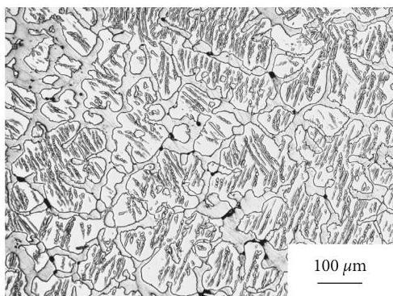
(a)

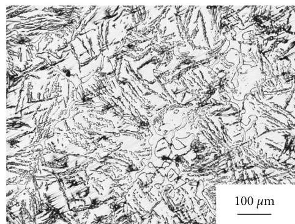
(b)

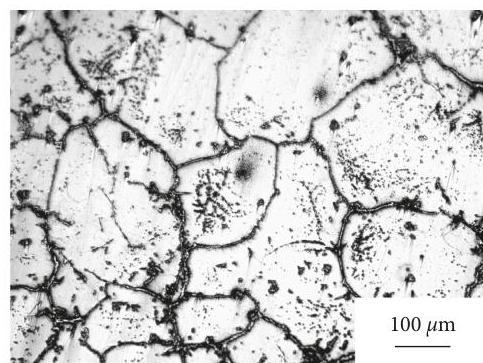
(c)

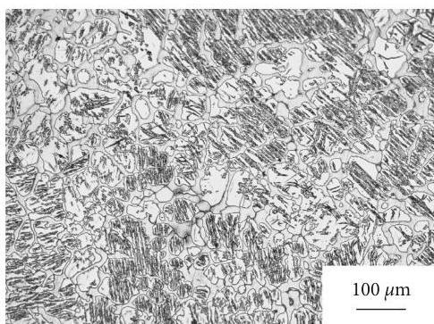
(d)

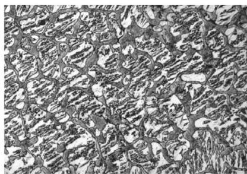
FIGURE 1: Optical micrographs of the as-cast (a) C1, (b) C2, and (c) C3 samples at  $30\mathrm{mm}$  and (d) C1 at  $5\mathrm{mm}$  thickness.
B:  $33.5\%$

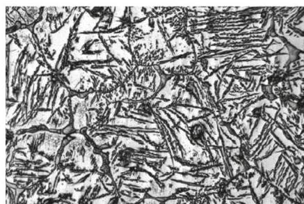
B:  $45\%$

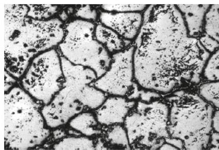
B:  $65\%$
(c)

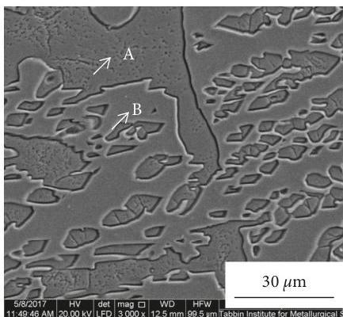
(a)
FIGURE 3: Scanning electron micrographs of the as-cast samples (a) 0.0 and (b)  $3.0\mathrm{wt.\%}$  Ti at  $30\mathrm{mm}$  and (c)  $0.0\mathrm{wt.\%}$  Ti sample at  $5\mathrm{mm}$ .

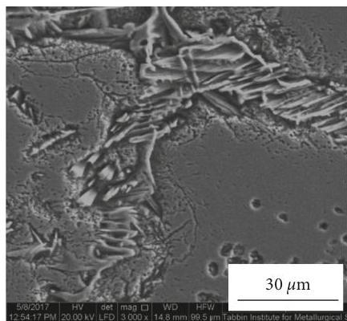
FIGURE 2: Annotated images taken at  $100\mathrm{X}$  for the as-cast samples at (a) C1, (b) C2, and (c) C3 showing the distribution of the white phase in volume  $\%$

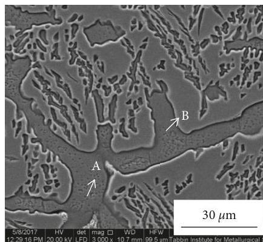
(c)

Advances in Materials Science and Engineering

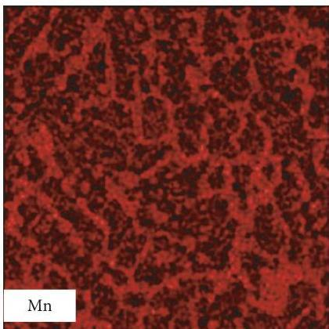
(a)

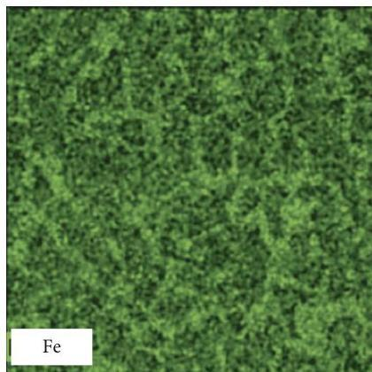
(b)

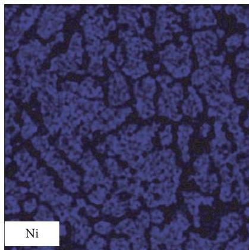
(c)

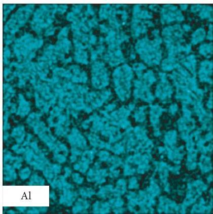
(d)

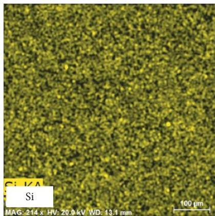
(e)

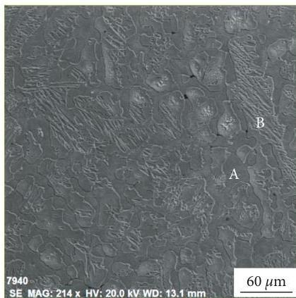
(f)
FIGURE 4: Elemental maps performed by EDX on the as-cast sample with  $0.0\%$  Ti.

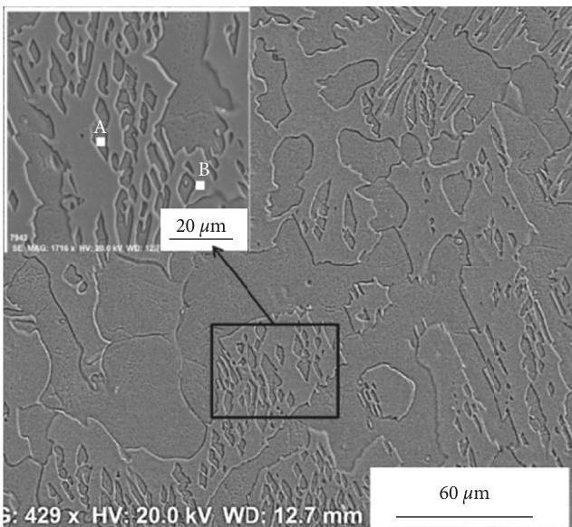
(a)
FIGURE 5:Continued.

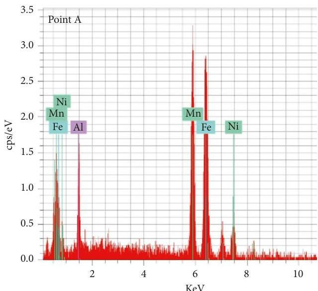
(b)

Advances in Materials Science and Engineering

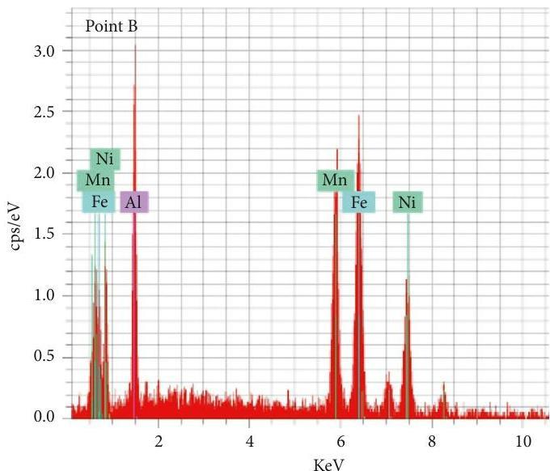
(c)

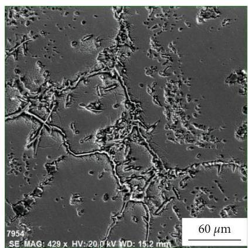
(a)

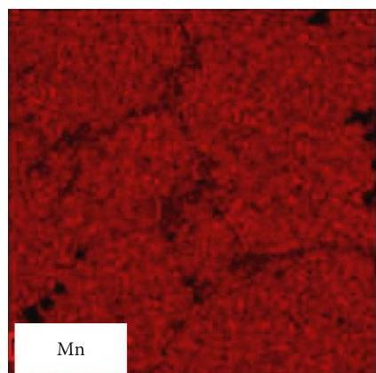
FIGURE 5: Results of EDX analysis of points A (a) and B (b) in the microstructure of  $0.0\%$  Ti sample.

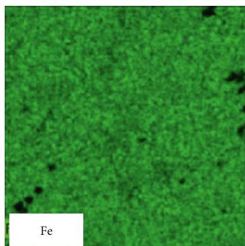
(c)

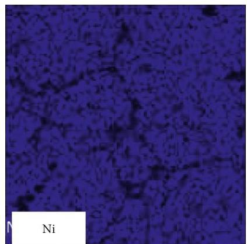
(d)

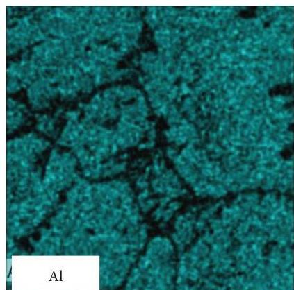
(b)
(e)
FIGURE 6:Continued.

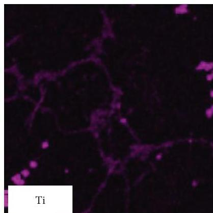
(f)

elements detected by EDX in C3 sample and the corresponding line scan and point analysis on some precipitates. Here, the elemental mapping further confirms the possibility of the presence of all the elements in the solid solutions as previously reported [14, 15] and that the lamellar structure diminishes with increasing Ti content. Moreover, coarse grains with some Ti precipitates on the grain boundaries formed with addition of 3.0% Ti. Also, some free Ti dispersoids were frequently found on all the maps performed on the samples. Some light points on the map show the presence of free Si on the grain boundaries. This Si came unintentionally from the addition of ferroalloys instead of pure metals during the casting process.

### 3.2. Effect of Heat Treatment on the Microstructure of Fe_{31}Mn_{28} Ni_{15}Al_{24}Ti_{x} HEAs

Heat treatment of high-entropy alloys via annealing is an important process which is applied to assess the thermal stability of their microstructures [9, 10]. Based on the review of Zhang et al. [16] and the recent work of Jiang et al. [17], heat treatment can affect the size of the different phases and their distribution in microstructure of HEAs and hence their mechanical properties. In the current work, the samples were annealed at 900°C for 10 h and some samples were left for 20 h to observe the effect of extending the annealing time on the microstructure of HEAs. Figures 8 and 9 show the microstructure of the different samples after annealing for 10 and 20 h, respectively.

According to the microstructure of Figure 9 and by contrasting it to Figure 1 for the as-cast samples, the distance between lamellas was decreased due to heat treatment for 10 h. Concluding, both of increasing Ti content up to 3.0 wt.% and heat treatment at 900°C for 10 h decrease the lamellar spacing and affect the phases distribution in the microstructure of the alloy. In Figure 10, points 1 and 2 show that all the elements still present together in the solid solution after heat treatment for 10 h and point 3 is a Ti precipitate. These Ti precipitates were found frequently in the microstructure and are expected to affect positively the mechanical properties of the alloy. Extending the treatment time to 20 h resulted only in grain growth via particle coalescence mechanism reported in [18] as observed in Figure 10.

### 3.3. Mechanical Properties Evaluation

High-entropy alloys as a new group of alloys were developed mainly to obtain good and contradicting mechanical properties at lower cost [1--3]. Evaluation of the mechanical properties due to elemental addition or heat treatment of these alloys therefore is very important. In the current study, the mechanical properties of the samples were evaluated in terms of the hardness. Figure 11 shows the hardness as affected by Ti addition, cooling rate, and heat treatment as well.

From this figure, it can be observed that addition of Ti up to 3.0 wt.% increased significantly the hardness of the alloy from ~310 to 500 (Hv). According to the explanation of the reported works [14--16], the strength of the current alloys are expected to improve because of both solid solution strengthening by Ti addition and by the decrease in the lamellar spacing following the Hall--Petch relationship [19]. Increasing the cooling rate by decreasing the section size down to 5 mm showed little improvement in the hardness. Heat treatment at 10 h enhanced the hardness of the as-cast samples with 0.0 and 0.8 wt.% Ti, while no effect was obtained when Ti was increased to 3.0 wt.%. Referring to the microstructures of the as-cast samples of Figure 1 and those of the heat-treated samples (10 h) shown in Figure 8, it can be observed that heat treatment for 10 h caused a decrease in the lamellar spacing of both C1 and C2 samples; therefore, the hardness increased. On the contrary, in the sample C3 where the lamellar structure was diminished, no significant change was observed.

Comparing the hardness of 3.0 wt.% Ti alloy which is about 500 (Hv) to the hardness of each main constituting elements, it can be noted that the current high-entropy alloy has higher hardness. This is due to the reported cocktail effect of high-entropy alloys by Ranganathan [20] and others [21, 22]. The cocktail effect of HEAs implies that the alloy properties can be greatly adjusted by the composition change and alloying, which indicates that the hardness of

Advances in Materials Science and Engineering

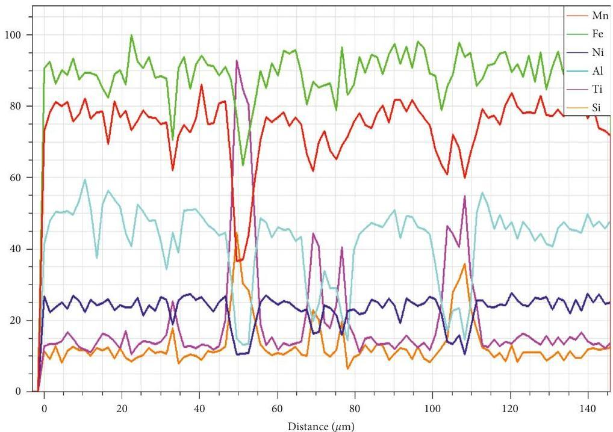

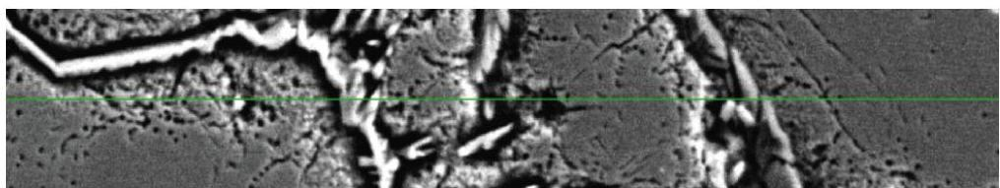
(a)

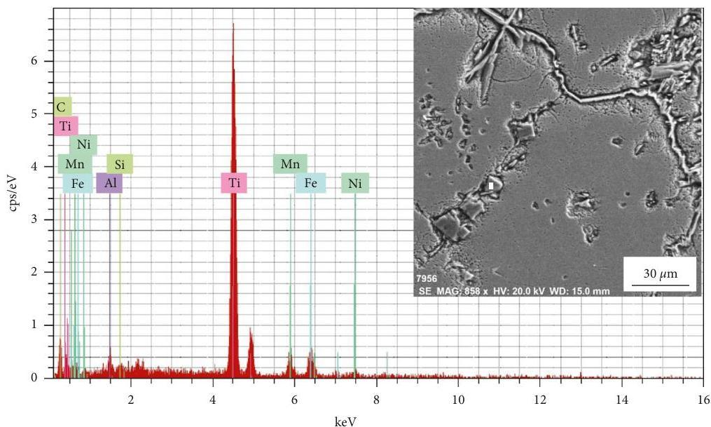
(b)
FIGURE 7: EDX line scan and a point analysis on some grain boundary precipitates in the C3 sample at  $30\mathrm{mm}$  thick.

HEAs can be dramatically changed by adjusting the alloying additives. This is very beneficial in terms of cost, where high hardness can be obtained using low-cost principle elements with some alloying additives [23, 24].

# 4. Conclusions

In the current  $\mathrm{Fe}_{31}\mathrm{Mn}_{28}\mathrm{Ni}_{15}\mathrm{Al}_{24.5}\mathrm{Ti}_{\mathrm{x}}$  HEAs, the effect of Ti addition up to  $3\mathrm{wt}.\%$  and heat treatment on the

Advances in Materials Science and Engineering

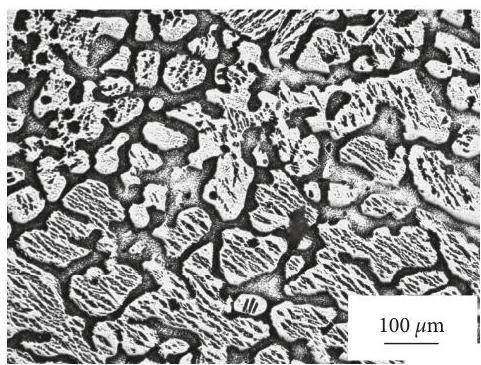
(a)

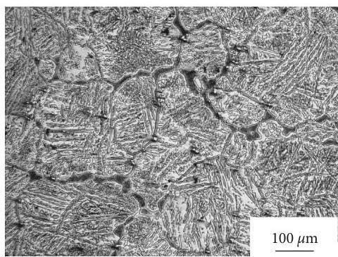
(b)

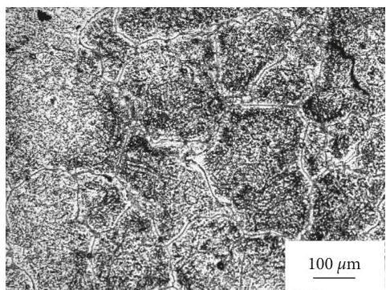
(c)

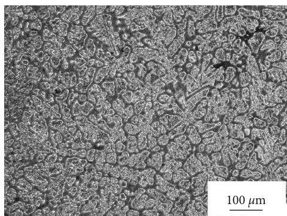
(d)
FIGURE 8: Optical micrographs of the  $10\mathrm{h}$  heat-treated samples: (a) C1, (b) C2, and (c) C3 at  $30\mathrm{mm}$  and (d) C1 at  $5\mathrm{mm}$ .

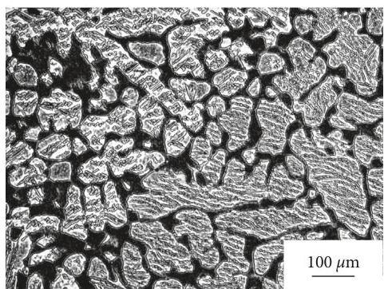
(a)

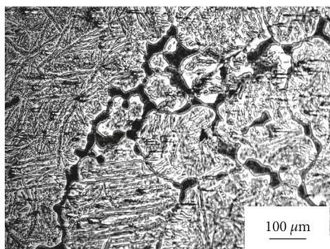
(b)

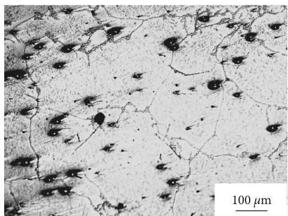
(c)
FIGURE 9: Micrographs of the  $20\mathrm{h}$  heat-treated samples: (a) C1, (b) C2, and (c) C3 at  $30\mathrm{mm}$  and (d) C1 at  $5\mathrm{mm}$ .

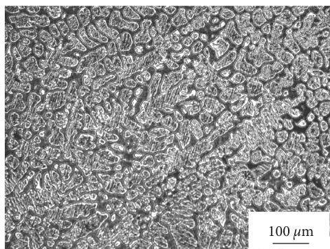
(d)

Advances in Materials Science and Engineering

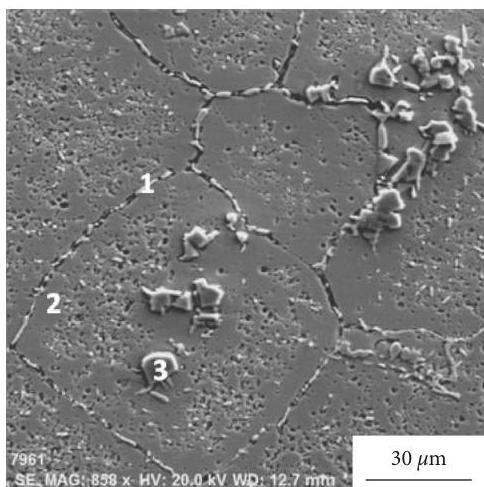

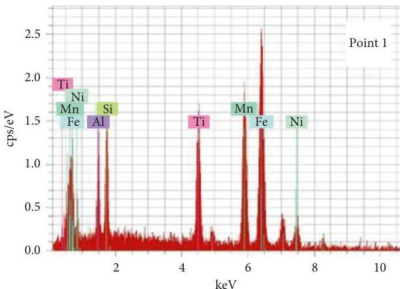

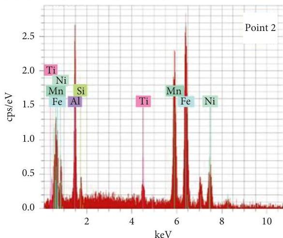
FIGURE 10: SEM and the corresponding point analysis at different positions for the C3 sample after heat treatment at  $900^{\circ}\mathrm{C}$  for  $10\mathrm{h}$ .

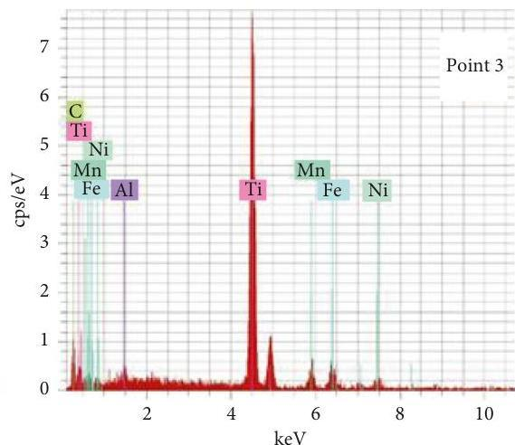

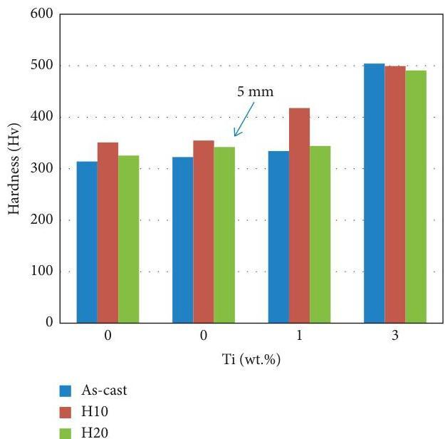
FIGURE 11: The hardness values of the different samples.

Advances in Materials Science and Engineering

microstructure and hardness was investigated and the following points were concluded:

(i) Addition of 3.0 wt.% Ti significantly enhanced the hardness of the alloy to 500 (Hv) by the combined effect of solid solution strengthening and decreasing lamellar spacing
(ii) Heat treatment at  $900^{\circ}\mathrm{C}$  enhanced the hardness at lower Ti percentages (0.0-0.8 wt.%) by decreasing the lamellar spacing, while no change was observed at higher Ti content
(iii) Extending the treatment time to  $20\mathrm{h}$  affected negatively the hardness of the alloy
(iv) High hardness can be obtained in HEAs at lower cost compared to the traditional alloys

# Data Availability

The data used to support the findings of this study are included within the article.

# Conflicts of Interest

The authors declare that there are no conflicts of interest regarding the publication of this paper.

# Supplementary Materials

A graphical abstract containing the main conclusions is attached. (Supplementary Materials)

# References

[1] B. Cantor, I. T. H. Chang, P. Knight, and A. J. B. Vincent, "Microstructural development in equiatomic multicomponent alloys," Materials Science and Engineering: A, vol. 375, pp. 213-218, 2004.
[2] J. W. Yeh, S. K. Chen, S. J. Lin et al., "Nanostructured high-entropy alloys with multiple principal elements: novel alloy design concepts and outcomes," Advanced Engineering Materials, vol. 6, no. 5, pp. 299-303, 2004.
[3] M.-x. Ren, B.-s. Li, and H.-z. Fu, "Formation condition of solid solution type high-entropy alloy," Transactions of Nonferrous Metals Society of China, vol. 23, no. 4, pp. 991-995, 2013.
[4] I. S. Wani, G. D. Sathiaraj, M. Z. Ahmed, S. R. Reddy, and P. P. Bhattacharjee, "Evolution of microstructure and texture during thermo-mechanical processing of a two phase Al 0.5 CoCrFeMnNi high entropy alloy," Materials Characterization, vol. 118, pp. 417-424, 2016.
[5] I. S. Wani, T. Bhattacharjee, S. Sheikh, P. P. Bhattacharjee, S. Guo, and N. Tsuji, "Tailoring nanostructures and mechanical properties of AlCoCrFeNi 2.1 eutectic high entropy alloy using thermo-mechanical processing," Materials Science and Engineering: A, vol. 675, pp. 99-109, 2016.
[6] T. Bhattacharjee, I. S. Wani, S. Sheikh et al., "Simultaneous strength-ductility enhancement of a nano-lamellar AlCoCr-FeNi2.1 eutectic high entropy alloy by cryo-rolling and annealing," Scientific Reports, vol. 8, no. 1, p. 3276, 2018.
[7] Y. Deng, C. C. Tasan, K. G. Pradeep, H. Springer, A. Kostka, and D. Raabe, "Design of a twinning-induced plasticity high entropy alloy," Acta Materialia, vol. 94, pp. 124-133, 2015.

[8] M. J. Yao, K. G. Pradeep, C. C. Tasan, and D. Raabe, "A novel, single phase, nonequiatomic FeMnNiCoCr high-entropy alloy with exceptional phase stability and tensile ductility," Scripta Materialia, vol. 72, pp. 5-8, 2014.
[9] I. Baker and F. Meng, "Lamellar coarsening in  $\mathrm{Fe_{28}Ni_{18}Mn_{33}Al_{21}}$  and its influence on room temperature tensile behavior," Acta Materialia, vol. 95, pp. 124-131, 2015.
[10] Y. Liao and I. Baker, "On the room-temperature deformation mechanisms of lamellar-structured  $\mathrm{Fe}_{30}\mathrm{Ni}_{20}\mathrm{Mn}_{35}\mathrm{Al}_{15}$ ," Materials Science and Engineering: A, vol. 528, pp. 3998-4008, 2011.
[11] B.-Y. Li, L. Peng, A.-P. Hu, L.-P. Zu, J.-J. Zhu, and D.-Y. Li, "Structure and properties of FeCoNiCrCu $_{0.5}$ Al $_x$  high-entropy alloy," Transactions of Non Ferrous Metals Society of China, vol. 23, pp. 935-741, 2013.
[12] F. Meng, J. Qiu, and I. Baker, "The effects of chromium on the microstructure and tensile behavior of  $\mathrm{Fe}_{30}\mathrm{Ni}_{20}\mathrm{Mn}_{35}\mathrm{Al}_{15}$ ," Materials Science and Engineering: A, vol. 586, pp. 45-52, 2013.
[13] F. Meng, J. Qiu, and I. Baker, "Effect of Al content on the microstructure and mechanical behavior of two-phase FeNiMnAl alloys," Journal of Materials Science, vol. 49, no. 5, pp. 1973-1983, 2014.
[14] Z. Wang, M. Wu, Z. Cai, S. Chen, and I. Baker, "Effect of Ti content on the microstructure and mechanical behavior of  $(\mathrm{Fe}_{36}\mathrm{Ni}_{18}\mathrm{Mn}_{33}\mathrm{aAl}_{13})_{100 - x}$ ,  $\mathrm{Ti}_x$  high entropy alloys," Intermetallics, vol. 75, pp. 79-87, 2016.
[15] Y. Liao and I. Baker, "Evolution of the microstructure and mechanical properties of eutectic  $\mathrm{Fe}_{30}\mathrm{Ni}_{20}\mathrm{Mn}_{35}\mathrm{Al}_{15}$ ," Journal of Materials Science, vol. 46, pp. 2009-2017, 2011.
[16] Y. Zhang, T. T. Zuo, Z. Tang et al., "Microstructures and properties of high-entropy alloys," Progress in Materials Science, vol. 61, pp. 1-93, 2014.
[17] L. Jiang, Y. Lu, W. Wu, Z. Cao, and T. Li, "Microstructure and mechanical properties of a  $\mathrm{CoFeNi_2V_{0.5}Nb_{0.75}}$  eutectic high entropy alloy in as-cast and heat-treated conditions," Journal of Materials Science &amp; Technology, vol. 32, pp. 245-250, 2016.
[18] T. Evangelos and A. Zavaliangos, "Evolution of near-equixed microstructure in the semisolid state," Materials Science and Engineering A, vol. 289, no. 1-2, pp. 228-235, 2000.
[19] G. E. Dieter, Mechanical Metallurgy, McGraw-Hill Book Co, New York, NY, USA, 3rd edition, 1986.
[20] S. Ranganathan, "Alloyed pleasures: multimetallic cocktails," Current Science, vol. 8, pp. 1404-1406, 2003.
[21] X. Yang and Y. Zhang, "Cryogenic resistivities of NbTiAlV-TaLax, CoCrFeNiCu and CoCrFeNiAl high entropy alloys," in Advanced materials and processing 2010, proceedings of the 6th international conference on ICAMP, Y. F. Zhang, C. W. Su, H. Xia, and P. F. Xiao, Eds., Yunnan, China, 2010.
[22] Y.-F. Kao, T.-J. Chen, S.-K. Chen, and J.-W. Yeh, "Microstructure and mechanical property of as-cast, -homogenized, and -deformed  $\mathrm{Al}_x\mathrm{CoCrFeNi}$ $(0\leq x\leq 2)$  high-entropy alloys," Journal of Alloys and Compounds, vol. 488, pp. 57-64, 2009.
[23] Y. J. Zhou, Y. Zhang, Y. L. Wang, and G. L. Chen, "Solid solution alloys of AlCoCrFeNiTi $_x$  with excellent room-temperature mechanical properties," Applied Physics Letters, vol. 90, no. 18, article 181904, 2007.
[24] I. Baker, “A review of the mechanical properties of B2 compounds,” Materials Science and Engineering: A, vol. 192, pp. 1-13, 1995.