coatings

MDPI

Article

# Microstructure and Properties of CoCrFeNi(WC) High-Entropy Alloy Coatings Prepared Using Mechanical Alloying and Hot Pressing Sintering

Juan Xu $^{1,2}$, Shouren Wang $^{3}$, Caiyun Shang $^{2}$, Shifeng Huang $^{1,*}$ and Yan Wang $^{2,*}$

$^{1}$ Shandong Provincial Key Laboratory of Preparation and Measurement of Building Materials, University of Jinan, No. 336, West Road of Nan Xinzhuang, Jinan 250022, China; 15053165095@163.com
$^{2}$ School of Materials Science and Engineering, University of Jinan, No. 336, West Road of Nan Xinzhuang, Jinan 250022, China; scy121295@163.com
$^{3}$ School of Mechanical Engineering, University of Jinan, No. 336, West Road of Nan Xinzhuang, Jinan 250022, China; me_wangsr@ujn.edu.cn
* Correspondence: mse_huangsf@ujn.edu.cn (S.H.); mse_wangy@ujn.edu.cn (Y.W.)

Received: 7 October 2018; Accepted: 20 December 2018; Published: 28 December 2018

check for updates

Abstract: The CoCrFeNi high-entropy alloy coatings (HEACs) with different weight ratios (10 and 30 wt.%) of WC additions have been prepared using mechanical alloying and a vacuum hot pressing sintering technique on a Q235 steel substrate. The microstructures, microhardness, wear resistance, and corrosion resistance of HEACs were studied. The CoCrFeNi(WC) powders were obtained by mixing the CoCrFeNi HEA powders and WC particles. The sintered products of both HEACs with high relative density contained one solid solution phase with face-centered cubic structure, WC, and unknown precipitate phases. The transition boundary had a good metallurgical bonding with the coating and substrate. The average microhardness values of CoCrFeNi HEACs with 10 and 30 wt.% WC additions reached 475 and 531 HV respectively, which were far higher than that of the substrate (160 HV). Moreover, both coatings exhibited better wear resistance than the substrate under the same wear conditions. The 30 wt.% WC HEAC displayed the lower friction coefficient, and the shallower wear groove depth. The grain refinement strengthening and second-phase particle strengthening could be beneficial to the enhanced hardness and wear resistance of coatings with WC additions. The corrosion behavior of the tested samples in the 3.5 wt.% NaCl solution were investigated using electrochemical polarization measurements. The CoCrFeNi(WC) coatings all revealed the improved corrosion resistance. Especially, a 10 wt.% WC addition remarkably enhanced the comprehensive corrosion resistance and easy passivation of CoCrFeNi HEAC.

Keywords: high-entropy alloy coating; mechanical alloying; vacuum hot pressing sintering; wear resistance; corrosion resistance

# 1. Introduction

High entropy alloys (HEAs), which have received important attention recently, contain multiple principal elements in equimolar or near equimolar ratios, and possess unique phase compositions [1]. The development of HEAs is motivated by their excellent properties such as mechanical strength, resistance to oxidation, and soft magnetic properties [2-4]. Moreover, they also have superior surface properties like high hardness, excellent wear performance, and outstanding corrosion resistance [5-10]. The FeNiCoAlCu HEA coating (HEAC) fabricated on the AISI 1045 steel using a laser cladding method had a good wear performance even at high temperature [7]. The laser-cladded TiVCrAlSi HEAC had much higher hardness values (1108 HV for the silicide and 628 HV for the matrix) than that of the Ti-6Al-4V substrate [8]. The AlCrMoNbZr HEAC was deposited on a N36 zirconium alloy

Coatings 2019, 9, 16; doi:10.3390/coatings9010016

www.mdpi.com/journal/coatings

substrate using magnetron co-sputtering technology and showed superior corrosion resistance and high hardness [9]. The AlCoCrFeNi HEAC was fabricated on the 1045 steel substrate using electrospark deposition technology, which had the improved corrosion resistance compared to the substrate [10].

Recently, a vacuum hot pressing sintering (VHPS) technique has been considered as a feasible way to prepare coatings, and is successfully used for the fabrication of HEACs [11,12,13]. Shang et al. prepared the CoCrFeNi(W_{1-x}Mo_{x}) (x = 0, 0.5) HEACs utilized by the mechanical alloying (MA) and VHPS technique, exhibiting the high microhardness and good wear resistance compared with the Q235 steel substrate [12].

The properties of HEA or HEACs are improved through adding the element, compound, or second phase. W element addition revealed the remarkable effects on the microhardness and wear resistance of CoCrFeNi HEAC [12]. The wear resistance of AlCoCrFeNiTi_{x} HEA was influenced by Ti addition, especially the AlCoCrFeNiTi_{0.5} HEA, which revealed a superior wear resistance compared to the bearing steel [14]. In addition, tungsten carbide (WC) as an attractive reinforcement-phase has been used in many alloy systems [15,16,17,18]. Chen et al. have found that hardness and wear resistance of the Al_{0.5}CrCoCuFeNi multi-element alloy were enhanced with increasing contents of WC from 10 to 35 wt.% [14]. Zhou et al. have found that the hardness of the (FeCoCrNi)_{1-x}(WC)_{x} (x = 3--11 at.%) HEA composites gradually increased from 603 to 768 HV with increasing WC content [17].

In this paper, we prepared the CoCrFeNi HEA powders with the additions of 10 and 30 wt.% WC particles. Furthermore, we also used a VHPS technique to prepare the high-quality CoCrFeNi(WC) HEACs on the Q235 steel substrate. The microstructure, microhardness, wear resistance, and corrosion resistance of these coatings were systematically investigated.

## 2. Experimental Procedure

Co, Cr, Fe, and Ni powders (Jia Ming Platinum Industry Non-Ferrous Metals Ltd. Beijing, China) with high purity (99.9 wt.%) and minor powder size (less than 75 μm) were mechanically alloyed to synthesize CoCrFeNi HEA powders. The starting elemental powders were mixed in a high-energy planetary ball mill (KE-4L, Hongchun Instrument Equipment Factory, Qidong, China) at 350 revolutions per minute (rpm) in an argon atmosphere. High-performance stainless-steel vials and balls were utilized, and the ball-to-powder mass ratio was 15:1. The diameters of milling balls used were 10, 6, and 3 mm, and the mass ratio of these three kinds of balls was 1:1:1. Then, the 200 h milled CoCrFeNi HEA powders and different weight ratios of WC particles (10 and 30 wt.%) were uniformly mixed together for the subsequent VHPS process. The composition of Q235 steel (Tongyi Economic and Trade Ltd. Jinan, China) is shown in Table 1, and it was used as the substrate. The Q235 steel surface was first treated using a grinding wheel to remove oxide and increase roughness, then degreased using absolute ethyl alcohol and dried in air. During the grinding process, the 400, 800, and 1200 mesh sandpapers were used in sequence. The HEACs were fabricated using a vacuum hot pressing sintering furnace (ZT-70-20Y, Chenhua Electric Furnace Ltd. Shanghai, China) with a 35 mm inner-diameter graphite die at 950 °C for 30 min under a constant axial pressure of 30 MPa. The phase constitutions and microstructures of the coating powders as well as HEACs were characterized by X-ray diffraction (XRD) and field-emission scanning electron microscopy (FESEM). The XRD device (D8 Advance, Bruker, Karlsruhe, Germany) was operated with a CuKα radiation, a step size of 0.02°, a measurement time per step of 0.2 s, and a Ni filter. In addition, the size of the analyzed area was 0.8 cm^{2}. The phase determination in XRD patterns was identified using the MDI Jade 6.0 (TILAB) software. The FESEM device (QUANTA FEG 250, FEI, Thermo Fisher Scientific, Waltham, MA, USA) was operated with backscattered-electron detector, voltage of 20 kV, and a spot size of 5.0 nm. The elements distributions of powders and coatings were analyzed by energy-dispersive spectrometry (EDS, IncaX-Max-50, Oxford, Oxfordshire, UK), which was operated at 20 kV. The densities of these sintered coatings were determined according to the Archimedes principle method with distilled water as the suspending medium using an electronic analytical balance. The microhardness (HV) of the HEACs was measured with the Vickers hardness tester (HVS-1000D, Broville Measuring Instruments Ltd. Foshan, Guangdong, China) with a load of

Coatings 2019, 9, 16

200 g and a duration time of 15 s. Each depth region was tested five times in order to obtain the average HV value, and the step size was about  $100\mu \mathrm{m}$ . Wear tests of Q235 steel and HEACs were performed on a high-temperature friction wear tester (MMG-10, Hansen Precision Instrument Ltd., Jinan, China) in the ring-disk configuration under a dry condition at room temperature. The counter body was a concentric ring prepared using GCr15 steel with a microhardness of 700 HV. Its inner diameter, outer diameter and height were 10, 17, and  $20\mathrm{mm}$ , respectively. Tests were performed with a rotational speed of  $100\mathrm{rev}\cdot \mathrm{min}^{-1}$ , a normal load of  $100\mathrm{N}$ , and a duration time of  $900\mathrm{s}$ . The transition region morphology was obtained from the wear surface to groove bottom by using the super depth of field three-dimensional microscopy system (VH-2500R, KEYENCE, Osaka, Japan). Corrosion behaviors of the coatings and substrate were carried out using electrochemical polarization measurements with a potentiostat (CHI660E, Huachen Instrument Ltd., Shanghai, China) in the  $3.5\mathrm{wt}.\%$  NaCl solution. Electrochemical measurements were performed using a conventional three-electrode cell immersed in solution. The working electrode was the tested samples, with an immersed average area of  $0.5\mathrm{cm}^2$ . The counter electrode was a platinum sheet, and the reference was an Ag-AgCl (in saturated KCl) reference electrode. Potentiodynamic polarization curves were recorded in air at a potential sweep rate of  $1\mathrm{mV}\cdot \mathrm{s}^{-1}$  after the open-circuit potential was steady enough (about  $600\mathrm{s}$ ). The measurements of all specimens were conducted at ambient temperature for at least three times in order to obtain one polarization curve with good repeatability. The  $i_{\mathrm{corr}}$  was acquired after fitting in the region about  $\pm 20$  mV of  $E_{\mathrm{corr}}$  in the potentiodynamic polarization curve using the Butler-Volmer analysis (ThalesXT5.1.4 software).

Table 1. The composition of the Q235 steel substrate as determined by the steel supplier.

|  Element | Content (wt.%)  |
| --- | --- |
|  C | 0.15  |
|  Si | 0.2  |
|  Mn | 0.46  |
|  S | 0.022  |
|  P | 0.012  |
|  Fe | 99.156  |

# 3. Results and Discussion

The XRD patterns of the CoCrFeNi HEA powder mixtures with different weight ratios of WC particles (10 and 30 wt.%) are shown in Figure 1a. Both samples contain the face-centered cubic (FCC) solid solution and WC phase. The XRD patterns of CoCrFeNi(WC) HEACs are given in Figure 1b. Compared with the as-milled powder mixtures, the sintered products of the tested HEACs are composed of FCC solid solution, WC phase, and a few unknown phases. It can be inferred that some intermetallic compounds precipitated from the FCC matrix during the sintering process.

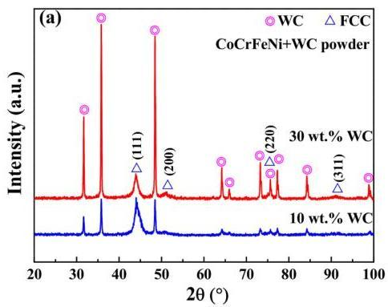
Figure 1. XRD patterns of mixed powders (a) and HEACs (b) for CoCrFeNi with different contents of WC additions.

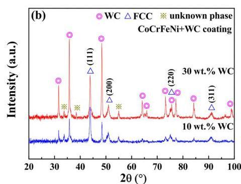

Coatings 2019, 9, 16

The crystallite size  $(D)$  and lattice constant  $(a)$  could be determined using Scherer formula (Equation (1)) and Bragg equation (Equation (2)) after eliminating the instrumental broadening of X-rays. The corresponding results of FCC phase in the CoCrFeNi [13] and CoCrFeNi(WC) HEACs are shown in Table 2.

$$
D = \frac {0 . 8 9 \lambda}{B \cos \theta} \tag {1}
$$

$$
a = d _ {h k l} \cdot \sqrt {h ^ {2} + k ^ {2} + l ^ {2}} \tag {2}
$$

where  $\lambda$  is the wavelength of the X-rays (0.154056 nm),  $B$  is the peak width at half the maximum intensity (subtracting  $\mathrm{K}\alpha_{2}$ ),  $\theta$  is the Bragg angle, and  $d$  is the interplanar spacing ( $d = \frac{\lambda}{2\sin\theta}$ ). All calculated values in the Table 2 were obtained from the (111) peak of the FCC phase.

Table 2. Crystallite size  $(D)$ , lattice constant  $(a)$  of the FCC phase ((111) peak) in the CoCrFeNi and CoCrFeNi (WC) HEACs.

|  Coatings (FCC Phase) | D (nm) | a (Å)  |
| --- | --- | --- |
|  CoCrFeNi | 27.6 | 3.574  |
|  +10 wt.% WC | 18.9 | 3.574  |
|  +30 wt.% WC | 18.2 | 3.574  |

The  $D$  values of FCC phases in CoCrFeNi coating decreased with the addition of WC particles. It indicated that the addition of WC particles contributed to the grain refinement of CoCrFeNi HEAC. The grain refinement when adding WC particles could be attributed to two reasons. On the one hand, the WC tended to locate at the grain boundary, and enhanced the grain boundary cohesion. On the other hand, the decoration of the grain boundary caused by WC could effectively enhance the grain boundary drag effect. Therefore, these could significantly refine the grains compared with the CoCrFeNi HEAC. Moreover, the  $a$  values of CoCrFeNi(WC) HEACs (3.574 Å) are not affected after adding WC particles. It can be inferred that the WC particles did not react with the principal elements of the matrix, and existed as the independent reinforcement phase. In addition, there was no apparent change of  $D$  values (25.3 nm) of the WC phase in both coatings.

The FESEM image of the powder mixtures of CoCrFeNi HEA with 30 wt.% WC particles is shown in Figure 2a. According to the corresponding elemental mappings (Figure 2(a-1)-(a-6)), it can be deduced that CoCrFeNi and WC particles were of large and fine size, respectively. In addition, two kinds of powders were mixed homogeneously during milling mixing. It needs to be noted that carbon atom (in the WC) as a light element cannot be accurately represented under our current test conditions (EDS and elemental mapping). Therefore, there are certain inaccuracies in the distribution of carbon embodied by the elemental mapping (Figure 2(a-5)). For HEAC with the 10 wt.% WC addition in Figure 3, the continuous gray matrix and a small amount of bright grains with fine sizes (less than  $3\mu \mathrm{m}$ ) were observed. Through EDS mapping (Figure 3(a-1)-(a-6)), it can be seen that the Fe, Ni, Co, and Cr elements mainly distributed in a gray matrix. The bright grains are rich in W and C elements. This confirms that the bright grains were WC particles and the distribution of them is homogeneous. Similarly, the distribution of bright grains in 30 wt.% WC HEAC exhibited a more uniform and dense state in the gray matrix (Figure 3(b-1)-(b-6)). Combining with EDS analyses of CoCrFeNi(WC) HEACs in Table 3, the compositions of principal elements for two coatings were all close to nominal compositions. Moreover, the atomic ratios of W and C elements in bright grains remained similar, and the W element was enhanced from 45 to 48 at.% in bright grains with increasing contents of WC.

Coatings 2019, 9, 16

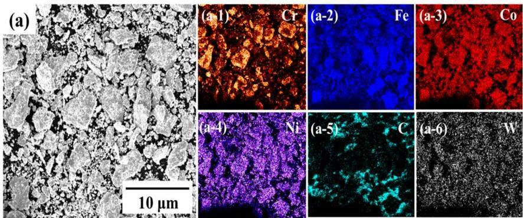
Figure 2. FESEM image of the as-milled CoCrFeNi + 30 wt.% WC mixed-powders (a), and the corresponding elemental mappings: (a-1)-(a-6).

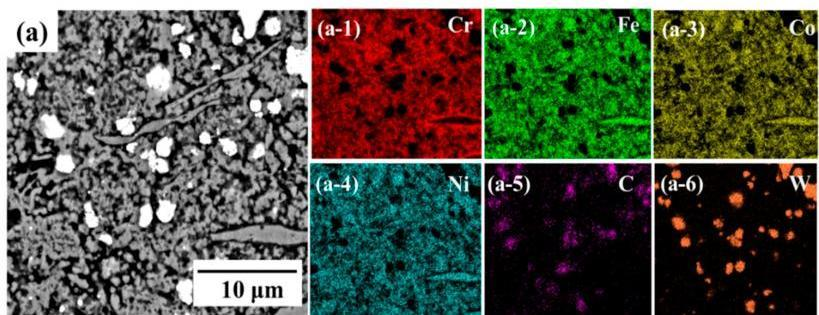

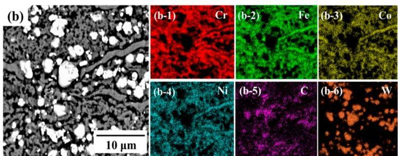
Figure 3. FESEM images of the CoCrFeNi + 10 wt.% WC (a) and CoCrFeNi + 30 wt.% WC (b) HEACs, and the elemental mappings of (a-1)-(a-6) and (b-1)-(b-6) corresponding to (a) and (b), respectively.

Table 3. Chemical compositions of the CoCrFeNi(WC) HEACs according to EDS analyses.

|  HEACs | Regions | Elements (at.%)  |   |   |   |   |   |
| --- | --- | --- | --- | --- | --- | --- | --- |
|   |   |  Co | Cr | Fe | Ni | W | C  |
|  +10 wt.% WC | Grains (bright) | 2.3 | 2.4 | 2.4 | 3.0 | 45.8 | 44.1  |
|   |  Matrix (gray) | 23.2 | 23.9 | 26.9 | 24.6 | 0.6 | 0.8  |
|  +30 wt.% WC | Grains (bright) | 1.2 | 2.4 | 1.2 | 0.6 | 48.3 | 46.3  |
|   |  Matrix (gray) | 23.5 | 25.9 | 25.2 | 24.3 | 0.4 | 0.7  |

Cross-sectional FESEM backscattered electron images of both HEACs are shown in Figure 4. It is obvious from Figure 4a,b that the average thickness values of coatings are of 860 and  $900\mu \mathrm{m}$  for 10 and  $30\mathrm{wt}.\%$  WC HEACs, respectively. The zoomed-in views in the transition boundary regions marked by the square for both HEACs are shown in Figure 4c,d. The span of transition boundaries in 10 and  $30\mathrm{wt}.\%$  WC coatings were about 2.4 and  $1.5\mu \mathrm{m}$ , as shown by the two-way arrows. It is clear that the transition boundary regions in both HEACs were dense, and no cracks or any other defects appeared, indicating a good metallurgical bonding between coatings and substrate. Moreover, the relative density of all sintered coatings, which was calculated with respect to actual density and theoretical density, reached up to  $97\%$  (Table 4). It suggests that the coatings with high sintering quality had been acquired.

Coatings 2019, 9, 16

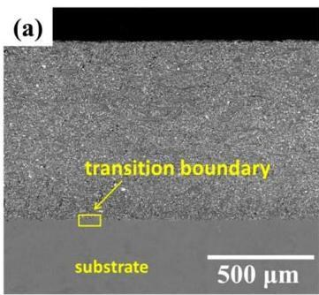

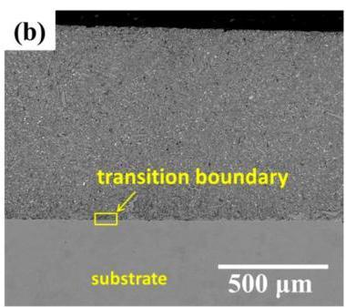

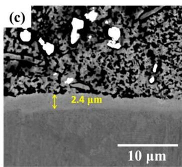
Figure 4. FESEM images of CoCrFeNi HEACs with different contents of WC addition: (a,c) CoCrFeNi + 10 wt.% WC HEAC; (b,d) CoCrFeNi + 30 wt.% WC HEAC.

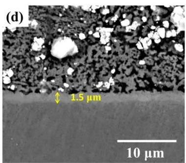

Table 4. Density, theoretical density, and relative density of the CoCrFeNi(WC) HEACs.

|  Properties | 10 wt.% WC Coating | 30 wt.% WC Coating  |
| --- | --- | --- |
|  Density (g·cm-3) | 7.24 ± 0.02 | 8.39 ± 0.03  |
|  Theoretical density (g·cm-3) | 7.42 | 8.53  |
|  Relative density (%) | 97.6 ± 0.3 | 98.4 ± 0.4  |

Figure 5a shows the variation of cross-sectional microhardness distribution of the HEACs and substrate. The microhardness values of the CoCrFeNi(WC) coatings were much higher than that of substrate. The average microhardness values of CoCrFeNi HEACs with 10 and 30 wt.% WC additions HEACs reached 475 and 531 HV respectively. For the 30 wt.% WC coating, the microhardness was more than 3 times larger than the substrate (160 HV). Moreover, compared with the previous study [13], the WC additions obviously enhanced the microhardness of CoCrFeNi HEAC (450 HV). These improvements of microhardness may be attributed to two major causes. First, combined with the crystallite size calculated using the Scherrer formula, it also revealed the decreasing trend with W addition, further indicating the grain refinement strengthening effect. Second, the WC hard phases could be responsible for the enhanced microhardness on the basis of a second-phase particle strengthening mechanism. Moreover, it was observed that the WC particles homogeneously distributed in the matrix, which further contribute to the improvement of mechanical properties. Therefore, it also effectively hindered the motion of dislocation; hence the microhardness of WC addition coatings became increased. In addition, compared with the 10 wt.% WC coating, the 30 wt.% WC HEAC possessed a more dense distribution of WC particles, which was beneficial to further improve the microhardness of the coating.

Coatings 2019, 9, 16

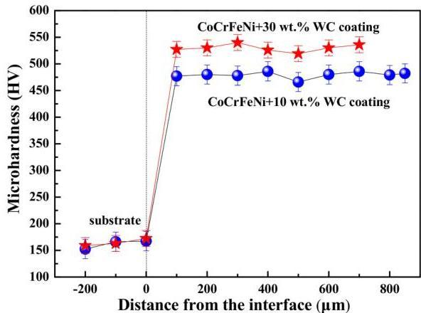
Figure 5. Cross-sectional microhardness distribution of the Q235 steel substrate and CoCrFeNi(WC) HEACs.

The friction coefficients for Q235 steel substrate and CoCrFeNi(WC) HEACs are shown in Figure 6. It was noticed that periodic waves with fluctuation were observed, and characterized the friction coefficient of the tested samples. This is thought to be caused by two factors. The first is the periodically localized fracture of the surface layer. The second is periodic accumulation and elimination of the debris on worn surface [19]. However, the friction coefficients of the tested samples gradually reached a relative constant value as testing time increased. The mean friction coefficients of CoCrFeNi HEACs with 10 and 30 wt.% WC addition were 0.34 and 0.30 respectively, which were more than  $61\%$  lower than that of Q235 substrate (0.87).

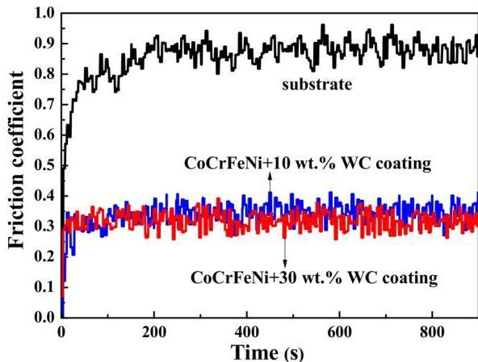
Figure 6. Variation of friction coefficients vs. testing time for the Q235 steel substrate and CoCrFeNi(WC) HEACs during the sliding wear test.

In addition, the mean friction coefficient of CoCrFeNi HEAC was 0.38 [13], which was also higher than that of WC addition HEACs. Correspondingly, WC additions were beneficial for improving the wear resistance of CoCrFeNi HEAC. Moreover, the enhancement effect was more feasible with increasing the additional contents of WC. For further characterizing the wear resistance of the tested samples, the wear groove depths were obtained through transition region 3D morphologies from the wear surface to the groove bottom, as shown in Figure 7. The corresponding values of the wear groove depth are revealed in Figure 8. The values of the wear groove depth for HEACs with 10 and  $30\mathrm{wt}.\%$  WC additions were 17.7 and  $15.1~{\mu\mathrm{m}}$  respectively, and were shallower than those of the substrate  $(25.5\mu \mathrm{m})$  and CoCrFeNi HEAC  $(19.8\mu \mathrm{m})$ . This further proves the excellent wear resistance of HEACs with WC additions.

Coatings 2019, 9, 16

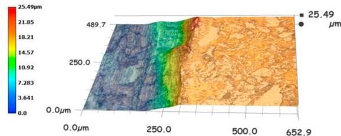
(a)

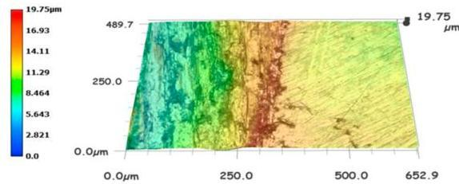
(b)

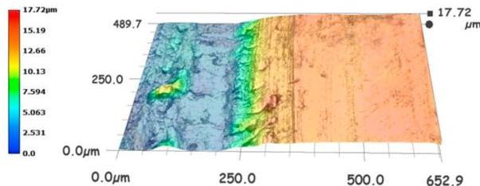
(c)

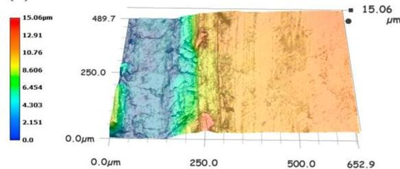
(d)
Figure 7. Transition region 3D morphologies from wear surface to groove bottom after wear tests. (a) Q235 steel substrate, (b) CoCrFeNi HEAC, (c) CoCrFeNi + 10 wt.% WC, and (d) CoCrFeNi + 30 wt.% HEACs in a dry sliding wear condition.

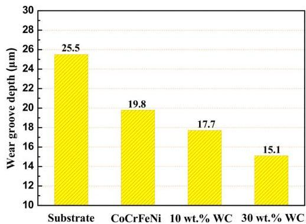
Figure 8. Wear groove depth of the Q235 substrate, CoCrFeNi HEAC, and 10 and 30 wt.% WC addition CoCrFeNi HEACs in a dry sliding wear condition.

The worn surface morphologies of the substrate and CoCrFeNi(WC) HEACs are shown in Figure 9. Under the combined effect of the normal and tangential force, the Q235 steel underwent intense plastic deformation easier due to its low microhardness (Figure 9a). The adhesive wear behavior appeared, which was evidenced by the severe peeling off of materials and the clear ploughed furrow structures. The worn surfaces of CoCrFeNi(WC) HEACs became smoother than that of the substrate after the wear test, as shown in Figure 9b,c. The plastic deformation was weakened to a certain extent, and a small quantity of plowing grooves appeared on the worn surface of the tested coatings. Furthermore, plowing grooves started to cut down and lessen when the mass fraction of WC increased from 10 to  $30\mathrm{wt.\%}$ . It is well known that the wear resistance is proportional to the hardness of the alloy according to Archard's laws [20]. The microhardness values of HEACs were higher than those of the substrate and CoCrFeNi HEAC, which further confirms this hypothesis.

The basic process of corrosion for metallic components in an aqueous solution consists of the anodic dissolution of metals and the cathode reduction of oxidants presented in the solution [21]. In open-circuit conditions or at the small applied potential, the components of samples dissolve slowly and selectively. When giving an applied potential or in relatively higher potential range, the dissolution takes place observably on the coating surface [22]. Therefore, it is meaningful to make potentiodynamic polarization curves under the applied potential, which is more helpful for observing

Coatings 2019, 9, 16

and studying the corrosion process of the tested sample. Figure 10 exhibits the potentiodynamic polarization curves of the Q235 substrate and CoCrFeNi(WC) HEACs in the  $3.5\mathrm{wt}.\%$  NaCl solution. In order to effectively verify the corrosion resistance of the tested samples in the present study, the CoCrFeNi HEAC was selected as the reference object tested in the same corrosion conditions. The corrosion potential  $(E_{\mathrm{corr}})$  characterizes the thermodynamic stability of the tested samples under the electrochemical corrosive condition [23]. The corrosion current density  $(i_{\mathrm{corr}})$  implies that the corrosion rate and breakdown potential were the lowest potential values at which pitting occurred [21]. The corresponding electrochemical parameters of tested samples are all listed in Table 5.

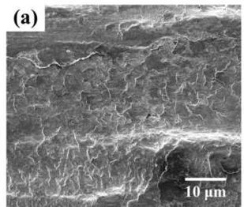

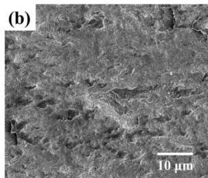
Figure 9. Worn surface morphologies of the (a) Q235 steel substrate, (b) CoCrFeNi + 10 wt.% WC, and (c) CoCrFeNi + 30 wt.% WC HEACs in a dry wear condition.

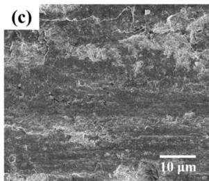

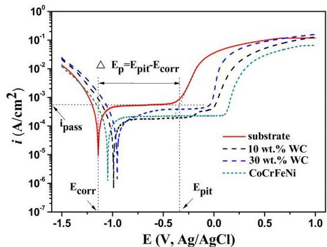
Figure 10. Potentiodynamic polarization curves of the Q235 steel substrate, CoCrFeNi HEAC, and CoCrFeNi(WC) HEACs in  $3.5\mathrm{wt}.\%$  NaCl solution.

Table 5. Electrochemical corrosion parameters of the Q235 steel substrate, CoCrFeNi, and CoCrFeNi(WC) HEACs.

|  Samples | Ecorr(V vs. Ag/AgCl) | Epit(V vs. Ag/AgCl) | ΔEp(V) | ipass(A·cm-2) | icorr(A·cm-2) | rcorr(mm/year)  |
| --- | --- | --- | --- | --- | --- | --- |
|  Substrate | -1.14 ± 0.03 | -0.34 ± 0.04 | 0.80 ± 0.04 | 5.43 × 10-4 | 5.89 × 10-5 | 6.85 × 10-1  |
|  CoCrFeNi | -1.08 ± 0.04 | 0.12 ± 0.01 | 1.20 ± 0.03 | 2.29 × 10-4 | 2.26 × 10-5 | 1.28 × 10-1  |
|  +10 wt.% WC | -0.99 ± 0.01 | 0 ± 0.02 | 0.99 ± 0.03 | 1.78 × 10-4 | 1.22 × 10-5 | 1.34 × 10-1  |
|  +30 wt.% WC | -0.95 ± 0.02 | -0.03 ± 0.03 | 0.92 ± 0.02 | 3.89 × 10-4 | 2.60 × 10-5 | 2.34 × 10-1  |

The  $E_{\mathrm{corr}}$  values of CoCrFeNi(WC) HEACs were more positive than those of the substrate and CoCrFeNi HEAC. In particular, CoCrFeNi HEAC with 10 wt.% WC exhibited the lowest  $i_{\mathrm{corr}}$ . Therefore,

it demonstrated that WC addition is beneficial to enhance the corrosion resistance of CoCrFeNi HEAC. The lower *i*_{*p**a**s**s*} illustrated that passivation behavior could occur more easily, and the passivation film was formed rapidly. Besides, the passivation films formed on the HEAC surface prevented the inner layer from being exposed to corrosive liquid, which could slow down the corrosion reaction [24]. Compared with the tested samples, the 10 wt.% WC coating possessed the lower *i*_{*p**a**s**s*} of 1.78 × 10^{-4} A·cm^{-2} than the other samples, exhibiting a good easy passivation property.

The ability of a material to resist a localized attack on the passive film is a function of its passivation region (*Δ**E*_{*p*} = *E*_{*p**i**t*} - *E*_{*c**o**r**r*}). The *Δ**E*_{*p*} values of both HEACs were larger than that of the substrate, but lower than the one of the CoCrFeNi HEAC. This was due to the high contents of Cr in the latter coating. Meanwhile, the corrosion rate (*r*_{*c**o**r**r*}) obtained from electrochemical polarization measurements could be calculated from Equation (3) [25]. $$r_{\text{corr}} = 0.00327~\left({\text{mm}/(u\text{A}\cdot\text{cm}\cdot\text{year})} \right) \cdot \frac{EW \times i_{\text{corr}}}{D}$$ where *E**W* is the equivalent weight of the coating, *i*_{*c**o**r**r*} is the corrosion current density (μA·cm^{-2}), 0.00327 is a constant (mm/(μA·cm·year)), and *D* is the density of HEACs (g·cm^{-3}). The *E**W* and *D* used for 10 wt.% WC and 30 wt.% WC HEACs were 24.38 and 7.24 g·cm^{-3}, 23.15 and 8.39 g·cm^{-3}, respectively. As can be seen in Table 5, the HEACs with WC addition exhibited much lower *r*_{*c**o**r**r*} values than the substrate, and meanwhile possessed *r*_{*c**o**r**r*} values similar to the CoCrFeNi coating. According to the above research results, this indicated that the 10 wt.% WC addition HEAC had the best comprehensive corrosion resistance in the 3.5 wt.% NaCl solution compared with other tested samples.

## 4. Conclusions

CoCrFeNi(WC) (WC contents of 10 and 30 wt.%) HEACs were successfully prepared using MA and VHPS technique on Q235 steel substrate. It shows that the final milling products of CoCrFeNi(WC) powders were the mixture of a FCC solid solution and WC phases. After the sintering process, a few unknown phases precipitated from the FCC matrix of the HEACs. The spans of the transition boundary were about 2.4 and 1.5 μm of the 10 wt.% WC and 30 wt.% WC HEACs, respectively. Moreover, it presented a good metallurgical bonding between the coating and the substrate. The relative densities of CoCrFeNi(WC) coatings reached up to 97%, indicating the high sintering quality. The microhardness and wear resistance of HEACs with WC additions evidently were superior to the Q235 steel substrate and CoCrFeNi coating. The 30 wt.% WC HEA exhibited the higher microhardness of 531 HV, the lower friction coefficient, and the shallower wear groove depth. This could be ascribed to the grain refinement strengthening and second-phase particle strengthening mechanisms. Besides, both HEACs showed the enhanced corrosion resistance in 3.5 wt.% NaCl solution comparing with Q235 steel. Compared with other tested samples, 10 wt.% WC HEAC revealed a good corrosion resistance characterized by the more positive *E*_{*c**o**r**r*}, the lowest *i*_{*c**o**r**r*}, as well as the lower *r*_{*c**o**r**r*}, and easy passivation embodied by the lowest *i*_{*p**a**s**s*}. The promising mechanical properties and corrosion resistance of the CoCrFeNi HEACs with WC addition provide the valuable guidance for expanding industrial applications, especially in the material surface engineering. Moreover, the VHPS technique used to fabricate HEACs in the present study achieved a layer thickness controllability, low cost, and even possessed the scalability for larger areas or more complex-shaped substrates.

Methodology, S.H. and Y.W.; Investigation, J.X. and C.S.; Formal Analysis, J.X. Y.W. and S.H.; Writing--Original Draft Preparation, J.X. and C.S.; Writing--Review & Editing, Y.W. S.H. and J.X.; Supervision, S.H. and Y.W.; Funding Acquisition, Y.W. and S.H.

This research was funded by Natural Science Foundation of China (No. 51671095), and Taishan Scholars Project of Shandong Province of China (No. 2016-2020).

Authors are grateful for the professional technicians who provided the testing techniques (FESEM, XRD).

The authors declare no conflict of interest.

Coatings 2019, 9, 16

# References

- [1] Yeh, J.W.; Chen, S.K.; Lin, S.J.; Gan, J.Y.; Chin, T.S.; Shun, T.T.; Tsau, C.H.; Chang, S.Y. Nanostructured high-entropy alloys with multiple principal elements: Novel alloy design concepts and outcomes. Adv. Eng. Mater. 2004, 6, 299–303. [CrossRef]
- [2] Miracle, D.B.; Senkov, O.N. A critical review of high entropy alloys and related concepts. Acta Mater. 2017, 122, 448–511. [CrossRef]
- [3] Gludovatz, B.; Hohenwarter, A.; Catoor, D.; Chang, E.H.; George, E.P.; Ritchie, R.O. A fracture-resistant high-entropy alloy for cryogenic applications. Science 2014, 345, 1153–1158. [CrossRef] [PubMed]
- [4] Zuo, T.T.; Gao, M.C.; Ouyang, L.Z.; Yang, X.; Cheng, Y.Q.; Feng, R.; Chen, S.Y.; Liaw, P.K.; Hawk, J.A.; Zhang, Y. Tailoring magnetic behavior of CoFeMnNiX (X = Al, Cr, Ga, and Sn) high entropy alloys by metal doping. Acta Mater. 2017, 130, 10–18. [CrossRef]
- [5] Zhang, W.R.; Liaw, P.K.; Zhang, Y. Science and technology in high-entropy alloys. Sci. China Mater. 2018, 61, 2–22. [CrossRef]
- [6] Ye, Y.X.; Liu, C.Z.; Wang, H.; Nieh, T.G. Friction and wear behavior of a single-phase equiatomic TiZrHfNb high-entropy alloy studied using a nanoscratch technique. Acta Mater. 2018, 147, 78–89. [CrossRef]
- [7] Jin, G.; Cai, Z.B.; Guan, Y.J.; Cui, X.F.; Liu, Z.; Li, Y.; Dong, M.L.; Zhang, D. High temperature wear performance of laser-cladded FeNiCoAlCu high-entropy alloy coating. Appl. Surf. Sci. 2018, 445, 113–122. [CrossRef]
- [8] Huang, C.; Zhang, Y.Z.; Vilar, R.; Shen, J.Y. Dry sliding wear behavior of laser clad TiVCrAlSi high entropy alloy coatings on Ti–6Al–4V substrate. Mater. Des. 2012, 41, 338–343. [CrossRef]
- [9] Zhang, W.; Tang, R.; Yang, Z.B.; Liu, C.H.; Chang, H.; Yang, J.J.; Liao, J.L.; Yang, Y.Y.; Liu, N. Preparation, structure, and properties of an AlCrMoNbZr high-entropy alloy coating for accident-tolerant fuel cladding. Surf. Coat. Technol. 2018, 347, 13–19. [CrossRef]
- [10] Li, Q.H.; Yue, T.M.; Guo, Z.N.; Lin, X. Microstructure and corrosion properties of AlCoCrFeNi high entropy alloy coatings deposited on AlSI 1045 Steel by the electrospark process. Metall. Mater. Trans. A 2012, 44, 1767–1778. [CrossRef]
- [11] Ge, W.J.; Wu, B.; Wang, S.R.; Xu, S.A.; Shang, C.Y.; Zhang, Z.T.; Wang, Y. Characterization and properties of CuZrAlTiNi high entropy alloy coating obtained by mechanical alloying and vacuum hot pressing sintering. Adv. Powder Technol. 2017, 28, 2556–2563. [CrossRef]
- [12] Shang, C.Y.; Axinte, E.; Sun, J.; Li, X.T.; Li, P.; Du, J.W.; Qiao, P.C.; Wang, Y. CoCrFeNi(W_{1-x}Mo_{x}) high-entropy alloy coatings with excellent mechanical properties and corrosion resistance prepared by mechanical alloying and hot pressing sintering. Mater. Des. 2017, 117, 193–202. [CrossRef]
- [13] Shang, C.Y.; Axinte, E.; Ge, W.J.; Zhang, Z.T.; Wang, Y. High-entropy alloy coatings with excellent mechanical, corrosion resistance and magnetic properties prepared by mechanical alloying and hot pressing sintering. Surf. Interfaces 2017, 9, 36–43. [CrossRef]
- [14] Löbel, M.; Lindner, T.; Mehner, T.; Lampke, T. Influence of titanium on microstructure, phase formation and wear behaviour of AlCoCrFeNiTix high-entropy alloy. Entropy 2018, 20, 505. [CrossRef]
- [15] Huang, G.Q.; Hou, W.T.; Shen, Y.F. Evaluation of the microstructure and mechanical properties of WC particle reinforced aluminum matrix composites fabricated by friction stir processing. Mater. Charact. 2018, 138, 26–37. [CrossRef]
- [16] Chen, C.S.; Yang, C.C.; Chai, H.Y.; Yeh, J.W.; Chau, J.L.H. Novel cermet material of WC/multi-element alloy. Int. J. Refract. Met. Hard Mater. 2014, 43, 200–204. [CrossRef]
- [17] Zhou, R.; Chen, G.; Liu, B.; Wang, J.; Han, L.; Liu, Y. Microstructures and wear behaviour of (FeCoCrNi)_{1-x}(WC)_{x} high entropy alloy composites. Int. J. Refract. Met. Hard Mater. 2018, 75, 56–62. [CrossRef]
- [18] Ji, X.L.; Zhao, J.H.; Wang, H.; Luo, C.Y. Sliding wear of spark plasma sintered CrFeCoNiCu high entropy alloy coatings with MoS2 and WC additions. Int. J. Adv. Manuf. Technol. 2018, 96, 1685–1691. [CrossRef]
- [19] Bartkowski, D.; Młynarczak, A.; Piasecki, A.; Dudziak, B.; Gościański, M.; Bartkowska, A. Microstructure, microhardness and corrosion resistance of Stellite-6 coatings reinforced with WC particles using laser cladding. Opt. Laser Technol. 2015, 68, 191–201. [CrossRef]

Coatings 2019, 9, 16

20. Scudino, S.; Liu, G.; Prashanth, K.G.; Bartusch, B.; Surreddi, K.B.; Murty, B.S.; Eckert, J. Mechanical properties of Al-based metal matrix composites reinforced with Zr-based glassy particles produced by powder metallurgy. Acta Mater. 2009, 57, 2029-2039. [CrossRef]
21. Da Silva, F.S.; Cinca, N.; Dosta, S.; Cano, I.G.; Couto, M.; Guilemany, J.M.; Benedetti, A.V. Corrosion behavior of WC-Co coatings deposited by cold gas spray onto AA 7075-T6. Corros. Sci. 2018, 136, 231-243. [CrossRef]
22. Ge, W.J.; Li, B.; Axinte, E.; Zhang, Z.T.; Shang, C.Y.; Wang, Y. Crystallization and corrosion resistance in different aqueous solutions of  $\mathrm{Zr}_{50.7}\mathrm{Ni}_{28}\mathrm{Cu}_{9}\mathrm{Al}_{12.3}$  amorphous alloy and its crystallization counterparts. JOM 2017, 69, 776-783. [CrossRef]
23. Chen, Y.Y.; Duval, T.; Hung, U.D.; Yeh, J.W.; Shih, H.C. Microstructure and electrochemical properties of high entropy alloys—A comparison with type-304 stainless steel. Corros. Sci. 2005, 47, 2257–2279. [CrossRef]
24. Gan, Y.; Wang, W.X.; Guan, Z.S.; Cui, Z.Q. Multi-layer laser solid forming of  $\mathrm{Zr}_{65}\mathrm{Al}_{7.5}\mathrm{Ni}_{10}\mathrm{Cu}_{17.5}$  amorphous coating: Microstructure and corrosion resistance. Opt. Laser Technol. 2015, 69, 17-22. [CrossRef]
25. Luo, H.; Li, Z.; Mingers, A.M.; Raabe, D. Corrosion behavior of an equiatomic CoCrFeMnNi high-entropy alloy compared with 304 stainless steel in sulfuric acid solution. Corros. Sci. 2018, 134, 131-139. [CrossRef]

© 2018 by the authors. Licensee MDPI, Basel, Switzerland. This article is an open access article distributed under the terms and conditions of the Creative Commons Attribution (CC BY) license (http://creativecommons.org/licenses/by/4.0/).