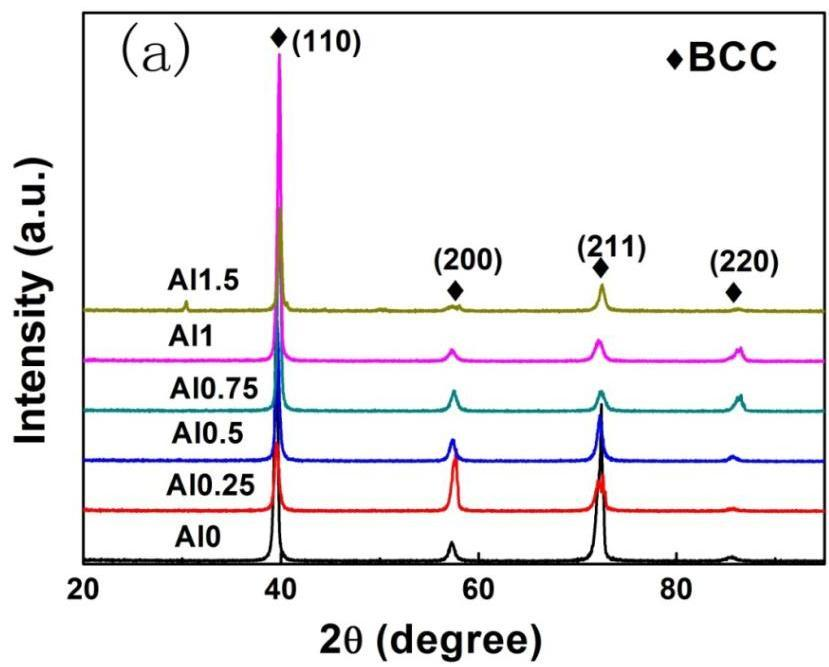
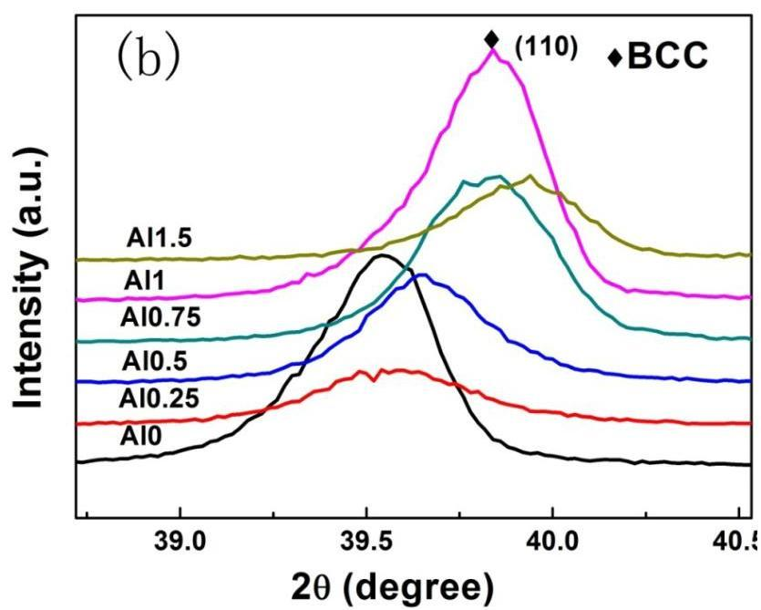
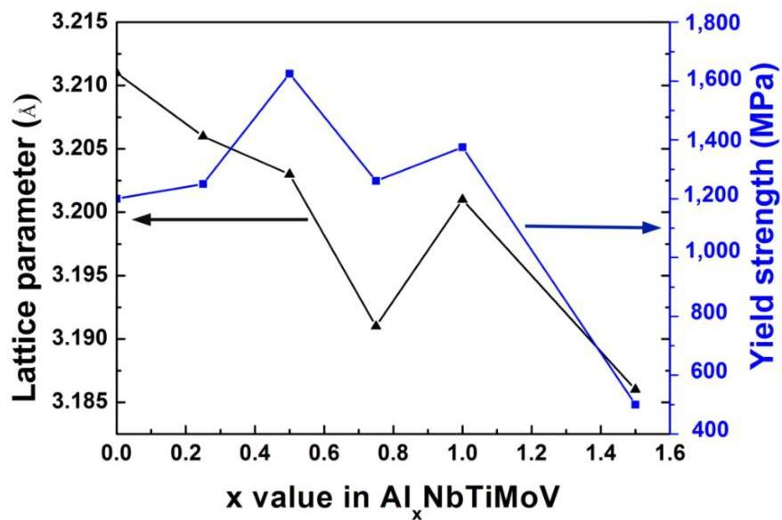
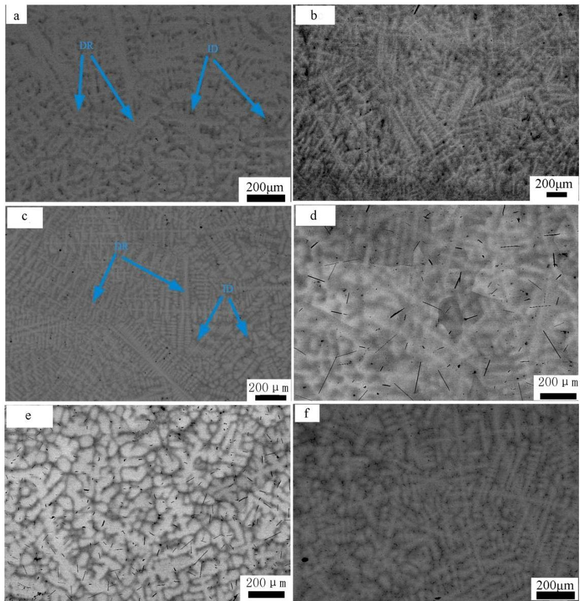
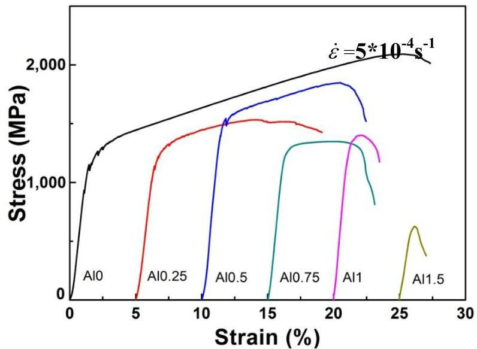
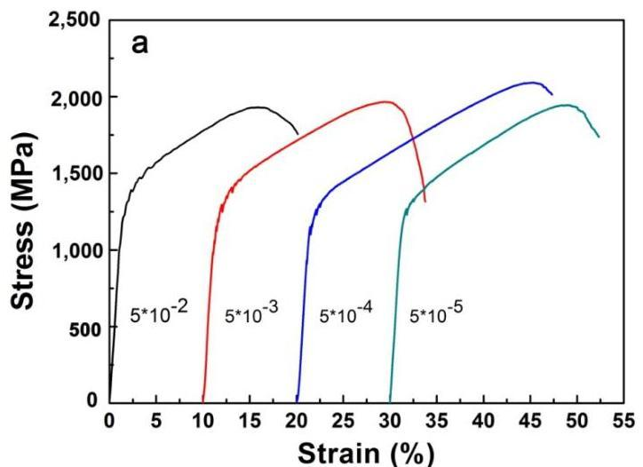
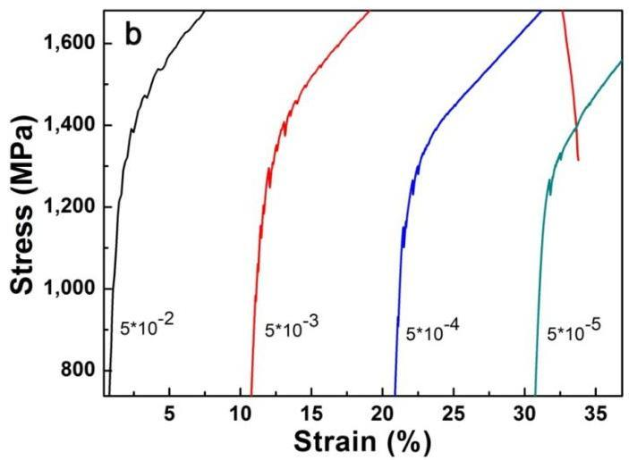
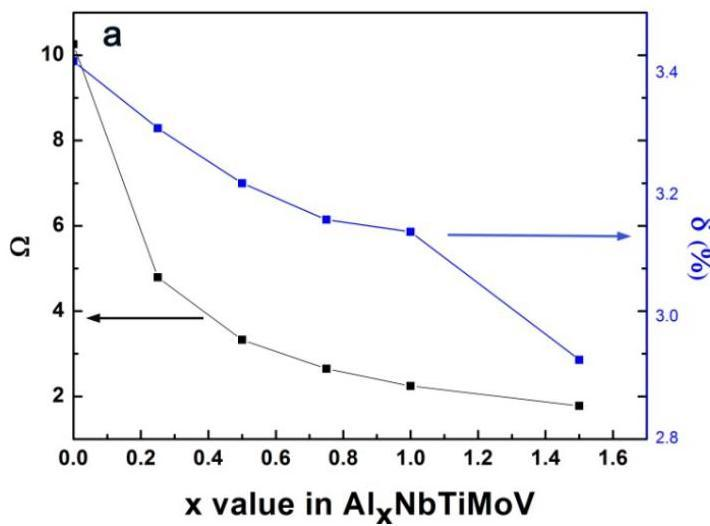
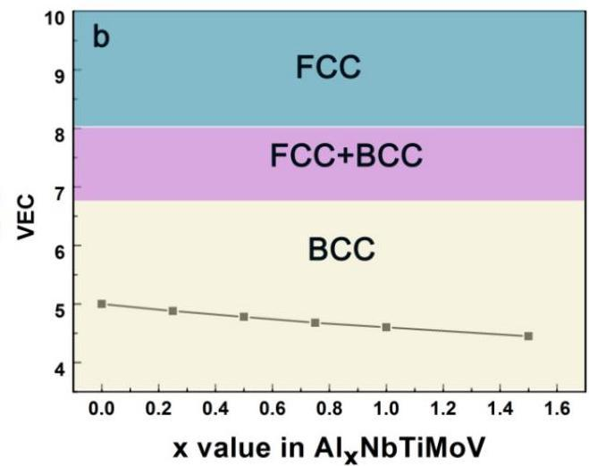
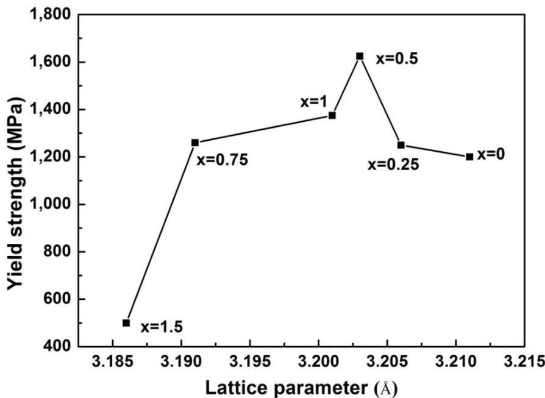

Entropy 2014, 16, 870-884; doi:10.3390/e16020870

OPEN ACCESS

entropy

ISSN 1099-4300

www.mdpi.com/journal/entropy

Article

# Microstructures and Crackling Noise of  $\mathrm{Al}_{\mathrm{x}}\mathrm{NbTiMoV}$  High Entropy Alloys

Shu Ying Chen $^{1}$, Xiao Yang $^{1}$, Karin A. Dahmen $^{2}$, Peter K. Liaw $^{3}$, and Yong Zhang $^{1,*}$

$^{1}$ State Key Laboratory for Advanced Metals and Materials, University of Science and Technology Beijing, Beijing 100083, China; E-Mails: sychen2014@gmail.com (S.Y.C.); yangxiaosky@163.com (X.Y.)
$^{2}$ Department of Physics, University of Illinois at Urbana-Champaign, 1110 West Green Street, Urbana, IL 61801, USA; E-Mail: dahmen@illinois.edu (K.A.D.)
$^{3}$ Department of Materials Science and Engineering, The University of Tennessee, Knoxville, TN 37996, USA; E-Mail: pliaw@utk.edu
* Author to whom correspondence should be addressed; E-Mail: drzhangy@ustb.edu.cn; Tel.: +86-10-62333073; Fax: +86-10-62333447.

Received: 28 October 2013; in revised form: 5 February 2014 / Accepted: 6 February 2014 / Published: 13 February 2014

Abstract: A series of high entropy alloys (HEAs),  $\mathrm{Al_xNbTiMoV}$ , was produced by a vacuum arc-melting method. Their microstructures and compressive mechanical behavior at room temperature were investigated. It has been found that a single solid-solution phase with a body-centered cubic (BCC) crystal structure forms in these alloys. Among these alloys,  $\mathrm{Al_{0.5}NbTiMoV}$  reaches the highest yield strength (1,625 MPa), which should be attributed to the considerable solid-solution strengthening behavior. Furthermore, serration and crackling noises near the yielding point was observed in the NbTiMoV alloy, which represents the first such reported phenomenon at room temperature in HEAs.

Keywords: high entropy alloy; disordered solid solution; jerky flow; serration phenomena; crackling noise

Entropy 2014, 16
871

# 1. Introduction

Traditional metallic alloys typically include one or two principal elements and have been studied for many years. It is well known that the addition of small amounts of other elements to these systems may improve their mechanical properties, but if large amounts of other elements are added, this may result in complicated intermetallic compounds and lead to brittleness, and thus, can deteriorate their properties.

In recent years, a new alloy design concept that breaks the traditional principles of alloy design has been studied. High entropy alloys (HEAs), which were proposed by Yeh et al [1,2], have attracted considerable attention around the World. HEAs contain five or more principal elements in equal or near-equal atomic ratios, in which all the atomic concentrations are between 5% and 35%, and none of them should be over 50%. Different from the traditional alloys that form complex phases, HEAs may form simple solid-solution structures like the face-centered cubic (FCC) and body-centered cubic (BCC) ones. HEAs demonstrate superior potential for engineering applications due to their high strength, hardness, wear resistance, high-temperature softening resistance and oxidation resistance [3,4].

The most commonly-used transition elements include Cu, Al, Ni, Fe, Cr, Ti, Co, et al. HEAs with improved mechanical and functional properties were investigated during the past several years [5–10]. Some new HEAs were fabricated, for example, single-crystal, micro- and nano-wire scale HEAs, and their properties were investigated [11,12]. Recently, W₂₅Nb₂₅Mo₂₅Ta₂₅ and W₂₀Nb₂₀Mo₂₀Ta₂₀V₂₀ [13,14] refractory HEAs which possess high yield strength and high stability at elevated temperatures were explored to meet the demands of aerospace applications.

In this study, a new kind of refractory HEA, including the high-melting temperatures elements Nb, Mo, and V, and the low-density elements Al and Ti, were prepared by arc melting and their microstructures and room-temperature mechanical properties were investigated. The influence of Al content on the phase formation and yield strength in these alloys was discussed. It is especially interesting to note that the Al₀.₂₅NbTiMoV, Al₀.₅NbTiMoV, and NbTiMoV HEAs show jerky flows and crackling noises at room temperature around the yield point, which has seldom been observed among HEAs studied so far.

# 2. Experimental Procedures

The chemical compositions of the prepared AlₓNbTiMoV alloys (the x value in molar ratios, x = 0, 0.25, 0.5, 0.75, 1, and 1.5, respectively) are shown in Table 1. These alloys are designed as Al₀, Al₀.₂₅, Al₀.₅, Al₀.₇₅, Al₁, and Al₁.₅. All alloy ingots were fabricated by non-consumable arc-melting the mixture of high-purity metals with purities better than 99.5 weight percent (wt.%) under an argon atmosphere with high-purity molten Ti as a trap for residual oxygen. In order to decrease the aluminum losses, the other elements, i.e., Nb, Ti, Mo, and V, were re-melted four times first, then Al is added to the pre-melted ingots, and all the constituents were re-melted four times to ensure the chemical homogeneity of the alloys. All the liquid states were held for 5 minutes during each melting event. The prepared alloy buttons with about 11 mm in thickness and 30 mm in diameter were then cut into various shapes to study their microstructures and compressive properties.

The microstructures and properties of the alloys were investigated in the as-cast state. The crystal structure was identified with X-ray diffraction (XRD) using a PHILIPS APD-10 diffractometer with Cu Kα radiation. The microstructural investigation was performed with a Zeiss SUPRA 55 scanning

Entropy 2014, 16
872

electron microscope (SEM) equipped with the energy-dispersive spectrometry (EDS) and backscatter electron (BSE) detector. Cylindrical specimens for compressive tests were 3.0 mm in diameter and 6 mm in height, and were tested with an MTS 809 materials testing machine at room temperature under strain rates of 5×10⁻⁵, 5 × 10⁻⁴, 5 × 10⁻³, and 5 × 10⁻² s⁻¹.

Table 1. Chemical compositions (in at%) of as-cast AlₓNbTiMoV (x = 0.25, 0.5, 0.75, 1, and 1.5) alloys (DR is short for dendrite, and ID for interdendrite).

|  Alloy | regions | Al | Ti | V | Nb | Mo  |
| --- | --- | --- | --- | --- | --- | --- |
|  Al₀.₂₅NbTiMoV | DR (white) | 5.4 | 22.0 | 22.1 | 25.5 | 25.0  |
|   |  ID (grey) | 6.5 | 24.6 | 24.9 | 23.6 | 20.4  |
|  Al₀.₅NbTiMoV | DR (white) | 9.8 | 19.9 | 20.4 | 24.3 | 25.6  |
|   |  ID (grey) | 14.6 | 25.3 | 24.1 | 21.0 | 15.0  |
|   |  ID (black) | 10.8 | 35.7 | 20.9 | 18.9 | 13.7  |
|  Al₀.₇₅NbTiMoV | DR (white) | 14.2 | 20.7 | 20.5 | 22.5 | 22.2  |
|   |  ID (grey) | 15.0 | 22.3 | 21.4 | 21.6 | 19.7  |
|  AlNbTiMoV | DR (white) | 17.6 | 16.9 | 19.0 | 21.9 | 24.6  |
|   |  ID (grey) | 23.7 | 21.5 | 20.7 | 20.0 | 14.1  |
|  Al₁.₅NbTiMoV | DR (white) | 27.7 | 16.0 | 17.8 | 18.2 | 20.4  |
|   |  ID (grey) | 32.8 | 19.2 | 17.0 | 18.0 | 13.0  |

## 3. Results

### 3.1. Crystal Structure

The X-ray diffraction patterns of the as-cast samples for the AlₓNbTiMoV alloy series are shown in Figure 1a. All major diffraction peaks are identified as belonging to a typical body-centered-cubic (BCC) solid-solution phase, which indicates that adding Al to this kind of HEAs has little effect on the phase formation. When the ratio of Al increases to 1.5, several minor peaks consistent with ordered phases appear in the XRD pattern of the Al₁.₅NbTiMoV alloy. This trend may be due to the fact that the elemental Al tends to interact with other alloying elements and when the addition of Al surpasses the solid-solubility limit in the alloy, it is more likely to precipitate in ordered phases. Nevertheless, the peak intensity of the ordered phase is much less than that of the BCC solid solution phase, indicating that the main phase in alloys is still the disordered solid-solution phase, which is due to the high-entropy effects that impede the formation of a substantial ordered-phase.

Furthermore, the magnified scans for the Braggs peaks of (110) with 2θ between 39 ~ 40° are illustrated in Figure 1b. As shown in this image, the position of the (110) peak changes slightly corresponding to the different Al addition levels, which could be obtained in terms of the changing lattice constant trend in Figure 2, as shown below. According to the Bragg equation:

$$
2d \sin \theta = n\lambda \tag{1}
$$

where $d$ is the distance between neighboring planes, $\theta$ is the diffraction angle, and $\lambda$ is the wavelength of the copper target. We could infer that the $d$ has a negative correlation with $2\theta$. Moreover, the $d$ value for the BCC structure could be calculated as follows:

Entropy 2014, 16

$$
d = \frac {a}{\sqrt {h ^ {2} + k ^ {2} + l ^ {2}}} \tag {2}
$$

where $a$ is the lattice constant, $h$, $k$, and $l$ are the crystal plane parameters. So it is easy to observe that the lattice-constant variation can reflect the (110) peak changing trend. When $x &lt; 0.75$, the lattice constant keeps dropping. Hence, the (110) peak shifts towards a higher $2\theta$ value. However, when $x = 1.0$ it increases to $3.201\,\text{\AA}$, which means that the peak shifts towards a lower $2\theta$ value. Finally it decreases again as the (110) peak shifts towards a highest value at $x = 1.5$. The precise values of the lattice constant, melting point, and radius of each element are listed in Table 2.

Figure 1. (a) XRD patterns of the as-cast $\mathrm{Al_xNbTiMoV}$ ($x = 0, 0.25, 0.5, 0.75, 1$, and 1.5) alloys. (b) The detailed scans for the peaks of (110) of BCC solid solutions.

Entropy 2014, 16
874

Figure 2. The lattice parameters, and yield strength as a function of Al content in  $\mathrm{Al_xNbTiMoV}$  alloys.

Table 2. The crystal structures, lattice parameters, atomic sizes and calculated melting temperatures for  $\mathrm{Al}_{\mathrm{x}}\mathrm{NbTiMoV}$  alloys.

|  Alloy | Al0 | Al0.25 | Al0.5 | Al0.75 | Al1 | Al1.5 | Nb | Ti | Mo | V | Al  |
| --- | --- | --- | --- | --- | --- | --- | --- | --- | --- | --- | --- |
|  Crystal structure | BCC | BCC | BCC | BCC | BCC | BCC+ordered phase | BCC | HCP* | BCC | BCC | BCC  |
|  Lattice parameter (Å) | 3.211 | 3.206 | 3.203 | 3.191 | 3.201 | 3.186 | - | - | - | - | -  |
|  Atomic radius (Å) | - | - | - | - | - | - | 1.47 | 1.46 | 1.40 | 1.35 | 1.43  |
|  T**m(K) | 2,448 | 2,359 | 2,280 | 2,209 | 2,145 | 2,035 | 2,750 | 1,946 | 2,895 | 2,202 | 933.5  |

*: the Hexagonal close packing; **: see Equation (6).

## 3.2. Microstructure

The representative SEM backscatter images of the  $\mathrm{Al_xNbTiMoV}$  alloys are shown in Figure 3, and the energy dispersive X-ray spectrometry (EDS) phase composition results are given in Table 1. These SEM pictures demonstrate typical dendrite structures with two apparent contrasts, which indicate the dendrite and interdendrite structure, as shown by the arrows, and they are both BCC solid-solution phases corresponding to XRD patterns. It could be observed from the EDS data that the dendrites are enriched in Mo and Nb, while the interdendrites are enriched in Al and Ti. This trend can be explained by the fact that Mo and Nb possess much higher melting points, and they are more likely to solidify first to form dendrites. On the other hand, Al and Ti possess relatively lower melting points, and they have the most negative enthalpy, thus, they tend to solidify later and combine together as interdendrites during the cooling process. All the melting points of these elements are listed in Table 2. With increasing the addition of Al, the main structure does not change much and it still retains a dendritic

Entropy 2014, 16

morphology. As for  $\mathrm{Al}_{0.5}$  in Figure 3c, there are clearly two kinds of dendrites in terms of their size, which is ascribed to the different cooling-speed distribution in the copper mold.

Figure 3. SEM backscattering-electron images of the microstructures in the as-cast  $\mathrm{Al_xNbTiMoV}$  ( $x = 0$  (a), 0.25 (b), 0.5 (c), 0.75 (d), 1 (e), and 1.5 (f)) alloys.

# 3.3. Compressive Properties

Figure 4 illustrates the compressive engineering stress-strain curve for  $\mathrm{Al_xNbTiMoV}$  alloys under a strain rate of  $5\times 10^{-4}\mathrm{s}^{-1}$  at room temperature. The corresponding yield strength and plastic strain are listed in Table 3. Most of the investigated alloys show high yield strength, and the fracture stresses are over  $2,000\mathrm{MPa}$ . Moreover, it can be seen that with the addition of Al, the yield strength fluctuates without regularity, and the ductility shows a downward trend. When  $\mathbf{x} = 0$ , the plastic strain reaches the maximum (about  $25\%$ ). For  $\mathbf{x}\leq 0.5$ , the yield strength of alloys keeps increasing with increasing Al content, and at  $\mathbf{x} = 0.5$ , this strength reaches its maximum (1,625 MPa). Then the further addition of Al makes the yield strength drop down to  $1,260\mathrm{MPa}$  when  $\mathbf{x} = 0.75$ , while it increase again at  $\mathbf{x} = 1$ , and it falls to the minimum (500 MPa) at  $\mathbf{x} = 1.5$ . By comparing Tables 3 and 4 it can be seen that this

Entropy 2014, 16
876

variation in yield strength tendency is totally different from that of the atomic-size differences, so it cannot be explained in terms of the traditional concept that a large lattice distortion should could cause a high yield strength. Besides, the relationships between the lattice constant, yield strength, and the x content of each alloy are shown in Figure 2. It is interesting to note that there are potential correlations between the lattice-constant and yield strength. According to Equation (2), the lattice constant variation could represent the value of d. Figure 2 demonstrates that d decreases with increasing Al content, which will make the dislocation more difficult to move. When the dislocation moves along the plane, which possesses the largest d, its resistance to glide and the lattice distortion is the least. Thus, it would need less energy to deform and tends to move easily. On the contrary, it would be difficult for dislocations to move if the d decreases, which could enhance the solid-solution strengthening and improve the yield strength [15]. Here, the d plays a critical role. However, the yield stress cannot keep on raising with the Al addition, as shown in Figure 2, where, for example, when x = 0.75 and 1.5, when d drops to a certain value, the yield strength would decrease rather than increase. Except for the brittle Al1.5 alloy due to the ordered structure, the yield strength trend could be explained by both the solution hardening and binding energy, which gives a maximum strength at x = 0.5. It is interesting that some serrations and crackling noises in were observed Al0, Al0.25 and Al0.5 alloys around the yield point in Figure 4. In order to investigate this kind serration behavior in detail, compression experiments were performed at room temperature on the NbTiMoV alloys under four different strain rates to study the effect of strain rate on crackling noise.

Table 3. The yield strength, fracture strain, and hardness of $\mathrm{Al_xNbTiMoV}$ alloys at room temperature.

|  alloy | Al0 | Al0.25 | Al0.5 | Al0.75 | Al1 | Al1.5  |
| --- | --- | --- | --- | --- | --- | --- |
|  σ_{y} (MPa) | 1,200 | 1,250 | 1,625 | 1,260 | 1,375 | 500  |
|  ε (%) | 25.62 | 12.91 | 11.25 | 7.5 | 2.5 | 1.3  |
|  Hardness (HV) | 440.7 | 460.1 | 486.5 | 516.6 | 536.6 | 556.4  |

Figure 4. Engineering stress vs. engineering strain curves of $\mathrm{Al_xNbTiMoV}$ alloys.

Entropy 2014, 16
877

It is notable that in Figure 5a, there are clear NbTiMoV serrations occurring around the yield point. Figure 5b is a magnification of the compressive stress-strain curve of NbTiMoV at four different strain rates, which illustrates that all strain rates show serrations. In Figure 5(b), for the strain rate of $5 \times 10^{-2} \mathrm{~s}^{-1}$, the critical serration stress is about $1,200 \mathrm{MPa}$ and disappears at $1,600 \mathrm{MPa}$, with an upward saw tooth. At a constant strain rates of $5 \times 10^{-3} \mathrm{~s}^{-1}$ and $5 \times 10^{-4} \mathrm{~s}^{-1}$, there is a decrease on the critical stress, which is about $1,100 \mathrm{MPa}$, and then it disappears at $1,500 \mathrm{MPa}$ and $1,300 \mathrm{MPa}$, respectively. As the strain rate decreases to $5 \times 10^{-5} \mathrm{~s}^{-1}$, the serration becomes very gentle and only several saw teeth exist on this curve, with the critical stress increasing to $1,300 \mathrm{MPa}$, which is related to the influence of Cottrell's locking and unlocking function on dislocation movements [16].

Figure 5. (a) Stress-strain curve of NbTiMoV alloy. (b) Local magnification around the yield points.

## 4. Discussion

### 4.1. Phase Selection

A parameter, $\Omega$, was proposed recently to describe the mutual influence between $\Delta H_{\mathrm{mix}}$ [17–19] and $\Delta S_{\mathrm{mix}}$, which provides a clearer and easier method to predict the phase formation when designing a multi-component composition. $\Omega$ is defined as:

Entropy 2014, 16

$$
\Omega = \frac {T _ {m} \Delta S _ {\text {m i x}}}{\Delta H _ {\text {m i x}}} \tag {3}
$$

where $\triangle \mathrm{H}_{\mathrm{mix}}$ is the enthalpy of mixing for the multi-component alloy system with n elements which can be determined from the following equation [20]:

$$
\Delta \mathrm {H} _ {\text {m i x}} = \sum_ {i = 1, i \neq j} ^ {n} \Omega_ {i j} c _ {i} c _ {j} \tag {4}
$$

where $\Omega_{\mathrm{ij}} (= 4\triangle \mathrm{H}^{\mathrm{mix}}_{\mathrm{AB}})$ is the regular melt-inter action parameter between ith and jth elements, and $\triangle \mathrm{H}^{\mathrm{mix}}_{\mathrm{AB}}$ is the mixing enthalpy of binary liquid alloys, which can be obtained from [21].

According the Boltzmann's hypotheses, $\Delta S_{\mathrm{mix}}$ is the mixing entropy of n-elements regular solution defined as follows:

$$
\Delta S _ {\text {m i x}} = - R \sum_ {i = 1} ^ {n} \left(c _ {i} \ln c _ {i}\right) \tag {5}
$$

where $c_{i}$ is the molar percent of ith element, $\sum_{i}^{n}c_{i} = 1$, and R is the gas constant $(= 8.314\mathrm{JK}^{-1}\mathrm{mol}^{-1})$.

For the equi-atomic ratio of an n-element alloys, the entropy of mixing would reach the maximum. Tm is the melting temperature of the n-elements alloy, which is calculated as follows:

$$
T _ {m} = \sum_ {i = 1} ^ {n} c _ {i} \left(T _ {m}\right) _ {i} \tag {6}
$$

where the $(\mathrm{T_m})_i$, is the melting point of the ith component alloy. From Equation (3), the $\Omega$ value could predict which factor possesses the dominant role. If $\Omega &gt; 1$, $\mathrm{T}\Delta S_{\mathrm{mix}}$ is the predominant part of the free energy, and it tends to form a solid-solution phase rather than compounds. The larger $\Omega$ is, the easier for the solid-solution formation.

Another important parameter affecting the phase formation is the atomic-size difference, $\delta$, which is defined as follows [22]:

$$
\delta = \sqrt {\sum_ {i = 1} ^ {n} c _ {i} \left(1 - \frac {r _ {i}}{\bar {r}}\right)} ^ {2} \tag {7}
$$

where $n$ is the number of the elements in the alloys, $c_i$ is the atomic percentage of the ith component, $\overline{r} = \sum_{i=1}^{n} c_i r_i$ is the average atomic radius, and $r_i$ is the atomic radius, which could be obtained from [23].

Because multiple elements with different atomic sizes co-exist in alloys, which will lead to the large atomic-size difference and deepen the extent of ordering of multi-component high-entropy alloys (MHAs) [24], we should take the effect of $\delta$ on the phase formation into consideration.

As previously reported, $\Omega \geq 1.1$, $\delta \leq 6.6\%$ could be used as the criteria for forming a high-entropy stabilized solid-solution phase [25]. In this work, the parameters, $\Omega$ and $\delta$, of $\mathrm{Al_xNbTiMoV}$ alloys are calculated according to Equations (3) and (7), and the corresponding results are listed in Table 4. The calculation required physicochemical and thermodynamic parameters for the constituent elements which are partly given in Table 2. With increasing Al content, the $\Omega$ value decreases from 10.256 to 1.78, which

Entropy 2014, 16
879

indicates that the effect of mixing of entropy on the solid-solution formation weaken. The δ value decreases from 3.42% to 2.93%, as plotted in Figure 6(a), which indicates that the Al addition leads to the decreased lattice distortion energy of the solid solution. Despite these large changes of Ω and δ, their values meet the requirement of forming single solid solutions (Ω ≥ 1.1, δ ≤ 6.6%).

Table 4. The ΔSₘᵢₓ, ΔHₘᵢₓ, Tₘ, Ω, VEC, and δ of AlₓNbTiMoV alloys.

|  Alloys | ΔSₘᵢₓ (J/K·mol) | ΔHₘᵢₓ (kJ/mol) | Tₘ (K) | Ω | VEC | δ (%)  |
| --- | --- | --- | --- | --- | --- | --- |
|  Al₁.₅NbTiMoV | 13.25 | −15.14 | 2035.1 | 1.78 | 4.45 | 2.93  |
|  AlNbTiMoV | 13.38 | −12.8 | 2145.3 | 2.242 | 4.6 | 3.14  |
|  Al₀.₇₅NbTiMoV | 13.33 | −11.12 | 2209 | 2.65 | 4.68 | 3.16  |
|  Al₀.₅NbTiMoV | 13.14 | −8.99 | 2279.9 | 3.33 | 4.78 | 3.22  |
|  Al₀.₂₅NbTiMoV | 12.71 | −6.256 | 2359 | 4.79 | 4.88 | 3.31  |
|  NbTiMoV | 11.52 | −2.75 | 2448.25 | 10.256 | 5 | 3.42  |

Figure 6. (a) The curves of Ω and δ as a function of Al content for AlₓNbTiMoV (x = 0, 0.25, 0.5, 0.75, 1, and 1.5) alloys. (b) The relationship between the VEC and Al content of alloys.

Furthermore, this BCC structure corresponds to the prediction of the valence electron concentration (VEC). In AlₓNbTiMoV alloys, the elements Nb, Mo, and V exhibit a BCC crystal structure (see Table 2), and the Al element always acts as a BCC stabilizer. Thus, all these factors are in favor of forming a BCC structure in the present alloys. Guo [26] mentioned that VEC can be used to quantitatively predict the phase stability for BCC or FCC phases in HEAs: when VEC ≥ 8.0, a single FCC phase will be stable in alloys; at 6.87 ≤ VEC ≤ 8.0, a mixed BCC and FCC will co-exist, and a sole BCC phase exists when VEC ≤ 6.87. Here, the VEC value can be defined as follows:

$$
VEC = \sum_{i=1}^{n} c_i (VEC)_i \tag{8}
$$

where (VEC)ᵢ is the VEC of the ith element. The VEC values for constituent elements are from [26]. The VEC in the studied alloys are shown in Figure 6b, with increasing the Al addition, the VEC value

Entropy 2014, 16
880

decreases from 5 to 4.45, which could meet the BCC-forming requirement. Therefore, the BCC phase is stable in this alloy system.

## 4.2. Strengthening Mechanism

In $\mathrm{Al_xNbTiMoV}$ alloys, each atom can be regarded as a solute atom, which can occupy the a crystallattice site randomly in the BCC structure. A dislocation has a stress field associated with it. Solute atoms, especially when their sizes are too large or too small in relation to the size of the host atom, are also centers of elastic strains. A vacancy (i.e., a vacant lattice site) can also be considered a point source of dilation. Consequently, the stress fields from these sources (dislocations and point defects) can interact and mutually exert forces, which could cause huge resistance to the dislocations movement, and hence enhance the solid-solution strengthening behavior. Furthermore, the relationship between the strengthening, $\Delta \sigma$, and the concentration, c of the solute atoms is expressed as follows [27–29]:

$$
\Delta \sigma \propto c ^ {n} \tag {9}
$$

where, $n \approx 0.5$ [27]. The concentration, $c$, of HEAs is considerably higher than that of traditional alloys due to the substitutional solute atoms [28]. So it is reasonable that a greater solid-solution strengthening effect induces a higher yield strength in HEAs (see Table 3). It can be seen that in Figure 7, with the increase of the $d$ pameter, the yield strength increases, and when $x = 0.5$, the lattice parameter is $3.203\ \text{\AA}$ (in Table 2), and the strength reaches its maximum.

Figure 7. The relationship between lattice parameters and yield strengths of $\mathrm{Al_xNbTiMoV}$ alloys.

As for $x = 0.75$ and 1.5 in Figure 7, there is a limit for $d$ to control the dislocation movement. If $d$ is smaller than what it needs to be and there are few dislocations being motivated or with the ability to move, it will lead to dislocation pile-up groups, and then stress concentration would occur. Thus, even a small load applied on the alloy can generate a huge local strain. This kind of strain energy around the

Entropy 2014, 16
881

dislocation is considerably large. When alloys cannot deform easily to release this strain energy because of the resistance mentioned above, they would not endure the small stress before fracture but have to crack to relieve this instability. Therefore, the lattice constant has an optimal value for a high yield strength.

## 4.3. Serration Phenomena

The typical quantitative model for serrated yielding was described by Cottrell, in which the average migration speed of dislocations, $v_{f}$ (m/s), between two obstacles can be defined as follows [16]:

$$
v _ {f} = \frac {l}{t _ {f}} = \left[ 1 + \frac {t _ {w}}{t _ {f}} \right] \left(\frac {\dot {\varepsilon}}{b \rho_ {m}}\right) \tag {10}
$$

where $l$ (m) is the average length between the obstacles; $t_f$ is the time needed for dislocations to migrate between two obstacles; $t_w$ is the average waiting time for dislocations ahead of obstacles; $\rho_m$ is the density of mobile dislocations; $b$ is the Burgers vector, and $\dot{\varepsilon}$ is the strain rate.

The serrated flow is characterized by a critical strain, $\varepsilon_{\mathrm{c}}$, in substitutional alloys, which is the minimum strain needed for the onset of the serrations in the stress-strain curve. It could be expressed as follows [30]:

$$
\varepsilon_ {c} ^ {m + \beta} = K \dot {\varepsilon} \exp \left(E _ {m} / k T\right) \tag {11}
$$

where $\mathcal{E}_c^{m + \beta}$ is the critical strain, typical $(m + \beta)$ values are between 2 and 3 for substitutional alloys [30], $E_{m}$ is the vacancy-migration energy, $k$ is the constant, and $T$ is the absolute temperature. The strain rate could reflect the critical strain magnitude and influence the appearance and disappearance of serrated flows. The strain rate determines the time that the dislocations or grain boundaries take to overcome these obstacles and have a dramatic effect on the conditions of the Portevin-Le Chatelier (PLC) effect [31]. Within a waiting time of $t_w$, solute atoms will move towards dislocations, with the stress field created by dislocations as the driving force. If $t_w$ is long enough or the drift velocity of the solutes is fast enough, the solute atoms would induce a huge solute atmosphere around the dislocation, called a Cottrell atmosphere, which has the effect of locking-in the dislocation, making it necessary to apply more force to free the dislocation from the atmosphere. On the other hand, as the applied stress becomes large enough, these dislocations will eventually avoid the lock of the solute atmosphere and move again, bringing tensile forces to these solute, and leading to the Cottrell atmosphere moving towards dislocations. If the migration speed of the Cottrell atmosphere produced in the dislocation field is far larger than the dislocations' moving rate, the solutes will lag behind the moving dislocation and induce large drag forces on it, but once the dislocations are motivated to move, they could avoid the Cottrell atmosphere and move towards the next obstacle under a small stress, so then the PLC effect will appear. However, if the strain capacity reaches a certain value or the strain rate is too low, there seems to be a lower limit of strain rate to produce the serration. In the present study, as discussed in Section 3.3, the amplitude of serration was influenced by the compressive strain rate. In this strain rate scope from $\dot{\varepsilon} = 5\times 10^{-5}\mathrm{s}^{-1}$ to $\dot{\varepsilon} = 5\times 10^{-2}\mathrm{s}^{-1}$, the amplitude of serration reaches its maximum with the $\dot{\varepsilon} = 5\times 10^{-3}\mathrm{s}^{-1}$. Then with the strain rate increases or decreases, like $\dot{\varepsilon} = 5\times 10^{-5}\mathrm{s}^{-1}$ or $\dot{\varepsilon} = 5\times 10^{-2}\mathrm{s}^{-1}$, the serration of NbTiMoV alloy tends to be difficult to observe or even disappears. It should be noted

Entropy 2014, 16
882

that the concept of the Cottrell atmosphere was first proposed for steels [32], and has not been applied to HEAs yet. More investigations and studies are needed to confirm this possible mechanism.

## 5. Conclusions

In conclusion, a refractory HEAs system, $\mathrm{Al_xNbTiMoV}$, is designed and fabricated by arc melting. It is found that single solid-solution phases with simple BCC structures and typical dendrite form can be observed in these alloys. These alloys have high compression yield strengths, attributed to solid-solution strengthening. In addition, a serration behavior and crackling noise were found in the stress-strain curves of the NbTiMoV alloys at room temperature, which is reported for the first time in HEAs. Further studies need to be done to investigate this kind of serration behavior and crackling noises in these refractory HEAs.

## Conflicts of Interest

State any potential conflicts of interest here or "The authors declare no conflict of interest".

## Acknowledgments

The authors very much appreciate the financial support from the China NSFC51210105006, the US National Science Foundation (DMR-0909037, CMMI-0900271, and CMMI-1100080), the Department of Energy (DOE), Office of Nuclear Energys Nuclear Energy University Program (NEUP) 00119262, the DOE, Office of Fossil Energy, National Energy Technology Laboratory (DE-FE-0008855 and DE-FE-0011194), and the Army Research Office (W911NF-13-1-0438) with C. Huber, C. V. Cooper, A. Ardell, E. Taleff, V. Cedro, R. O. Jensen, L. Tan, S. Lesica, S. Markovich, and S. N. Mathaudhu as contract monitors.

## References

1. Yeh, J.W.; Chen, S.K.; Lin, S.J.; Gan, J.Y.; Chin, T.S.; Shun, T.T.; Tsau, C.H.; Chang, S.Y. Nanostructured high-entropy alloys with multiple principal elements: Novel alloy design concepts and outcomes. Adv. Eng. Mater. 2004, 6, 299–303.
2. Yeh, J.W. Recent progress in high-entropy alloys. Ann. Chim. Sci. Mat. 2006, 31, 633–648.
3. Wu, W.H.; Yang, C.C.; Yeh, J.W. Industrial development of high-entropy alloys. Ann. Chim. Sci. Mat. 2006, 31, 737–747.
4. Wang, X.F.; Zhang, Y.; Qiao, Y.; Chen, G.L. Novel microstructure and properties of multicomponent CoCrCuFeNiTi $_x$ alloys. Intermetallics 2007, 15, 357–362.
5. Zhang, Y; Zuo, T.T.; Tang, Z.; Gao, M.C.; Dahmen, K.A.; Liaw, P.K.; Lu, Z.P. Microstructures and properties of high-entropy alloys. Prog. Mater Sci. 2014, 61, 1–93.
6. Laktionova, M.A.; Tabchnikova, E.D.; Tang, Z.; Liaw, P.K. Mechanical properties of the high-entropy alloy $\mathrm{Ag_{0.5}CoCrCuFeNi}$ at temperatures of 4.2–300 K. Low Temp. Phys. 2013, 39, 630–632.
7. Hemphill, M.A.; Yuan, T.; Wang, G.Y.; Yeh, J.W.; Tsai, C.W.; Chuang, A.; Liaw, P.K. Fatigue behavior of Al0.5CoCrCuFeNi high entropy alloys. Acta Mater. 2012, 60, 5723–5734.

Entropy 2014, 16
883

8. Zhang, Y.; Yang, X.; Liaw, P.K. Alloy design and properties optimization of high-entropy alloys. JOM 2012, 64, 830–838.
9. Tang, Z.; Gao, M.C.; Diao, H.Y.; Yang, T.F.; Liu, J.P.; Zuo, T.T.; Zhang, Y.; Lu, Z.P.; Cheng, Y.Q.; Zhang, Y.W.; Dahmen, K.A.; Liaw, P.K.; Egami, T. Aluminum alloying effects on lattice types, microstructures, and mechanical behavior of high-entropy alloys systems. JOM 2013, 65, 1848–1858.
10. Zhang, Y.; Zuo, T.T.; Cheng, Y.Q.; Liaw, P.K. High-entropy alloys with high saturation magnetization, electrical resistivity, and malleability. Sci. Rep. 2013, 3, DOI: 10.1038/srep01455.
11. Ma, S.G.; Zhang, S.F.; Gao, M.C.; Liaw, P.K.; Zhang, Y. A Successful synthesis of the CoCrFeNiAl₀.₃ single-crystal, high-entropy alloy by bridgman solidification. JOM 2013, 65, 1751–1758.
12. Zhang, Y.; Zuo, T.T.; Liao, W.B.; Liaw, P.K. Processing and properties of high-entropy alloys and micro- and nano-wires. Nanotechnology 2011, 30, 49–60.
13. Senkov, O.N.; Wilks, G.B.; Scott, J.M.; Miracle, D.B. Mechanical properties of Nb₂₅Mo₂₅Ta₂₅W₂₅ and V₂₀Nb₂₀Mo₂₀Ta₂₀W₂₀ refractory high entropy alloys. Intermetallics 2011, 19, 698–706.
14. Senkov, O.N.; Wilks, G.B.; Miracle, D.B.; Chuang, C.P.; Liaw, P.K. Refractory high-entropy alloys. Intermetallic 2010, 18, 1758–1756.
15. Lu, G. The Peierls—Nabarro Model of Dislocations: A Venerable Theory and its Current Development. In Handbook of Materials Modeling; Yip, S., Ed.; Springer: The Netherlands; , 2005; pp.793–811.
16. Cottrell, A.H. A note on the Portevin-Le Chatelier effect. Phil. Mag. 1953, 44, 829.
17. Ranganathan, S. Alloyed pleasures: Multimetallic cocktails. Curr. Sci. 2003, 85, 1404–1406.
18. Zhou, Y.J.; Zhang, Y.; Wang, Y.L. Chen, G.L. Solid solution alloys of AlCoCrFeNiTiₓ with excellent room-temperature mechanical properties. Appl. Phys. Lett. 2007, 90, 181904.
19. Pichon, A. Alloys made of five or six principal components show excellent mechanical properties at room temperature. Nature China. 2007, 83, doi:10.1038/nchina.
20. Takeuchi, A.; Inoue, A. Quantitative evaluation of critical cooling rate for metallic glasses. Mater. Sci. Eng. A 2001, 304, 446–451.
21. Takeuchi, A.; Inoue, A. Classification of bulk metallic glasses by atomic size difference, heat of mixing and period of constituent elements and its application to characterization of the main alloying element. Mater. Trans. JIM 2005, 46, 2817–2829.
22. Fang, S.S.; Xiao, X.S.; Xia, L.; Li, W.H.; Dong, Y.D. Relationship between the widths of supercooled liquid region and bond parameters of Mg-based bulk metallic glasses. J. Non-Cryst. Solids 2003, 321, 120–125.
23. Kittel, C. Introduction to Solid State Physics, 6th ed.; John Wiley&amp;Sons, Inc.: New York, NY, USA, 1980; p. 26.
24. Zhang, Y.; Zhou, Y.J.; Lin, J.P.; Chen, G.L.; Liaw, P.K. Solid-solution phase formation rules for multi-component alloys. Adv. Eng. Mater. 2008, 10, 534–538.
25. Yang, X.; Zhang, Y. Prediction of high-entropy stabilized solid-solution in multi-component alloys. Mater. Chem. Phy. 2012, 132, 233–238.
26. Guo, S.; Ng, C.; Lu, J.; Liu, C.T. Effect of valence electron concentration on stability of fcc or bcc phase in high entropy alloys. J. Appl. Phys. 2011, 109, 103505.

Entropy 2014, 16
884

27. Rosler, J.; Harders, H.; Baker, M. Mechanical Behaviour of Engineering Materials: Metals, Ceramics, Polymers; Springer: Berlin/Heidelberg, Germany, 2007; p. 205.
28. Qiao, J.W.; Ma, S.G.; Huang, E.W.; Chuang, C.P.; Liaw, P.K.; Zhang, Y. Microstructural characteristics and mechanical behaviors of AlCoCrFeNi high-entropy alloys at ambient and cryogenic temperatures. Mater. Sci. Forum. 2011, 688, 419–425.
29. Yang, X.; Zhang, Y.; Liaw, P.K. Microstructure and compressive properties of NbTiVTaAlx high-entropy alloys. Procedia Engin. 2012, 36, 292–298.
30. Rodriguez, P. Serrated plastic flow. Bull. Mater. Sci. 1984, 6, 653–663.
31. Ananthakrishna, G. Current theoretical approaches to collective behavior of dislocations. Phy. Rep. 2007, 440, 113–259.
32. Cottrell, A.H.; Bilby, A.H. Dislocation theory of yielding and strain ageing of iron. Proc. Phys. Soci. Section A. 1949, 62, 49.

© 2014 by the authors; licensee MDPI, Basel, Switzerland. This article is an open access article distributed under the terms and conditions of the Creative Commons Attribution license (http://creativecommons.org/licenses/by/3.0/).