#

entropy

MDPI

Article

# MoNbTaV Medium-Entropy Alloy

Hongwei Yao  $^{1}$ , Jun-Wei Qiao  $^{1,*}$ , Michael C. Gao  $^{2,3,*}$ , Jeffrey A. Hawk  $^{2}$ , Sheng-Guo Ma  $^{4}$  and Hefeng Zhou

$^{1}$  Laboratory of Applied Physics and Mechanics of Advanced Materials, College of Materials Science and Engineering, Taiyuan University of Technology, Taiyuan 030024, China; yaohongwei581@gmail.com (H.Y.); zhouhefeng@tyut.edu.cn (H.Z.)
$^{2}$  National Energy Technology Laboratory, Albany, OR 97321, USA; jeffrey.hawk@netl.doe.gov
3 AECOM, P.O. Box 1959, Albany, OR 97321, USA
4 Institute of Applied Mechanics and Biomedical Engineering, Taiyuan University of Technology, Taiyuan 030024, China; mashguo.cumt@163.com
* Correspondence: qiaojunwei@gmail.com (J.-W.Q.); michael.gao@netl.doe.gov (M.C.G.); Tel.: +1-541-967-5869 (M.C.G.)

Academic Editor: An-Chou Yeh

Received: 17 April 2016; Accepted: 13 May 2016; Published: 19 May 2016

Abstract: Guided by CALPHAD (Calculation of Phase Diagrams) modeling, the refractory medium-entropy alloy MoNbTaV was synthesized by vacuum arc melting under a high-purity argon atmosphere. A body-centered cubic solid solution phase was experimentally confirmed in the as-cast ingot using X-ray diffraction and scanning electron microscopy. The measured lattice parameter of the alloy  $(3.208\AA)$  obeys the rule of mixtures (ROM), but the Vickers microhardness  $(4.95\mathrm{GPa})$  and the yield strength  $(1.5\mathrm{GPa})$  are about 4.5 and 4.6 times those estimated from the ROM, respectively. Using a simple model on solid solution strengthening predicts a yield strength of approximately  $1.5\mathrm{GPa}$ . Thermodynamic analysis shows that the total entropy of the alloy is more than three times the configurational entropy at room temperature, and the entropy of mixing exhibits a small negative departure from ideal mixing.

Keywords: medium-entropy alloy; high-entropy alloy; enthalpy; entropy; lattice parameter; rule of mixture; mechanical properties; hardness; yield strength; solid solution strengthening

# 1. Introduction

Materials development is closely related to the civilization of human society. Most transportation and energy applications call for structural materials that have high strength, good fracture toughness, and great thermal stability. To date, four major commercial alloy families have been commonly used to meet the operational requirements of these applications. They are iron alloys, aluminum alloys, titanium alloys, and nickel-based superalloys, and they are based on one major element with additional alloying elements used to achieve the optimal balanced properties [1]. One common weakness among these traditional single-principal-element alloys is that their properties are limited by the inherent characteristics of the principal element. For instance, Ni-based superalloys have been adopted for load-bearing applications at high temperatures (aircraft, power-generation turbines, rocket engines, etc.), whereas their operational temperatures have reached their theoretical limits, no more than  $1200^{\circ}\mathrm{C}$ , which is approximately  $90\%$  of the melting point of the material [2]. Therefore, other advanced structural materials need to be discovered with superior temperature capability to Ni-based alloys for ultra-high temperature applications.

More recently, the concept of high-entropy alloys (HEAs), also known as multi-principal element alloys (MPEAs), was proposed with equi-atomic or near equi-atomic compositions to increase the configurational entropy so as to stabilize the solid solution structures [3,4]. In contrast to traditional

Entropy 2016, 18, 189; doi:10.3390/e18050189

www.mdpi.com/journal/entropy

alloy design that focuses on alloy compositions at the corners of phase diagrams, the focus of HEAs has been moved to the central region of the phase diagrams. Thus, HEA design has opened up a door to explore new alloy families with unique compositions [3,4,5]. The HEAs reported in the literature generally form with face-centered cubic (FCC) [6], body-centered cubic (BCC) [7], or hexagonal close-packed (HCP) structures [8,9,10]. Reference [11] provides a list of single-phase HEAs in these structures that have been experimentally verified or computationally predicted. Moreover, a number of these compositions have demonstrated favorable combinations of high strength, high ductility, oxidation resistance, and thermal stability [12,13,14], especially at high temperatures [15,16]. Since 2010, a series of HEAs with refractory elements were investigated for high temperature applications, including alloys based on the following element combinations: MoNbTaW, HfNbTaTiZr, MoNbTiZrV_{x}, and NbTaTiVAl_{x} [7,17,18,19,20,21]. The MoNbTaW alloy exhibits a high-yield strength of 405 MPa at 1600 °C. Unfortunately, other properties are still problematical, including higher than desired density and lower than expected room-temperature ductility. These issues still need to be resolved [7,22]. In fact, it is well known that most refractory metals lack good ductility at low temperatures [23,24].

The present study focuses on a medium-entropy alloy MoNbTaV with the objective of achieving a single BCC structure with lower density and higher ductility than MoNbTaW. Vanadium has a significantly lower density (6.11 g/cm^{3}) than tungsten (19.25 g/cm^{3}), while the former has a much higher Poisson's ratio (0.365) than the latter (0.28) [7,25]. Poisson's ratio is commonly used to gauge the ductility of metals and alloys, and alloys with higher Poisson's ratio often exhibit higher intrinsic ductility [23,24]. The MoNbTaV alloy is fabricated using arc-melting technique, and its microstructure and mechanical properties at room temperature (RT) were investigated. The Calculation of Phase Diagrams (CALPHAD) method is used to predict phase formation during solidification, and solid solution strengthening is analyzed using a simple model based on traditional elastic theory.

## 2. Computational Methodologies and Experimental Procedures

The TCNI8 thermodynamic database supplied by ThermoCalc^{TM} (version 2015b, Thermo-Calc Software, Stockholm, Sweden) [26] was used for all CALPHAD calculations, and it covers the complete binaries pertaining to the nine refractory metals of interest (i.e. Hf, Cr, Mo, Nb, Ta, Ti, V, W, and Zr). Previous CALPHAD modeling using this database has demonstrated good agreement with experimental observations for various refractory BCC HEAs [20,21,27,28,29,30]. Recent publications [29,30,31,32,33] offer guidance on CALPHAD modeling of HEAs.

An alloy ingot with nominal composition of MoNbTaV (at.%) was synthesized by arc melting the corresponding metals (elemental purity of metal constituents better than 99.9 wt.%) in a Ti-gettered, high-purity argon atmosphere on a water-cooled copper hearth. To achieve a homogeneous distribution of elements, the ingot was remelted at least seven times. Between melts, the ingot was flipped in an attempt to better mix the constituent elements. The ingot was about 35 mm in diameter and 15 mm in height.

The crystal structure was identified using an X-ray diffractomer (DX-2700, Haoyuan Instrument Co. Ltd. Dandong, China) with Cu Kα radiation. The scanning range was from 20° to 80° in 2θ at a scanning rate of 3 °/min. The morphologies and microstructures of the as-cast alloy were characterized by scanning electron microscopy (SEM, MIRA3 LMH, Tescan, Brno, Czech Republic) with energy dispersive spectroscopy (EDS, X-Max^{N}, Oxford Instruments Plc, Oxfordshire, UK) capability. Vickers microhardness (MH-600, Everone Enterprises Ltd. Shanghai, China) was performed on the polished sample surface using a 1 kg load, applied for 20 s. Eight random points were used to obtain an average Vickers hardness number.

Cylindrical specimens for compression testing were electric-discharged machined from the as-cast ingot. The samples were 3 mm in diameter and 6 mm in height, giving an aspect ratio of 1:2. The two end surfaces of the cylindrical compression specimen were polished to ensure planar and parallel sided surfaces. A MTS 809 (MTS Systems Corporation, Eden Prairie, MN, USA) universal testing

Entropy 2016, 18, 189

machine was used to perform the compression tests at room temperature with a nominal strain rate of  $5 \times 10^{-4} \, \mathrm{s}^{-1}$ .

# 3. Results

# 3.1. Microstructure

Figure 1 shows the X-ray diffraction (XRD) pattern of the as-cast alloy. The XRD peaks of the alloy are indexed as a single BCC phase. The lattice parameter of the solid solution phase is estimated to be equal to  $3.2036\AA$ . Using the lattice parameters of the pure elements [7] (Table 1) and the bulk alloy compositions (Table 2), the crystal lattice parameter  $(a_{mix})$  of the alloy can be estimated using the ROM [34]:

$$
a _ {m i x} = \sum_ {i = 1} ^ {n} c _ {i} a _ {i} \tag {1}
$$

where  $c_{i}$  and  $a_{i}$  are the atomic fraction and the lattice parameter of the  $i$ -th element, respectively, and  $n$  is the number of alloy components. The calculated value is consistent with the experimental value determined from the XRD, and these values are given in Table 1. A prior study [10] also shows excellent agreement in the lattice parameters of single-phase HEAs estimated from the ROM with those from experimental measurements.

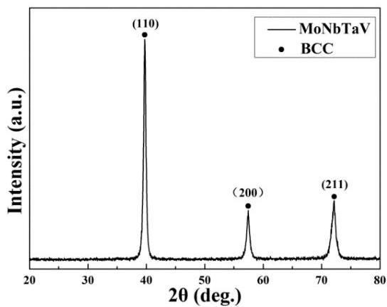
Figure 1. X-ray diffraction (XRD) pattern of the as-cast MoNbTaV alloy.

Table 1. The crystal lattice parameter  $(a)$ , atomic radius  $(r)$ , melting temperature  $(T_{m})$ , Vickers hardness  $(\mathrm{H}_{v})$ , yield strength  $(\sigma_{0.2})$ , valence electron concentration (VEC), Pauling electronegativity difference  $(\Delta \chi)$ , and shear modulus  $(G)$  of pure metals are given. The calculated (Calc) and experimental (Exp) data for MoNbTaV alloy is also listed here.

|  Metal | Mo | Nb | Ta | V | MoNbTaV (Calc/Exp)  |
| --- | --- | --- | --- | --- | --- |
|  a (Å) | 3.1468 | 3.301 | 3.303 | 3.039 | 3.2036/3.208  |
|  r (Å) | 1.4 | 1.47 | 1.47 | 1.35 | -  |
|  Tm (°C) | 2623 | 2477 | 3017 | 1910 | 2528/-  |
|  Hv (MPa) | 1530 | 1320 | 873 | 628 | 1097/4947  |
|  σ0.2 (MPa) | 438 | 240 | 345 | 310 | 333/1525  |
|  VEC | 6 | 5 | 5 | 5 | -  |
|  Δχ | 2.16 | 1.6 | 1.5 | 1.63 | -  |
|  G (GPa) | 123 | 59.5 | 64.7 | 46.6 | 73.78/-  |

The backscattered-electron SEM image of the as-cast alloy (Figure 2) shows a typical dendritic microstructure, indicating constitutional segregation during the non-equilibrium solidification. The average bulk composition of the alloys  $(C_{\mathrm{aver}})$  was estimated using energy-dispersive X-ray spectroscopy (EDX) on large areas, and it slightly deviates from the nominal concentration due

Entropy 2016, 18, 189

to evaporation losses of elements during the melting process. Table 2 lists  $C_{aver}$ , the average composition of the dendritic arms ( $C_{dr}$ ), and the average composition of the interdendritic regions ( $C_{idr}$ ). The dendrite arms are enriched with Ta and Mo, while the interdendritic regions are enriched strongly with V. Overall, the Nb content in both regions deviates little from the bulk concentration and falls within the uncertainty of EDX measurements.

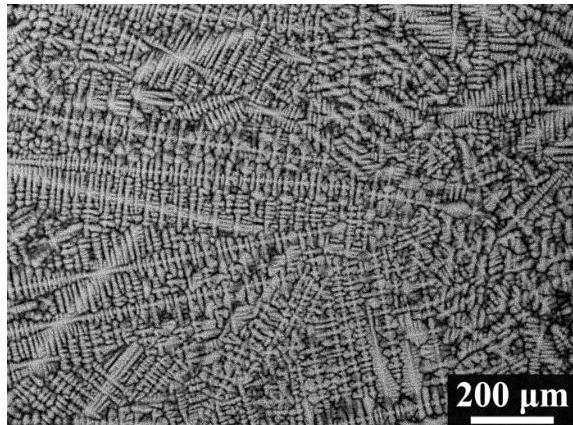
Figure 2. Backscattered electron SEM micrograph of the polished cross-section of the MoNbTaV alloy.

Table 2. The average bulk composition ( $C_{aver}$ ), the average composition of dendrite arms ( $C_{dr}$ ), and the average composition of interdendrite regions ( $C_{idr}$ ) for MoNbTaV alloy.

|  Alloy | Concentrations (at.%) | Mo | Nb | Ta | V  |
| --- | --- | --- | --- | --- | --- |
|  MoNbTaV | Caver | 24.9 | 25.8 | 26.6 | 22.7  |
|   |  Cdr | 27.6 | 25.0 | 31.5 | 15.9  |
|   |  Cidr | 19.6 | 27.5 | 19.0 | 33.9  |

To demonstrate the elemental distribution, the EDS mapping was obtained on a small region of the alloy, as presented in Figure 3. The qualitative elemental mapping agrees with the EDX point analysis listed in Table 2.

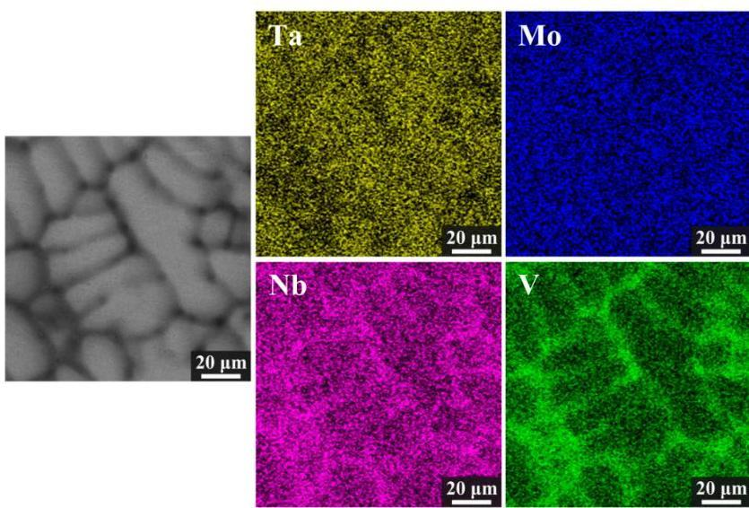
Figure 3. Backscattered electron SEM micrograph and EDX mapping of elements Ta, Mo, Nb, and V in the as-cast MoNbTaV alloy.

Entropy 2016, 18, 189

The level of elemental segregation can be described by a linear relationship [7]:

$$
\Delta C = k \Delta T \tag {2}
$$

where $k$ is a constant and $\Delta T_{i} = (T_{m})_{i} - T_{m}^{mix}$. Here, $(T_{m})_{i}$ is the melting temperature of the $i$-th element [7], and $T_{m}^{mix}$ is the calculated average melting temperature of the alloy. The $\Delta C = C_{dr} - C_{aver}$, reveals the excess concentration inside the dendrite arms. The $\Delta C - \Delta T$ relation is illustrated in Figure 4. Note that the element Mo apparently deviates from linearity. The reason for this abnormality was subsequently studied using CALPHAD modeling, which will be discussed in the next subsection.

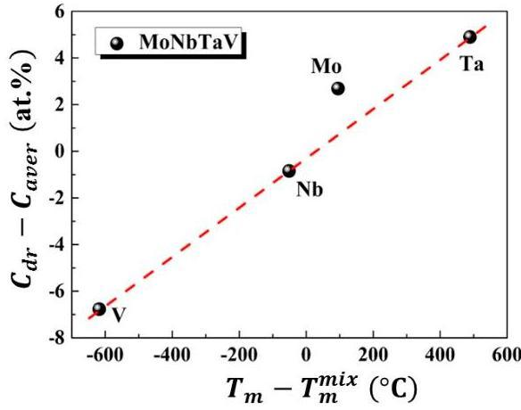
Figure 4. The correlation between the partition coefficient $\Delta C$ and $\Delta T$ for MoNbTaV alloy.

## 3.2. CALPHAD Modeling

Figure 5a shows the evolution of predicted equilibrium phase mole fraction versus temperature for MoNbTaV. The only crystallization phase is the BCC phase that forms at $2437^{\circ}\mathrm{C}$, and it is predicted to decompose to a non-equimolar BCC phase and a minor V-rich BCC phase at $456^{\circ}\mathrm{C}$. The non-equilibrium solidification simulation was accomplished using the Scheil-Gulliver models [35,36], which assume equilibrium mixing in the liquid with no diffusion in the solid. The simulation also predicts the formation of a single BCC solid solution phase as shown in Figure 5b. Simulation on the true bulk composition reveals very similar results; that is, only the BCC phase forms as the primary crystallization phase under both solidification routes, and it is stable over a very wide temperature range.

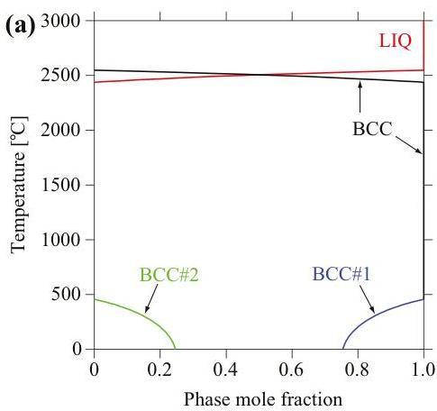
Figure 5. (a) Calculated equilibrium phase mole fraction versus temperature for MoNbTaV; (b) Mole fraction of solid phase formed during non-equilibrium solidification using Scheil-Gulliver models.

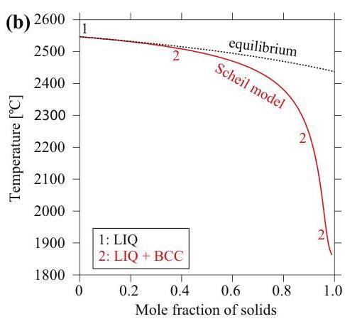

Entropy 2016, 18, 189

The simulations also predict likely segregation tendencies for both the nominal and true bulk compositions due to constitutional cooling effect. The compositional evolution in liquid and BCC phases for the actual alloy composition is shown in Figure 6a,b, respectively. As the temperature decreases, the liquid is gradually depleted in Mo followed by Ta, while it is steadily enriched in V. In contrast, the BCC phase is predicted to be rich in Ta and Mo while depleted in V in the dendrites that form at earlier stages of solidification. Conversely, the BCC phase is predicted to be depleted in Ta and Mo while enriched in V in interdendritic regions that form at later stages of solidification. The Nb content in liquid and BCC phases are predicted to be close to the bulk concentration. The predicted composition profiles, qualitatively at least, agree with experimental results.

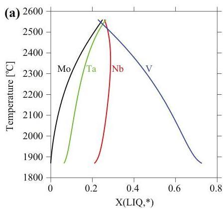

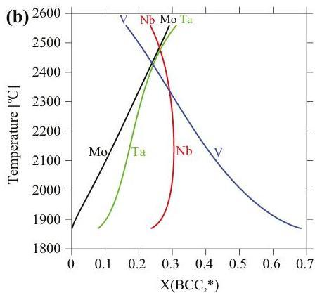

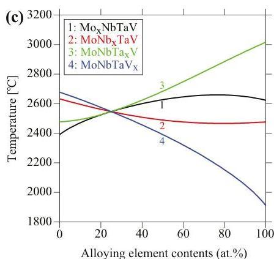

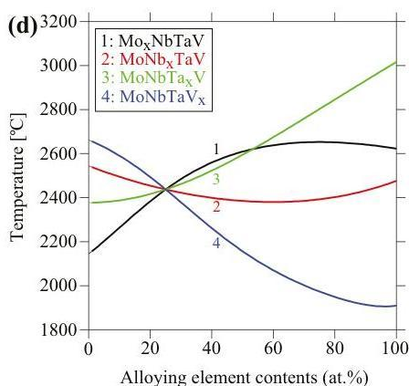

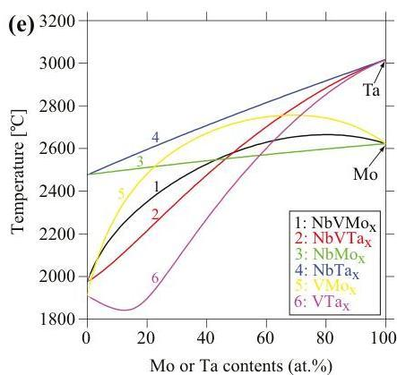
Figure 6. (a) Liquid and (b) body-centered cubic (BCC) compositions of the actual alloy predicted using Scheil-Gulliver models; (c) Liquidus and (d) solidus temperatures of  $\mathrm{Mo_xNbTaV}$ ,  $\mathrm{MoNb_xTaV}$ ,  $\mathrm{MoNbTa_xV}$ , and  $\mathrm{MoNbTaV_x}$  alloys as a function of alloying element contents; (e) Liquidus and (f) solidus temperatures of  $\mathrm{NbV - M_x}$ ,  $\mathrm{Nb - M_x}$  and  $\mathrm{V - M_x}$  systems ( $\mathrm{M} = \mathrm{Mo}$ , Ta) as a function of Mo and Ta contents.

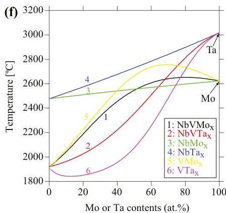

Entropy 2016, 18, 189

The positive deviation from the linear  $\Delta C = k\Delta T$  relation (Equation (2) and Figure 4) for Mo observed in the experiments can be qualitatively understood from the evolution of the liquidus and solidus temperatures as a function of alloy systems and compositions, as shown in Figure 6c-f. Both the liquidus and solidus temperatures pertaining to Mo (i.e.,  $\mathrm{Mo_xNbTaV}$ ,  $\mathrm{NbVMox}$ , and  $\mathrm{VMox}$ , except  $\mathrm{NbMox}$ ) exhibit a concave shape while for other alloys (i.e.,  $\mathrm{MoNb_xTaV}$ ,  $\mathrm{MoNbTa_xV}$ ,  $\mathrm{NbVTa_x}$ , and  $\mathrm{VTa_x}$ , except  $\mathrm{NbTa_x}$ ), they exhibit a convex shape. For example, the liquidus temperature of V-Mo binary shows a very positive departure from the ROM, while that of V-Ta binary shows a very negative departure from ROM. Accordingly, the liquidus temperature is significantly higher for V-Mo binary than V-Ta binary for alloying element contents up to about 72 at.% The liquidus temperature is also noticeably higher for NbV-Mo than NbV-Ta pseudo-binary for alloying element contents up to 49 at.% The liquidus temperatures of Nb-Mo and Nb-Ta binaries obey the ROM. Similar trends are seen in the solidus temperatures of V-M binaries and NbV-M pseudo-binaries ( $M = Mo$ , Ta). In other words, addition of Mo to those systems tends to raise the liquidus and solidus temperatures, in contrast to Nb, Ta and V. This is consistent with common observation that the elements of higher melting temperature often solidify before elements of lower melting temperature, as reported in [27,29,30]. In short, in analogy to pure elements, alloying with elements that tend to increase the liquidus and solidus temperatures of the solid solution alloy are expected to solidify first before elements that tend to decrease those temperatures.

# 3.3. Mechanical Properties

Figure 7a shows the engineering stress-strain curves (RT,  $23^{\circ}\mathrm{C}$ ) for MoNbTaV alloy. The yield stress (i.e.,  $\sigma_{0.2}$  is defined as the stress at strain  $\varepsilon = 0.2\%$ .) of MoNbTaV is  $1.5\mathrm{GPa}$ , while the maximum compressive fracture strength is  $2.4\mathrm{GPa}$ . The alloy exhibits about  $21\%$  compression strain before fracture and a large work-hardening capacity. Both the strength and the ductility of MoNbTaV are significantly greater than MoNbTaW ( $\sigma_{0.2} = 1.0\mathrm{GPa}$  with compression strain  $\varepsilon = 2.1\%$ ) [22]. While the higher ductility of MoNbTaV alloy is expected, its higher yield strength is a surprise. One factor that may contribute to its higher strength could be its much refined grain sizes in the as-cast state than the homogenized MoNbTaW alloy [22]. The MoNbTaW sample was annealed at  $1400^{\circ}\mathrm{C}$  for  $19\mathrm{h}$ , leading to an average grain size about  $200\mu \mathrm{m}$  [22]. Also, the presence of pores could be seen in both intergranular and intragranular areas in MoNbTaW [22]. As shown in the Figure 7b, the morphology of the fractograph exhibits a mixture of cleavage steps, river patterns, and tongue patterns in MoNbTaV. For a meaningful evaluation on MoNbTaV for high temperature applications, proper homogenization and subsequent measurement of its yield strength and fracture strength during tensile/compression tests as a function of temperature are required. This task is beyond the scope of the present study.

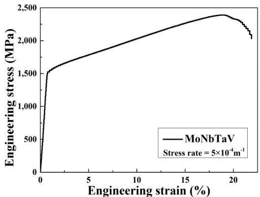
(a)

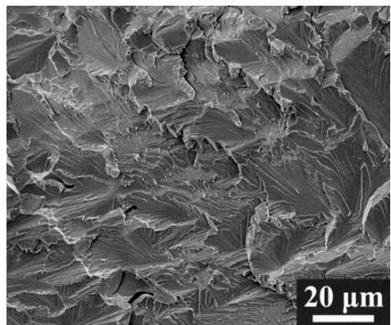
(b)
Figure 7. (a) Compressive engineering stress-strain curve for MoNbTaV alloy at room temperature; (b) The fracture surface of the deformed sample of MoNbTaV.

The average Vickers microhardness values (H_{v}) for this alloy, and for the pure elements [7], are listed in Table 1. Generally speaking, materials properties are sensitive to alloying elements and their concentrations, and thus cannot be reliably predicted using the ROM (at least not always). The ROM is expressed as follows:$$p = \sum_{i = 1}^{n}c_{i}p_{i}$$ where c_{i} is the atomic percentage, and p_{i} is the mechanical property of the i-th constituent element. The calculated average values of σ_{0.2}^{mix} and H_{v}^{mix} are 333 MPa and 1.1 GPa, respectively, which are much smaller than the measured values (see Table 1). The results suggest that the mechanical properties of the alloy do not obey the simple ROM, and aspects of solid solution strengthening (SSS) may play a more dominant role than expected. As summarized in a prior study [10], significant SSS effect is also observed in other BCC alloys (e.g. MoNbTaW, MoNbTaVW, HfNbTaTiZr, MoNbTaTiVW, HfNbTaTiVZr, and CrMoNbTaVW), as well as the FCC CoCrFeNi alloy. However, little SSS is observed in the HCP GdHoLaTbY alloy [10].

## 4. Discussion

### 4.1. Phase Formation

Predicting stable phases of HEAs is a challenging task [32,37] since phase diagrams targeted for HEAs are often not available. For the HEAs, the ideal configurational entropy (ΔS_{mix}) is expressed as:$$\Delta S_{mix} = - R\sum_{i = 1}^{n}c_{i}\ln c_{i}$$ where R is the gas constant (8.314 J·K^{-1}·mol^{-1}), and c_{i} is the atomic percent of the i-th component. ΔS_{mix} reaches its maximum value, Rln(n), when the molar fractions of all components are equal. A high value of ΔS_{mix} is regarded to be important in stabilizing the solid solution phases, as the Gibbs free energy is reduced by the entropy term (TΔS_{mix}). In 2008, Zhang et al. [4] suggested that the criteria for forming random solid solutions alloys solidified from the melt were -15 kJ/mol < ΔH_{mix} < 5 kJ/mol and δ < 6.6%, where ΔH_{mix} and δ are enthalpy of mixing and atomic size difference, respectively, and are defined as follow:$$\delta = 100% \sqrt{\sum_{i = 1}^{n}c_{i}\left({1 - r_{i}/\overline{r}} \right)^{2}}$$ $$\Delta H_{mix} = \sum_{i = 1,j \neq i}^{n}4\omega_{ij}c_{i}c_{j}$$ where c_{i} (r_{i}) is the atomic fraction (the Goldschmidt atomic radius [38]) of the i-th component, $\overline{r}$ (=∑_{i = 1}^{n}c_{i}r_{i}) is the arithmetical mean value of atomic radius, and ω_{ij} is the enthalpy of mixing between i-th and j-th elements [39].

In 2012, a new parameter, Ω, was proposed based on the concept of entropy-enthalpy competition [40,41]:$$\Omega = \frac{T_{m}^{mix}\Delta S_{mix}}{\mid\Delta H_{mix}\mid}$$ where T_{m}^{mix} = ∑_{i = 1}^{n}c_{i} (T_{m})_{i} is the calculated average melting temperature. From available data, these relations suggest that the solid-solution HEAs are located at Ω ≥ 1.1 and δ ≤ 6.6%. The values of δ, ΔH_{mix}, and Ω for the current alloy are listed in Table 3.

###

Entropy 2016, 18, 189

Table 3. The parameters atomic size difference  $(\delta)$ , enthalpy of mixing  $(\Delta H_{mix})$ , ideal configurational entropy  $(\Delta S_{mix})$ ,  $\Omega$ , VEC, and Pauling electronegativity difference  $(\Delta \chi)$  of MoNbTaV high-entropy alloys (HEA) are given.

|  Alloy | δ (%) | ΔHmix (kJ/mol) | ΔSmix (J·K-1·mol-1) | Ω | VEC | Δχ  |
| --- | --- | --- | --- | --- | --- | --- |
|  MoNbTaV | 3.59 | -3.25 | 11.53 | 9.86 | 5.25 | 0.26  |

In addition, the valence electron concentration (VEC) and Pauling electronegativity difference  $(\Delta \chi)$  are also used to predict the formation of solid solution versus intermetallic phases in HEAs [42-44]. The VEC and  $\Delta \chi$  for multi-component alloys can be defined as:

$$
\mathrm {V E C} = \sum_ {i = 1} ^ {n} c _ {i} \mathrm {V E C} _ {i} \tag {8}
$$

$$
\Delta \chi = \sqrt {\sum_ {i = 1} ^ {n} c _ {i} \left(\chi_ {i} - \bar {\chi}\right) ^ {2}} \tag {9}
$$

where  $\mathrm{VEC}_i(\chi_i)$  is the VEC (Pauling electronegativity) for the  $i$ -th element, and  $\overline{\chi} (= \sum_{i=1}^{n} c_i \chi_i)$  is the arithmetical mean value of electronegativity for a multi-component alloy system. It is revealed that FCC phases are stable at higher VEC ( $\geqslant 8$ ), and conversely, BCC phases are stable at lower VEC ( $&lt; 6.87$ ). The coexistence of FCC and BCC phases is observed at VEC values between 6.87 and 8 [42]. The calculated VEC value for MoNbTaV is 5.25, so a BCC structure is expected to form in MoNbTaV. The calculated  $\Delta \chi$  value for MoNbTaV is 0.26.

It is intuitively expected that low values of  $\Delta \chi$  will favor solid solution phase formation, but a prior study [20] also shows that empirical parameters such as  $\Delta \chi$  and  $\Omega$  are not always effective in separating single-phase compositions from multi-phase ones. Instead, Gao et al. [9,11,32] have demonstrated an effect approach that combines phase diagram inspection, CALPHAD modeling, first-principles density functional theory (DFT) calculations, and ab initio molecular dynamics simulations. Using this methodology, hundreds of new single-phase HEA compositions have been suggested [11]. For example, quaternary and higher-order equimolar compositions in the Dy-Er-Gd-Ho-Lu-Sc-Sm-Tb-Tm-Y, Ba-Ca-Eu-Sr-Yb, Mo-Nb-Ta-Ti-V-W, and Mo-Nb-Re-Ta-Ti-V-W systems have been suggested.

## 4.2. Thermodynamic Properties Analyses

The present research demonstrates that these empirical parameters are useful in predicting phase formation. However, it should be noted that the  $\Omega$ -parameter is calculated using the ideal configurational  $\Delta S_{mix}$  and  $\Delta H_{mix}$  for the liquid phase, as well as the average melting point, and thus, this value may vary substantially if the thermodynamic properties of the solid phase and the liquidus temperature are used, as pointed out by Gao et al. [20]. Accordingly, the thermodynamic properties of the Mo-Nb-Ta-V system have been further studied using CALPHAD.

Using BCC phase as the reference state, the calculated entropy of mixing and enthalpy of mixing for BCC phase of MoNbTaV are predicted to be  $10.79\mathrm{J / K / mol}$  and  $-4.13\mathrm{kJ / mol}$ , respectively. The entropy of mixing is slightly less than the ideal configurational entropy, suggesting a negative excess entropy for the alloy. Using liquid phase as the reference state, the calculated entropy of mixing and enthalpy of mixing for liquid phase of MoNbTaV are predicted to be  $11.31\mathrm{J / K / mol}$  and  $-2.97\mathrm{kJ / mol}$ , respectively. While the mixing entropies and mixing enthalpies for the BCC and liquid phases are fairly consistent for MoNbTaV, the contrasting trend in the mixing properties between BCC and liquid phases are observed in other refractory HEAs [20,30].

Using the default states as the reference (the stable structures at pressure of 1 atm and temperature of  $25.15^{\circ}\mathrm{C}$ ), the total entropy, enthalpy and Gibbs free energy for MoNbTaV are shown in Figure 8. The calculated total entropy at  $300\mathrm{K}$  is  $45.2\mathrm{J} / \mathrm{K} / \mathrm{mol}$ , which is about 3.9 times the ideal configurational entropy of  $11.53\mathrm{J} / \mathrm{K} / \mathrm{mol}$ . This is mainly due to vibrational entropy, which is usually much larger

Entropy 2016, 18, 189

than the configurational entropy as revealed by recent DFT calculations [45]. For example, DFT calculations [45] show that the vibrational entropies for FCC CoCrFeNi, BCC MoNbTaW, and HCP CoOsReRu solid solution phases are already more than twice the ideal configurational entropy at room temperature. Vibrational entropy also scales with increasing temperature. The total enthalpy is  $-4.09\mathrm{kJ / mol}$  at  $T = 27^{\circ}\mathrm{C}$ , but quickly becomes positive with increasing temperature. The Gibbs energy combines the contributions from both enthalpy and entropy, but apparently the contribution from entropy overweighs that from enthalpy for this alloy.

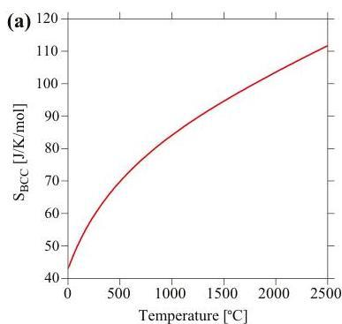
Figure 8. Calculated (a) entropy, (b) enthalpy, and (c) Gibbs free energy of BCC MoNbTaV as a function of temperature using the default states as the reference.

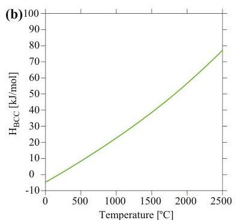

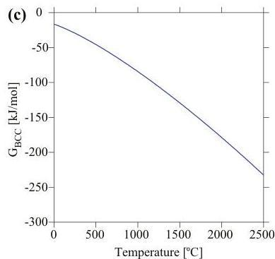

To analyze the compositional dependence of the thermodynamic properties, the mixing behavior in entropy, enthalpy and Gibbs free energy for the BCC phase for four pseudo-binaries of  $\mathrm{Mo_xNbTaV}$ ,  $\mathrm{MoNb_xTaV}$ ,  $\mathrm{MoNbTa_xV}$ , and  $\mathrm{MoNbTaV_x}$  at  $1000^{\circ}\mathrm{C}$  were calculated as shown in Figure 9. The entropies of mixing for these systems are fairly comparable and all lie below the ideal configurational entropy, and thus they exhibit negative excess entropy. The enthalpy of mixing appears to be sensitive to the alloying elements. The addition of Mo lowers the enthalpy of mixing while the addition of V increases it. The resulting Gibbs free energy largely follows the trend of the enthalpy of mixing, suggesting that enthalpy plays a more important role in phase stability than entropy for the BCC phase among these pseudo-binaries.

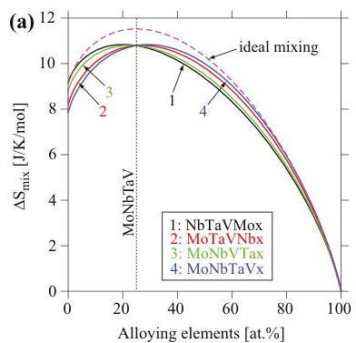
Figure 9. Calculated (a) entropy of mixing, (b) enthalpy of mixing, and (c) Gibbs free energy of mixing at  $T = 1000^{\circ}\mathrm{C}$  for four pseudo-binaries of  $\mathrm{Mo_xNbTaV}$ ,  $\mathrm{MoNb_xTaV}$ ,  $\mathrm{MoNbTa_xV}$ , and  $\mathrm{MoNbTaV_x}$  using TCNI8 database. The reference states used are the BCC phase at  $T = 1000^{\circ}\mathrm{C}$ .

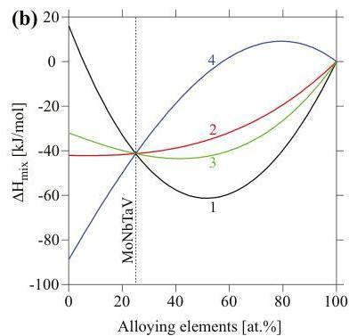

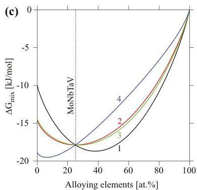

# 4.3. Solid Solution Strengthening (SSS)

It is widely regarded that large differences in atomic size and shear modulus among solute and solvent atoms will lead to a more pronounced SSS effect. On the basis of the classical Labush

Entropy 2016, 18, 189

approach [46], which has been successfully applied to HEAs [47], the SSS caused by the  $i$ -th element can be expressed as:

$$
\Delta \sigma_ {i} = A G f _ {i} ^ {4 / 3} c _ {i} ^ {2 / 3} \tag {10}
$$

where  $A$  is a material-dependent dimensionless constant, which is of the order of 0.04 [17],  $G$  is the shear modulus of the alloy,  $c_{i}$  is the concentration of the  $i$ -th element, and  $f_{i}$  is the mismatch parameter. The  $f_{i}$  parameter can be determined by:

$$
f _ {i} = \sqrt [ 3 ]{\delta G _ {i} ^ {2} + \alpha^ {2} \delta r _ {i} ^ {2}} \tag {11}
$$

where  $\delta G_{i} = \left(\frac{1}{G}\right)\frac{\mathrm{d}G}{\mathrm{d}c_{i}}$  is the atomic modulus and  $\delta r_{i} = \left(\frac{1}{r}\right)\frac{\mathrm{d}r}{\mathrm{d}c_{i}}$  is the atomic size mismatch. The term  $\alpha$  is a constant that accounts for the difference in the interaction forces between screw and edge dislocations and the solute atom. Generally,  $\alpha$  is 2-4 for screw dislocations and  $\alpha \geqslant 16$  for edge dislocations [17]. In the BCC lattice each solute has eight nearest-neighbor atoms, thus forming a nine-atom cluster. If the local concentration around the  $i$ -th element is assumed to be equal to the average concentration of the alloy, the  $i$ -th element will have  $\mathrm{N}_j = 9c_j$  of  $j$ -atom and  $\mathrm{N}_i = 9c_i - 1$  of  $i$ -atom neighbors ( $j \neq i$ ). Then the lattice distortion  $\delta_{ri}$  and atomic modulus mismatch  $\delta_{Gi}$  (per atom pair) in the vicinity of an element  $i$  can be estimated as an average of the atomic size difference ( $\delta_{rij}$ ) and the atomic modulus difference ( $\delta_{Gij}$ ) of the element with its neighbors [17], respectively:

$$
\delta_ {r i} = \frac {9}{8} \sum c _ {j} \delta_ {r i j} \tag {12}
$$

$$
\delta_ {G i} = \frac {9}{8} \sum c _ {j} \delta_ {G i j} \tag {13}
$$

where  $c_{j}$  is the atomic fraction of  $j$ -th element in the alloy, and  $\delta_{rij} = 2(r_i - r_j) / (r_i + r_j)$ ,  $\delta_{Gij} = 2(G_i - G_j) / (G_i + G_j)$ .

The calculated  $\delta_{rij}$  and  $\delta_{Gij}$  values are listed in Table 4. Using Equations (12) and (13), the calculated  $\delta_{ri}$  and  $\delta_{Gi}$  values for Mo, Nb, Ta, and V are listed in Table 5, while the parameters of pure elements [38] are given in Table 1. Note that the absolute values of the estimated  $\delta_{ri}$  for Mo is lower than Nb, Ta, and V, and this means that by increasing Mo content, the lattice distortion of the alloy will decrease and thus its contribution for SSS will reduce. By contrast, the  $\delta_{Gi}$  of Mo is higher than any other element. This suggests that the SSS from shear modulus distortion increases with the addition of Mo.

The  $\Delta \sigma_{i}$  of each component element is listed in Table 5. Since the shear modulus of the alloy is not available, it is estimated using the rule of mixture to be  $73.78\mathrm{GPa}$ . Considering the real type of dislocation in alloy is mixed dislocations, an average value of  $\alpha = 9$  for the alloy is assumed as an intermediate value ( $\alpha$  is 2 for screw dislocations and 16 for edge dislocations). The  $\Delta \sigma_{i}$  of Mo is significantly higher than  $\Delta \sigma_{i}$  by other elements. Using the Gypen and Deruyttere approach [48], the SSS effect has been estimated for HEAs [47]. The SSS of the alloy ( $\Delta \sigma$ ) by summarizing  $\Delta \sigma_{i}$  of each constituent is expressed by the following equation:

$$
\Delta \sigma = \left(\sum \Delta \sigma_ {i} ^ {3 / 2}\right) ^ {3 / 2} \tag {14}
$$

Table 4. Relative atomic size difference,  ${\delta }_{rij}$  ,and modulus difference,  ${\delta }_{Gij}$  ,of the alloying element pairs.

|  δrij/δGij | Mo | Nb | Ta | V  |
| --- | --- | --- | --- | --- |
|  Mo | 0 | -0.049/0.696 | -0.049/0.621 | 0.036/0.901  |
|  Nb | 0.049/-0.696 | 0 | 0/-0.084 | 0.085/0.243  |
|  Ta | 0.049/-0.621 | 0/0.084 | 0 | 0.085/0.325  |
|  V | -0.036/-0.901 | -0.085/-0.243 | -0.085/-0.325 | 0  |

Entropy 2016, 18, 189

Table 5. Calculated atomic lattice distortion  $\delta_{ri}$ , shear modulus distortion  $\delta_{Gi}$ , and  $\Delta \sigma_{i}$  near an individual  $i$ -th element in MoNbTaV alloy.

|  Parameters | Mo | Nb | Ta | V  |
| --- | --- | --- | --- | --- |
|  δri | -0.019 | 0.035 | 0.035 | -0.058  |
|  δGi | 0.618 | -0.158 | -0.067 | -0.41  |
|  Δσi(MPa) | 647 | 302 | 273 | 631  |

Substituting  $\Delta \sigma_{i}$  values (determined via Equation (10) through Equations (11)-(13)) into Equation (14) yields a  $\Delta \sigma$  value of 1.21 GPa. The calculated yield stress of the alloy can then be described as:

$$
\sigma_ {0. 2} ^ {\text {c a l}} = \sigma_ {0. 2} ^ {\text {m i x}} + \Delta \sigma \tag {15}
$$

herein, the  $\sigma_{0.2}^{mix}$  is given using ROM. For clarity,  $\sigma_{0.2}^{mix}$  and  $\Delta \sigma$  are summarized in a column chart (Figure 10) to compare the calculated and experimental  $\sigma_{0.2}$ . The calculated  $\sigma_{0.2}^{cal}$  agrees well with the experimental  $\sigma_{0.2}^{exp}$ . It should be noted that the simple SSS model used in the present study assumes no other significant strengthening mechanisms that may be found in the as-cast MoNbTaV. However, the interaction between moving dislocations and the "solute" atoms and their elastic field in the as-cast dendrite microstructure can be much more complex than in a homogeneous equi-axed grain microstructure.

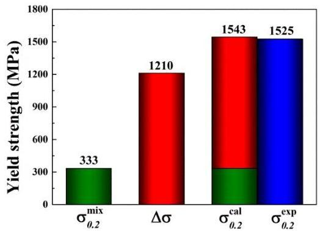
Figure 10. The estimated yield strength by the rule of mixtures (ROM)  $(\sigma_{0.2}^{mix})$  and the calculated solid solution strengthening (SSS)  $(\Delta \sigma)$ . The predicted total strength  $(\sigma_{0.2}^{mix} + \Delta \sigma)$  agrees well with the experimental data  $(\sigma_{0.2}^{exp})$ .

# 5. Conclusions

In conclusion, the refractory MoNbTaV HEA is designed by CALPHAD modeling and synthesized by vacuum arc melting. The as-cast alloy with a single BCC structure based on XRD and SEM analyses exhibits a high yield stress of  $\sim 1.5$  GPa and a large compression fracture strain of  $\sim 21\%$  at room temperature, both of which are significantly greater than what was found for the MoNbTaW alloy. CALPHAD modeling is useful in predicting phase formation and analyzing the elemental segregation that occurs during solidification. The total entropy of the alloy is nearly four times that of the configurational entropy even at room temperature, and the entropy of mixing shows slightly negative departure from ideal. The Vickers microhardness value (and the yield stress) of the alloy are about 4.5 (and 4.6) times that estimated from the simple ROM. This behavior has been explained by a simple solid solution strengthening modeling based on traditional elasticity theory. The predicted yield stress agrees very well with experimental value.

Acknowledgments: The authors would like to acknowledge the financial support of National Natural Science Foundation of China (No. 51371122 and No. 51501123), the Program for the Innovative Talents of Higher Learning

Institutions of Shanxi (2013), the Youth Natural Science Foundation of Shanxi Province, China (No. 2015021005 and No. 2015021006), and the financial support from State Key Lab of Advanced Metals and Materials (No. 2015-Z07). The modeling work was funded by the Cross-Cutting Technologies Program at the National Energy Technology Laboratory (NETL)—Strategic Center for Coal, managed by Robert Romanosky (Technology Manager) and Charles Miller (Technology Monitor). The Research was executed through NETL's Office of Research and Development's Innovative Process Technologies (IPT) Field Work Proposal. Research performed by AECOM Staff was conducted under the RES contract DE-FE-0004000.

All authors contributed extensively to this study. Michael C. Gao and Jun-Wei Qiao conceived the idea and designed the experiments; Michael C. Gao and Jeffrey A. Hawk did the modeling work; Hongwei Yao and Sheng-Guo Ma performed the experiments; Michael C. Gao and Hongwei Yao analyzed the data; Hefeng Zhou contributed reagents/materials/analysis tools; Hongwei Yao and Michael C. Gao wrote the paper. All authors have read and approved the final manuscript.

The authors declare no conflict of interest. This project was funded by the Department of Energy, National Energy Technology Laboratory, an agency of the United States Government, through a support contract with AECOM. Neither the United States Government nor any agency thereof, nor any of their employees, nor AECOM, nor any of their employees, makes any warranty, expressed or implied, or assumes any legal liability or responsibility for the accuracy, completeness, or usefulness of any information, apparatus, product, or process disclosed, or represents that its use would not infringe privately owned rights. Reference herein to any specific commercial product, process, or service by trade name, trademark, manufacturer, or otherwise, does not necessarily constitute or imply its endorsement, recommendation, or favoring by the United States Government or any agency thereof. The views and opinions of authors expressed herein do not necessarily state or reflect those of the United States Government or any agency thereof.

1. Donachie, M.J.; Donachie, S.J. Superalloys: A Technical Guide; ASM International: Materials Park, OH, USA, 2002.
2. Pollock, T.M.; Tin, S. Nickel-based superalloys for advanced turbine engines: Chemistry, microstructure and properties. J. Propuls. Power 2006, 22, 361--374.
3. Yeh, J.-W.; Chen, S.-K.; Lin, S.-J.; Gan, J.-Y.; Chin, T.-S.; Shun, T.-T.; Tsau, C.-H.; Chang, S.-Y. Nanostructured High-Entropy Alloys with Multiple Principal Elements: Novel Alloy Design Concepts and Outcomes. Adv. Eng. Mater. 2004, 6, 299--303. [CrossRef]
4. Zhang, Y.; Zhou, Y.J.; Lin, J.P.; Chen, G.L.; Liaw, P.K. Solid—Solution phase formation rules for multi-component alloys. Adv. Eng. Mater. 2008, 10, 534--538. [CrossRef]
5. Ye, Y.F.; Wang, Q.; Lu, J.; Liu, C.T.; Yang, Y. High-entropy alloy: Challenges and prospects. Mater. Today 2015, in press. [CrossRef]
6. Cantor, B.; Chang, I.T.H.; Knight, P.; Vincent, A.J.B. Microstructural development in equiatomic multicomponent alloys. Mater. Sci. Eng. A 2004, 375, 213--218. [CrossRef]
7. Senkov, O.N.; Wilks, G.B.; Miracle, D.B.; Chuang, C.P.; Liaw, P.K. Refractory high-entropy alloys. Intermetallics 2010, 18, 1758--1765. [CrossRef]
8. Takeuchi, A.; Amiya, K.; Wada, T.; Yubuta, K.; Zhang, W. High-entropy alloys with a hexagonal close-packed structure designed by equi-atomic alloy strategy and binary phase diagrams. JOM 2014, 66, 1984--1992. [CrossRef]
9. Gao, M.C.; Zhang, B.; Guo, S.M.; Qiao, J.W.; Hawk, J.A. High-entropy alloys in hexagonal close-packed structure. Metall. Mater. Trans. A 2016. [CrossRef]
10. Zhao, Y.J.; Qiao, J.W.; Ma, S.G.; Gao, M.C.; Yang, H.J.; Chen, M.W.; Zhang, Y. A hexagonal close-packed high-entropy alloy: The effect of entropy. Mater. Des. 2016, 96, 10--15. [CrossRef]
11. Gao, M.C. Design of High-Entropy Alloys. In High-Entropy Alloys: Fundamentals and Applications; Gao, M.C. Yeh, J.W. Liaw, P.K. Zhang, Y. Eds.; Springer: Cham, Switzerland, 2016.
12. Yeh, J.W. Recent progress in high entropy alloys. Ann. Chim. Sci. Mat. 2006, 31, 633--648. [CrossRef]
13. Zhang, Y.; Zuo, T.T.; Tang, Z.; Gao, M.C.; Dahmen, K.A.; Liaw, P.K.; Lu, Z.P. Microstructures and properties of high-entropy alloys. Prog. Mater. Sci. 2014, 61, 1--93. [CrossRef]
14. Murty, B.S.; Yeh, J.W.; Ranganathan, S. High Entropy Alloys; Butterworth-Heinemann: Oxford, UK, 2014.
15. Gludovatz, B.; Hohenwarter, A.; Catoor, D.; Chang, E.H.; George, E.P.; Ritchie, R.O. A fracture-resistant high-entropy alloy for cryogenic applications. Science 2014, 345, 1153--1158. [CrossRef] [PubMed]
16. Qiao, J.W.; Jia, H.L.; Liaw, P.K. Metallic glass matrix composites. Mater. Sci. Eng. R. 2016, 100, 1--69. [CrossRef]

Entropy 2016, 18, 189

17. Senkov, O.N.; Scott, J.M.; Senkova, S.V.; Miracle, D.B.; Woodward, C.F. Microstructure and room temperature properties of a high-entropy TaNbHfZrTi alloy. J. Alloys Compd. 2011, 509, 6043–6048. [CrossRef]
18. Tian, F.Y.; Varga, L.K.; Chen, N.X.; Shen, J.; Vitos, L. Ab initio design of elastically isotropic TiZrNbMoV $_x$ high-entropy alloys. J. Alloys Compd. 2014, 599, 19–25. [CrossRef]
19. Yang, X.; Zhang, Y.; Liaw, P.K. Microstructure and compressive properties of NbTiVTaAl $_x$ high entropy alloys. Procedia Eng. 2012, 36, 292–298. [CrossRef]
20. Gao, M.C.; Carney, C.S.; Dogan, Ö.N.; Jablonksi, P.D.; Hawk, J.A.; Alman, D.E. Design of Refractory High-Entropy Alloys. JOM 2015, 67, 2653–2669. [CrossRef]
21. Gao, M.C.; Zhang, B.; Yang, S.; Guo, S.M. Senary Refractory High-Entropy Alloy HfNbTaTiVZr. Metall. Mater. Trans. A 2016. [CrossRef]
22. Senkov, O.N.; Wilks, G.B.; Scott, J.M.; Miracle, D.B. Mechanical properties of  $\mathrm{Nb}_{25}\mathrm{Mo}_{25}\mathrm{Ta}_{25}\mathrm{W}_{25}$  and  $\mathrm{V}_{20}\mathrm{Nb}_{20}\mathrm{Mo}_{20}\mathrm{Ta}_{20}\mathrm{W}_{20}$  refractory high entropy alloys. Intermetallics 2011, 19, 698–706. [CrossRef]
23. Gao, M.C.; Dogan, Ö.N.; King, P.; Rollett, A.D.; Widom, M. The first-principles design of ductile refractory alloys. JOM 2008, 60, 61–65. [CrossRef]
24. Gao, M.C.; Suzuki, Y.; Schweiger, H.; Dogan, Ö.N.; Hawk, J.; Widom, M. Phase Stability and Elastic Properties of Cr-V Alloys. J. Phys. Condens. Matter 2013, 25, 075402. [CrossRef] [PubMed]
25. Goodfellow. Available online: http://www.goodfellow.com (accessed on 17 May 2016).
26. Sundman, B.; Jansson, B.; Andersson, J.O. The thermo-calc databank system. Calphad 1985, 9, 153-190. [CrossRef]
27. Zhang, B.; Gao, M.C.; Zhang, Y.; Yang, S.; Guo, S.M. Senary Refractory High-Entropy Alloy MoNbTaTiVW. Mater. Sci. Technol. 2015, 31, 1207-1213. [CrossRef]
28. Zhang, B.; Gao, M.C.; Zhang, Y.; Guo, S.M. Senary Refractory High-Entropy Alloy  $\mathrm{Cr_xMoNbTaVW}$ . Calphad 2015, 51, 193–201. [CrossRef]
29. Zhang, C.; Gao, M.C. CALPHAD Modeling of High-Entropy Alloys. In High-Entropy Alloys: Fundamentals and Applications; Gao, M.C., Yeh, J.W., Liaw, P.K., Zhang, Y., Eds.; Springer: Cham, Switzerland, 2016.
30. Yao, H.W.; Qiao, J.W.; Gao, M.C.; Hawk, J.A.; Ma, S.G.; Zhou, H.F.; Zhang, Y. NbTaV-(Ti, W) Refractory High Entropy Alloys. Mater. Sci. Eng. A 2016, submitted.
31. Zhang, C.; Zhang, F.; Chen, S.; Cao, W. Computational thermodynamics aided high-entropy alloy design. JOM 2012, 64, 839–845. [CrossRef]
32. Gao, M.C.; Alman, D.E. Searching for next single-phase high-entropy alloy compositions. Entropy 2013, 15, 4504–4519. [CrossRef]
33. Zhang, F.; Zhang, C.; Chen, S.L.; Zhu, J.; Cao, W.S.; Kattner, U.R. An understanding of high entropy alloys from phase diagram calculations. Calphad 2014, 45, 1-10. [CrossRef]
34. Vegard, L. Die konstitution der mischkristalle und die raumfüllung der atome. Z. Phys. A Hadron. Nucl. 1921, 5, 17-26. (In German)
35. Gulliver, G.H. The quantitative effect of rapid cooling upon the constitution of binary alloys. J. Inst. Met. 1913, 9, 120-157.
36. Scheil, E. Comments on the layer crystal formation. Z. Metallkd. 1942, 34, 70-72. (In German)
37. Yang, X.; Zhang, Y. Prediction of high-entropy stabilized solid-solution in multi-component alloys. Mater. Chem. Phys. 2012, 132, 233-238. [CrossRef]
38. Martienssen, W.; Warlimont, H. Springer Handbook of Condensed Matter and Materials Data; Springer: Berlin/Heidelberg, Germany, 2005.
39. Takeuchi, A.; Inoue, A. Classification of bulk metallic glasses by atomic size difference, heat of mixing and period of constituent elements and its application to characterization of the main alloying element. Mater. Trans. 2005, 46, 2817-2829. [CrossRef]
40. Zhang, Y.; Yang, X.; Liaw, P.K. Alloy design and properties optimization of high-entropy alloys. JOM 2012, 64, 830-838. [CrossRef]
41. Zhang, Y.; Lu, Z.P.; Ma, S.G.; Liaw, P.K.; Tang, Z.; Cheng, Y.Q.; Gao, M.C. Guidelines in predicting phase formation of high-entropy alloys. MRS Commun. 2014, 4, 57–62. [CrossRef]
42. Guo, S.; Ng, C.; Lu, J.; Liu, C.T. Effect of valence electron concentration on stability of fcc or bcc phase in high entropy alloys. J. Appl. Phys. 2011, 109, 103505. [CrossRef]
43. Guo, S.; Liu, C.T. Phase stability in high entropy alloys: Formation of solid-solution phase or amorphous phase. Prog. Nat. Sci. 2011, 21, 433-446. [CrossRef]

Entropy 2016, 18, 189

44. Dong, Y.; Lu, Y.; Jiang, L.; Wang, T.; Li, T. Effects of electro-negativity on the stability of topologically close-packed phase in high entropy alloys. Intermetallics 2014, 52, 105-109. [CrossRef]
45. Gao, M.C.; Niu, C.; Jiang, C.; Irving, D.L. Applications of Special Quasi-Random Structures to High-Entropy Alloys. In High-Entropy Alloys: Fundamentals and Applications; Gao, M.C., Yeh, J.W., Liaw, P.K., Zhang, Y., Eds.; Springer: Cham, Switzerland, 2016.
46. Labusch, R. A statistical theory of solid solution hardening. Phys. Status Solidi B 1970, 41, 659-669. [CrossRef]
47. Toda-Caraballo, I.; Rivera-Díaz-del-Castillo, P.E. Modelling solid solution hardening in high entropy alloys. Acta Mater. 2015, 85, 14-23. [CrossRef]
48. Gypen, L.A.; Deruyttere, A. Multi-component solid solution hardening. J. Mater. Sci. 1977, 12, 1028-1033. [CrossRef]

© 2016 by the authors; licensee MDPI, Basel, Switzerland. This article is an open access article distributed under the terms and conditions of the Creative Commons Attribution (CC-BY) license (http://creativecommons.org/licenses/by/4.0/).