#

entropy

MDPI

Article

# Effect of Mn Addition on the Microstructures and Mechanical Properties of CoCrFeNiPd High Entropy Alloy

Yiming Tan, Jinshan Li *, Jun Wang and Hongchao Kou

State Key Laboratory of Solidification Processing, Northwestern Polytechnical University, Xi'an 710072, China; tanym2015@mail.nwpu.edu.cn (Y.T.); nwpuwj@nwpu.edu.cn (J.W.); hchkou@nwpu.edu.cn (H.K.)

* Correspondence: ljsh@nwpu.edu.cn

Received: 16 February 2019; Accepted: 12 March 2019; Published: 16 March 2019

check for updates

Abstract: CoCrFeNiPdMn $_x$  ( $x = 0, 0.2, 0.4, 0.6, 0.8$ ) high entropy alloys (HEAs) were prepared and characterized. With an increase in Mn addition, the microstructures changed from dendrites (CoCrFeNiPd with a single face-centered-cubic (FCC) phase) to divorced eutectics (CoCrFeNiPdMn $_{0.2}$  and CoCrFeNiPdMn $_{0.4}$ ), to hypoeutectic microstructures (CoCrFeNiPdMn $_{0.6}$ ), and finally to seaweed eutectic dendrites (CoCrFeNiPdMn $_{0.8}$ ). The addition of Mn might change the interface energy anisotropy of both the FCC/liquid and MnPd-rich intermetallic compound/liquid interfaces, thus forming the seaweed eutectic dendrites. The hardness of the FCC phase was found to be highly related to the solute strengthening effect, the formation of nanotwins and the transition from CoCrFeNiPd-rich to CoCrFeNi-rich FCC phase. Hierarchical nanotwins were found in the MnPd-rich intermetallic compound and a decrease in either the spacing of primary twins or secondary twins led to an increase in hardness. The designing rules of EHEAs were discussed and the pseudo binary method was revised accordingly.

Keywords: high entropy alloys; solidification; alloy design; eutectic dendrites; hierarchical nanotwins

# 1. Introduction

High entropy alloys (HEAs) [1] or multi-principal element alloys [2] are now attracting more and more attention [3-10]. In contrast to the traditional alloys with one principal element or two, HEAs have at least four principal elements and usher in an expansive alloy space for exploring potential new materials with brilliant properties [11-26]. Initially, studies of HEAs concentrated to a greater extent on the solid-solution phases, e.g., the HEAs with a single face-centered-cubic (FCC) phase, with a single body-centered-cubic (BCC) phase or with dual FCC and BCC phases. Lots of studies suggested that the high configurational entropy would be able to stabilize thermodynamically the solid-solution phases [1,4,5,27,28]. As the researches move forward, more and more studies suggested that the high configurational entropy alone could not determine completely the constituent phases, because most of the HEAs consisted of multi-phases [29-34].

Although the HEAs with a single solid-solution phase have some advantages (e.g., higher melting points than the HEAs with multi-phases, higher strength for the HEAs with a single BCC phase, better ductility for the HEAs with a single FCC phase etc.), their good properties are usually accompanied by some disadvantages, which are fatal for technological applications. One is that the HEAs with a single solid-solution phase usually have inadequate liquidity, poor castability and hence considerable chemical inhomogeneity [21,35]. The other is that the HEAs with a single solid-solution phase could not achieve a balance between high strength and good ductility (e.g., the HEAs with a single FCC phase were ductile but not strong enough while the HEAs with a single BCC phase were adequately strong but at risk of brittleness [21,35-37]).

Entropy 2019, 21, 288; doi:10.3390/e21030288

www.mdpi.com/journal/entropy

To tackle the aforementioned problems, eutectic HEAs (EHEAs) [21] were proposed. On the one hand, EHEAs should have the general character of traditional eutectic alloys. In this sense, EHEAs should have better fluidity and thus better castability and less casting defects [15,35]. On the other hand, EHEAs as one kind of in-situ composites with lamellar or rod-like eutectic microstructures might reach the balance between strength and ductility via mixing the soft FCC phase with the hard BCC phase or intermetallic compound [15,35,38,39,40,41,42,43,44]. Some EHEAs indeed have outstanding properties. Lu et al. [15] reported the AlCoCrFeNi_{2.1} EHEA with simultaneous high strength (944 MPa) and good ductility (25.6%). The excellent mechanical properties do not depend significantly on derivation of eutectic compositions [35]. After cold-rolling and annealing, its strength reached up to 1.2 GPa and its elongation could remain at about 12% [40]. After cryo-rolling and annealing, its strength could reach up to 1.47 GPa while its ductility could even increase to 14% [41]. He et al. [42,43] designed the CoCrFeNiNb_{x} EHEAs and found that the microstructures were stable from 600 °C to 900 °C.

The current work aims to report a new EHEA. From Ref. [45], CoCrFeNiPd is a single FCC solid solution HEA. From the Mn-Pd phase-diagram [46], Mn_{x}Pd_{y} is a relative stable intermetallic compound. We hence chose CoCrFeNiPd as a FCC solid solution phase and Mn_{x}Pd_{y} as an intermetallic compound (IMC) phase to design pseudo binary EHEAs via adjusting the content of IMC forming element Mn to finally get the eutectic structure. The effect of Mn addition on the microstructures was investigated and a seaweed eutectic dendrite solidification microstructure was found in the CoCrFeNiPdMn_{0.8} EHEA. The effect of Mn addition on the mechanical properties was studied by nano-indentation and compression tests. The size effects of primary and secondary twins on the hardness of Mn_{x}Pd_{y} phase were shown. The designing rules of EHEAs were improved.

## 2. Materials and Methods

### 2.1. Material Preparation

The ingots were prepared by arc melting under a Ti-gettered, high-purity argon atmosphere. Elements of Co, Cr, Fe, Ni, Mn and Pd with purities better than 99.95 wt.% were chosen as the raw materials. To prevent the mass loss due to evaporation of Mn, a high purity Fe-68.7at.%Mn intermediate alloy was prepared in advance and the total mass loss of each ingot was less than 0.3 wt.%. In order to ensure the chemical homogeneity, electromagnetic stirring was used during the melting process; each ingot was re-melted at least five times in the water-chilled copper crucible, held at a liquid state for at least 5 min and flipped before each melting process. The prepared button-shaped ingots were approximately 20 mm in diameter and 10 mm in thickness.

### 2.2. Material Characterization

The crystal structures were analyzed by X-ray diffraction (XRD, DX2700, Fang Yuan Company, Dandong, China) using Co ka radiation and a 2θ scattering range of 20°--120°. The microstructures were characterized by the field emission scanning electron microscopy (SEM, Zeiss SUPRA 55, Zeiss Inc. Jena, Germany) operated at 15 kV. The SEM samples were first polished and then etched for a few seconds within the solution of hydrochloric acid, sulfuric acid and supersaturated copper sulfuric (30 mL, 10 mL, 1 g). After the SEM observations, the samples for transmission electron microscopy (TEM) analysis were cut from the center of the SEM samples, prepared by mechanically polishing to a thickness of 45 μm, punched into disks with a diameter of 3 mm and then thinned by ion milling (GATAN 691, Gatan Inc. Warrendale, PA, United State). The chemical components and element distributions in different phases were measured by an electron probe micro-analyzer (EPMA, Shimadzu 1720, Shimadzu Inc. Kyoto, Japan) and an energy dispersive spectrometer (EDS) attached to TEM (TecnaiFG^{2}).

The hardness and elastic modulus of constituent phases in the as-cast alloys were investigated by the Nano-indenter XP^{®} system (MTS Inc. Eden Prairie, MN, United State) at room temperature with a diamond Berkovich indenter at a peak load of 20 mN and a load rate of 0.1 mN·s^{-1}. The peak

load was held for about 5 s to eliminate the instrument noise and five different points were measured for each phase. The samples for nano-indentation were mechanically polished to 1 mm thickness and then electro-polished in an electrolyte of 90 vol.% ethanol and 10 vol.% perchloric acid, with a voltage of 30 V and a polishing time of about 20 s in Struers LectroPol-5. The compression tests were conducted at room temperature in an electronic testing machine (INSTRON 3382, Instron Inc. Norwood, MA, United State) with a strain rate of 1 × 10^{-3} s^{-1}. Cuboid specimens were produced by electric-discharged machining from the cast buttons. The samples were 6 mm in height and 3 mm in length and width, giving an aspect ratio of 2. In order to show the solidification path, the thermal histories of as-cast alloys were measured by a differential scanning calorimetry (DSC, Netzsch 449 C, Netzsch Inc. Selb, Germany) under a flow of purified argon for protection and with a rate of 20 K min^{-1}. The mass of samples was about 15 mg.

## 3. Results

### 3.1. Crystal Structures and Microstructures

Figure 1 shows the XRD patterns of as-cast CoCrFeNiPdMn_{x} (x = 0--0.8) HEAs. It should be noted that the CoCrFeNiPdMn_{x} HEA in what follows was denoted as Mn_{x} for short (e.g. Mn_{0.2} stands for the CoCrFeNiPdMn_{0.2} alloy). The Mn_{0} HEA was of a single FCC phase with a lattice parameter of a = 3.669 Å. The Mn_{0.2}, Mn_{0.4}, Mn_{0.6} and Mn_{0.8} HEAs had a dual FCC phase and Mn_{x}Pd_{y} intermetallic compound. Because the diffraction peaks of Mn_{x}Pd_{y} intermetallic compound are intensified with increasing Mn addition, one could draw a conclusion that the Mn addition promotes the formation of Mn_{x}Pd_{y} intermetallic compound. However, the diffraction peaks of MnPd, Mn_{2}Pd_{3} and Mn_{3}Pd_{5} as well as those of Mn_{7}Pd_{9} and Mn_{11}Pd_{21} were quite similar. The XRD results alone were therefore not able to distinguish the crystal structure of the Mn_{x}Pd_{y} intermetallic compound.

Typical microstructures of as-cast Mn_{x} (x = 0.2--0.8) HEAs are shown in Figure 2. The Mn_{0} HEA exhibited a single solid-solution phase and the coarse dendrites were of several hundred or even a thousand microns; see Figure 2a,a_{1} in different magnifications. For the Mn_{0.2} EHEA, the microstructure consisted of a main FCC solid-solution phase in the dendrite and a sporadic distributed granular Mn_{x}Pd_{y} intermetallic compound; see Figure 2b. Because the Mn_{x}Pd_{y} intermetallic compound distributed within the inter-dendrites, it could be reasonable to conclude that the microstructure belonged to divorced eutectics; see Figure 2b_{1} in which the FCC phase and the Mn_{x}Pd_{y} intermetallic compound are in dark grey and light grey, respectively. It should be pointed out that at the inter-dendrites, a eutectic microstructure could be found but its volume fraction was very small. The microstructure of Mn_{0.4} EHEA was quite similar to the Mn_{0.2} EHEA, except that both the volume fractions of eutectics and granular Mn_{x}Pd_{y} intermetallic compound were much larger; see Figure 2c,c_{1} in different magnifications. The microstructure changes from a hypoeutectic microstructure for the Mn_{0.6} EHEA (e.g. a primary FCC dendrite around which were the lamellar eutectics) to a fully eutectic microstructure for the Mn_{0.8} EHEA (e.g. a eutectic dendrite with a fine lamellar spacing around which

Entropy 2019, 21, 288

were the coarse granular eutectics); see Figure 2d-e $_1$  in different magnifications. In order to show the characteristics of the eutectic dendrite pattern in the Mn $_{0.8}$  EHEA, two additional figures with different amplifications are shown in Figure 2e $_2$ , e $_3$ . Figure 2e $_2$  shows an overall view of eutectic dendrites and Figure 2e $_3$  presents some details for tip splitting of eutectic dendrites. Because the tips repeatedly split into several parts and grew on themselves, the microstructure of Mn $_{0.8}$  HEA belonged to seaweed eutectic dendrites [47,48].

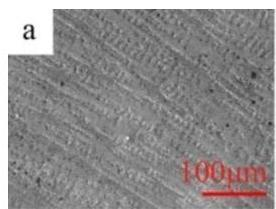

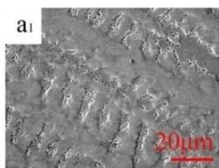

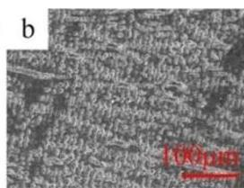

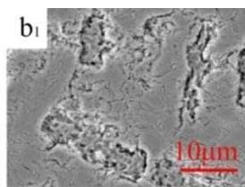

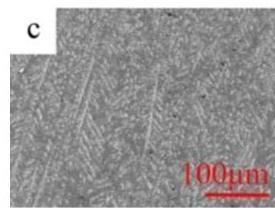

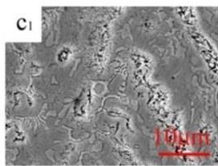

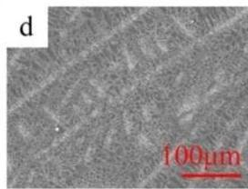

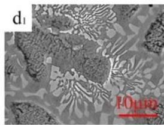

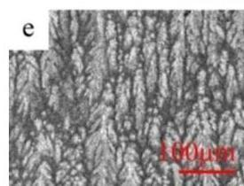
Figure 2. SEM images of as-cast CoCrFeNiPdMn $_x$  ( $x = 0, 0.2, 0.4, 0.6, 0.8$ ): Mn $_0$  ( $\mathbf{a}, \mathbf{a}_1$ ), Mn $_{0.2}$  ( $\mathbf{b}, \mathbf{b}_1$ ), Mn $_{0.4}$  ( $\mathbf{c}, \mathbf{c}_1$ ), Mn $_{0.6}$  ( $\mathbf{d}, \mathbf{d}_1$ ) and Mn $_{0.8}$  ( $\mathbf{e}, \mathbf{e}_1, \mathbf{e}_2, \mathbf{e}_3$ ).

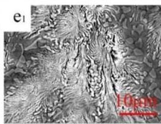

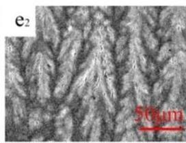

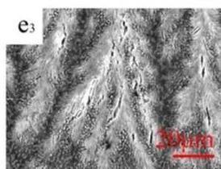

# 3.2. Phase Identification

The TEM results of as-cast  $\mathrm{Mn}_x$  ( $x = 0.2, 0.4, 0.6, 0.8$ ) HEAs are shown in Figures 3-6. In each figure, the bright-field TEM images (a, d), the selected area electron diffraction (SAED) pattern of FCC (c) and  $\mathrm{Mn}_x\mathrm{Pd}_y$  (d) phases, the EDS mapping of Co (e), Cr (f), Fe (g), Ni (h), Pd (i) and Mn (j) elements are shown. To show the effect of Mn addition on the phase transition in the  $\mathrm{Mn}_x$  HEAs, the chemical compositions of FCC and  $\mathrm{Mn}_x\mathrm{Pd}_y$  phases were measured by EDS attached to TEM and EMPA. In the current work, four points were randomly selected for each phase in the fine lamellar region by EDS and five points were measured randomly for each phase in the surrounding coarse granular eutectic region by EPMA. Because the average compositions measured by EDS and EPMA were quite close, only the EPMA results for the FCC solid-solution phase and  $\mathrm{Mn}_x\mathrm{Pd}_y$  intermetallic compound are summarized in Tables 1 and 2, respectively.

Table 1. EPMA results of the FCC phase in the CoCrFeNiPdMn  ${}_{x}$  (  $x = 0 - {0.8}$  ) HEAs (in atomic fraction).

|  HEA | Co | Cr | Fe | Ni | Pd | Mn | FCC Phase  |
| --- | --- | --- | --- | --- | --- | --- | --- |
|  Mn0.2 | 22.32 ± 0.91 | 21.23 ± 0.48 | 19.30 ± 0.41 | 19.79 ± 0.28 | 13.49 ± 0.66 | 2.09 ± 0.36 | CoCrFeNiPd-rich  |
|  Mn0.4 | 22.61 ± 0.53 | 21.92 ± 0.39 | 20.41 ± 0.90 | 20.02 ± 0.60 | 11.75 ± 0.67 | 3.56 ± 0.25 | CoCrFeNiPd-rich  |
|  Mn0.6 | 22.29 ± 0.51 | 22.12 ± 0.76 | 21.32 ± 0.36 | 21.22 ± 0.97 | 8.09 ± 0.89 | 4.22 ± 0.45 | CoCrFeNi-rich  |
|  Mn0.8 | 20.83 ± 0.36 | 21.44 ± 0.45 | 20.84 ± 0.53 | 24.46 ± 0.59 | 6.67 ± 0.70 | 5.12 ± 0.30 | CoCrFeNi-rich  |

Table 2. EPMA results of the  ${\mathrm{{Mn}}}_{x}{\mathrm{{Pd}}}_{y}$  phase in the CoCrFeNiPdMn  ${}_{x}$  (  $x = 0 - {0.8}$  ) HEAs (in atomic fraction).

|  HEA | Co | Cr | Fe | Ni | Pd | Mn | MnxPdy  |
| --- | --- | --- | --- | --- | --- | --- | --- |
|  Mn0.2 | 3.87 ± 0.85 | 7.48 ± 0.51 | 8.55 ± 0.17 | 5.49 ± 0.41 | 47.32 ± 0.65 | 27.29 ± 0.65 | Mn3Pd5  |
|  Mn0.4 | 4.49 ± 0.83 | 7.32 ± 0.21 | 8.71 ± 0.21 | 5.53 ± 0.31 | 46.01 ± 0.76 | 29.44 ± 0.57 | Mn3Pd5  |
|  Mn0.6 | 1.60 ± 0.09 | 4.78 ± 0.36 | 4.27 ± 0.45 | 3.39 ± 0.34 | 43.66 ± 0.93 | 42.31 ± 0.17 | Mn7Pd9  |
|  Mn0.8 | 2.56 ± 0.38 | 6.28 ± 0.11 | 4.69 ± 0.79 | 3.81 ± 0.44 | 40.35 ± 0.67 | 41.71 ± 0.23 | Mn7Pd9  |

Entropy 2019, 21, 288

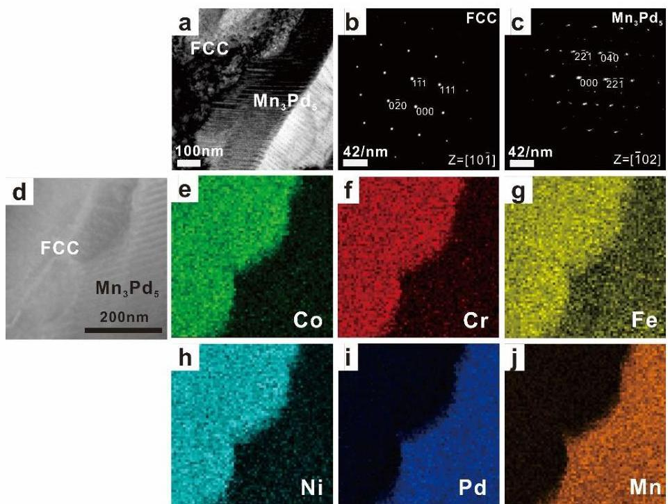
Figure 3. TEM images (a) and (d), the corresponding SAED patterns of FCC (b) and  $\mathrm{Mn}_3\mathrm{Pd}_5$  (c) phases, and the EDS mapping of Co (e), Cr (f), Fe (g), Ni (h), Pd (i), Mn (j) for the as-cast CoCrFeNiPdMn $_{0.2}$  HEA.

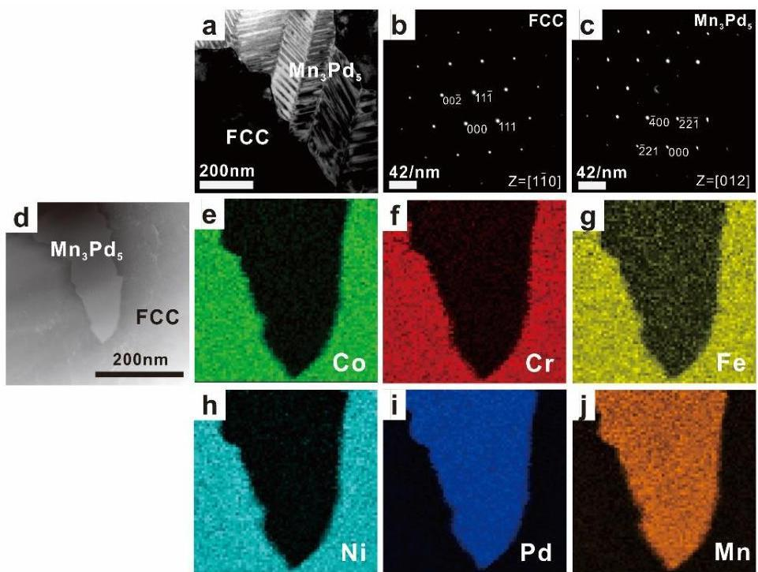
Figure 4. TEM images (a) and (d), the corresponding SAED patterns of FCC (b) and  $\mathrm{Mn}_3\mathrm{Pd}_5$  (c) phases, and the EDS mapping of Co (e), Cr (f), Fe (g), Ni (h), Pd (i), Mn (j) for the as-cast CoCrFeNiPdMn $_{0.4}$  HEA.

Entropy 2019, 21, 288

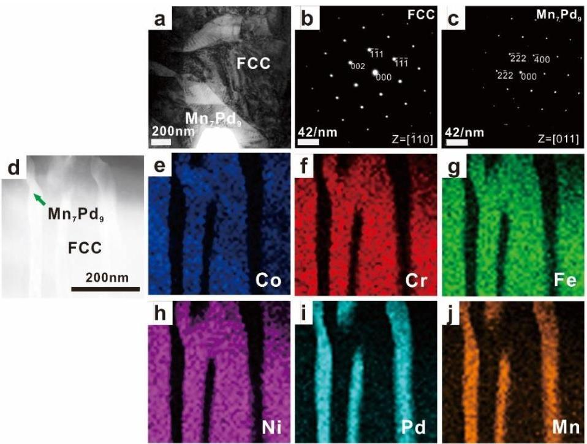
Figure 5. TEM images (a) and (d), the corresponding SAED patterns of FCC (b) and  $\mathrm{Mn}_7\mathrm{Pd}_9$  (c) phases, and the EDS mapping of Co (e), Cr (f), Fe (g), Ni (h), Pd (i), Mn (j) for the as-cast CoCrFeNiPdMn $_{0.6}$  EHEA.

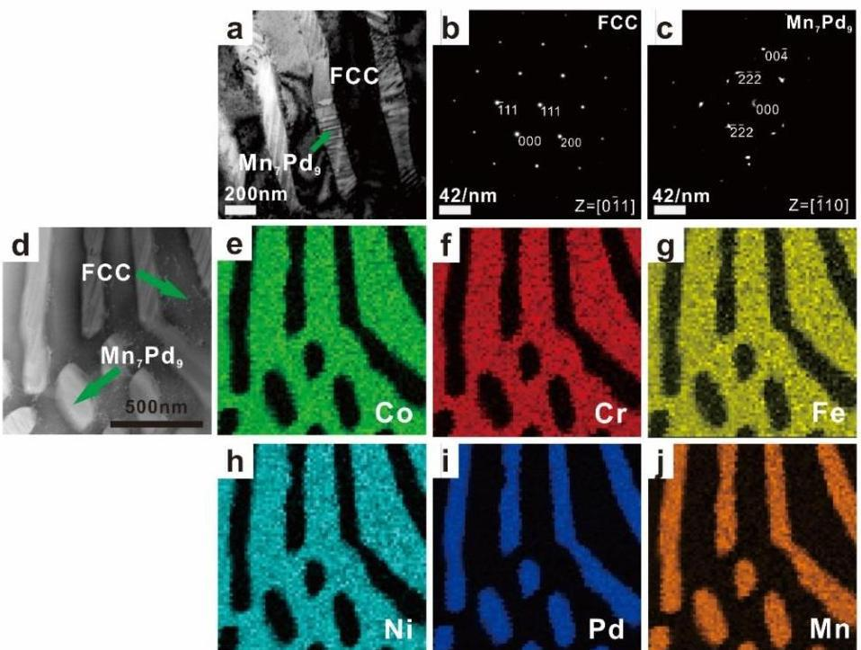
Figure 6. TEM images (a) and (d), the corresponding SAED patterns of FCC (b) and  $\mathrm{Mn}_7\mathrm{Pd}_9$  (c) phases, and the EDS mapping of Co (e), Cr (f), Fe (g), Ni (h), Pd (i), Mn (j) for the as-cast CoCrFeNiPdMn $_{0.8}$  RHEA.

For the  $\mathrm{Mn}_{0.2}$  EHEA, the FCC phase was rich in Co, Cr, Fe, Ni and Pd but depleted of Mn, whereas for the  $\mathrm{Mn}_x\mathrm{Pd}_y$  phase, the compositions of Co, Cr, Fe and Ni were negligible; see Figure 3 and Table 1. According to the SAED patterns taken from the FCC-region and  $\mathrm{Mn}_x\mathrm{Pd}_y$ -region, the matrix was of a FCC structure while the  $\mathrm{Mn}_x\mathrm{Pd}_y$  phase was a  $\mathrm{Mn}_3\mathrm{Pd}_5$  intermetallic compound with lattice parameters

Entropy 2019, 21, 288

of  $a = 0.2285 \, \mathrm{nm}$ ,  $b = 0.1998 \, \mathrm{nm}$  and  $c = 0.2278 \, \mathrm{nm}$ , being consistent with the XRD results in Figure 1. It should be pointed out that even though the composition of Pd in the FCC phase ( $\approx 13.5\%$ ) was much larger than that of Mn ( $\approx 2\%$ ), it was still considerably smaller than that in  $\mathrm{Mn}_3\mathrm{Pd}_5$  intermetallic compound ( $\approx 47\%$ ). Therefore, the fact that the FCC phase was rich in Pd cannot be shown by the EDS mapping; see Figure 3i. For the  $\mathrm{Mn}_{0.4}$  EHEA, the same result could be found from the SAED patterns, i.e., the matrix was the FCC phase and the  $\mathrm{Mn}_x\mathrm{Pd}_y$  phase was the  $\mathrm{Mn}_3\mathrm{Pd}_5$  intermetallic compound. The FCC phase was still a (CoCrFeNiPd)-rich one and similar EDS mappings could be found; see Figure 4e-j.

With the further addition of Mn element, the FCC phases became rich in Co, Cr, Fe and Ni for the  $\mathrm{Mn}_{0.6}$  and  $\mathrm{Mn}_{0.8}$  EHEAs, while the compositions of Mn ( $\sim 42.3\%$  and  $41.7\%$ ) and Pd ( $\sim 43.7\%$  and  $\sim 40.4\%$ ) were comparable in the  $\mathrm{Mn}_x\mathrm{Pd}_y$  phases; see Figures 5e-j and 6e-j, Tables 1 and 2. According to the SAED patterns in Figures 5c and 6c, the  $\mathrm{Mn}_x\mathrm{Pd}_y$  phase could be the  $\mathrm{Mn}_7\mathrm{Pd}_9$  or the  $\mathrm{Mn}_{11}\mathrm{Pd}_{21}$  intermetallic compound with lattice parameters of  $a = b = 0.2267\mathrm{nm}$ ,  $c = 0.203\mathrm{nm}$  or  $a = b = 0.2235\mathrm{nm}$ ,  $c = 0.1816\mathrm{nm}$ . Because the  $\mathrm{Mn}_{11}\mathrm{Pd}_{21}$  phase was neither confirmed experimentally nor theoretically [46], the  $\mathrm{Mn}_x\mathrm{Pd}_y$  phase in the  $\mathrm{Mn}_{0.6}$  and  $\mathrm{Mn}_{0.8}$  EHEAs was ultimately determined to be the  $\mathrm{Mn}_7\mathrm{Pd}_9$  intermetallic compound.

# 3.3. Solidification Path

To confirm further the effect of Mn addition on solidification microstructures, the cooling histories were measured by DSC; see Figure 7. For the  $\mathrm{Mn}_{0.2}$  (the solid line) and  $\mathrm{Mn}_{0.4}$  (the dashed line) EHEAs, two completely separated exothermal peaks could be found during the solidification process. The first and the second peak should correspond to the primary solidification of the FCC phase and following growth of the  $\mathrm{Mn}_3\mathrm{Pd}_5$  intermetallic compound or eutectic growth. For the  $\mathrm{Mn}_{0.6}$  EHEA (the dotted line), two exothermal peaks still exited during the solidification process but they overlapped with each other. As shown in Figures 1 and 2, an increase of the Mn content promoted the formation of  $\mathrm{Mn}_x\mathrm{Pd}_y$  phase, thus intensifying the second exothermal peak during solidification and narrowed the distance between the two peaks as shown in Figure 7. For the  $\mathrm{Mn}_{0.8}$  EHEA, only one solidification peak could be found; see the dashed-dotted line in Figure 7. The peak should correspond to eutectic solidification.

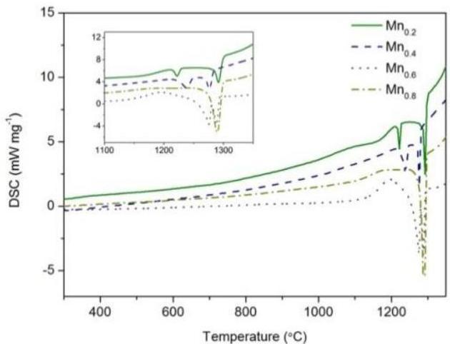
Figure 7. DSC solidification curves of as-cast CoCrFeNiPdMn $_x$  ( $x = 0.2 - 0.8$ ) HEAs. Insert shows the magnified exothermic peaks during solidification.

# 3.4. Mechanical Properties

The nanoindentor was used to measure the hardness and elastic modulus of FCC and  $\mathrm{Mn}_x\mathrm{Pd}_y$  phases; see Figure 8a,b. It should be noted that the lamellar spacing of lamellar eutectics in the  $\mathrm{Mn}_{0.6}$  and  $\mathrm{Mn}_{0.8}$  EHEAs was so fine that it was beyond the measurability of the nanoindentor. In this case, the coarse granular eutectics were measured. From Figure 8a, it can be seen that with an increase in

Entropy 2019, 21, 288

the Mn addition, the hardness and elastic modulus of FCC phase first increased and then decreased. From Table 1, the FCC phase was CoCrFeNiPd-rich for the  $\mathrm{Mn}_{0.2}$  and  $\mathrm{Mn}_{0.4}$  EHEAs while it was CoCrFeNi-rich for the  $\mathrm{Mn}_{0.6}$  and  $\mathrm{Mn}_{0.8}$  EHEAs. From Ref. [49], the measured hardness of CoCrFeNiPd HEA 3.16 GPa was nearly twice of CoCrFeNi HEA 1.47 GPa. This was the reason why the hardness of  $\mathrm{Mn}_0$ ,  $\mathrm{Mn}_{0.2}$  and  $\mathrm{Mn}_{0.4}$  HEAs was much larger than that of  $\mathrm{Mn}_{0.6}$  and  $\mathrm{Mn}_{0.8}$  HEAs; see Figure 8a. For the  $\mathrm{Mn}_x\mathrm{Pd}_y$  phase, the hardness of the  $\mathrm{Mn}_3\mathrm{Pd}_5$  intermetallic compound in the  $\mathrm{Mn}_{0.2}$  (4.9 GPa) and  $\mathrm{Mn}_{0.4}$  (5.3 GPa) EHEAs was much larger than that of the  $\mathrm{Mn}_7\mathrm{Pd}_9$  intermetallic compound in the  $\mathrm{Mn}_{0.6}$  (3.1 GPa) and  $\mathrm{Mn}_{0.8}$  (3.4 GPa) EHEAs. For both the FCC and  $\mathrm{Mn}_x\mathrm{Pd}_y$  phases, the evolution tendencies of hardness were the same as those of the elastic modulus.

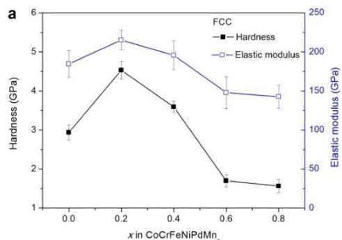
Figure 8. Hardness and elastic modulus of FCC phase (a)  $\mathrm{Mn_xPd_y}$  phase (b) in the CoCrFeNiPdMn $_x$  ( $x = 0.2 - 0.8$ ) HEAs.

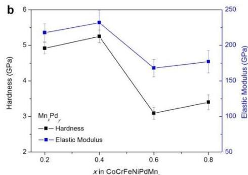

To show further the effect of Mn addition on the mechanical properties, compression tests were conducted for the as-cast  $\mathrm{Mn}_x$  HEAs; see Figure 9 One can see that with the increase of Mn addition, the yielding strength held constantly at about  $650\mathrm{MPa}$ . The fracture strain (strength) decreased from about  $50\%$  (2.4 GPa) for the  $\mathrm{Mn}_{0.2}$  HEA to about  $35\%$  (1.9 GPa) for the  $\mathrm{Mn}_{0.8}$  HEA. The current EHEAs had good strength and ductility.

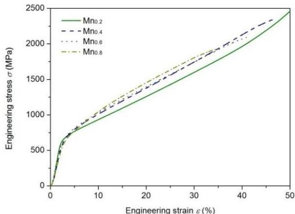
Figure 9. Compressive engineering stress-strain curves of as-cast CoCrFeNiPdMn $_x$  ( $x = 0.2 - 0.8$ ) HEAs.

# 4. Discussion

# 4.1. Effect of Mn Addition on Microstructures

With an increase in the Mn content, the microstructures of  $\mathrm{Mn}_x$  HEAs changed from dendrites for the  $\mathrm{Mn}_0$  HEA to divorced eutectics for the  $\mathrm{Mn}_{0.2}$  and  $\mathrm{Mn}_{0.4}$  EHEAs, to hypoeutectic microstructures for the  $\mathrm{Mn}_{0.6}$  EHEA and finally to eutectic dendrites for the  $\mathrm{Mn}_{0.8}$  EHEA. The eutectic dendrite solidification pattern in the  $\mathrm{Mn}_{0.8}$  EHEA was formed by cooperative growth of the FCC phase and  $\mathrm{Mn}_7\mathrm{Pd}_9$  intermetallic compound. From Tables 1 and 2, the FCC phase was lacking Mn while the  $\mathrm{Mn}_7\mathrm{Pd}_9$  intermetallic compound was lacking Co, Cr, Fe and Ni. Therefore, lateral solute diffusion of

Co, Cr, Fe, Ni and Mn formed the eutectic pattern while longitudinal solute diffusion of Pd made the eutectic interface unstable to a eutectic dendrite.

From Figure 2e_{2},e_{3}, seaweed eutectic dendrites were found for the Mn_{0.8} EHEA. Unlike the normal dendrite pattern where the structure branches with pronounced orientation order, the seaweed pattern is characterized by tip-splitting and the key factor for its formation is weak interface energy anisotropy [50]. Generally, the formation of seaweed dendrites is highly related to alloy compositions and solidification conditions [51,52,53,54]. For example, the effect of Zn content on the microstructures of directional solidification of Al-Zn alloys was studied by X-ray tomographic microscopy and phase-field simulation [51]. Accordingly, an increase in the Zn content modified the interface energy anisotropy, thus leading to the transition from <100> dendrites at low Zn content to <110> dendrites at high Zn content, between which were the <320> seaweed dendrites. For both the undercooled Cu-8.9 wt.% Ni and Cu-3.98 wt.% Ni alloys [53,54], a transition from <100> dendrites to mixed <100> and <111> seaweed dendrites and then to <111> dendrites was reported.

For eutectic solidification that consisted of at least two solid phases, its morphology was determined by a combination effect of eutectic phases and the formation mechanism became more complex. Eutectic seaweed dendrites were reported in the undercooled Co-24.0at.%Sn eutectic alloy, in which the weak interface energy anisotropy ascribed to an alternate arrangement of lamellae and alloy physical properties [55]. For the current Mn_{x} HEAs, primary FCC dendrites were found in the divorced eutectics (e.g. Mn_{0.2} and Mn_{0.4}) and the hypoeutectic microstructures (e.g. Mn_{0.6}), indicated that its interface energy anisotropy was not weak. From Table 1 and Table 2, the addition of Mn changed not only the compositions of FCC phase but also those of the Mn_{7}Pd_{9} intermetallic compound. Therefore, it was quite possible that the addition of Mn influenced the interface energy anisotropy of both the FCC/liquid and Mn_{x}Pd_{y}/liquid interfaces, thus forming the seaweed eutectic dendrites in the Mn_{0.8} EHEA.

### 4.2. Effect of Mn Addition on Mechanical Properties

Because an increase in Mn addition results in a transition from the CoCrFeNiPd-rich to the CoCrFeNi-rich FCC phase in the Mn_{x} HEAs (Table 1) and the hardness of CoCrFeNiPd HEA is much higher than that of CoCrFeNi HEA [49], the hardness of the FCC phase should decrease with increasing Mn addition. This was however, not the case, e.g. the hardness increased first and then decreased; see Figure 8a. The larger hardness of the FCC phase in the Mn_{0.2} and Mn_{0.4} EHEAs than that in the Mn_{0} HEA could be ascribed to the solute strengthening effect. But this effect alone cannot explain the fact that the hardness of the FCC phase in the Mn_{0.2} EHEA was larger than that in the Mn_{0.4} EHEA. The TEM results showed that a small amount of Mn addition might promote but a large amount would suppress the formation of nanotwins in the FCC phase; see Figure 10. Abundant nanotwins of about 50 nm could be found in the Mn_{0.2} EHEA, whereas for the Mn_{0.4} EHEA, it was almost free of nanotwins and so were the Mn_{0.6} and Mn_{0.8} EHEAs (not shown here). Therefore, the solute strengthening effect and the formation of nanotwins made the hardness increase first with increased Mn addition, the suppression of nanotwins then decreased the hardness and finally the transition from the CoCrFeNiPd-rich to the CoCrFeNi-rich FCC phase made the hardness decrease considerably.

Besides, hierarchical nanotwins were found in the Mn_{x}Pd_{y} intermetallic compounds of Mn_{0.2}-Mn_{0.8} EHEAs; see Figure 10. With the help of Image-Pro Plus software, the spacing of the primary twins (λ_{1}) and secondary twins (λ_{2}) in the Mn_{x}Pd_{y} intermetallic compound were measured for the Mn_{0.2}-Mn_{0.8} EHEAs; see Table 3. With an increase in the Mn addition, λ_{1} decreased but λ_{2} remained unchanged for the Mn_{3}Pd_{5} intermetallic compound. For the Mn_{7}Pd_{9} intermetallic compound, λ_{1} did not change significantly but λ_{2} decreased. The measured spacing of primary twins (242.1 nm, 180.3 nm) and secondary twins (10.0 nm, 9.98 nm) in the Mn_{3}Pd_{5} intermetallic compound were much larger than those in the Mn_{7}Pd_{9} intermetallic compound (15.0 nm, 15.0 nm for λ_{1}, 2.22 nm and 1.46 nm for λ_{2}) but the hardness of the former was much larger than that of the latter. However, for the same phase, a decrease of either λ_{1} or λ_{2} would increase the hardness of the intermetallic

Entropy 2019, 21, 288

compound, being consistent with Yuan and Wu [56] who studied the size effects of primary and secondary twins on the atomistic deformation mechanisms in the hierarchically nanotwinned metals.

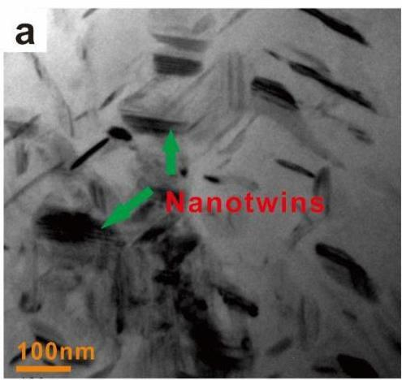
Figure 10. TEM images of FCC phase in the  $\mathrm{Mn}_{0.2}$  (a) and  $\mathrm{Mn}_{0.4}$  (b) EHEAs.

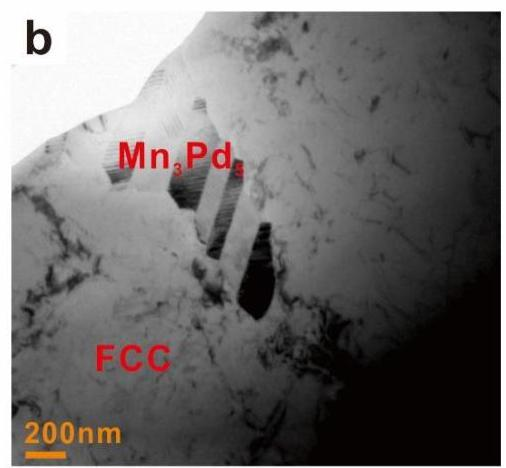

Table 3. The measured spacing of primary twins  $(\lambda_{1})$  and secondary twins  $(\lambda_{2})$  for the  $\mathrm{Mn}_x\mathrm{Pd}_y$  phase in the CoCrFeNiPdMn  $x$ $(x = 0.2 - 0.8)$  EHEAs.

|  EHEA (MnxPdy) | Spacing of Primary Twins λ1 (nm) | Spacing of Secondary Twins λ2 (nm)  |
| --- | --- | --- |
|  Mn0.2 (Mn3Pd5) | 242.10 ± 26.63 | 10.02 ± 1.10  |
|  Mn0.4 (Mn3Pd5) | 180.33 ± 19.84 | 9.99 ± 1.22  |
|  Mn0.6 (Mn7Pd9) | 14.96 ± 16.46 | 2.22 ± 0.24  |
|  Mn0.8 (Mn7Pd9) | 15.02 ± 1.65 | 1.46 ± 0.16  |

# 4.3. Designing Rules for EHEAs

Even though the EHEAs have good processing and mechanical properties, most of the reported EHEAs were found by the trial and error method. Up to now, several studies were carried out for designing EHEAs [42,57-59]. Lu et al. [57] started from their representative AlCoCrFeNi $_{2.1}$  EHEA. They divided the constituent elements into two different groups, i.e., Al and Ni with very high negative mixing of enthalpy  $(-22\mathrm{kJ}\cdot \mathrm{mol}^{-1})$ , and Co, Cr and Fe with similar atomic size and very small negative mixing of enthalpy; see Table 4. Their method was to substitute Al by Zr, Nb, Hf and Ta that had very high negative mixing of enthalpy with Ni. After using the enthalpy mixing of equimolar binary alloys to obtain the eutectic points, four new EHEAs, i.e.,  $\mathrm{Zr_{0.6}CoCrFeNi_{2.1}}$ ,  $\mathrm{Nb_{0.74}CoCrFeNi_{2.1}}$ ,  $\mathrm{Hf_{0.55}CoCrFeNi_{2.1}}$  and  $\mathrm{Ta_{0.65}CoCrFeNi_{2.1}}$ , were reported. In their subsequent work [58], the eutectic composition containing (Ni, Co, Cr, Fe)-rich solid-solution phase in the (Co, Cr, Fe, Ni)-(Nb, Ta, Zr, Hf) binary systems were averaged to obtain the eutectic compositions of pseudo binary alloy  $\mathrm{CoCrFeNiM_x}$  ( $\mathrm{M = Nb}$ , Ta, Zr and Hf). Consequently, four new EHEAs, i.e.,  $\mathrm{Zr_{0.51}CoCrFeNi}$ ,  $\mathrm{Nb_{0.6}CoCrFeNi}$ ,  $\mathrm{Hf_{0.49}CoCrFeNi}$  and  $\mathrm{Ta_{0.47}CoCrFeNi}$ , were found. Even though the actual eutectic compositions were very close to the predicted ones using the above simple methods, the former method was based on a known EHEA, which might limit its application [59] and for the latter, there should be a eutectic reaction between the added element and any element in the base alloy which is not always the case for EHEAs. For example, for the  $\mathrm{CoCrFeNiMnPd_x}$  EHEAs, eutectic reactions happen only in the Mn-Pd and Cr-Pd binary alloys while for the  $\mathrm{CoCrFeNiPdMn_x}$  EHEAs, eutectic reactions can be found only in the Pd-Mn binary alloy.

He et al. [42] designed a pseudo binary alloy, i.e., the CoCrFeNi HEA with a single FCC solid-solution phase as the base alloy and Nb as the additional element. Such simple pseudo binary method was followed by Jin et al. [59]. First, they chose one HEA with a single solid-solution phase and one stable binary intermetallic compound. After that, they obtained the HEA with dual phase

Entropy 2019, 21, 288

by mixing the two phases. To ensure the formation of an eutectic structure, three conditions were proposed: (1) The single solid-solution phase should be stable enough without any segregation and precipitation; (2) the binary intermetallic compound should be stable from room temperature to its melting point; (3) the intermetallic compound must have the most negative mixing of enthalpy among all the binary combinations in the alloy. With  $\mathrm{CoCrFeNi_2}$ ,  $\mathrm{Co_2CrFeNi}$  and  $\mathrm{CoCrFe_2Ni}$  as the HEAs with a single FCC solid-solution phase and NiAl as the binary intermetallic compound, they found three new EHEAs.

Table 4. The mixing enthalpy  $\Delta H_{mix}$  (kJ·mol $^{-1}$ ) of atom pairs in the current CoCrFeNiPdMn $_x$  ( $x = 0.2-0.8$ ) and some other EHEAs.

|   | Co | Cr | Ni | Mn | Pd | Al | Nb | Ta | Zr | Hf  |
| --- | --- | --- | --- | --- | --- | --- | --- | --- | --- | --- |
|  Fe | -1 | -1 | -2 | 0 | -4 | -11 | -16 | -15 | -25 | -21  |
|  Co |  | -4 | 0 | -5 | -1 | -19 | -25 | -24 | -41 | -35  |
|  Cr |  |  | -7 | 2 | -15 | -10 | -9 | -7 | -12 | -9  |
|  Ni |  |  |  | -8 | 0 | -22 | -30 | -29 | -49 | -42  |
|  Mn |  |  |  |  | -23 | -19 | -4 | -4 | -15 | -12  |

For the CoCrFeNiMnPd $_x$  and CoCrFeNiPdMn $_x$  EHEAs, CoCrFeNi can be taken to be the HEA with a single FCC solid-solution phase and MnPd can be taken to be the binary intermetallic compound; their mixing led to the CoCrFeNiMnPd EHEA [47]. Even though the mixing enthalpy between Mn and Pd was the most negative one (Table 4), the MnPd intermetallic compound was not stable enough from room temperature to its melting point [46]. As a result, the Mn $_x$ Pd $_y$  intermetallic compound in the eutectics depending on the compositions could be Mn $_2$ Pd $_3$ , Mn $_3$ Pd $_5$  or Mn $_7$ Pd $_9$  [46,47]. In one word, the pseudo binary method could be a simple way for designing EHEAs but the designing rules still need to be studied further to achieve general and effective rules. According to our study, the consistent elements in the EHEAs with a solid-solution phase and an intermetallic compound can be divided into two groups, i.e., two of them with very high mixing of enthalpy forms the intermetallic compound and the rest of them with very small mixing of enthalpy forms the solid-solution phase. There should be a eutectic reaction in the binary alloy system for the two elements in the first group. One of the eutectic phases is the solid-solution phase which should have a good solubility for all the elements in the second group. The other one is the intermetallic compound which might have negligible solubility for all the elements in the second group.

# 5. Conclusions

In the current work, the  $\mathrm{Mn}_x$  ( $x = 0, 0.2, 0.4, 0.6, 0.8$ ) HEAs were prepared and characterized. Our main conclusions were as follows:

(1) With an increase in Mn addition, the microstructures of CoCrFeNiPdMn $_x$  HEAs changed from dendrites to divorced eutectics, to hypoeutectic microstructures and finally to eutectic dendrites. For the Mn $_{0.2}$  and Mn $_{0.4}$  (Mn $_{0.6}$  and Mn $_{0.8}$ ) EHEA, the FCC phase was a CoCrFeNiPd-rich (CoCrFeNi-rich) phase and the Mn $_x$ Pd $_y$  intermetallic compound was Mn $_3$ Pd $_5$  (Mn $_7$ Pd $_9$ ). Addition of Mn might influence the interface energy anisotropy of both the FCC/liquid and Mn $_x$ Pd $_y$ /liquid interfaces, thus forming the seaweed eutectic dendrites in the Mn $_{0.8}$  EHEA.
(2) With an increase in Mn addition, the hardness of FCC phase increased first and then decreased. The solute strengthening effect of Mn and the formation of nanotwins made the hardness increase firstly, the suppression of nanotwins then decreased the hardness and finally the transition from the CoCrFeNiPd-rich to the CoCrFeNi-rich FCC phase made the hardness decrease considerably. For the  $\mathrm{Mn}_3\mathrm{Pd}_5$  and  $\mathrm{Mn}_7\mathrm{Pd}_9$  intermetallic compounds, a decrease of either  $\lambda_{1}$  or  $\lambda_{2}$  would increase the hardness.

(3) The current EHEA system violates to some extent all the designing rules for EHEAs. The pseudo binary method was improved accordingly and the current work might be helpful for accelerating designing of potential EHEAs.

Y.T. and J.L. conceived and designed the experiments; Y.T. performed the experiments; Y.T. J.W. H.K. performed the data analysis and drafted the manuscript. Y.T. J.W. H.K. participated in the data analysis, discussion, and interpretation. Y.T. and J.L. completed the paper.

This research was funded by the National Nature Science Foundation of China, grant number 51571161, 51774240 and 51690163, the Natural Science Basic Research Plan in Shaanxi Province of China, grant number 2016JQ5003 and the Program of Introducing Talents of Discipline to Universities, grant number B08040.

The authors declare no conflicts of interest.

1. Yeh, J.W.; Chen, S.K.; Lin, S.J.; Gan, J.Y.; Chin, T.S.; Shun, T.T.; Tsau, C.H.; Chang, S.Y. Nanostructures high-entropy alloys with multiple principal elements: Novel alloy design concepts and outcomes. Adv. Eng. Mater. 2004, 6, 299--303. [CrossRef]
2. Cantor, B.; Chang, I.T.H.; Knight, P.; Vincent, A.J.B. Microstructural development in equiatomic multicomponent alloys. Mater. Sci. Eng. A 2004, 375--377, 213--218. [CrossRef]
3. Zhang, Y.; Zuo, T.T.; Tang, Z.; Gao, M.C.; Dahmen, K.A.; Liaw, P.K.; Lu, Z.P. Microstructures and properties of high-entropy alloys. Prog. Mater. Sci. 2014, 61, 1--93. [CrossRef]
4. Tsai, M.H.; Yeh, J.W. High-entropy alloys: A critical review. Mater. Res. Lett. 2014, 2, 107--123. [CrossRef]
5. Tsai, M.H. Three Strategies for the Design of Advanced High-Entropy Alloys. Entropy 2016, 18, 252. [CrossRef]
6. Yeh, J.W. Physical metallurgy of high-entropy alloys. JOM 2015, 67, S499--S503. [CrossRef]
7. Pickering, E.J.; Jones, N.G. High-entropy alloys: A critical assessment of their founding principles and future prospects. Int. Mater. Rev. 2016, 61, 183--202. [CrossRef]
8. Ye, Y.F.; Wang, Q.; Lu, J.; Liu, C.T.; Yang, Y. High entropy alloy: Challenges and prospects. Mater. Today 2016, 19, 349--362. [CrossRef]
9. Miracle, D.B.; Senkov, O.N. A critical review of high entropy alloys and related concepts. Acta Mater. 2017, 122, 448--511. [CrossRef]
10. Gorsse, S.; Miracle, D.B.; Senkov, O.N. Mapping the world of complex concentrated alloys. Acta Mater. 2017, 135, 177--187. [CrossRef]
11. Gludovatz, B.; Hohenwarter, A.; Catoor, D.; Chang, E.H.; George, E.P.; Rirtchie, R.O. A fracture-resistant high-entropy alloy for cryogenic applications. Science 2014, 345, 1153. [CrossRef] [PubMed]
12. Li, Z.M.; Pradeep, K.G.; Deng, Y.; Raabe, D.; Tasan, C.C. Metastable high-entropy dual-phase alloys overcome the strength--ductility trade-off. Nature 2016, 534, 227--230. [CrossRef]
13. Lei, Z.F.; Liu, X.J.; Wu, Y.; Wang, H.; Jiang, S.; Wang, S.; Hui, X.; Wu, Y.; Gault, B.; Kontis, P. Enhanced strength and ductility in a high-entropy alloy via ordered oxygen complexes. Nature 2018, 563, 546--550. [CrossRef] [PubMed]
14. Yang, T.; Zhao, Y.L.; Tong, Y.; Jiao, Z.B.; Wei, J.; Cai, J.X.; Han, X.D.; Chen, D.; Hu, A.; Kai, J.J. Multicomponent intermetallic nanoparticles and superb mechanical behaviors of complex alloys. Science 2018, 362, 933--937. [CrossRef] [PubMed]
15. Senkov, O.N.; Wilks, G.B.; Scott, J.M.; Miracle, D.B. Mechanical properties of Nb25Mo25Ta25W25 and V20Nb20Mo20Ta20W20 refractory high entropy alloys. Intermetallics 2011, 19, 698--706. [CrossRef]
16. Chen, S.Y.; Yang, X.; Dahmen, K.A.; Liaw, P.K.; Zhang, Y. Microstructures and Crackling Noise of AlxNbTiMoV High Entropy Alloys. Entropy 2014, 16, 870--884. [CrossRef]
17. Yao, H.W.; Qiao, J.W.; Gao, M.C.; Hawk, J.A.; Ma, S.G.; Zhou, H.F. MoNbTaV Medium-Entropy Alloy. Entropy 2016, 18, 189. [CrossRef]
18. Ye, Y.X.; Liu, C.Z.; Wang, H.; Nieh, T.G. Friction and wear behavior of a single-phase equiatomic TiZrHfNb high-entropy alloy studied using a nanoscratch technique. Acta Mater. 2018, 147, 78--89. [CrossRef]
19. Tang, Z.; Yuan, T.; Tsai, C.W.; Yeh, J.W.; Lundin, C.D.; Liaw, P.K. Fatigue behavior of a wrought Al0.5CoCrCuFeNi two-phase high-entropy alloy. Acta Mater. 2015, 99, 247--258. [CrossRef]

Entropy 2019, 21, 288

20. Zou, Y.; Ma, H.; Spolenak, R. Ultrastrong ductile and stable high-entropy alloys at small scales. Nat. Commun. 2015, 6, 7748. [CrossRef] [PubMed]
21. Lu, Y.P.; Dong, Y.; Guo, S.; Jiang, L.; Kang, H.J.; Wang, T.M.; Wen, B.; Wang, Z.J.; Jie, J.C.; Cao, Z.Q.; et al. A promising new class of high-temperature alloys: Eutectic high entropy alloys. Sci. Rep. 2014, 4, 6200. [CrossRef] [PubMed]
22. Yu, Y.; He, F.; Qiao, Z.H.; Wang, Z.J.; Liu, W.M.; Yang, J. Effects of temperature and microstructure on the triblogical properties of CoCrFeNiNb x eutectic high entropy alloys. J. Alloys Compd. 2019, 775, 1376-1385. [CrossRef]
23. Li, D.Y.; Li, C.X.; Feng, T.; Zhang, Y.D.; Sha, G.; Lewandowski, J.J.; Liaw, P.K.; Zhang, Y. High-entropy AlCoCrFeNi alloy fibers with high tensile strength and ductility at ambient and cryogenic temperatures. Acta Mater. 2017, 123, 285–294. [CrossRef]
24. Zhang, Y.; Zuo, T.T.; Cheng, Y.Q.; Liaw, P.K. High-entropy alloys with high saturation magnetization, electrical resistivity, and malleability. Sci. Rep. 2013, 3, 1455. [CrossRef] [PubMed]
25. Yuan, Y.; Wu, Y.; Tong, X.; Zhang, H.; Wang, H.; Liu, X.J.; Ma, L.; Suo, H.L.; Lu, Z.P. Rare-earth high-entropy alloys with giant magnetocaloric effect. Acta. Mater. 2017, 125, 481–489. [CrossRef]
26. Zhou, Q.; Du, Y.; Han, W.C.; Ren, Y.; Zhai, H.M.; Wang, H.F. Identifying the origin of strain rate sensitivity in a high entropy bulk metallic glass. Scr. Mater. 2019, 164, 121-125. [CrossRef]
27. Zhang, Y.; Zhou, Y.J.; Lin, J.P.; Chen, G.L.; Liaw, P.K. Solid-solution phase-formation rules for multi-component alloys. Adv. Eng. Mater. 2008, 10, 534-538. [CrossRef]
28. Yang, X.; Zhang, Y. Prediction of high entropy stabilized solid solution in multi-component alloys. Mater. Chem. Phys. 2012, 132, 233-238. [CrossRef]
29. Otto, F.; Yang, Y.; Bei, H.; George, E.P. Relative effects of enthalpy and entropy on the phase stability of equiatomic high entropy alloys. Acta Mater. 2013, 61, 2628-2638. [CrossRef]
30. Tsai, M.H.; Li, J.H.; Fan, A.C.; Tsai, P.H. Incorrect predictions of simple solid solution high entropy alloys: Cause and possible solution. Scr. Mater. 2017, 127, 6-9. [CrossRef]
31. King, D.J.M.; Middle burgh, S.C.; Mcgregor, A.G.; Cortie, M.B. Predicting the formation and stability of single phase high entropy alloys. Acta. Mater. 2016, 104, 172-179. [CrossRef]
32. Sohn, S.; Liu, Y.H.; Liu, J.B.; Gong, P.; Prades-Rodel, S.; Blatter, A.; Scanley, B.E.; Broadbridge, C.C.; Schroers, J. Noble metal high entropy alloys. Scr. Mater. 2017, 126, 29-32. [CrossRef]
33. Stepanov, N.D.; Shaysultanov, D.G.; Salishchev, G.A.; Tikhonovsky, M.A.; Oleynik, E.E.; Tortika, A.S.; Senkov, O.N. Effect of V content on microstructure and mechanical properties of the CoCrFeMnNiVx high entropy alloys. J. Alloys Compd. 2015, 628, 170-185. [CrossRef]
34. Xu, X.D.; Liu, P.; Guo, S.; Hirata, A.; Fujita, T.; Nieh, T.G. Nanoscale phase separation in a fcc-based CoCrCuFeNiAl high entropy alloy. Acta. Mater. 2015, 84, 145-152. [CrossRef]
35. Lu, Y.P.; Gao, X.Z.; Jiang, L.; Chen, Z.M.; Wang, T.; Jie, J.; Kang, H.; Zhang, Y.; Guo, S.; Ruan, H. Directly cast bulk eutectic and near-eutectic high entropy alloys with balanced strength and ductility in a wide temperature range. Acta Mater. 2017, 124, 143-150. [CrossRef]
36. Guo, N.N.; Wang, L.; Luo, L.S.; Li, X.Z.; Su, Y.Q.; Guo, J.J.; Fu, H.Z. Microstructure and mechanical properties of refractory MoNbHfZrTi high-entropy alloy. Mater. Des. 2015, 81, 87-94. [CrossRef]
37. Chen, R.; Qin, G.; Zheng, H.T.; Wang, L.; Su, Y.Q.; Chiu, Y.L.; Ding, H.S.; Guo, J.J.; Fu, H.Z. Composition design of high entropy alloy using the valence electron concentration to balance strength and ductility. Acta Mater. 2018, 144, 129-137. [CrossRef]
38. Lu, Y.P.; Gao, X.X.; Dong, Y.; Wang, T.M.; Chen, H.; Maob, H.; Zhao, Y.; Jiang, H.; Cao, Z.; Li, T. Preparing bulk ultrafine-microstructure high entropy alloys via direct solidification. Nanoscale 2017, 10, 1039. [CrossRef]
39. Ai, C.; He, F.; Guo, M.; Zhou, J.; Wang, Z.J.; Yuan, Z.W.; Guo, Y.J.; Liu, Y.L.; Liu, L. Alloy design, mechanical and macromechanical properties of CoCrFeNiTax eutectic high entropy alloys. J. Alloys Compd. 2018, 735, 2653-2662. [CrossRef]
40. Wani, I.S.; Bhattacharjee, T.; Sheikh, S.; Lu, Y.P.; Chatterjee, S.; Bhattacharjee, P.P.; Guo, S.; Tsuji, N. Ultrafine-grained AlCoCrFeNi eutectic high entropy alloy. Mater. Res. Lett. 2016, 4, 174-179. [CrossRef]
41. Bhattacharjee, T.; Wani, I.S.; Sheikh, S.; Clark, I.T.; Okawa, T.; Guo, S.; Bhattacharjee, P.P.; Tsuji, N. Simultaneous strength-ductility enhancement of a nano-lamellar AlCoCrFeNi2.1 eutectic high entropy alloy by cryo-rolling and annealing. Sci. Rep. 2018, 8, 3276. [CrossRef]

Entropy 2019, 21, 288

42. He, F.; Wang, Z.J.; Cheng, P.; Wang, Q.; Li, J.J.; Dang, Y.Y.; Wang, J.C.; Liu, C.T. Designing eutectic high entropy alloys of CoCrFeNiNbx. J. Alloys Compd. 2016, 656, 284-289. [CrossRef]
43. He, F.; Wang, Z.J.; Shang, X.L.; Leng, C.; Li, J.J.; Wang, J.C. Stability of lamellar structures in CoCrFeNiNbx eutectic high entropy alloys at elevated temperatures. Mater. Des. 2016, 104, 259-264. [CrossRef]
44. Huo, W.Y.; Zhou, H.; Fang, F.; Xie, Z.H.; Jiang, J.Q. Microstructure and mechanical properties of CoCrFeNiZrx eutectic high entropy alloys. Mater. Des. 2017, 134, 226-233. [CrossRef]
45. Lucas, M.S.; Mauger, L.; Muoz, J.A.; Xiao, Y.M.; Sheets, A.O.; Semiatin, S.L.; Horwath, J.; Turgut, Z. Magnetic and vibrational properties of high-entropy alloys. J. Appl. Phys. 2011, 109, 07E307. [CrossRef]
46. Karadeniz, E.P.; Lang, P.; Moszner, F.; Pogatscher, S.; Ruban, A.V.; Uggowitz, P.J.; Kozeschnik, E. Thermodynamics of Pd-Mn phases and extension to the Fe-Mn-Pd system. *Calphad* 2015, 51, 314-333. [CrossRef]
47. Tan, Y.M.; Li, J.S.; Wang, J.; Kou, H.C. Seaweed eutectic-dendritic solidification pattern in a CoCrFeNiMnPd eutectic high-entropy alloy. Intermetallics 2017, 85, 74-79. [CrossRef]
48. Tan, Y.M.; Li, J.S.; Wang, J.; Kolbe, M.; Kou, H.C. Microstructure characterization of CoCrFeNiMnPdx eutectic high entropy alloys. J. Alloys Compd. 2018, 731, 600-611. [CrossRef]
49. Wang, J.; Guo, T.; Li, J.S.; Jia, W.J.; Kou, H.C. Microstructure and mechanical properties of non-equilibrium solidified CoCrFeNi high entropy alloy. Mater. Chem. Phys. 2018, 200, 192-196. [CrossRef]
50. Ben-Jacob, E.; Garik, P. The formation of patterns in non-equilibrium growth. Nature 1990, 343, 523-530. [CrossRef]
51. Friedli, J.; Fife, J.L.; Di Napoli, P.; Rappaz, M. Dendritic Growth Morphologies in Al-Zn Alloys—Part I: X-ray Tomographic Microscopy. Metall. Mater. Trans. A 2013, 44, 5522-5531. [CrossRef]
52. Dantzig, J.A.; Di Napoli, P.; Friedli, J.; Rappaz, M. Dendritic Growth Morphologies in Al-Zn Alloys—Part II: Phase-Field Computations. Metall. Mater. Trans. A 2013, 44, 5532–5543. [CrossRef]
53. Castle, E.G.; Mullis, A.M.; Cochrane, R.F. Evidence for an extensive, undercooling-mediated transition in growth orientation, and novel dendritic seaweed microstructures in Cu-8.9 wt.% Ni. Acta Mater. 2014, 66, 378-387. [CrossRef]
54. Castle, E.G.; Mullis, A.M.; Cochrane, R.F. Mechanism selection for spontaneous grain refinement in undercooled metallic melts. Acta Mater. 2014, 77, 76-84. [CrossRef]
55. Liu, L.; Li, J.F.; Zhou, Y.H. Solidification interface morphology pattern in the undercooled Co-24.0 at.% Sn eutectic melt. Acta Mater. 2011, 59, 5558-5567. [CrossRef]
56. Yuan, F.P.; Wu, X.L. Size effects of primary/secondary twins on the atomistic deformation mechanisms in hierarchically nanotwinned metals. J. Appl. Phys. 2013, 113, 203516. [CrossRef]
57. Lu, Y.P.; Jiang, H.; Guo, S.; Wang, T.M.; Cao, Z.Q.; Li, T.J. A new strategy to design eutectic high entropy alloys using mixing enthalpy. Intermetallics 2017, 91, 124-128. [CrossRef]
58. Jiang, H.; Han, K.M.; Gao, X.X.; Lu, Y.P.; Cao, Z.Q.; Gao, M.C.; Hawk, J.A.; Li, T.J. A new strategy to design eutectic high-entropy alloys using simple mixture method. Mater. Des. 2018, 142, 101–105. [CrossRef]
59. Jin, X.; Zhou, Y.; Zhang, L.; Du, X.Y.; Li, B.S. A new pseudo binary strategy to design eutectic high entropy alloys using mixing enthalpy and valence electron concentration. Mater. Des. 2018, 143, 49-55. [CrossRef]

© 2019 by the authors. Licensee MDPI, Basel, Switzerland. This article is an open access article distributed under the terms and conditions of the Creative Commons Attribution (CC BY) license (http://creativecommons.org/licenses/by/4.0/).