#

entropy

MDPI

Article

# Effects of Annealing on Microstructure and Mechanical Properties of Metastable Powder Metallurgy CoCrFeNiMo $_{0.2}$  High Entropy Alloy

Cui Zhang  $^{1}$ , Bin Liu  $^{1,*}$ , Yong Liu  $^{1}$ , Qihong Fang  $^{2}$ , Wenmin Guo  $^{1,*}$  and Hu Yang  $^{3}$

$^{1}$  State Key Laboratory for Powder Metallurgy, Central South University, Changsha 410083, China; cuizhang@csu.edu.cn (C.Z.); yonliu@csu.edu.cn (Y.L.)
2 College of Mechanical and Vehicle Engineering, Hunan University, Changsha 410082, China; fangqh1327@hnu.edu.cn
3 Yuanmeng Precision Technology (Shenzhen) Institute, Shenzhen 518055, China; yang.hu@weixiongtech.cn
* Correspondence: binliu@csu.edu.cn (B.L.); talangfeixueguo@163.com (W.G.); Tel.: +86-731-8887-7669 (B.L.); +86-739-530-5016 (W.G.)

Received: 15 February 2019; Accepted: 24 April 2019; Published: 30 April 2019

check for updates

Abstract: A CoCrFeNiMo $_{0.2}$  high entropy alloy (HEA) was prepared through powder metallurgy (P/M) process. The effects of annealing on microstructural evolution and mechanical properties of P/M HEAs were investigated. The results show that the P/M HEA exhibit a metastable FCC single-phase structure. Subsequently, annealing causes precipitation in the grains and at the grain boundaries simultaneously. As the temperature increases, the size of the precipitates grows, while the content of the precipitates tends to increase gradually first, and then decrease as the annealing temperature goes up to  $1000^{\circ}\mathrm{C}$ . As the annealing time is prolonged, the size and content of the precipitates gradually increases, eventually reaching a saturated stable value. The mechanical properties of the annealed alloys have a significant correspondence with the precipitation behavior. The larger the volume fraction and the size of the precipitates, the higher the strength and the lower the plasticity of the HEA. The CoCrFeNiMo $_{0.2}$  high entropy alloy, which annealed at  $800^{\circ}\mathrm{C}$  for  $72\mathrm{h}$ , exhibited the most excellent mechanical properties with the ultimate tensile strength of about 850 MPa and an elongation of about  $30\%$ . Nearly all of the annealed HEAs exhibit good strength-ductility combinations due to the significant precipitation enhancement and nanotwinning. The separation of the coarse precipitation phase and the matrix during the deformation process is the main reason for the formation of micropores. Formation of large volume fraction of micropores results in a decrease in the plasticity of the alloy.

Keywords: powder metallurgy; high entropy alloy; microstructure; precipitation strengthening; mechanical properties

# 1. Introduction

Designing strong and ductile metals has been among the most ambitious goals for metallurgists [1-4]. During the past decade, a new concept of high entropy alloys (HEAs), which is broadly defined based on the high entropy effect of alloys with multi-components, has attracted great attention due to their unique superior properties, such as high strength, good ductility, high thermal stability, corrosion and oxidation resistance [5-7]. The most studied HEAs can be divided into two categories: one is FCC HEAs, with Fe, Co, Ni, Cr, Mn and other transition elements as main components, and the other is BCC HEAs, with refractory metals as main components [8-10]. Previous studies have demonstrated that FCC structured HEAs generally exhibited high tensile elongation but relatively low

Entropy 2019, 21, 448; doi:10.3390/e21050448

www.mdpi.com/journal/entropy

yield strength, while BCC alloys are the opposite, although some relatively ductile BCC refractory HEAs have been reported [11,12,13].

Simultaneous improvement of strength and ductility of alloys has been very challenging. Although single-phase FCC high-entropy alloys struggle to meet the high strength requirements of engineering materials, such alloys exhibit high work hardening rates and uniform deformation behavior [14,15]. These characteristics make high-entropy alloys prone to be an excellent composite matrix. Yang et al. [1] reported that the FCC based (CoFeNi)86-Al7Ti7 alloy can be significantly strengthened by the L12 multicomponent intermetallic nanoparticles and exhibit superior strength of 1.5 GPa and ductility as high as 50% in tension at ambient temperature. Liu et al. [16] reported that the FCC CoCrFeNiNbx can be significantly strengthened by the Nb-enriched Laves phase with the HCP structure. He et al. [17] reported that the addition of Al to the CoCrFeNiMn alloy can form a BCC phase, resulted in a high tensile strength up to 1174 MPa. The above studies show that the formation of high hardness reinforcing particles is an effective way to prepare high performance high entropy composite alloys.

Presently, different kinds of topologically close-packed (TCP) phases, such as σ, μ, Laves, etc. are observed in HEAs [18,19]. Adding this reinforcing phase to the FCC high entropy alloys can significantly increase their strength, but at the same time significantly reduce their plasticity [20]. Based on the precipitation strengthening effect, the most important thing is to control the morphology and distribution of the precipitated phase, and then to alleviate their harmful effects on ductility. As reported, the size and distribution of the reinforcing phase is very sensitive to heat treatment conditions. Gwalani et al. [21] reported that the L12 Ni_{3} (Ti, Al) nano-precipitates in the Al0.3CrFeCoNi alloy can only be stably present in the temperature range of 500--600 °C. As the temperatures above ~700 °C, these precipitates are dissolved and replaced by coarser ordered B2 precipitates. Liu et al. [14] reported that the precipitated nano σ phase formed during the heat treatment at 850--900 °C can simultaneously increase the strength and plasticity of the CoCrFeNiMo_{0.3} alloy. Ming et al. [22] reported that the Cr15Fe20Co35Ni20Mo10 HEA exhibit a superb strength--ductility combination by precipitation hardening of nanoscale precipitates of Mo-rich μ phase. It is suggested that a reasonable heat treatment process is essential for the formation of nano-precipitates, generally resulting in the improved comprehensive mechanical properties of alloys.

Powder metallurgy technology is one of the effective methods to avoid component segregation and obtain high performance composite materials. There have been many reports on powder metallurgy high entropy alloys [23,24,25]. Due to the higher cooling rate during the preparation process, these alloys typically exhibit an equiaxed microstructure. Presently, the effects of precipitation strengthening on the mechanical properties of CoCrFeNi based HEAs prepared by powder metallurgy have not yet been reported.

In the present research, a CoCrFeNiMo_{0.2} high entropy alloy was prepared by P/M process. A systematic study on precipitation behavior of the reinforcing phase is obtained. The effects of annealing on microstructure and mechanical properties of powder metallurgy CoCrFeNiMo_{0.2} high entropy alloy were also discussed.

## 2. Experimental Procedures

The CoCrFeNiMo_{0.2} spherical powders were obtained by an atomization process with high purity Fe Co Cr Ni and Mo raw materials. These raw materials were firstly melted in a vacuum furnace. And then, the melt dropped through a ceramic tube and was atomized in high purity Ar with an atomization pressure was 4 MPa. The chemical composition and oxygen content of the atomized powders was characterized by chemical methods and the fusion method on a Leco O/N analyzer (LECO TCH 600) respectively.

Subsequently, the CoCrFeNiMo_{0.2} alloy was prepared by a hot extrusion process with the atomized powders. The dimensions of the stainless-steel mold used in the hot extrusion process is d60 × 150 mm^{3}. The powder is first loaded into a stainless steel can, pre-heated at 1473 K for 60 min, and sealed under

vacuum. The enclosed powders were immediately subjected to hot extrusion with an extrusion ratio of 6 and a velocity of ~10 mm/s on a 2500 T hydraulic press. The as-extruded alloy was annealed at different temperatures range from in the range between 700 and to 1000 °C in vacuum for different times range from 2 to 72 h respectively, and then water quenched.

Tensile samples with d4 × 15 mm^{3} were prepared with the as-extruded and annealed HEA alloys along the extrusion direction (ED). Microstructures of these alloys were analyzed using a field emission scanning electron microscope (FESEM) (FEI Nova Nano-230, Hillsboro, OR, USA) equipped with an electron backscattered diffraction system (EBSD). The size and volume fraction of the precipitated phase were obtained by image analysis using Imagepro software. Phase structures were identified by an X-ray diffractometer (XRD) (Rigaku D/MAX-2250, Tokyo, Japan) with a Cu/Ka radiation. Tensile tests were performed with a loading strain rate of 10^{-3}/s on an Instron 3369 testing machine at room temperature. The standard bright-field images and diffraction patterns were obtained using a transmission electron microscope (Tecnai G2 F20 S-TWIN, FEI, Hillsboro, OR, USA).

## 3. Results and Discussion

### 3.1. Microstructures

Figure 1a shows the inverse pole figure (IPF) of the as-extruded CoCrFeNiMo_{0.2} HEA. It is obvious that the extruded alloy exhibits an equiaxed grain structure with an average grain size of approximately 20 μm. The relative density of the as-extruded alloy is approximately 99.5%. The consolidated microstructure is fully recrystallized, indicating that recrystallization occurred during and after the extrusion. Figure 1b shows the XRD patterns of the P/M CoCrFeNiMo0.2 HEA, where the alloy shows clearly a single FCC structure.

Figure 2 demonstrate the microstructures of the Co Cr Fe Ni Mo 0.2 HEAs annealed at different temperatures in the range of 700--1000 °C for 72 h respectively. These annealed alloys are mainly composed of distinct grey matrix, black pores and white areas. It is apparent from Figure 2a to d that the size of these white areas gradually increases as the annealing temperature increased. As shown in Figure 2b, white areas generally appear at the grain boundaries and the size is less than 1 μm. As the annealing temperature increased up to 1000 °C, the size of these white areas is rapidly coarsened to 3--5 microns. In addition, the volume fraction of these white areas tends to increase gradually first and then decrease, as the annealing temperature goes up to 1000 °C.

In order to further identify the crystal structure of the P/M CoCrFeNiMo_{0.2} HEA, we performed the TEM analysis on the precipitated phase. It is reported that the σ phase and μ phase in the CoCrFeNiMo_{x} alloy systems is corresponding to the stoichiometric (Cr,Mo)(Co,Fe,Ni) and (Mo,Cr)_{7}(Co,Fe,Ni)_{6} respectively [26,27]. The EDS analysis results in Table 1 clearly indicates that the chemical composition of the precipitates contains a high concentration of Mo, which is very close to the σ phase reported by Shun et al. [27,28]. The selected electron diffraction pattern embedded in the upper right corner of

Entropy 2019, 21, 448

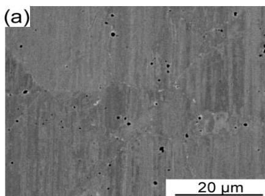
Figure 3 also confirms that the white precipitates are  $\sigma$  phase. This result is also consistent with the calculated pseudo binary (CoCrFeNi)-Mo phase diagram [14].

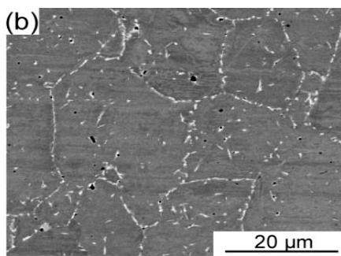

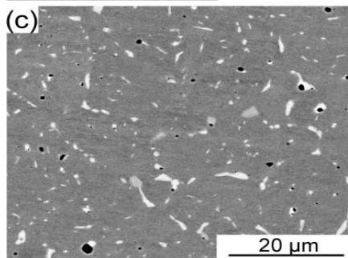
Figure 2. SEM images of the P/M CoCrFeNiMo $_{0.2}$  HEAs annealed at different temperatures for  $72\mathrm{h}$ . (a)  $700^{\circ}\mathrm{C}$ , (b)  $800^{\circ}\mathrm{C}$ , (c)  $900^{\circ}\mathrm{C}$ , and (d)  $1000^{\circ}\mathrm{C}$ .

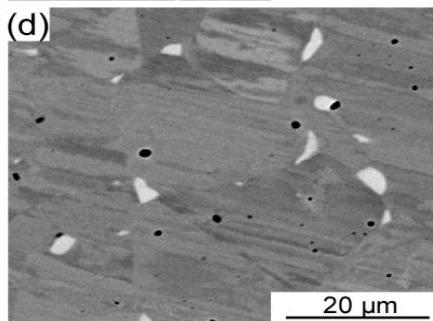

Table 1. EDS analysis results for the P/M CoCrFeNiMo $_{0.2}$  HEA annealed at  $700^{\circ}\mathrm{C}$  for  $72\mathrm{h}$  (Spots in Figure 3).

|  Location | Chemical Composition (at.%)  |   |   |   |   |
| --- | --- | --- | --- | --- | --- |
|   |  Mo L | Cr K | Fe K | Co K | Ni K  |
|  EDS spot 1 | 34.56 | 18.03 | 20.38 | 17.53 | 9.49  |
|  EDS spot 2 | 6.18 | 22.08 | 25.71 | 24.51 | 21.52  |

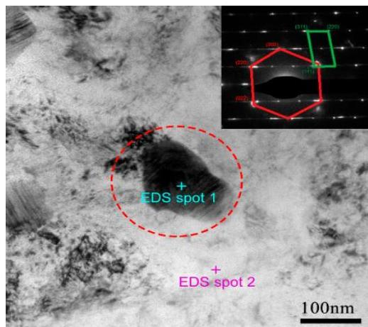
Figure 3. TEM image of the P/M CoCrFeNiMo $_{0.2}$  HEA annealed at  $700^{\circ}\mathrm{C}$  for  $72\mathrm{h}$ .

The microstructures of the CoCrFeNiMo $_{0.2}$  HEAs annealed at  $800^{\circ}\mathrm{C}$  for various times are illustrated in Figure 4. It is apparent that prolongation of the annealing time promotes the precipitation of the  $\sigma$  phase. As shown in Figure 4b,  $\sigma$  phase began to appear at the grain boundary of the matrix as the annealing time was  $4\mathrm{h}$ .  $\sigma$  phase grows with annealing time and changes its morphology.

Entropy 2019, 21, 448

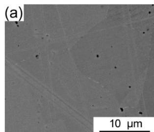

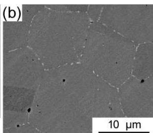

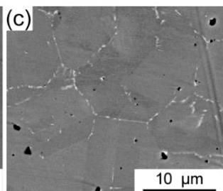

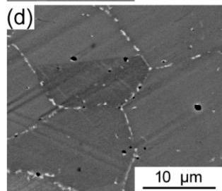
Figure 4. SEM images of the P/M CoCrFeNiMo $_{0.2}$  HEAs annealed at  $800^{\circ}\mathrm{C}$  for different times: (a)  $2\mathrm{h}$ , (b)  $4\mathrm{h}$ , (c)  $8\mathrm{h}$ , (d)  $16\mathrm{h}$ , (e)  $48\mathrm{h}$ , and (f)  $72\mathrm{h}$ .

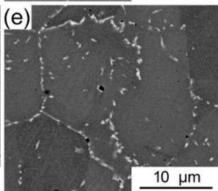

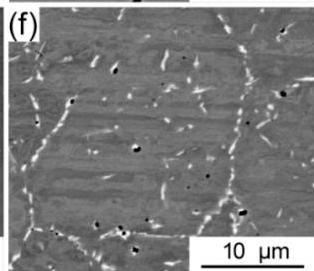

Figure 5 shows a statistical analysis on the variation of the size and volume fraction of the  $\sigma$  phase with the annealing temperature and time. As shown in Figure 5a, the size of the  $\sigma$  phase is less than  $0.5\mu \mathrm{m}$  as the annealing temperature at  $700^{\circ}\mathrm{C}$ . As the temperature increases, the size of the  $\sigma$  phase rapidly grows to the micron level. When the annealing temperature increases to  $1000^{\circ}\mathrm{C}$ , the size of the  $\sigma$  phase reaches to  $3.7\mu \mathrm{m}$ . As seen from Figure 5b, the content of the precipitated phase is also closely related to the annealing time. As the annealing time is prolonged, the volume fraction of the precipitates gradually increases, eventually reaching a saturated stable value. Therefore, obtaining a uniformly dispersed nanoprecipitate phase in the CoCrFeNiMo $_{0.2}$  HEA is strictly controlled by the heat treatment process.

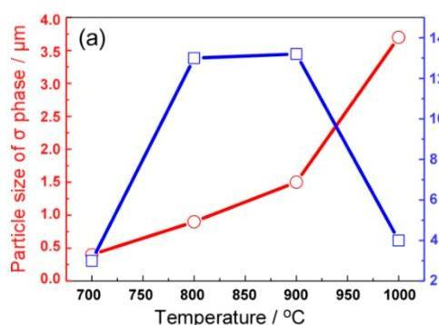
Figure 5. (a) Variation of the average size and volume fraction of  $\sigma$  precipitate with annealing temperatures; (b) Variation of the volume fraction of  $\sigma$  precipitate with annealing times at  $800^{\circ}\mathrm{C}$ .

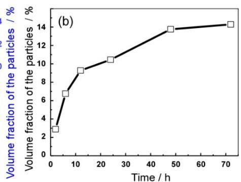

# 3.2. Mechanical Properties

Figure 6a shows the engineering stress-strain curves of the as-extruded and annealed  $\mathrm{CoCrFeNiMo_{0.2}}$  HEA at different temperatures for  $72\mathrm{h}$ . The evolution of tensile strength and plasticity with annealing temperature was also statistically calculated in Figure 6b. A typical elasto-plastic deformation behavior is remarked. All these annealed alloys exhibited a long work hardening stage. The yield strength, ultimate tensile strength and elongation to failure of the as-extruded  $\mathrm{CoCrFeNiMo_{0.2}}$  HEA were about  $400\mathrm{MPa}$ ,  $781\mathrm{MPa}$  and  $55.6\%$  respectively. As the annealing temperature increases from  $700^{\circ}\mathrm{C}$  to  $900^{\circ}\mathrm{C}$ , it is apparent that the yield strength and ultimate tensile strength of these annealed alloys were gradually improved. However, the ductility of these alloys has also dropped significantly. Since the annealing temperature increases up to  $1000^{\circ}\mathrm{C}$ , the yield strength and ultimate

Entropy 2019, 21, 448

tensile strength of the alloy is significantly decreased, while the plasticity is correspondingly increased to as high as approximately  $65\%$ . Although such a tradeoff relationship between the strength and plasticity is conventional, the comprehensive mechanical properties of these annealed CoCrFeNiMo $_{0.2}$  alloys are significantly better than those of the as-extruded one.

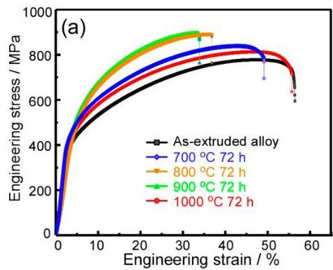
Figure 6. (a) Room-temperature engineering stress-strain curves for these HEAs annealed at different temperatures; (b) variation tendency of ultimate tensile strength and elongation of the annealed alloys with at different annealing temperatures.

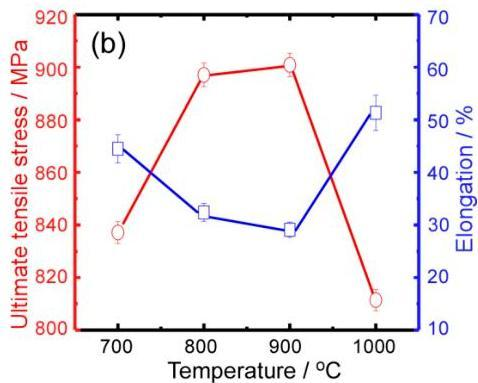

Figure 7a shows the engineering stress-strain curves of the as-extruded and annealed CoCrFeNiMo0 $_2$  HEA at  $800^{\circ}\mathrm{C}$  with different annealing times. The evolution of tensile strength and plasticity with annealing time was also statistically calculated in Figure 7b. With the prolongation of annealing time, the yield strength and ultimate tensile strength of these annealed alloys gradually increase, while the plasticity decreases gradually. Combined with the Figure 5, it is obvious that the evolutionary trend of the mechanical properties of the annealed alloys has a significant correspondence with the precipitate behavior of  $\sigma$  phase. The enhanced yield strength and ultimate tensile strength is mainly attributed to the high content and grain growth of the  $\sigma$  phase. The larger the volume fraction and the size of the  $\sigma$  phase, the higher the strength while the lower the plasticity of the alloy.

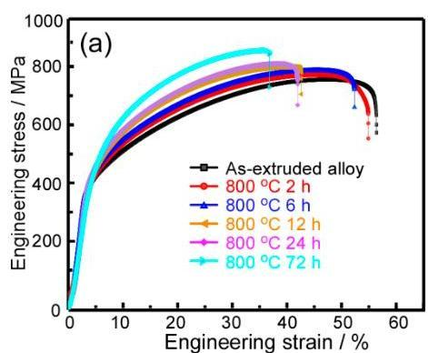
Figure 7. (a) Room-temperature engineering stress-strain curves for the HEAs annealed at  $800^{\circ}\mathrm{C}$  for various times; (b) variation tendency of ultimate tensile strength and elongation of the annealed HEAs at different annealing times.

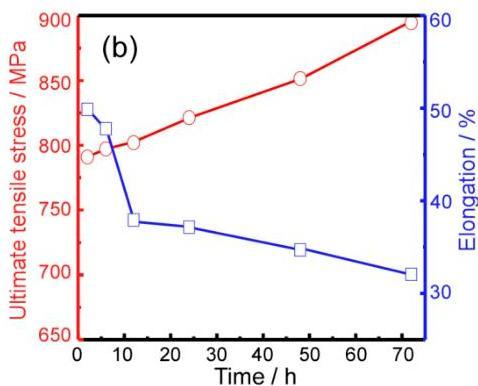

Figure 8 shows the fracture surface of CoCrFeNiMo $_{0.2}$  HEA annealed at different temperatures in the range from  $700^{\circ}\mathrm{C}$  to  $1000^{\circ}\mathrm{C}$  for  $72\mathrm{h}$ . The presence of a large number of dimples on the fracture surface indicates that these alloys have good deformability [29]. As the annealing temperature increases, it can be found that the size of the dimples becomes significantly bigger. Simultaneously, obvious signs of broken phase of the precipitated phase can be found at the bottom of the dimple. It is found that the separation of the precipitation phase and the matrix during the deformation process is the main reason for the formation of micropores. Due to the difference between the elastic modulus,

Entropy 2019, 21, 448

stress concentration is likely to occur at the interface between the precipitated phase and the matrix during the deformation process. The size of the micropores increases with this coarse precipitated phase, indicating crack propagation in the localized region of the alloy was significantly affected by these precipitated phase. Formation of large volume fraction of micropores results in a decrease in the plasticity of the alloy.

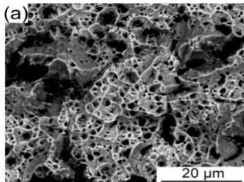

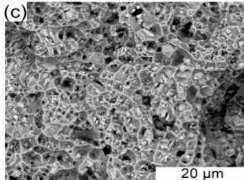
Figure 8. The morphologies of the fractured surface of the P/M CoCrFeNiMo0.2 HEAs annealed at different temperatures for  $72\mathrm{h}$ . (a)  $700^{\circ}\mathrm{C}$ , (b)  $800^{\circ}\mathrm{C}$ , (c)  $900^{\circ}\mathrm{C}$ , and (d)  $1000^{\circ}\mathrm{C}$ .

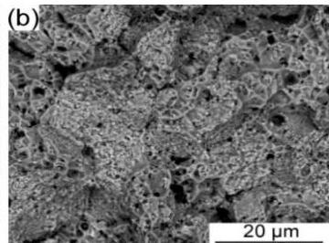

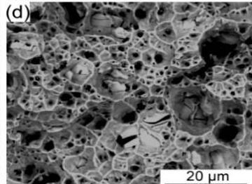

Figure 9 illustrates the TEM bright-field images of the annealed CoCrFeNiMo0.2 alloy after tensile deformation. It can be seen that a large number of deformed twins formed during the tensile deformation process. The interaction of the precipitates, deformed twins and grain boundary results in the pileup of dislocations. The  $\sigma$  precipitates did not undergo plastic deformation during the dislocation slip, resulting in high strength and work hardening rate of the alloy. As can be seen from Figure 9b, the nanoprecipitate phase preferentially precipitates at the grain boundary. In addition, deformed twins also play an important role in improving the strength and toughness of the alloy. The twin boundaries have a significant hindrance to the slip of dislocations. Thus, these annealed CoCrFeNiMo $_{0.2}$  HEAs plastically deform via dislocation gliding and nanotwinning, significantly enhancing strain hardening capability.

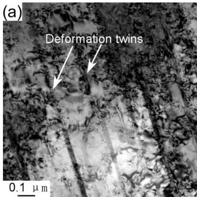
Figure 9. TEM bright-field images of the fractured CoCrFeNiMo0.2 HEA annealed at  $700^{\circ}\mathrm{C}$  for  $72\mathrm{h}$ : (a) showing the nano twinning and (b) showing the interaction of dislocations with nanoscale  $\sigma$  precipitates.

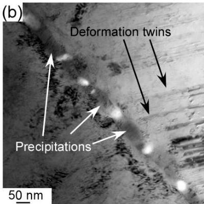

## 4. Conclusions

In the present research, a CoCrFeNiMo_{0.2} HEA is prepared using P/M method. The P/M HEA was annealed at different temperatures (700--1000 °C) for different times (2--72 h). The following conclusions are drawn:

1. The P/M CoCrFeNiMo_{0.2} HEA has a metastable FCC single-phase microstructure. During annealing, σ phase enriched with Mo and Cr precipitates in the grains and at the grain boundaries. As the temperature increases from 700 °C to 1000 °C, the size of the precipitates grows apparently. The volume fraction of the precipitates tends to increase gradually as the annealing temperature up to 900 °C and then decrease at 1000 °C. At 800 °C, the volume fraction of the precipitates gradually increases as the annealing time is prolonged, eventually reaching a saturated stable value about 14%.

2. The comprehensive mechanical property of the annealed CoCrFeNiMo_{0.2} HEAs has a significant correspondence with the precipitates. The larger the volume fraction and the size of the precipitates, the higher the strength and the lower the plasticity of the HEA. Nearly all the annealed HEAs exhibit good strength--ductility combinations due to the significant precipitation enhancement and nanotwinning.

B.L. Y.L. Q.F. and W.G. conceived and designed the experiments; C.Z. prepared the CoCrFeNiMo_{0.2} HEA samples and performed the microstructural characterization under the supervision of Y.L. and B.L.; H.Y. conducted the mechanical testing under the supervision of B.L. and W.G. All authors discussed the results and approved the final manuscript.

This research was funded by National Natural Science Foundation of China, grant number 51771232, National Key Research and Development Plan of China, grant number 2016YFB0700302, Hunan Natural Science Foundation of China, grant number 2018JJ3477 and Special funds for future industrial development of Shenzhen, China, grant number HKHTZD20140702020004.

The authors declare no conflicts of interest.

1. Zhao, Y.; Tong, Y.; Jiao, Z.; Wei, J.; Cai, J.; Han, X.; Chen, D.; Hu, A.; Kai, J. Multicomponent intermetallic nanoparticles and superb mechanical behaviors of complex alloys. Science 2018, 362, 933--937.
2. Nene, S.S.; Frank, M.; Liu, K.; Mishra, R.S.; McWilliams, B.A.; Cho, K.C. Extremely high strength and work hardening ability in a metastable high entropy alloy. Sci. Rep. 2018, 8, 9920. [CrossRef]
3. Nene, S.S.; Sinha, S.; Frank, M.; Liu, K.; Mishra, R.S.; McWilliams, B.A.; Cho, K.C. Unexpected strength--ductility response in an annealed, metastable, high-entropy alloy. Appl. Mater. Today 2018, 13, 198--206. [CrossRef]
4. Nene, S.S.; Sinha, S.; Frank, M.; Liu, K.; Mishra, R.S.; McWilliams, B.A.; Cho, K.C. Reversed strength-ductility relationship in microstructurally flexible high entropy alloy. Scripta Mater. 2018, 154, 163--167. [CrossRef]
5. Lu, Y.P.; Dong, Y.; Guo, S.; Jiang, L.; Kang, H.J.; Wang, T.M.; Wen, B.; Wang, Z.J.; Jie, J.C.; Cao, Z.Q.; et al. A Promising New Class of High-Temperature Alloys: Eutectic High-Entropy Alloys. Sci. Rep. 2014, 4, 6200. [CrossRef]
6. Wang, Z.J.; Guo, S.; Liu, C.T. Phase Selection in High-Entropy Alloys: From Nonequilibrium to Equilibrium. JOM 2014, 66, 1966--1972. [CrossRef]
7. Wang, Z.J.; Huang, Y.H.; Yang, Y.; Wang, J.C.; Liu, C.T. Atomic-size effect and solid solubility of multicomponent alloys. Scripta Mater. 2015, 94, 28--31. [CrossRef]
8. Chen, S.Y.; Li, W.D.; Xie, X.; Brechtl, J.; Chen, B.L.; Li, P.Z.; Zhao, G.F.; Yang, F.Q.; Qiao, J.W.; Dahmen, K.A.; et al. Nanoscale serration and creep characteristics of Al0.5CoCrCuFeNi high-entropy alloys. J. Alloy. Comp. 2018, 752, 464--475. [CrossRef]
9. Wang, Y.F.; Ma, S.G.; Chen, X.H.; Shi, J.Y.; Zhang, Y.; Qiao, J.W. Optimizing Mechanical Properties of AlCoCrFeNiTix High-Entropy Alloys by Tailoring Microstructures. Acta Metall. Sin. Eng. Lett. 2013, 26, 277--284. [CrossRef]
10. Hou, J.X.; Zhang, M.; Ma, S.G.; Liaw, P.K.; Zhang, Y.; Qiao, J.W. Strengthening in Al0.25CoCrFeNi high-entropy alloys by cold rolling. Mater. Sci. Eng. Struct. Mater. Prop. Microstruct. Process. 2017, 707, 593--601. [CrossRef]

Entropy 2019, 21, 448

11. Guo, S.; Ng, C.; Liu, C.T. Sunflower-like Solidification Microstructure in a Near-eutectic High-entropy Alloy. Mater. Res. Lett. 2013, 1, 228–232. [CrossRef]
12. Guo, S.; Ng, C.; Wang, Z.J.; Liu, C.T. Solid solutioning in equiatomic alloys: Limit set by topological instability. J. Alloy. Comp. 2014, 583, 410–413. [CrossRef]
13. Sheikh, S.; Shafeie, S.; Hu, Q.; Ahlstrom, J.; Persson, C.; Vesely, J.; Zyka, J.; Klement, U.; Guo, S. Alloy design for intrinsically ductile refractory high-entropy alloys. J. Appl. Phys. 2016, 120, 164902. [CrossRef]
14. Liu, W.; Lu, Z.; He, J.; Luan, J.; Wang, Z.; Liu, B.; Liu, Y.; Chen, M.; Liu, C. Ductile CoCrFeNiMox high entropy alloys strengthened by hard intermetallic phases. Acta Mater. 2016, 116, 332–342. [CrossRef]
15. Wang, Z.J.; Guo, S.; Wang, Q.; Liu, Z.Y.; Wang, J.C.; Yang, Y.; Liu, C.T. Nanoindentation characterized initial creep behavior of a high-entropy-based alloy CoFeNi. Intermetallics 2014, 53, 183–186. [CrossRef]
16. Liu, W.H.; He, J.Y.; Huang, H.L.; Wang, H.; Lu, Z.P.; Liu, C.T. Effects of Nb additions on the microstructure and mechanical property of CoCrFeNi high-entropy alloys. Intermetallics 2015, 60, 1–8. [CrossRef]
17. He, J.Y.; Liu, W.H.; Wang, H.; Wu, Y.; Liu, X.J.; Nieh, T.G.; Lu, Z.P. Effects of Al addition on structural evolution and tensile properties of the FeCoNiCrMn high-entropy alloy system. Acta Mater. 2014, 62, 105–113. [CrossRef]
18. Otto, F.; Yang, Y.; Bei, H.; George, E.P. Relative effects of enthalpy and entropy on the phase stability of equiatomic high-entropy alloys. Acta Mater. 2013, 61, 2628–2638. [CrossRef]
19. Lu, Z.P.; Lei, Z.F.; Huang, H.L.; Liu, S.F.; Zhang, F.; Duan, D.B.; Cao, P.P.; Wu, Y.; Liu, X.J.; Wang, H. Deformation Behavior and Toughening of High-Entropy Alloys. Acta Metall. Sin. 2018, 54, 1553–1566.
20. Rae, C.M.; Reed, R.C. The precipitation of topologically close-packed phases in rhenium-containing superalloys. Acta Mater. 2001, 49, 4113–4125. [CrossRef]
21. Gwalani, B.; Soni, V.; Choudhuri, D.; Lee, M.; Hwang, J.; Nam, S.; Ryu, H.; Hong, S.H.; Banerjee, R. Stability of ordered L12 and B2 precipitates in face centered cubic based high entropy alloys-Al0. 3CoFeCrNi and Al0. 3CuFeCrNi2. Scripta Mater. 2016, 123, 130–134. [CrossRef]
22. Ming, K.; Bi, X.; Wang, J. Precipitation strengthening of ductile Cr15Fe20Co35Ni20Mo10 alloys. Scripta Mater. 2017, 137, 88–93. [CrossRef]
23. Liu, B.; Wang, J.; Liu, Y.; Fang, Q.; Wu, Y.; Chen, S.; Liu, C.T. Microstructure and mechanical properties of equimolar FeCoCrNi high entropy alloy prepared via powder extrusion. Intermetallics 2016, 75, 25–30. [CrossRef]
24. Cao, Y.K.; Liu, Y.; Liu, B.; Zhang, W.D. Precipitation behavior during hot deformation of powder metallurgy Ti-Nb-Ta-Zr-Al high entropy alloys. Intermetallics 2018, 100, 95–103. [CrossRef]
25. Wang, J.; Liu, Y.; Liu, B.; Wang, Y.; Cao, Y.; Li, T.; Zhou, R. Flow behavior and microstructures of powder metallurgical crfeconimo 0.2 high entropy alloy during high temperature deformation. Mater. Sci. Eng. 2017, 689, 233–242. [CrossRef]
26. Guo, W.M.; Liu, B.; Liu, Y.; Li, T.C.; Fu, A.; Fang, Q.H.; Nie, Y. Microstructures and mechanical properties of ductile NbTaTiV refractory high entropy alloy prepared by powder metallurgy. J. Alloy. Comp. 2019, 776, 428–436. [CrossRef]
27. Shun, T.T.; Chang, L.Y.; Shiu, M. Age-hardening of the CoCrFeNiMo0.85 high-entropy alloy. Mater. Charact. 2013, 81, 92–96. [CrossRef]
28. Chen, J.; Zhou, X.Y.; Wang, B.L.; Liu, B.; Lv, Y.K.; Yang, W.; Xu, D.P.; Liu, Y. A review on fundamental of high entropy alloys with promising high-temperature properties. J. Alloy. Comp. 2018, 760, 15–30. [CrossRef]
29. Ritchie, R.; Thompson, A. On macroscopic and microscopic analyses for crack initiation and crack growth toughness in ductile alloys. Metall. Trans. A 1985, 16, 233–248. [CrossRef]

CC BY

© 2019 by the authors. Licensee MDPI, Basel, Switzerland. This article is an open access article distributed under the terms and conditions of the Creative Commons Attribution (CC BY) license (http://creativecommons.org/licenses/by/4.0/).