metals

MDPI

Article

# EBSD Study of Delta-Processed Ni-Based Superalloy

Pedro Jacinto Páramo Kañetas $^{1,\star\text{©}}$, Jessica Calvo $^{2}$, Pablo Rodriguez-Calvillo $^{3}$, José María Cabrera Marrero $^{2,4\text{©}}$, Marco Antonio Zamora Antuñano $^{5\text{©}}$ and Martha Patricia Guerrero-Mata $^{6}$

$^{1}$ Department of Engineering, Universidad del Valle de México, Coyoacán 04910, Mexico
$^{2}$ Department of Materials Science and Metallurgical Engineering, Universitat Politècnica de Catalunya EEBE, 08019 Barcelona, Spain; jessica.calvo@upc.edu (J.C.); jose.maria.cabrera@upc.edu (J.M.C.M.)
$^{3}$ Arcelor Mittal Global R&amp;D Gent, OCAS NV | Technologie park 935, BE-9052 Zwijnaarde, Belgium; pablo.rodriguezcalvillo@arcelormittal.com
$^{4}$ Institute of Research in Metallurgy and Materials, Universidad Michoacana de San Nicolás de Hidalgo Morelia 58230, Mexico
$^{5}$ Department of Engineering, Universidad del Valle de México, Santiago de Querétaro 76230, Mexico; marco.zamora@uvmnet.edu
$^{6}$ Facultad de Ingeniería Mecánica y Eléctrica, Universidad Autónoma de Nuevo León, San Nicolás de los Garza 66451, Mexico; martha.guerreromt@uanl.edu.mx
* Correspondence: pedro.paramo@uvmnet.edu; Tel.: +52-5560376553

Received: 7 September 2020; Accepted: 29 October 2020; Published: 3 November 2020

$\bullet$ check for updates

Abstract: Nickel-based superalloys are extensively used in the aerospace and power generation industries due to their excellent mechanical properties at elevated temperatures and good corrosion resistance. Typically, these alloys require accomplishing critical standards during their manufacturing process. In this study, an Inconel 718 (IN718) Ni-based superalloy was subjected to a delta-processing treatment (DP718) and subsequently deformed at high temperature. Samples were compressed below and above the $\delta$-solvus temperature at two different strain rates of $0.001\,\mathrm{s}^{-1}$ and $0.01\,\mathrm{s}^{-1}$. A detailed microstructural characterization was carried out by the electron backscattered diffraction technique (EBSD). Kikuchi patterns and the orientation relationship of the $\delta$-phase were identified. For samples deformed above the $\delta$-solvus at $0.01\,\mathrm{s}^{-1}$, an increase in the percentage of low angle grain boundaries (LAGB) within deformed grains and a decrease in high angle grain boundaries (HAGB) were observed. Comprehensive observation of the microstructural evolution of IN718 subjected to DP718 using orientation map images was also performed.

Keywords: Inconel 718; delta-processing; EBSD analysis; CSL boundaries

# 1. Introduction

The control of the microstructure of nickel-based superalloys in manufacturing processes is critical for the development of optimal mechanical properties [1,2]. The properties of Inconel 718 (IN718) are sensitive to the grain size evolution during forging operations. In this alloy, the presence of the $\delta$-phase promotes grain refinement during hot working and prevents excessive grain growth during heat treatment operations [3–6]. Since the development of nickel-based superalloys, several investigations have been conducted to evaluate and optimize their microstructure and performance for different applications [7–15]. One of the most common setbacks in the forging industry is obtaining refined microstructures, particularly in areas close to the contact with the dies where the lack of deformation due to friction and high heat transfer conditions avoids any microstructural modification by forging. Due to the nature of this pinning mechanism, the amount, size, and morphology of the intergranular phase ($\delta$-phase) strongly influences the effectivity of grain size control, as well as other mechanical

Metals 2020, 10, 1466; doi:10.3390/met10111466

www.mdpi.com/journal/metals

properties of a polycrystalline composite [16]. In addition to this, it has been reported that during deformation at elevated temperatures, the partial dissolution and breakage of the needle-like phase influence the dynamic recrystallization (DRX) behavior of the alloy since these particles play the role of “nucleation sites” to stimulate the onset of DRX [7,9]. Thereby, the search for alternative processing routes continues. One possible solution for IN718 is the application of the so-called delta-processing (DP718) route. This treatment includes an intentional δ-phase precipitation cycle as a preparation for the subsequent thermomechanical processing. It has been reported that DP718 can produce uniform fine grains [17,18,19,20,21,22,23,24]. Although DP718 is derived from a process known as “mini grain” mainly used in ingot-billet conversion [25,26,27], it also finds an opportunity as a possible industrial forging process.

The aim of this work is to investigate the microstructural features of an IN718 superalloy subjected to DP718, including the identification of the δ-phase and the evaluation of the microstructure evolution by the electron backscattered diffraction (EBSD) technique. This latter technique can be used to facilitate phase identification based on chemical composition and crystalline structures [28]. Moreover, it is helpful in characterizing the recrystallized fraction, as well as grain and sub-grain boundaries by analysis of the relative misorientation between adjacent points. Typically, grain boundaries (GB) can be drawn between pixels with misorientations larger than 2--5°. Lower values are not usually considered because the angular resolution of this technique is limited to ~0.5°. Usually, grain boundaries with misorientations between 2° and 10° are considered sub-grains or low angle grain boundaries (LAGBs), while limits with misorientations > 10° are considered high angle grain boundaries (HAGBs). If neighboring pixels belong to different phases, phase boundaries can be displayed instead [29,30]. Finally, it is possible to detect and measure special limits, such as the so-called coincident site lattice (CSL), i.e. limits in which there is a good atom crystallographic match across the boundary and a significant fraction of common atoms sites to both crystals. The reciprocal of the common sites of atoms that are common to both crystals (sites coincidence) to the network sites is denoted by Σ [31]. In particular, twin boundaries, Σ_{3}, have great importance in nickel-based alloys.

Some researchers have already used EBSD analysis for nickel-based superalloys. For instance, the flow behavior of IN718 by hot compression tests conducted at several conditions in connection with the grain boundary misorientation angle distribution at different temperatures, microstructural evolution, and twinning formation during dynamic recrystallization has been analyzed [21,31,32,33,34]. It has also been found that twin boundaries are particularly resistant to precipitate formation, and no clear evidence has been found for a special relationship between boundary misorientation and precipitation [35]. The fraction of LAGBs has been also investigated, and the results indicate that it decreases with the increase of the deformation temperature. Additionally, the decrease of the strain rate and the small fraction of LAGBs indicate that continuous dynamic recrystallization (CDRX) plays a minor role in the nucleation of dynamic recrystallization in nickel-based superalloy, at least at relatively high temperatures and low strain rates [36]. The microstructural evolution during superplastic deformation of Inconel 718 and the grain size after deformation, while the δ-phase precipitation is increased, have been also studied. In this latter case, the δ-phase precipitation is increased by the superplastic deformation, and the final grain size is also increased when the δ-phase precipitation is decreased at increasing experimental temperatures [37].

## 2. Materials and Methods

The IN718 alloy studied here has the following chemical composition (in weight percent): Ni balance, Cr 17.96, 18.72 Fe, Nb 5.41, 0.51 Al 1.01 Ti, 2.88 Mo. A workpiece with an initial height of 150 mm and a diameter of 100 mm was deformed at 980 °C and at a strain rate of 0.13 s^{-1} using an industrial hydraulic (FRISA Aerospace, Santa Catarina, Mexico) press to achieve a reduction of 73%. After deformation, the piece was cut and macro-etched to obtain deformation flow patterns (see Figure 1). Localized deformation flow is observed in the central area and edges, while the upper and lower zones have a limited deformation flow due to the friction with the pressing tools. Two specimens were machined from this upper zone, marked as A and B in Figure 1, i.e. an area

Metals 2020, 10, 1466

where partial recrystallization was expected. Samples had an initial height of  $10\mathrm{mm}$  and were  $7\mathrm{mm}$  in diameter, and they were subjected to DP718 consisting of a solution treatment at  $1100^{\circ}\mathrm{C}$  for  $1\mathrm{h}$ , then water quenching and an aging treatment at  $900^{\circ}\mathrm{C}$  for  $24\mathrm{h}$ , followed by water quenching. After the heat treatment sequence, samples were compressed at temperatures below and above the  $\delta$ -solvus in order to include two different deformation conditions: accordingly, Sample A was tested at  $0.001\mathrm{s}^{-1}$  and  $960^{\circ}\mathrm{C}$  (below the  $\delta$ -solvus) and Sample B at  $0.01\mathrm{s}^{-1}$  and  $1020^{\circ}\mathrm{C}$  (above the  $\delta$ -solvus). Samples were compressed to a total strain of 0.6, and then, the metallographic preparation was performed by standard procedures.

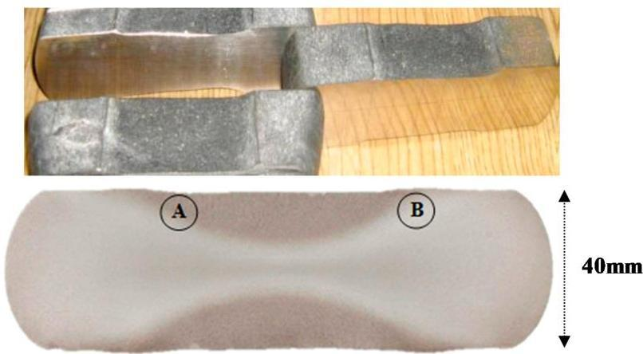
Figure 1. Cuts and macro-etched image of the deformed sample; specimens from the A and B regions were sectioned from the sample to perform the delta-processing treatment (DP718).

# 3. Results

Grain size was measured according to the standard ASTM E-112, using the method of the comparison images of maps graduated at 100 magnification. The final grain size decreases after DP718 deformation in relation to the grain size before DP718 thermal treatment, as observed in Figure 2 and Table 1. One can notice that the grain size is heterogeneous, where relatively fine sizes coexist with some abnormally large ones (indicated as "as large as" (ALA) in Table 1).

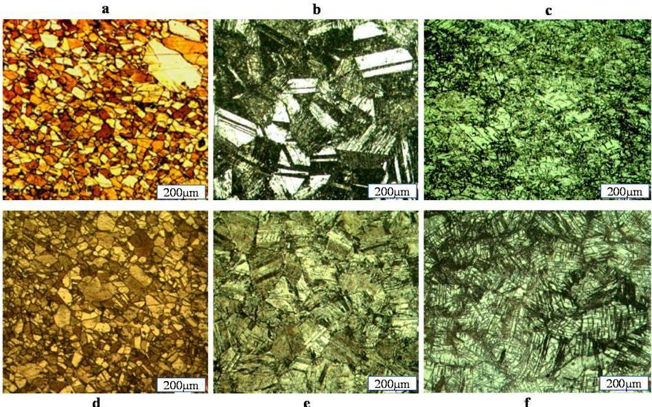
Figure 2. Metallographic images: (a,d) after industrial deformation without DP718; (b,e) after thermal treatment DP718 before DP718 deformation; (c,f): after DP718 deformation. (a-c) correspond to Sample A. (d-f) correspond to Sample B.

Metals 2020, 10, 1466

Table 1. Grain size evolution.

|  Sample | Grain size Average ASTM (μm)  |   |   |
| --- | --- | --- | --- |
|   |  After Industrial Deformation without DP718 | After Thermal Treatment DP718 before DP718 Deformation | After DP718 Deformation  |
|  A | 6 (45 μm) ALA 3 (127 μm) | 3 (127 μm) ALA 2 (180 μm) | 6 (45 μm) 60%, (16 μm) 40% ALA 5 (63 μm)  |
|  B | 7 (31 μm) 70%, 6 (45 μm) 30% ALA 5 (63 μm) | 4 (90 μm) ALA 3 (127 μm) | 4 (90 μm) 70%, 5 (63 μm) 30%  |

ALA—as large as.

# 3.1. Grains and Grain Boundaries Behavior of the  $\gamma$ -Phase with Delta-Processing

The recrystallized fractions of the samples are depicted in Figures 3-5. In these cases, the assigned parameter of the minimum misorientation to separate sub-grains from grains was selected as  $2^{\circ}$ , while  $8^{\circ}$  was chosen to separate recrystallized grains from deformed grains. These are the typical values found in the literature [28-31]. The recrystallized fraction of a sample with delta-processing treatment but without deformation is shown in Figure 3a. Accordingly, the histogram of Figure 3b illustrates that  $95\%$  of the grains are recrystallized,  $5\%$  are sub-structured grains, and due to the absence of deformation after DP718, virtually no deformed grains are present. The grain size distribution before the compression testing has an initial average grain size of  $39.5~{\mu\mathrm{m}}$ .

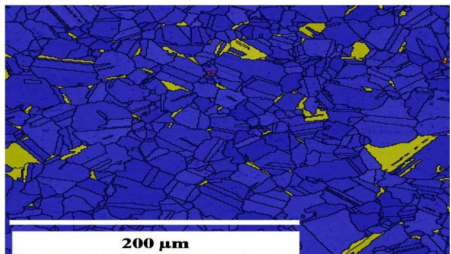
(a)

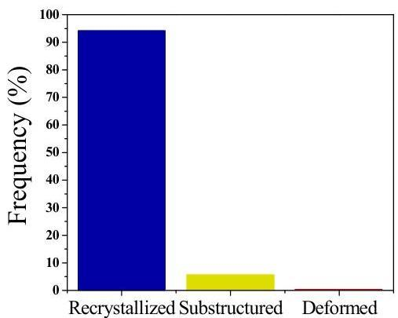
(b)
Figure 3. Recrystallized fraction for a sample with delta-processing treatment without deformation: (a) recrystallized grains (blue), substructured grains (yellow), deformed grains (red); (b) frequency (in %).

Metals 2020, 10, 1466

On the other hand, after deformation, this average grain size goes down to  $10\mu \mathrm{m}$ . In the deformation condition of Sample A (0.001 s $^{-1}$  and 960 °C), depicted in Figure 4a, the microstructure switches to 60% deformed grains, 20% recrystallized grains, and 20% sub-structured grains (Figure 4b). It is readily apparent that recrystallized grains (the blue ones) form a sort of necklace around deformed grains. Such a topology leads to assuming that the recrystallization mechanisms must be categorized as discontinuous (or classical) dynamic recrystallization based on the sequence hardening-energy storage and softening-energy relief, which leads to the nucleation of new grains at the initial grain boundaries [38].

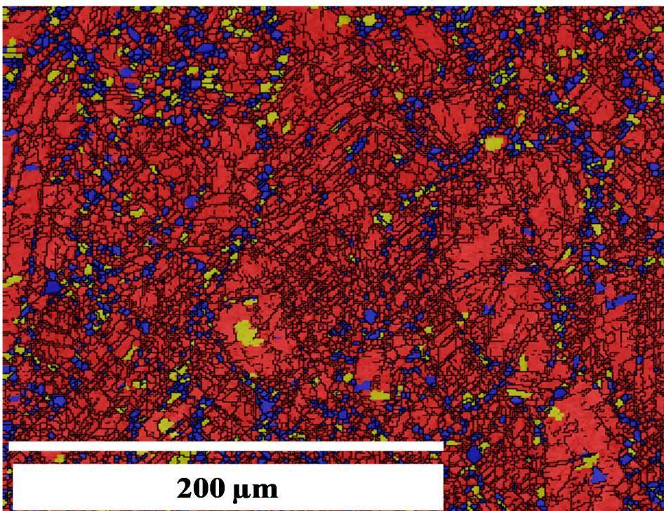
(a)

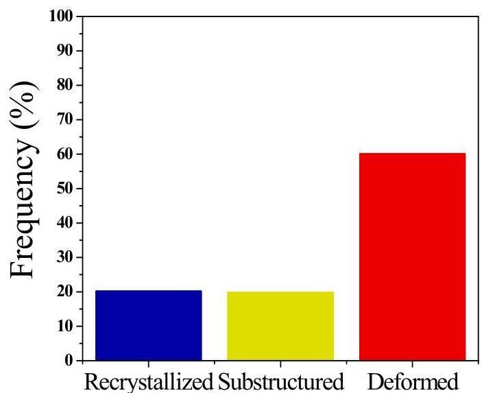
(b)
Figure 4. Recrystallized fraction for Sample A with delta-processing treatment and deformation: (a) recrystallized grains (blue), substructured grains (yellow), deformed grains (red); (b) frequency (in %).

Metals 2020, 10, 1466

Moreover, Figure 5a,b shows the recrystallized fraction of Sample B deformed at  $0.01\mathrm{s}^{-1}$  and  $1020^{\circ}\mathrm{C}$ , where  $20\%$  of grains are recrystallized,  $35\%$  sub-structured, and  $45\%$  deformed. The average grain size of deformed Sample B is  $13\mu \mathrm{m}$ .

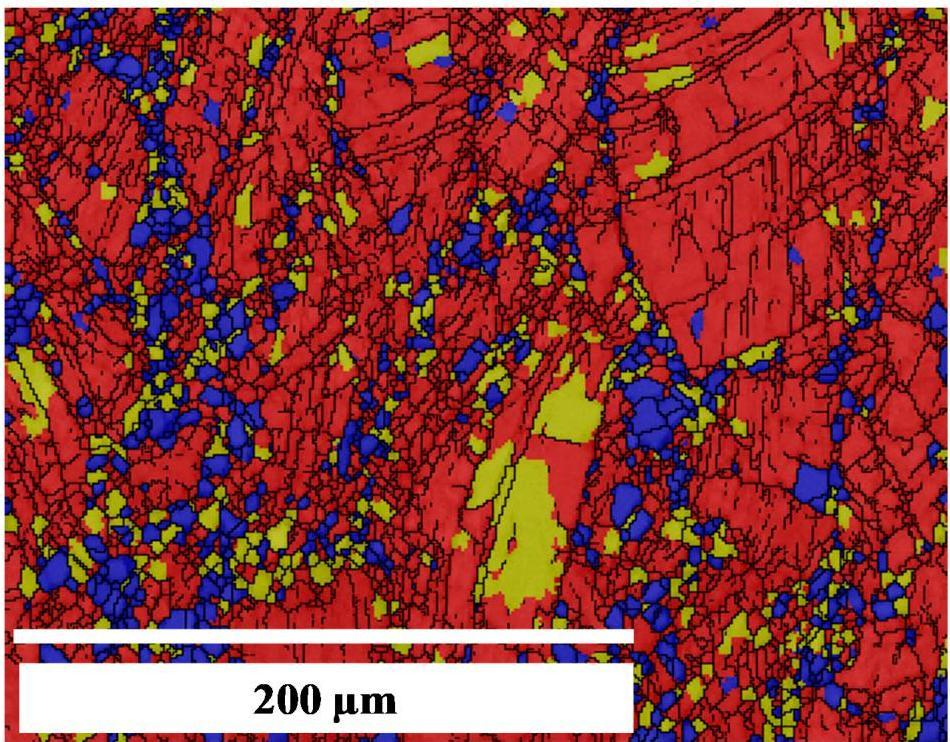
(a)

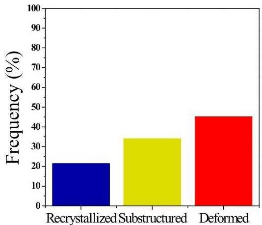
(b)
Figure 5. Recrystallized fraction for Sample B with delta-processing treatment and deformation: (a) Recrystallized grains (blue), substructured grains (yellow), deformed grains (red); (b) frequency (in %).

Figure 6 displays the grain boundaries' nature derived from the EBSD analysis. Here, the grain boundaries with disorientations  $&lt; 15^{\circ}$  are considered LAGB limits, while boundaries with disorientations  $&gt;15^{\circ}$  are considered random HAGB limits (green and red  $&lt; 15^{\circ}$ ; black  $&gt;15^{\circ}$ ). The sample without deformation is presented in Figure 6a, where several high angle grain boundaries and annealing twins can be noticed. In contrast, Figure 6b shows Sample A after deformation at  $0.001\mathrm{s}^{-1}$  and  $960^{\circ}\mathrm{C}$ . A dramatic decrease in both twin oriented boundaries and HAGBs is observed, together with a remarkable increase in LAGBs, suggesting a close relationship between temperature and strain with grain boundaries' misorientation. Notice that most LAGBs (in green) within the

Metals 2020, 10, 1466

deformed grains are identified as sub-grains and sub-structure as observed in the recrystallized fraction. Nevertheless, a saturation of the  $\delta$ -phase concentration is conducive to the generation of more obstacles to dislocation motion. The clustering and climbing of dislocations at grain boundaries during deformation can broaden the grain boundaries and can promote LAGBs, which could result in an increase of hardness and embrittlement of the alloy.

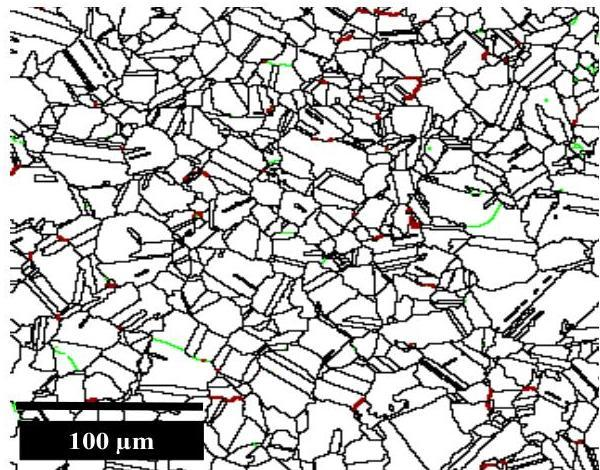
(a)

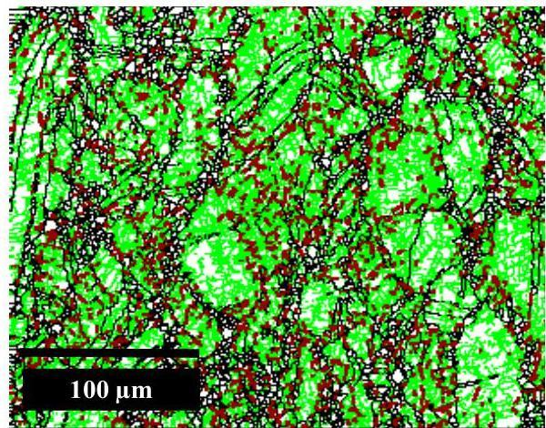
(b)

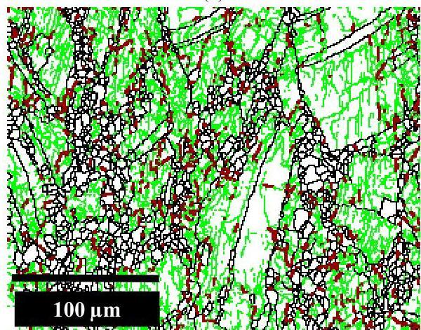
(c)
Figure 6. Results of EBSD grain boundaries (green and red  $&lt; 15^{\circ}$ ; black  $&gt;15^{\circ}$ ): (a) specimen without deformation; (b) Specimen A; (c) Specimen B.

Metals 2020, 10, 1466

Similar results are shown in Figure 6c for Sample B (deformed at  $0.01\mathrm{s}^{-1}$  and  $1020^{\circ}\mathrm{C}$ ). However, the amount of LAGBs is larger than in deformed Sample A, indicating that the lower strain rate has a greater effect on sub-structuring grains than the increment of temperature has on reducing the fraction of LAGBs. This evinces that if the strain rate increases, even at a temperature of  $1020^{\circ}\mathrm{C}$ , above the  $\delta$ -solvus, the LABGs tend to increase. Therefore, the increase of the HAGBs is directly related to the increase of the temperature and the decrease of the strain rate.

The EBSD study also allows examining the nature of the boundaries and detecting those belonging to CSLs. These special limits are known to possess relatively little energy and mobility, and therefore, exhibit a different behavior during recrystallization than ordinary boundaries. In this respect, Figure 7a presents CSL boundaries for the sample with DP treatment and no deformation;  $46\%$  of the CSL boundaries are of the  $\Sigma 3$  type (in red), i.e., annealing twins. The second CSL in importance in Figure 7a is the  $\Sigma 9$  boundaries with a presence of approximately  $2\%$ . This observation sets a clear presence of twins formed during thermal treatment DP718 in a virtually recrystallized microstructure with a small percentage of sub-structured grains.

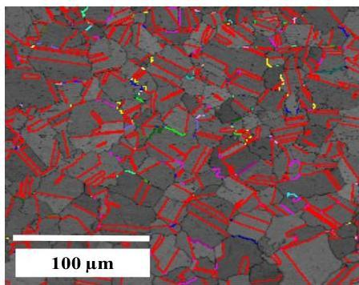
(a)

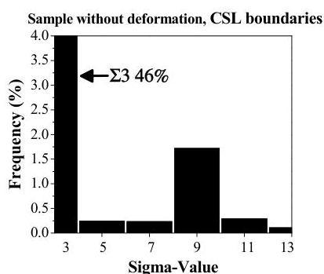
(b)

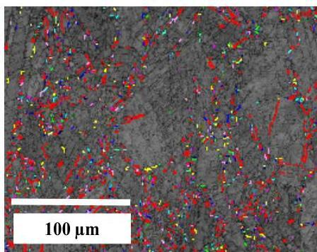
(c)

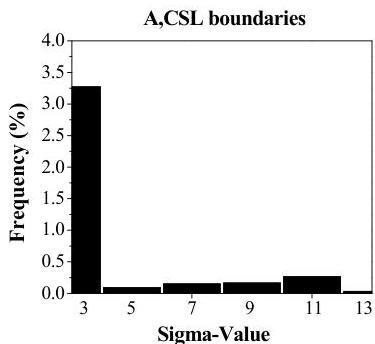
(d)

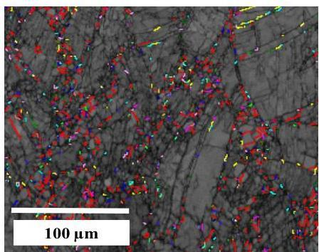
(e)

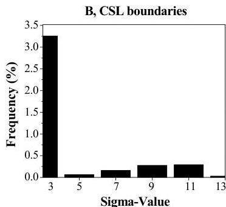
(f)
Figure 7. EBSD results of CSL boundaries for specimens (Σ3 in red): (a) sample without deformation; (c) Specimen A; (e) Specimen B; (b,d,f): Frequency histogram of sigma-value.

Metals 2020, 10, 1466

During boundary migration, interactions take place predominantly among existing  $\Sigma 3$  boundaries, leading to multiple twins. These interactions occur frequently between two existing twins, which results in a  $\Sigma 9$  limit, according to the relationship  $\Sigma 3 + \Sigma 3 = \Sigma 9$ . When a  $\Sigma 9$  boundary is generated in this form and the result interacts with another  $\Sigma 3$  limit, the result is a new boundary  $\Sigma 3$  or  $\Sigma 27$  according to the relationship  $\Sigma 3 + \Sigma 9 = \Sigma 3$  or  $\Sigma 3 + \Sigma 9 = \Sigma 27$ . However, from the statistics of  $\Sigma 3$ ,  $\Sigma 9$ , and  $\Sigma 27$  boundaries in various microstructures, as in the present one, it follows that  $\Sigma 3 + \Sigma 9 = \Sigma 3$  occurs more frequently than  $\Sigma 3 + \Sigma 9 = \Sigma 27$  [39-43].

The EBSD results of Sample A deformed at strain rate of  $0.001\mathrm{s}^{-1}$  and  $960^{\circ}\mathrm{C}$  are presented in Figure 7c. There is a noticeable decrease in the percentage of twins  $\Sigma 3$  to  $3.5\%$ . A similar result is displayed in Figure 7e for Specimen B (deformed at  $0.01\mathrm{s}^{-1}$  and  $1020^{\circ}\mathrm{C}$ ).

# 3.2. Identification of  $\delta$  Phase and Orientation Relationship with the  $\gamma$ -Phase

The structural parameters needed to identify the  $\delta$ -phase ( $\mathrm{Ni}_3\mathrm{Nb}$ ) by EBSD are presented in Table 2. In accordance with the literature [36,37],  $\mathrm{Ni}_3\mathrm{Nb}$  is an ordered and orthorhombic phase, having the space group Pmmn  $n^{\circ}59$ , and the following lattice constants:  $a = 5.114\AA$ ,  $b = 4.244\AA$ , and  $c = 4.538\AA$ . It is a center symmetric structure with eight atoms per unit cell, and because cell parameters  $b$  and  $c$  are similar, this phase can be considered distorted tetragonal. Figure 8 shows: (a) the SEM image of Sample B, indexed by backscattered electron Kikuchi patterns (EBSKP) of  $\gamma$  (in b) and  $\delta$  (in c) with EBSKP overlay in blue and yellow, respectively, using nickel parameters existing in the software database for  $\gamma$  and the parameters of Table 2 for  $\delta$ . Figure 9a presents the orientation imaging microscopy (OIM) identification of the  $\gamma$ -phase and  $\delta$ -phase for Sample B after DP plus deformation at a strain rate of  $0.01\mathrm{s}^{-1}$  and  $1020^{\circ}\mathrm{C}$ . The  $\gamma$ -phase is identified in blue color and quantified to be  $91.1\%$  in volume fraction (relating only to indexed niobium in the  $\gamma$ - and  $\delta$ -phases), and the  $\delta$ -phase is identified as yellow with  $8.95\%$  and is found mostly at grain boundaries. The fact that most of the  $\delta$ -phase is at grain boundaries suggests a pinning effect and thus a grain growth control during hot deformation. Figure 9b shows an SEM image by electron backscattering diffraction with black contrast.

Table 2. Structural parameters of  $\delta$  phase at  ${25}^{ \circ  }\mathrm{C} : \mathrm{{Pmmn}}{\mathrm{n}}^{ \circ  }{59}$  with  $\mathrm{a} = {5.114Å},\mathrm{\;b} = {4.244Å}$  ,and  $\mathrm{c} = {4.538Å}\left\lbrack  {38}\right\rbrack$  .

|  Element | Wyckoff | x | y | z | Occupation  |
| --- | --- | --- | --- | --- | --- |
|  Ni (1) | 2a | 0 | 0 | 0.3182 | 1  |
|  Ni (2) | 4f | 0.7494 | 0 | 0.8414 | 1  |
|  Nb (1) | 2b | 0 | 1/2 | 0.6513 | 1  |

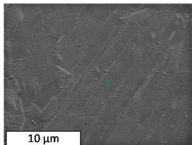
a)

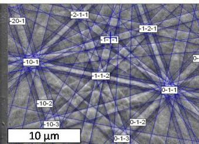
b)
Figure 8. Backscattered electron Kikuchi patterns (EBSKP) indexing of Sample B. (a) SEM image; (b,c) nickel  $\gamma$ -phase (blue) and  $\delta$ -phase (yellow) EBSKP overlay, respectively.

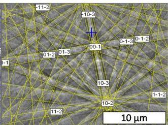
c)

Recently in the literature, a new phenomenon was reported, namely the grain boundary wetting phase transitions by a second solid phase [44]; this investigation found specific similarities with reported results, such as the formation of layers or needle shapes along the grain boundaries of the second solid phase (as shown in Figure 9a); the grain boundary wetting phase transition, as aforementioned, may be present due to the increase of LAGBs (as shown in Figure 6), resulting in the increase in the portion of

Metals 2020, 10, 1466

the wetted area at grain boundaries; this may allow the growth of layers or needle shapes along the grain boundaries of the second solid phase.

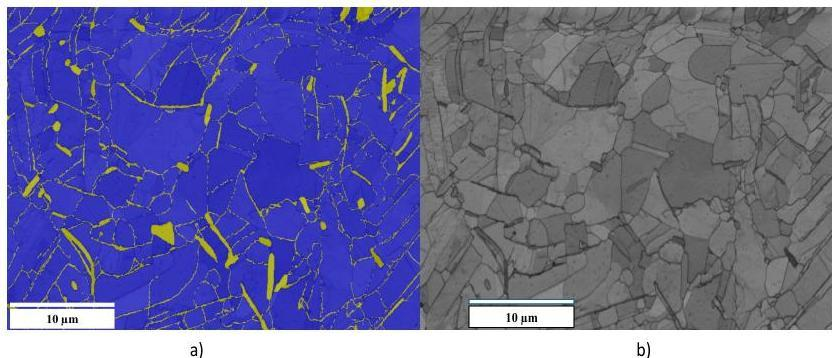
Figure 9. (a)  $\delta$ -phase identification in Sample B by orientation imaging microscopy (OIM) analysis,  $\gamma$ -phase (blue) and  $\delta$ -phase (yellow). (b) Backscattered electron SEM image.

Phase boundaries and the deviation angle in the orientation relationship, between the  $\gamma$ - and  $\delta$ -phases through the EBSD of Sample B of Figure 9 are presented in Figure 10. This orientation relationship is found and fixed in the software to define deviation limits among planes and directions as  $\{111\} \gamma // \{110\} \delta$  and  $&lt;1-10&gt;$ $\gamma // &lt;1-11&gt;$ $\delta$ , respectively. Phase boundaries identified by three different colors with respect to the deflection angle, yellow  $&gt;10^{\circ}$ , lime green  $&gt;20^{\circ}$ , and turquoise  $&gt;30^{\circ}$ , are shown in Figure 10 The OIM indicates that there is a large presence of limits higher than  $30^{\circ}$  (turquoise).

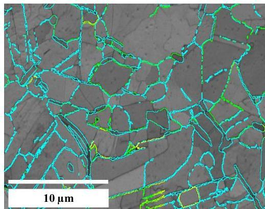
Figure 10. Sample B. OIM, orientation relationship (yellow  $&gt;10^{\circ}$ , lime green  $&gt;20^{\circ}$  and turquoise  $&gt;30^{\circ}$ ), phase limits.

Furthermore,  $\gamma$  and  $\delta$  misorientation is presented in Figure 11. The highest percentage of average angle misorientation of the  $\gamma$ -phase of  $80\%$  corresponds to angles  $&lt; 1^{\circ}$  (blue), as illustrated in Figure 11b, and the  $\delta$ -phase presents a percentage on average of  $12\%$  angle misorientation  $&lt; 1^{\circ}$  (red tones), as shown in Figure 11c. This reveals that both phases are mostly a necessary ratio of less than one for a reference frame transformation of a crystalline network to another [34,45-47], i.e., the orientation distance in space between two different orientations.

For the local change of crystalline orientations produced inside the grains, a dispersion of crystalline orientations was found, which increases with a random distribution and deformation in the crystallographic orientation, irrespective of the axis,  $Z0$ ,  $Y0$ , and  $X0$ .

Metals 2020, 10, 1466

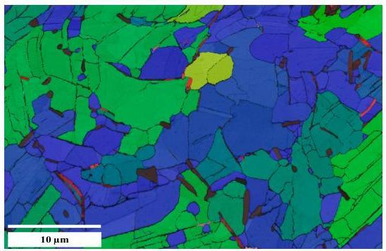
(a)

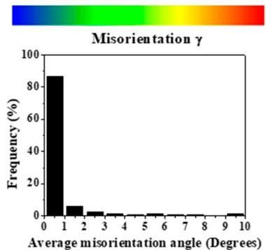
(b)

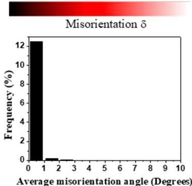
(c)
Figure 11. Sample B. OIM: (a) misorientation relationship ( $\gamma &lt; 1^{\circ}$  in blue,  $\delta &lt; 1^{\circ}$  in red tones) phase limit; (b)  $\gamma$  "frequency vs. average disorientation"; (c)  $\delta$  "frequency vs. average disorientation".

# 4. Conclusions

In this investigation, it is apparent that the time taken for specimens subjected to deformation at a temperature above the  $\delta$ -solvus (1020 °C, Sample B) is sufficient to promote recrystallization in deformed grains. However, the stored energy after work hardening depends directly on the strain rate, meaning that if the strain rate is not high enough (in this study, above 0.001 s $^{-1}$ , Sample A), the nucleation of new recrystallized grains at grain boundaries will be more difficult, and recrystallization may only take place at deformed grains.

The  $\delta$ -phase is found mostly at grain boundaries, but is also appreciated within grains and especially at the twin limits, as shown in Figure 9. The fact that the  $\delta$ -phase is located at grain boundaries leads to a pinning effect and thus a grain growth control during hot deformation.

The formation of CSL boundaries increases with the amount of recrystallization (high temperatures and low strain rates), suggesting that the time for deforming the sample at a temperature higher than the  $\delta$ -solvus is sufficient to promote deformed grains' recrystallization and twin boundaries  $\Sigma 3$ , even if the strain rate increases.

New recrystallized grains after the necklace nucleation appear at temperatures below the  $\delta$ -solvus and higher strain rates.

The grain shape and grain size depend directly on the deformation conditions; low strain rates and high deformation temperatures affect the  $\delta$ -phase concentration and nucleation of new recrystallized grains at grain boundaries. However, the recrystallized fraction depends on several simultaneous factors such as grains size (related to the thermo-mechanical history before and after DP718), the volume fraction of the  $\delta$ -phase, and the deformation temperature and strain rate.

Author Contributions: Conceptualization, P.J.P.K. and J.M.C.M.; methodology, M.P.G.-M.; software, P.R.-C.; validation, P.J.P.K., J.M.C.M., and M.P.G.-M.; formal analysis, M.A.Z.A.; investigation, P.J.P.K.; resources, J.M.C.M.; data curation, M.A.Z.A.; writing, draft preparation, M.P.G.-M.; writing, review and editing, J.M.C.M.; visualization,

Metals 2020, 10, 1466

J.C.; supervision, J.C.; project administration, J.M.C.M.; funding acquisition, P.J.P.K. All authors have read and agreed to the published version of the manuscript.

Funding: This research was funded by CONACYT, Grant Number 277663.

Acknowledgments: The authors are grateful to CONACYT Mexico for the financial support to develop this project (Grant 277663) and to FRISA Forjados S.A. de C.V for supplying the material. J.M.C. also thanks CONACYT for partially funding his sabbatical leave at UMSNH.

Conflicts of Interest: The authors declare no conflict of interest.

# References

1. Basoalto, H.C.; Brooks, J.W.; Di Martino, I. Multiscale microstructure modelling for nickel based superalloys. Mater. Sci. Technol. 2009, 25, 221-227. [CrossRef]
2. Reyes, L.; Páramo, P.; Zamarripa, A.S.; De La Garza, M.; Mata, M.G. Grain size modeling of a Ni-base superalloy using cellular automata algorithm. Mater. Des. 2015, 83, 301-307. [CrossRef]
3. Desvalles, Y.; Bouzidi, M.; Boisand, F.; Beaude, N. Delta phase in inconel 718: Mechanical properties and forging process requirements. Superalloys 1994, 718, 281-291. [CrossRef]
4. Azadian, S.; Wei, L.-Y.; Warren, R. Delta phase precipitation in Inconel 718. Mater. Charact. 2004, 53, 7-16. [CrossRef]
5. Nalawade, S.; Sundararaman, M.; Singh, J.; Verma, A.; Kishore, R. Precipitation of  $\gamma^\prime$  phase in  $\delta$ -precipitated Alloy 718 during deformation at elevated temperatures. Mater. Sci. Eng. A 2010, 527, 2906-2909. [CrossRef]
6. Antonov, S.; Detrois, M.; Helmink, R.C.; Tin, S. Precipitate phase stability and compositional dependence on alloying additions in  $\gamma-\gamma'-\delta-\eta$  Ni-base superalloys. J. Alloy. Compd. 2015, 626, 76-86. [CrossRef]
7. Park, N.; Kim, I.; Na, Y.; Yeom, J. Hot forging of a nickel-base superalloy. J. Mater. Process. Technol. 2001, 111, 98-102. [CrossRef]
8. Semiatin, S.; Weaver, D.S.; Kramb, R.C.; Fagin, P.N.; Glavicic, M.G.; Goetz, R.L.; Frey, N.D.; Antony, M.M. Deformation and recrystallization behavior during hot working of a coarse-grain, nickel-base superalloy ingot material. Met. Mater. Trans. A 2004, 35, 679-693. [CrossRef]
9. Nalawade, S.; Sundararaman, M.; Singh, J.B.; Verma, A.; Kishore, R. Comparison of deformation induced precipitation behaviour in Alloy 718 under two microstructural conditions. Trans. Indian Inst. Met. 2010, 63, 35-41. [CrossRef]
10. Hongbo, D.; Gaochao, W. Effect of Deformation Process on Superplasticity of Inconel 718 Alloy. Rare Met. Mater. Eng. 2015, 44, 298-302. [CrossRef]
11. Mei, Y.; Liu, Y.; Liu, C.; Li, C.; Yu, L.; Guo, Q.; Li, H. Effects of cold rolling on the precipitation kinetics and the morphology evolution of intermediate phases in Inconel 718 alloy. J. Alloy. Compd. 2015, 649, 949-960. [CrossRef]
12. Wen, D.-X.; Lin, Y.; Chen, J.; Chen, X.-M.; Zhang, J.-L.; Liang, Y.-J.; Li, L.-T. Work-hardening behaviors of typical solution-treated and aged Ni-based superalloys during hot deformation. J. Alloy. Compd. 2015, 618, 372-379. [CrossRef]
13. Yao, Z.; Wang, H.; Dong, J.-X.; Wang, J.; Jiang, H.; Zhou, B. Characterization of Hot Deformation Behavior and Dislocation Structure Evolution of an Advanced Nickel-Based Superalloy. Metals 2020, 10, 920. [CrossRef]
14. Díaz-Álvarez, J.; Díaz-Álvarez, A.; Miguelez, M.H.; Cantero, J.L. Finishing Turning of Ni Superalloy Haynes 282. Metals 2018, 8, 843. [CrossRef]
15. Chang, B.; Yang, S.; Liu, G.; Li, W.; Du, D.; Ma, N. Influences of Cooling Conditions on the Liquation Cracking in Laser Metal Deposition of a Directionally Solidified Superalloy. Metals 2020, 10, 466. [CrossRef]
16. Konyashin, I.Y.; Lachmann, F.F.; Ries, B.H.; Mazilkin, A.A.; Straumal, B.B.; Kübel, C.; Llanes, L.; Baretzky, B. Strengthening zones in the Co matrix of WC-Co cemented carbides. Scr. Mater. 2014, 83, 17-20. [CrossRef]
17. Wang, X.; Xu, W.; Xu, P.; Zhou, H.; Kong, F.; Chen, Y. High Nb-TiAl Intermetallic Blades Fabricated by Isothermal Die Forging Process at Low Temperature. Metals 2020, 10, 757. [CrossRef]
18. Zhu, Q.; Chen, G.; Wang, C.; Cheng, L.; Qin, H.; Zhang, P. Effect of the  $\delta$  Phase on the Tensile Properties of a Nickel-Based Superalloy. Metals 2019, 9, 1153. [CrossRef]
19. Wang, Y.; Zhen, L.; Shao, W.; Yang, L.; Zhang, X. Hot working characteristics and dynamic recrystallization of delta-processed superalloy 718. J. Alloy. Compd. 2009, 474, 341-346. [CrossRef]

Metals 2020, 10, 1466

20. Zhang, H.; Zhang, S.-H.; Cheng, M.; Li, Z. Deformation characteristics of $\delta$ phase in the delta-processed Inconel 718 alloy. Mater. Charact. 2010, 61, 49–53. [CrossRef]
21. Wang, Y.; Shao, W.; Zhen, L.; Zhang, B. Hot deformation behavior of delta-processed superalloy 718. Mater. Sci. Eng. A 2011, 528, 3218–3227. [CrossRef]
22. Zhang, S.-H.; Zhang, H.-Y.; Cheng, M. Tensile deformation and fracture characteristics of delta-processed Inconel 718 alloy at elevated temperature. Mater. Sci. Eng. A 2011, 528, 6253–6258. [CrossRef]
23. Cheng, M.; Zhang, H.Y.; Zhang, S.H. Microstructure evolution of delta-processed IN718 during holding period after hot deformation. J. Mater. Sci. 2011, 47, 251–256. [CrossRef]
24. Kañetas, P.P.; Osorio, L.R.; Mata, M.P.G.; De La Garza, M.; López, V.P. Influence of the Delta Phase in the Microstructure of the Inconel 718 subjected to "Delta-processing" Heat Treatment and Hot Deformed. Procedia Mater. Sci. 2015, 8, 1160–1165. [CrossRef]
25. Brown, E.E.; Boettner, R.C.; Ruckle, D.L. Minigrain Processing of Nickel—Base 718. U.S. Patent No. 3,660,177, 2 May 1972.
26. Banik, T.; Keefe, P.; Maurer, G.; Petzold, L. Ultra Fine Grain/Ultra Low Carbon 718. Superalloys 1991, 913–924. [CrossRef]
27. Petri, C.; Deragon, T.; Schweizer, F.; Schirra, J. Ultra Fine Grain Processed UDIMET Alloy 718 for Isothermal Forging. Superalloys 1997, 718, 267–277. [CrossRef]
28. Gourgues-Lorenzon, A.F. Application of electron backscatter diffraction to the study of phase transformations. Int. Mater. Rev. 2007, 52, 65–128. [CrossRef]
29. Feijoo, I.; Merino, P.; Pena, G.; Rey, P.; Cabeza, M. Microstructure and Mechanical Properties of an Extruded 6005A Al Alloy Composite Reinforced with TiC Nanosized Particles and Strengthened by Precipitation Hardening. Metals 2020, 10, 1050. [CrossRef]
30. Maitland, T.; Sitzman, S. Electron Backscatter Diffraction (EBSD) Technique and Materials Characterization Examples; Springer: Berlin, Germany, 2007.
31. Randle, V. Application of electron backscatter diffraction to grain boundary characterisation. Int. Mater. Rev. 2004, 49, 1–11. [CrossRef]
32. Wang, Y.; Shao, W.; Zhen, L.; Zhang, X. Microstructure evolution during dynamic recrystallization of hot deformed superalloy 718. Mater. Sci. Eng. A 2008, 486, 321–332. [CrossRef]
33. Pickering, E.; Mathur, H.; Bhowmik, A.C.; Messe, O.M.D.M.; Barnard, J.; Hardy, M.; Krakow, R.; Loehnert, K.; Stone, H.; Rae, C. Grain-boundary precipitation in Allvac 718Plus. Acta Mater. 2012, 60, 2757–2769. [CrossRef]
34. Guo, Z.; Zhou, J.; Yin, Y.; Shen, X.; Ji, X. Numerical Simulation of Three-Dimensional Mesoscopic Grain Evolution: Model Development, Validation, and Application to Nickel-Based Superalloys. Metals 2019, 9, 57. [CrossRef]
35. Lin, Y.; Wu, X.-Y.; Chen, X.-M.; Chen, J.; Wen, D.-X.; Zhang, J.-L.; Li, L.-T. EBSD study of a hot deformed nickel-based superalloy. J. Alloy. Compd. 2015, 640, 101–113. [CrossRef]
36. Huang, L.; Qi, F.; Hua, P.; Yu, L.; Liu, F.; Sun, W.; Hu, Z. Discontinuous Dynamic Recrystallization of Inconel 718 Superalloy during the Superplastic Deformation. Met. Mater. Trans. A 2015, 46, 4276–4285. [CrossRef]
37. Dehmas, M.; Lacaze, J.; Niang, A.; Viguier, B. TEM Study of High-Temperature Precipitation of Delta Phase in Inconel 718 Alloy. Adv. Mater. Sci. Eng. 2011, 2011, 1–9. [CrossRef]
38. Fang, T.; Kennedy, S.J.; Quan, L.; Hicks, T.J. The structure and paramagnetism of Ni3Nb. J. Phys. Condens. Matter 1992, 4, 2405–2414. [CrossRef]
39. Clair, A.; Foucault, M.; Calonne, O.; Lacroute, Y.; Markey, L.; Salazar, M.; Vignal, V.; Finot, E. Strain mapping near a triple junction in strained Ni-based alloy using EBSD and biaxial nanogauges. Acta Mater. 2011, 59, 3116–3123. [CrossRef]
40. Gertsman, V.Y. Coincidence site lattice theory of triple junctions and quadruple points. Sci. Technol. Interfaces 2002, 387–392. [CrossRef]
41. Cayron, C. Multiple twinning in cubic crystals: Geometric/algebraic study and its application for the identification of the $\Sigma 3$ngrain boundaries. Acta Crystallogr. Sect. A Found. Crystallogr. 2006, 63, 11–29. [CrossRef]
42. Sangid, M.D.; Sehitoglu, H.; Maier, H.J.; Niendorf, T. Grain boundary characterization and energetics of superalloys. Mater. Sci. Eng. A 2010, 527, 7115–7125. [CrossRef]
43. Mandal, S.; Bhaduri, A.; Sarma, V.S. Origin and Role of $\Sigma 3$ Boundaries during Thermo-Mechanical Processing of a Ti-Modified Austenitic Stainless Steel. Mater. Sci. Forum 2011, 702–703, 714–717. [CrossRef]

Metals 2020, 10, 1466

44. Mandal, S.; Bhaduri, A.K.; Sarma, V.S. Role of Twinning on Dynamic Recrystallization and Microstructure during Moderate to High Strain Rate Hot Deformation of a Ti-Modified Austenitic Stainless Steel. Met. Mater. Trans. A 2012, 43, 2056–2068. [CrossRef]
45. Gornakova, A.S.; Straumal, B.B.; Nekrasov, A.N.; Kilmametov, A.; Afonikova, N.S. Grain Boundary Wetting by a Second Solid Phase in Ti-Fe Alloys. J. Mater. Eng. Perform. 2018, 27, 4989–4992. [CrossRef]
46. Tan, L.; Sridharan, K.; Allen, T. Effect of thermomechanical processing on grain boundary character distribution of a Ni-based superalloy. J. Nucl. Mater. 2007, 371, 171-175. [CrossRef]
47. Dahmen, U. Orientation relationships in precipitation systems. Acta Met. 1982, 30, 63-73. [CrossRef]

Publisher's Note: MDPI stays neutral with regard to jurisdictional claims in published maps and institutional affiliations.

© 2020 by the authors. Licensee MDPI, Basel, Switzerland. This article is an open access article distributed under the terms and conditions of the Creative Commons Attribution (CC BY) license (http://creativecommons.org/licenses/by/4.0/).