#

metals

MDPI

Article

# Gradient Distribution of Microstructures and Mechanical Properties in a FeCoCrNiMo High-Entropy Alloy during Spark Plasma Sintering

Mingyang Zhang $^{1}$, Yingbo Peng $^{2}$, Wei Zhang $^{1,\ast}$, Yong Liu $^{1}$, Li Wang $^{3}$, Songhao Hu $^{4}$ and Yang Hu $^{5}$

$^{1}$ Powder Metallurgy Research Institute, Central South University, Changsha 410083, China; hugezmy123@gmail.com (M.Z.); yonliu@csu.edu.cn (Y.L.)
$^{2}$ College of Engineering, Nanjing Agricultural University, Nanjing 210031, China; ybpengnj@njau.edu.cn
$^{3}$ Department Metal Physics, Helmholtz-Zentrum Geesthacht, 21502 Geesthacht, Germany; li.wang1@hzg.de
$^{4}$ Henan Huanghe Whirlwind Co., Ltd., Xuchang 461500, China; husonghao2008@outlook.com
$^{5}$ Yuanmeng Precision Technology (Shenzhen) Institute, Shenzhen 518055, China; yanghu_hust@126.com
* Correspondence: waycsu@csu.edu.cn; Tel.: +86-731-8887-7669

Received: 31 January 2019; Accepted: 15 March 2019; Published: 19 March 2019

check for updates

Abstract: A novel graded material of a high-entropy alloy (HEA) FeCoCrNiMo was fabricated by spark plasma sintering (SPS) processing. After SPS, the HEA specimens consisted of a single face-centred cubic (FCC) phase in the center, but dual FCC and a tetragonal structure $\sigma$ phase near the surface. Surprisingly, the sintering pressure was sufficient to influence the proportion of phases, and thus the properties of HEA samples. The hardness of the specimens sintered under the pressures of 30, 35, and $40\mathrm{MPa}$ increased gradually from $210\mathrm{HV}_{0.2}$, which is the single FCC phase in the center, to the maximum value near the surface as a result of the gradual increase in the fraction of the transformed $\sigma$ phase. The $\sigma$ phase, being a complex hard and brittle intermetallic particle to manipulate the properties of FCC-type HEA systems, which could be influenced by pressure, indicated a major possibility for designing gradient HEA materials.

Keywords: high-entropy alloy; spark plasma sintering; pressure; microstructure; mechanical properties

# 1. Introduction

Because of the rapid development of modern engineering and manufacturing industries, high-performance alloys urgently need to be developed. High-entropy alloys (HEAs) constitute a unique class of alloys exhibiting high strength and hardness, decent wear and corrosion resistance, and other attractive mechanical properties for both scientific research and practical applications [1-4]. For further studies on HEAs, phase transformations could be crucial for controlling their microstructures to obtain superior properties [5-7]. A significant amount of research on HEAs has been performed to study phase transformation using vacuum arc melting [8]; this procedure was usually restricted to laboratory settings. Using spark plasma sintering (SPS) to consolidate mechanically alloyed HEA powders is a promising method to obtain high-performance bulk HEAs [9-12]. The sintering pressure is one of the most important parameters in the SPS method [13]. Moreover, pressure will influence the equilibrium between the gaseous and liquid phases. The influence of pressure is typically neglected for the equilibrium of two or more solid phases. Standard phase diagrams involve only composition and temperature as the relevant variables [14]. This approach is based on phase transformations involving only solid phases not being associated with significant volume changes, unlike changes from liquid to gas. According to this theory, if the pressure could be

Metals 2019, 9, 351; doi:10.3390/met9030351

www.mdpi.com/journal/metals

controlled and further influence the phase transformation, it would represent a breakthrough in the field of controlling the structure and performance of HEAs.

In the present study, a FeCoCrNiMo HEA was successfully prepared using the SPS method under different pressures. The gradient distribution of microstructures and mechanical properties in the SPS samples were investigated. The face-centered cubic (FCC) to a tetragonal structure σ phase transformation was also studied. There is the possibility of the σ intermetallic compounds [15]. Consequently, the microstructure of the alloy can be varied by careful control of thermal treatment. Moreover, this phase transformation of FCC to σ phase, which can be influenced by SPS pressure, indicates a major possibility to design a novel gradient material of HEAs used in tools and dies.

## 2. Experimental

The investigated alloy with a nominal composition Fe_{24.1}Co_{24.1}Cr_{24.1}Ni_{24.1}Mo_{3.6} (in at. %) was prepared using powder metallurgy (99.9%, Vilory new materials Co. Ltd, Xuzhou, China). Powders consisting of particles under 200 mesh in size were prepared using gas atomization and were mechanically milled using conventional planetary-milling equipment. Next, the powder with a particle size under 200 mesh was mechanically milled using conventional planetary milling equipment. The weight ratio between the powder and the stainless-steel balls was 1:10 and ethanol was added as the milling medium. The milling time was 20 h and the milling speed was 300 rev min^{-1}. The milled powders were then added into a graphite die 40 mm in diameter and consolidated using an HPD 25/3 SPS equipment under reduced pressure (10^{-3} Pa). The sintering temperature was 1150 °C and the pressures were 30, 35, and 40 MPa. After a holding time of 480 s, the sintered billets were cooled down to room temperature in the furnace. Samples were prepared by mechanical grinding using 1200 to 4000 grit SiC papers followed by a final polishing step (size: φ 40 × 2 mm^{3}). The transverse fracture strength of the samples (size: 12 × 2 × 30 mm^{3}) was determined by an Instron 3369 mechanical testing facility (Instron, Norwood, MA, USA) using the three-point method (span length: 25 mm, test speed: 2 mm/min), and tested twice for each treatment. A FEI Quanta FEG 250 scanning electron microscope (SEM, FEI, Hillsboro, OR, USA) equipped with an energy-dispersive X-ray (EDX) analyzer was used to investigate the microstructure and chemical compositions of the sintered specimens (20 kV, using spot analysis and backscattering mode). A Philips CM 200 transmission electron microscopy (TEM, Royal Philips, Amsterdam, The Netherlands) operating at 200 kV was used to identify the structure of the precipitates by selected area electron diffraction (SAED) analysis. The TEM specimen was prepared by a crossbeam workstation AURIGA 40 (Zeiss, Oberkochen, Germany) equipped with a focused ion beam (FIB) column and scanning electron microscopy (SEM). The phase constitution of the specimens used a Rigaku Rapid IIR (Rigaku, Tokyo, Japan) micro-area X-ray diffractometer (XRD, 40 kV, from 20° to 100°, a circular region with a diameter of 30 μm, PDF database 2009, using 20 minutes for each position) equipped with a 2D detector (phi: 360°, omega: -15°~150°) utilizing Cu Kα radiation. The phase transition temperature was analyzed by differential scanning calorimeter (DSC) using a NETZSCH STA 449C thermal analyzer (RT~1300 °C, 40 K/min, Ar atmosphere; Netzsch, Selb, Germany). The hardness of the alloy was determined using Buehler 5104 hardness tester (Buehler, Lake Bluff, IL, USA) under a 200 g load for 15 s and was averaged from three measurements. The indentation profile was obtained by NanoMap 500 DLS 3D surface profiler (Aep Technology, Santa Clara, CA, USA).

## 3. Results and Discussion

### 3.1. Microstructure

The morphology and phase composition of the powders before and after ball milling are shown in Figure 1a,b. The previously spherical particles of HEA powders were crushed to form irregular shape particles; the specific surface area of powders increased. As the specific surface area of the particles increases, a higher sintering driving force can be obtained, and the degree of sintering densification is

Metals 2019, 9, 351

improved. According the XRD pattern in Figure 1c, both powders exhibit an FCC structure. This means that the ball milling process does not lead to phase transition.

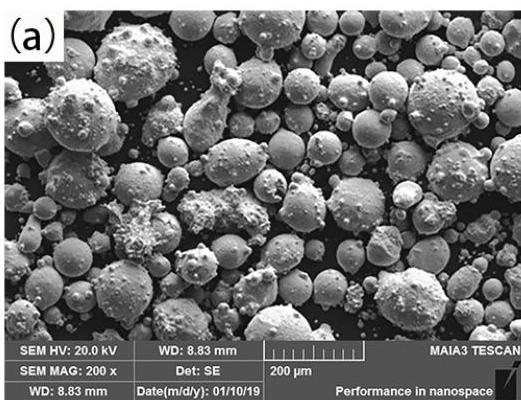

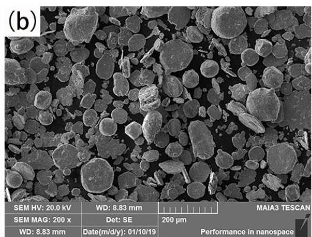

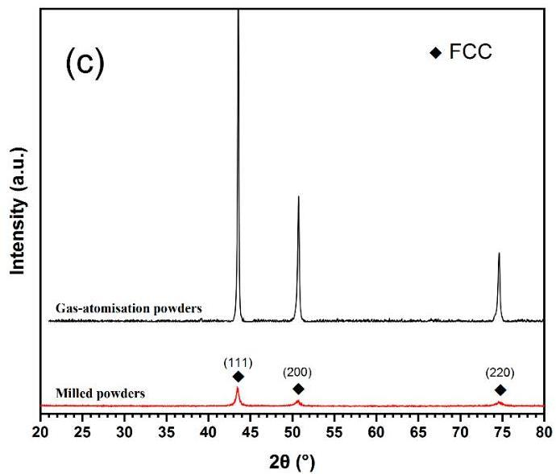
Figure 1. Microstructure of FeCoCrNiMo high-entropy alloy (HEA) powders before (a) and after (b) ball milling, (c) X-ray diffractometer (XRD) pattern of two powders. FCC—face-centered cubic.

Figure 2a-c shows the longitudinal cross-sections of the HEAs samples sintered at  $1150^{\circ}\mathrm{C}$  under different pressures. Judging from the contrast images, the microstructure did not consist of a single phase, as did those obtained after lower temperature sintering in our previous study [16].

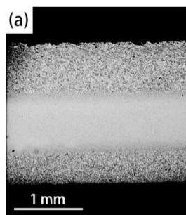
(d)  $2\mathrm{mm}$

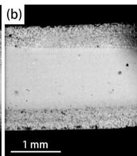
Figure 2. Longitudinal cross-sections of the same area in the FeCoCrNiMo HEA samples sintered at  $1150^{\circ}\mathrm{C}$  under different pressures: (a) 30, (b) 35, and (c)  $40\mathrm{MPa}$ , as well as (d) the macrostructure of the  $30\mathrm{MPa}$  sintered sample.

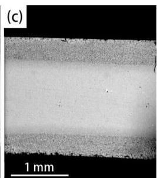

The microstructure gradually changed along the radial direction, towards the center of the samples. Obviously, the phase transformation occurred on the upper and lower surfaces of the three samples during SPS. The thickness of the phase transformed region decreased gradually along the radial direction of the cylinder towards both ends, as shown in Figure 2d. The reason for this phenomenon is the inhomogeneous distribution of the temperature field along the radial direction in the cylindrical graphite die during SPS. By simulating the temperature field of graphite die in the SPS process, the sintering temperature at the center is about 1700 °C and the border of the sample and the die can be as high as 450 °C [17]. Thus, because of the inhomogeneous distribution of temperature field, the volume fraction of phase transition is less than that of the middle part.

Under the sintering pressure of 30 MPa, the microstructure exhibited a distinct gradient distribution, as illustrated in Figure 3. It can be seen that multiple phase structures were successfully synthesized during SPS. The volume fraction of the transformed phase increased gradually from the center to edge of the specimen. As shown in Figure 3b, the volume fraction of the transformed phase decreased as the depth increased, which shows that sintering pressure directly affects the degree of phase transformation and presents a gradient distribution. For example, when the sintering pressure is 30 MPa, the volume fraction of the transformed phase is reduced from about 27% at the edge to 14% at a depth of 550 microns, and the volume fraction is reduced by half. When the sintering pressure is 40 MPa, the volume fraction of the transformed phase is sharply reduced from about 19% at the edge to 1% at a depth of 550 μm, which is about 20 times lower. It can be seen that the sintering pressure has a significant influence on the transformed phase volume fraction and the distribution of the transformed phase along the thickness direction. By controlling the sintering pressure, the gradient distribution of the multiple phase along the pressure direction can be realized and regulated.

3.2. Phase Identification

To understand the phase transformation, the phase constitution of the specimens was investigated using a combination of SEM, EDX, and XRD techniques.

As shown in Figure 4, the distribution of the elements Fe, Co, Cr, Ni, and Mo could be clearly identified in the samples. The precipitated phase was a Cr-rich phase, containing relatively low amounts of Co and Ni. No intermetallic compound was formed; therefore, the precipitate was a hard, Cr-rich σ phase. Powder metallurgy with a fast cooling rate was employed to reduce the preferred orientation effects observed in the cast alloys [18], the result of which could be used for accurately measuring the local lattice distortion. The distribution of the FCC and σ phase structures in the specimen can be identified using XRD analysis, as shown in Figure 5. The center of the specimen that underwent SPS under 30 MPa of pressure was a single FCC structure. While gradually transitioning towards the surface of the specimen, the {111} FCC diffraction peak became less intense than that of the center. However, the peaks corresponding to the {110} and {200} planes could be identified, indicating the formation of the σ phase structure. In addition, EDX analyses (Table 1) showed that the FCC matrix was rich in Mo and Ni, whereas the precipitated σ phase was rich in Cr, indicating that the matrix was represented by the FCC phase and the precipitate was the ordered σ phase. The XRD peak intensities are in a good accordance with the polycrystalline powders and the chemical compositions. Previous studies on the phase transformation of HEAs caused by SPS or the vacuum arc melting method reported that the body-centered cubic (BCC) phases or a tetragonal structure σ phase were composed of a spinodally modulated matrix, and precipitates exhibiting a near-equiaxed shape were distributed uniformly throughout the HEA. The FCC phases exhibiting net-like structure were located at the boundaries of the BCC phases [19,20]. However, the distribution of the σ phase and FCC structures observed was significantly different than those described in these previous studies. Interestingly, the microstructure presented a significant gradient distribution as the volume fraction of the σ structure increased. The mixed structures presented neither a net-shaped nor a dendritic form. This suggested that the FCC phase primarily formed during sintering, while the σ phase precipitated. The σ phase is an intermetallic precipitate, which dispersed and distributed in the FCC matrix.

Figure 4. SEM image and EDX maps of Fe, Co, Cr, Ni, Mo, and C of marked area in Figure 3a of HEA after spark plasma sintering (SPS) at 1150 °C and 30 MPa.

Metals 2019, 9, 351

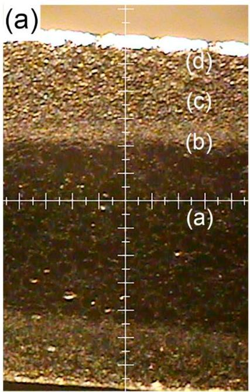
Figure 5. XRD pattern of different areas in the sample of HEA after SPS at  $1150^{\circ}\mathrm{C}$  and  $30\mathrm{MPa}$ , (a) the macrostrucutre of the  $30\mathrm{MPa}$  sintered sample, and (b) XRD pattern of the corresponding position in (a).

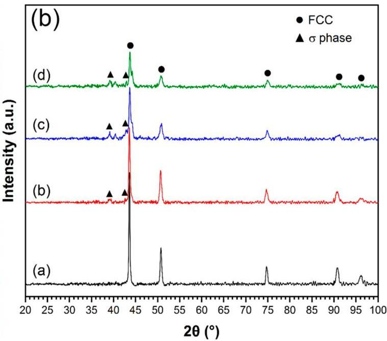

Table 1. Chemical composition of FeCoCrNiMo after spark plasma sintering (SPS) at  ${1150}^{ \circ  }\mathrm{C}$  and  ${30}\mathrm{{MPa}}$  . FCC-face-centered cubic.

|  Chemical Composition (at. %) | Cr | Fe | Co | Ni | Mo  |
| --- | --- | --- | --- | --- | --- |
|  σ phase | 50.8 | 19.1 | 17.3 | 10.1 | 2.6  |
|  FCC | 20.0 | 23.9 | 24.8 | 22.5 | 6.7  |

In addition, there is no segregation of C in both the FCC and  $\sigma$  phases, which excludes the possibility of carbide formation (C diffusion of graphite die during SPS). There are several places where C element is segregated in the micropore or porosities; it is certain that these micropore or porosities are inevitable in sintering process, but have nothing to do with and are not the result of the phase transition from FCC to  $\sigma$  phase.

In Table 1, the Mo content of the  $\sigma$  phase is only  $2.6\%$ , whereas that of the FCC phase is approximately  $6.7\%$ . As the Mo content of nominal composition is 4.34 at.% the FCC phase was enriched in Mo. This was the result of the good inter-solubility of Cr, Fe, Co, and Ni, while the solubility of Mo in the other elements was poor. Therefore, during the dissolution process of the solid solution, Mo, as a solute element, was repelled towards the FCC phase and redistributed along with Cr, while Cr entered the solid solution. The precipitated  $\sigma$  phase became rich in Cr and poor in Mo.

According to the (CoFeNi)-Cr-Mo pseudo ternary phase diagram at  $900^{\circ}\mathrm{C}$  and the (CoFeCrNi)-Mo pseudo-binary phase diagram in the work of [21], the microstructures of the dual phase (FCC and  $\sigma$  phase) structure (marked area in Figure 3) are examined and presented in Figure 6. The P1 area exhibits a single-phase polycrystalline structure, which can be identified in Figure 3. With the proceeding to the center of the specimen, the microstructures evolve to a dendritic structure, and Mo starts to segregate in the interdendritic areas and gradually shows a mixed two-phase structure. The TEM images and the selected-area diffraction (SAED) pattern in Figure 6a,c, showing a large precipitate embodied in the FCC matrix, clearly confirm that the precipitate consists of a mixture of the FCC and the  $\sigma$  phase, which are enriched with Cr and Mo elements (Table 1). It is noted that the FCC phase particles were precipitated out from the  $\sigma$  phase particle during cooling from a high temperature by solid-phase transformation. Thus, this complex structure can be simply referred to as a "double precipitation" during cooling, which can be explained by the pseudo binary diagram.

Metals 2019, 9, 351

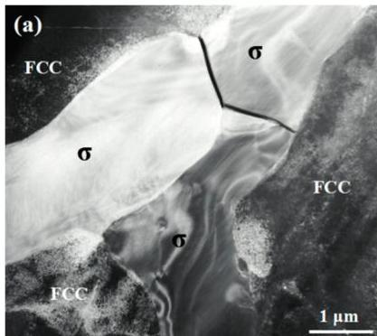
Figure 6. Transmission electron microscopy (TEM) image (a), (b) of the marked area in Figure 3a of FeCoCrNiMo HEA after sintering at  $1150^{\circ}\mathrm{C}$  and  $30\mathrm{MPa}$ , and the selected-area diffraction (SAED) pattern (c) of the marked area in (b).

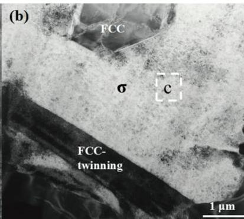

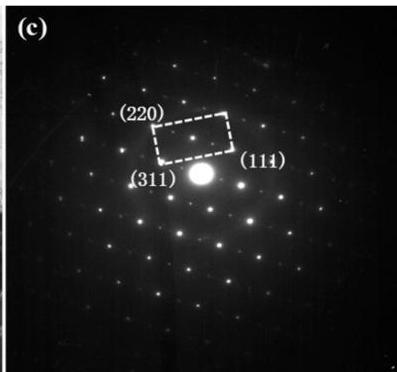

The phases formed in the SPS-processed HEA are essentially metastable—they are indeed formed solid-state phases during SPS, which are then kept at the ambient temperature because of the sluggish diffusion kinetics of HEAs. The TEM images are shown in Figure 6b. It was identified that an FCC phase re-precipitated in the  $\sigma$  phase. It can be concluded that the pseudo phase diagram quite successfully predicts all the structural features in the current alloy system. However, the solubility of Mo in the FCC matrix at SPS temperatures should correspond to the "FCC +  $\sigma$  zone in the pseudo phase diagram in the work of [21], so there was no Mo-rich  $\mu$  phase observed. Also, FCC twinning has also been observed in Figure 6b, which may be the result of phase transformation induction. This twinning structure will have a beneficial effect on the mechanical properties of HEA [22]. It is noted that the FCC matrix has intrinsically low stacking fault energy [23] and alloying of Mo could further reduce such energy, all of which promotes both twinning and widely dissociated and reactive dislocations.

According to the above analysis, the precipitates were identified as the  $\sigma$  phases that were transformed from the initial FCC structure during SPS. As can be seen in Figure 2, the thickness of the  $\sigma$  phase precipitates decreased gradually as the SPS pressure increased from 30 to  $40\mathrm{MPa}$ . In addition, the FCC to  $\sigma$  phase transition temperature of FeCoCrNiMo HEA was about  $1260^{\circ}\mathrm{C}$ , which was measured by DSC (Figure 7). The first exothermic peak is at about  $960^{\circ}\mathrm{C}$ , which represents the beginning of the sintering reaction and the formation of the FCC phase. However, phase transition occurs at  $1150^{\circ}\mathrm{C}$  under the SPS condition, which is attributed to the effect of sintering pressure in the SPS process. When pressure existed, the phase transformation became easier, which reduced the transformation temperature and shortened the time of transformation. Thus, the sintering pressure significantly reduced the phase transformation temperature. Moreover, the  $\sigma$  phase is an ordered tetragonal structure as an intermetallic compound. From the point of view of atomic stacking density, the change of phase-volume is sensitive to pressure, and the larger the pressure, the smaller the trend of phase volume grown up. This theory has been proven in TiAl-based alloys, which are also intermetallic compounds. Under HIP (Hot Isostatic Pressing) conditions, the phase volume is sensitive to sintering pressure [14]. This explained why when sintering pressure rose to 35 and  $40\mathrm{MPa}$ , the volume fraction of the transformed  $\sigma$  structure decreased. Accordingly, the gradient distribution of microstructure is caused by the sintering pressure and by adjusting the sintering pressure, the volume fraction of phase transformation can be changed to obtain the required gradient materials.

Metals 2019, 9, 351

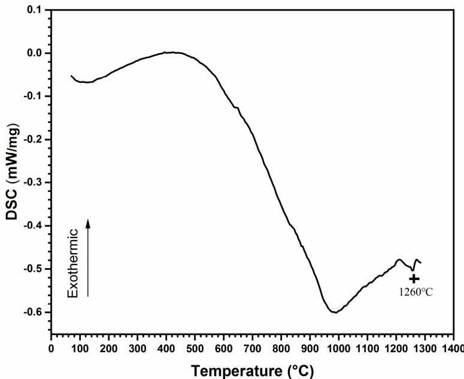
Figure 7. Differential scanning calorimeter (DSC) of the FeCoCrNiMo HEA sample processed by SPS.

# 3.3. Mechanical Properties

Bending and microhardness tests were used to analyze the effect of the distribution of the FCC and  $\sigma$  phases on the mechanical properties of HEA.

Figure 8 shows the bending curve of the HEA sample SPS processed under different pressures. According to Figure 8, when the sintering pressure is  $40\mathrm{MPa}$ , the sample has the highest transverse strength of  $1004\mathrm{MPa}$  and the highest fracture strain of  $2.3\%$ . With the decrease of sintering pressure, the strength and strain also decrease. When the sintering pressure is  $30\mathrm{MPa}$ , the bending strength is  $779\mathrm{MPa}$ . Obviously, the transverse strength decreases with the increase of the volume fraction of the  $\sigma$  phase. This is because the  $\sigma$  phase is an intermetallic compound with intrinsic brittleness. In contrast, the FCC phase has higher toughness. Comprehensively, when the volume fraction of the  $\sigma$  phase is small, the transverse strength of the FCC phase is more reflected. When sintering pressure is  $30\mathrm{MPa}$ , the  $\sigma$  phase increases significantly, which leads to the decrease of transverse strength.

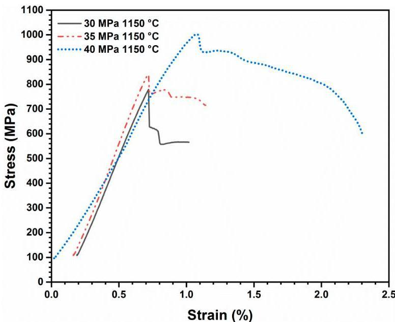
Figure 8. Bending curve of the HEA sample SPS processed under different pressure.

In addition, the results of the bending tests demonstrated that the SPS sample, which contained a larger volume fraction of the σ phase, could resist greater bending stress. This observation agreed with the work of Tsai et al. who found that the hardness of the Al_{0.3}CrFe_{1.5}MnNi_{0.5} HEA nearly tripled after the σ phase formed [24], as the σ phase is a very hard phase [25]. Although, because of the different composition, it is different compared with the σ phase in FeCoCrNi--Mo HEA, other chemical elements may result in different properties. However, the σ phase is a typical ordered, tetragonal structure. Whatever the elements formed, its essence is a hard phase compared with the FCC phase.

The sample exhibited a gradual microhardness change similar to the gradually distribution of the σ phase. The center of all the three specimens consisted of a single FCC phases structure with a constant microhardness value of approximately 210 HV_{0.2}. As an increasing amount of the new structure precipitated, the hardness gradually increased as the distance from the surface decreased, and the hardness increased to the maximum value at 50 μm from the surface, as shown in Figure 9. The highest hardness could be attributed to the effect of the large volume fraction of hard σ phases. It also illustrates that the sintering pressure directly affects the gradient distribution of the FCC to σ phase transformation in the thickness direction. When the sintering pressure is 30 MPa, the hardness distribution shows a steep trend owing to the transformation of the FCC phase to the σ phase. However, at 40 MPa, the overall hardness distribution tends to be flat owing to the thinner phase transition area.

Moreover, from the indentation morphology of different depths, taking the sintering of 30 MPa as an example, the volume fraction of σ phase at the edge is larger, and the indentation depth is shallower, as shown in Figure 10. As the depth increases to the middle, the volume fraction of the σ phase decreases, the FCC phase increases, and the indentation area and depth increase. This further proves that the σ phase is a hard and brittle intermetallic phase, and the FCC phase is softer than the σ phase.

Metals 2019, 9, 351

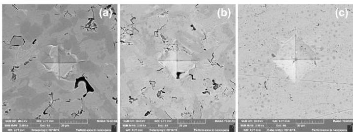

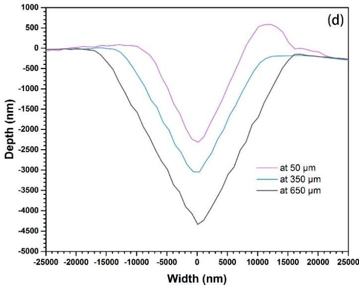
Figure 10. Indentation morphology of different depths from edge (a)  $50~\mu \mathrm{m}$ , (b)  $350~\mu \mathrm{m}$ , (c)  $650~\mu \mathrm{m}$ , and (d) indent profile of the FeCoCrNiMo HEA after sintering at  $1150^{\circ}\mathrm{C}$  and  $30\mathrm{MPa}$ .

# 4. Conclusions

The mechanical properties of the FeCoCrNiMo HEA exhibited a significantly gradual change because of gradient distribution of the mixed FCC and  $\sigma$  phase structure. This gradient distribution was mainly assumed to be caused by the sintering pressure, which was under the specific sintering temperature of  $1150^{\circ}\mathrm{C}$ . It was found that the alloying of Mo into the CoCrFeNi HEA system generated the precipitation of the hard and brittle  $\sigma$  phase in the FCC matrix. The hard, Cr-rich  $\sigma$  phase was homogeneously distributed throughout the FCC matrix, and the volume fraction of the  $\sigma$  structure increased from the center to the surface of the HEA sample, like it would for gradient materials. The volume fraction of transformed  $\sigma$  structure can easily be adjusted by sintering pressure. The sintering pressure directly affects the gradient distribution of the FCC to the  $\sigma$  phase transformation in the thickness direction of the HEA samples. The implication for control of properties via changing the phase balance in HEAs will provide a strong technical base for the tool and dies of a novel gradient material.

Author Contributions: Conceptualization, W.Z. and Y.L.; Methodology, W.Z.; Validation, Y.P.; Formal Analysis, W.Z. and Y.P.; Investigation, M.Z. and L.W.; Resources, Y.L. and S.H.; Data Curation, M.Z.; Writing-Original Draft Preparation, M.Z.; Writing-Review &amp; Editing, W.Z. and Y.P.; Project Administration, W.Z. and Y.L.; Funding Acquisition, Y.L., S.H. and Y.H.

Funding: This research was funded by the project of Innovation and Entrepreneur Team Introduced by Guangdong Province, grant number 201301G0105337290, and the Special Funds for Future Industrial Development of Shenzhen, grant number HKHTZD20140702020004.

Acknowledgments: The authors wish to acknowledge the financial support of State Key Laboratory of Powder Metallurgy (CSU 621011808), XUCHANG Fellowship Program [grant number: XW2017-40], the project of Innovation and Entrepreneur Team Introduced by Guangdong Province (201301G0105337290), and the Special Funds for Future Industrial Development of Shenzhen (No. HKHTZD20140702020004).

Conflicts of Interest: The authors declare no conflict of interest.

Metals 2019, 9, 351

# References

1. Yeh, J.W.; Chen, S.K.; Lin, S.J.; Gao, M.C.; Dahmen, K.A.; Liaw, P.K.; Lu, Z.P. Nanostructured high-entropy alloys with multiple principal elements: Novel alloy design concepts and outcomes. Adv. Eng. Mater. 2004, 6, 299–303. [CrossRef]
2. Zhang, Y.; Zuo, T.T.; Tang, Z.; Gao, M.C.; Dahmen, K.A.; Liaw, P.K.; Lu, Z.P. Microstructures and properties of high-entropy alloys. Prog. Mater. Sci. 2014, 61, 1–93. [CrossRef]
3. Tsai, M.H.; Yeh, J.W. High-entropy alloys: a critical review. Mater. Res. Lett. 2014, 2, 107–123. [CrossRef]
4. Chuang, M.H.; Tsai, M.H.; Wang, W.R.; Lin, S.J.; Yeh, J.W. Microstructure and wear behavior of $\mathrm{AlxCo_{1.5}CrFeNi_{1.5}Tiy}$ high-entropy alloys. Acta Mater. 2011, 59, 6308–6317. [CrossRef]
5. He, J.Y.; Wang, H.; Huang, H.L.; Xu, X.D.; Chen, M.W.; Wu, Y.; Liu, X.J.; Nieh, T.G.; An, K.; Lu, Z.P. A precipitation-hardened high-entropy alloy with outstanding tensile properties. Acta Mater. 2016, 102, 187–196. [CrossRef]
6. Shun, T.T.; Du, Y.C. Microstructure and tensile behaviors of FCC $\mathrm{Al}_{0.3}\mathrm{CoCrFeNi}$ high entropy alloy. Alloy. Compd. 2009, 479, 157–160. [CrossRef]
7. Li, Z.; Pradeep, K.G.; Deng, Y.; Raabe, D.; Tasan, C.C. Metastable high-entropy dual-phase alloys overcome the strength–ductility trade-off. Nature 2016, 534, 227–230. [CrossRef] [PubMed]
8. Singh, S.; Wanderka, N.; Murty, B.S.; Glatzel, U.; Banhart, J. Decomposition in multi-component AlCoCrCuFeNi high-entropy alloy. Acta Mater. 2011, 59, 182–190. [CrossRef]
9. Praveen, B.S.; Murty, R.S. Alloying behavior in multi-component AlCoCrCuFe and NiCoCrCuFe high entropy alloys. Mater. Sci. Eng. A 2012, 534, 83–89. [CrossRef]
10. Fu, Z.Q.; Chen, W.P.; Wen, H.M.; Zhang, D.L.; Chen, Z.; Zheng, B.L.; Zhou, Y.Z.; Lavernia, E.J. Microstructure and strengthening mechanisms in an FCC structured single-phase nanocrystalline $\mathrm{Co}_{25}\mathrm{Ni}_{25}\mathrm{Fe}_{25}\mathrm{Al}_{7.5}\mathrm{Cu}_{17.5}$ high-entropy alloy. Acta Mater. 2016, 107, 59–71. [CrossRef]
11. Gwalani, B.; Pohan, R.M.; Lee, J.; Lee, B.; Banerjee, R.; Ryu, H.J.; Hong, S.H. High-entropy alloy strengthened by in situ formation of entropy-stabilized nano-dispersoids. Sci. Rep. 2018, 8, 14085. [CrossRef]
12. Pohan, R.M.; Gwalani, B.; Lee, J.; Alam, T.; Hwang, J.Y.; Ryu, H.J.; Banerjee, R.; Hong, S.H. Microstructures and mechanical properties of mechanically alloyed and spark plasma sintered $\mathrm{Al}_{0.3}\mathrm{CoCrFeMnNi}$ high entropy alloy. Mater. Chem. Phys. 2018, 210, 62–70. [CrossRef]
13. Mamedov, V. Spark plasma sintering as advanced PM sintering method. Powder Metall. 2002, 45, 322–328. [CrossRef]
14. Huang, A.; Hu, D.; Loretto, M.H.; Mei, J.; Wu, X.H. The influence of pressure on solid-state transformations in Ti–46Al–8Nb. Scr. Mater. 2007, 56, 253–256. [CrossRef]
15. Liu, W.H.; Lu, Z.P.; He, J.Y.; Luan, J.H.; Wang, Z.J.; Liu, B.; Liu, Y.; Chen, M.W.; Liu, C.T. Ductile CoCrFeNiMox high entropy alloys strengthened by hard intermetallic phases. Acta Mater. 2016, 116, 332–342. [CrossRef]
16. Zhang, M.; Zhang, W.; Liu, Y.; Liu, B.; Wang, J. FeCoCrNiMo high-entropy alloys prepared by powder metallurgy processing for diamond tool applications. Powder Metall. 2018, 61, 123–130. [CrossRef]
17. Wang, Y.; Fu, Z. Study of temperature field in spark plasma sintering. Mater. Sci. Eng. 2002, B90, 34–37.
18. Yeh, J.W.; Chang, S.Y.; Hong, Y.D.; Chen, S.K.; Lin, S.J. Anomalous decrease in X-ray diffraction intensities of Cu–Ni–Al–Co–Cr–Fe–Si alloy systems with multi-principal elements. Mater. Chem. Phys. 2007, 103, 41–46. [CrossRef]
19. Wang, J.; Niu, S.Z.; Guo, T.; Kou, H.C.; Li, J.S. The FCC to BCC phase transformation kinetics in an $\mathrm{Al}_{0.5}\mathrm{CoCrFeNi}$ high entropy alloy. Alloy. Compd. 2017, 710, 144–150. [CrossRef]
20. Zhang, A.; Han, J.; Meng, J.; Su, B.; Li, P. Rapid preparation of AlCoCrFeNi high entropy alloy by spark plasma sintering from elemental powder mixture. Mater. Lett. 2016, 181, 82–85. [CrossRef]
21. Wu, Q.; Wang, Z.; He, F.; Li, J.; Wang, J. Revealing the Selection of $\sigma$ and $\mu$ Phases in CoCrFeNiMox High Entropy Alloys by CALPHAD. J. Phase Equilibria Diffus. 2018, 39, 446–453. [CrossRef]
22. Liu, T.K.; Wu, Z.; Stoica, A.D.; Xie, Q.; Wu, W.; Gao, Y.F.; Bei, H.; An, K. Twinning-mediated work hardening and texture evolution in CrCoFeMnNi high entropy alloys at cryogenic temperature. Mater. Des. 2017, 131, 419–427. [CrossRef]
23. Zaddach, A.J.; Niu, C.; Koch, C.C.; Irving, D.L. Mechanical properties and stacking fault energies of NiFeCrCoMn high-entropy alloy. JOM 2013, 65, 1780–1789. [CrossRef]

Metals 2019, 9, 351

24. Tsai, K.C.; Chang, J.; Li, H.; Tsai, R.C.; Cheng, A.H. A second criterion for sigma phase formation in high-entropy alloys. Mater. Res. Lett. 2016, 4, 1–6. [CrossRef]
25. Tsai, M.H.; Yuan, H.; Cheng, G.M. Significant hardening due to the formation of a sigma phase matrix in a high entropy alloy. Intermetallics 2013, 33, 81–86. [CrossRef]

© 2019 by the authors. Licensee MDPI, Basel, Switzerland. This article is an open access article distributed under the terms and conditions of the Creative Commons Attribution (CC BY) license (http://creativecommons.org/licenses/by/4.0/).